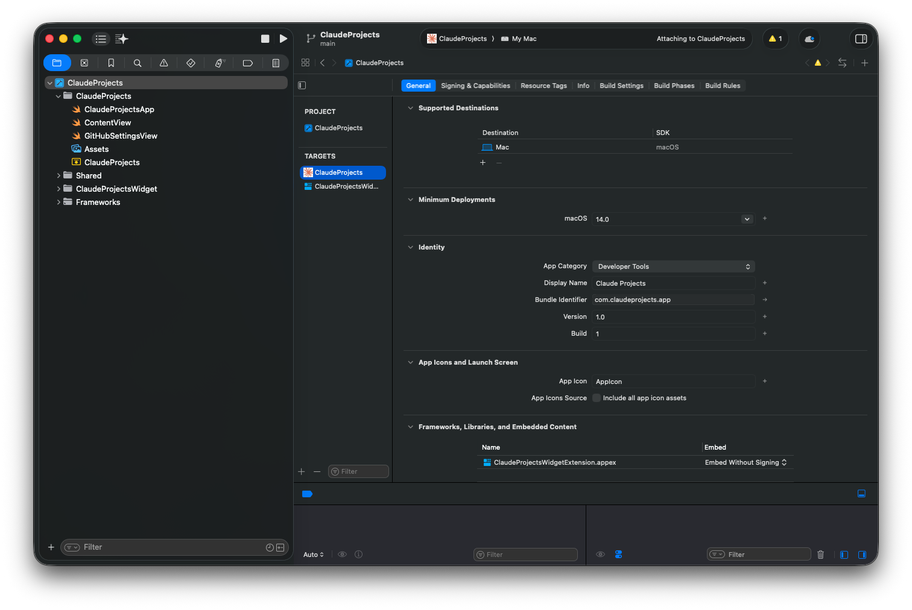

# Product Requirements Document (Sequential)

## 0. Source Context

**Derived From:** Product Feature Brief
**Feature Name:** Media Component Migration & Backend API Creation
**PRD Owner:** TBD
**Last Updated:** 2026-01-18
**Source PFB:** `./projects/migrate-media-components-to-sui-media-package-with-nestjs-api/pfb.md`

### Feature Brief Summary

This feature consolidates media-related functionality by migrating from the existing `@stoked-ui/media-selector` package to a new comprehensive `@stoked-ui/media` package while simultaneously creating a dedicated `@stoked-ui/media-api` NestJS backend service. The new frontend package will include all existing media selector functionality plus the MediaCard and MediaViewer components (and their composed components) from the v3 codebase. The backend API will centralize all media-related endpoints and metadata processing capabilities, moving from client-side to a hybrid client-server architecture for better performance and scalability.

**Problem Statement:**

- Package fragmentation: media-selector only handles file selection while critical UI components are in v3
- Missing backend infrastructure: no dedicated API service for media operations
- Client-heavy processing: metadata extraction happens entirely client-side causing performance issues
- Code duplication: metadata processing logic exists in both client and server but isn't unified
- Scalability limitations: difficult to implement features like thumbnail generation, transcoding

**Goals:**

1. Consolidate media UI components - Migrate all media-related React components into single package
2. Deprecate fragmented package - Sunset media-selector in favor of comprehensive media package
3. Establish backend API service - Create dedicated NestJS API package
4. Implement hybrid metadata processing - Enable both client-side and server-side extraction
5. Maintain backward compatibility - Minimal breaking changes for existing consumers
6. Improve developer experience - Clear, well-documented API surface

---

## 1. Objectives & Constraints

### Objectives

1. **Consolidate media UI components** - Migrate all media-related React components (MediaCard, MediaViewer, and all dependencies) from v3 into a single, well-organized `@stoked-ui/media` package
2. **Deprecate fragmented package** - Sunset `@stoked-ui/media-selector` in favor of the more comprehensive `@stoked-ui/media` with clear migration path
3. **Establish backend API service** - Create a dedicated `@stoked-ui/media-api` NestJS package for all media-related operations
4. **Implement hybrid metadata processing** - Enable both client-side and server-side metadata extraction based on use case and environment
5. **Maintain backward compatibility** - Ensure existing media-selector consumers can migrate with minimal breaking changes
6. **Improve developer experience** - Provide a clear, well-documented API surface for both frontend and backend media operations

### Constraints

**Technical:**

- Must maintain compatibility with existing file selection APIs to minimize breaking changes
- MediaCard and MediaViewer components depend on Material-UI (MUI) design system
- Server-side processing requires ffmpeg/ffprobe to be installed in the deployment environment
- Client-side browser APIs required for file system access, drag-and-drop, and media element metadata
- Package must support both modern and stable build targets as per existing stoked-ui packages
- Must work in both browser and Node.js environments where applicable

**Dependencies:**

- Depends on `@stoked-ui/common` package for shared utilities
- Depends on Material-UI (@mui/material) for component library
- Depends on Redux/Redux Toolkit for state management (MediaCard/MediaViewer)
- Depends on authentication system for secure media operations
- Backend depends on Mongoose for MongoDB data persistence
- Backend depends on S3-compatible storage service

**Timeline:**

- TBD - Needs project scoping and resource allocation

**Resources:**

- Requires access to v3 codebase for component migration
- Requires developer familiar with both React component development and NestJS backend development
- May require DevOps support for backend deployment infrastructure

---

## 2. Execution Phases

> Phases below are ordered and sequential.
> A phase cannot begin until all acceptance criteria of the previous phase are met.

---

## Phase 1: Foundation Setup

**Purpose:** Establish the new package structures, build configurations, and copy existing media-selector code to the new @stoked-ui/media package. This phase creates the foundation that all subsequent component migrations and backend development will build upon.

### 1.1 Create @stoked-ui/media Package Structure

Create the new `@stoked-ui/media` package with proper monorepo configuration, build scripts, and copy all existing functionality from `@stoked-ui/media-selector` without breaking changes.

**Implementation Details**

- Systems affected: `/packages/sui-media/` (new), monorepo build configuration
- Inputs: Existing `@stoked-ui/media-selector` package structure and code
- Outputs: New package with identical functionality under new name
- Core logic:
  - Create `/packages/sui-media/` directory structure
  - Copy package.json and update name to `@stoked-ui/media`
  - Copy all source files from media-selector to media package
  - Copy build scripts and TypeScript configuration
  - Update internal imports and references
  - Add package to turbo.json and root package.json workspaces
- Failure modes:
  - Build errors due to missing dependencies
  - Import path resolution failures
  - TypeScript configuration conflicts

**Acceptance Criteria**

- AC-1.1.a: When new package is created at `/packages/sui-media/` → package.json has correct name `@stoked-ui/media` and version `0.1.0`
- AC-1.1.b: When all media-selector source files are copied → directory structure matches with src/MediaFile/, src/MediaType/, src/App/, src/WebFile/, etc.
- AC-1.1.c: When build scripts are executed → all build targets (modern, node, stable, types) complete without errors
- AC-1.1.d: When TypeScript compilation runs → no type errors and all types are properly exported
- AC-1.1.e: When package is built → output in `/packages/sui-media/build/` contains all compiled artifacts

**Acceptance Tests**

- Test-1.1.a: Unit test validates package.json has correct name, version, and peer dependencies
- Test-1.1.b: Integration test verifies all source directories exist and contain expected files
- Test-1.1.c: Build test runs `pnpm build` successfully with exit code 0
- Test-1.1.d: Type test runs `pnpm typescript` successfully with no errors
- Test-1.1.e: Artifact test validates build output contains modern/, node/, stable/, and types/ directories

---

### 1.2 Create @stoked-ui/media-api Package Structure

Create the new NestJS API package with proper monorepo configuration, NestJS CLI setup, and basic application structure.

**Implementation Details**

- Systems affected: `/packages/sui-media-api/` (new), monorepo build configuration
- Inputs: NestJS project template, monorepo patterns from existing packages
- Outputs: Functional NestJS application skeleton
- Core logic:
  - Create `/packages/sui-media-api/` directory
  - Initialize NestJS application structure (src/main.ts, app.module.ts, etc.)
  - Create package.json with NestJS dependencies (@nestjs/core, @nestjs/common, etc.)
  - Configure TypeScript for NestJS (tsconfig.json)
  - Create basic build scripts for development and production
  - Add package to turbo.json for monorepo builds
  - Create Dockerfile for containerized deployment
- Failure modes:
  - NestJS dependency conflicts with monorepo versions
  - Port conflicts with other services
  - TypeScript configuration incompatibilities

**Acceptance Criteria**

- AC-1.2.a: When NestJS package is created at `/packages/sui-media-api/` → package.json has correct name `@stoked-ui/media-api` and required NestJS dependencies
- AC-1.2.b: When application starts → NestJS server runs on port 3001 and responds to health check at `/health`
- AC-1.2.c: When build is executed → TypeScript compiles to dist/ directory without errors
- AC-1.2.d: When Dockerfile is built → Docker image builds successfully and container runs application
- AC-1.2.e: When development mode is started → hot reload works for code changes

**Acceptance Tests**

- Test-1.2.a: Unit test validates package.json has all required NestJS dependencies (@nestjs/core, @nestjs/common, @nestjs/mongoose)
- Test-1.2.b: Integration test starts application and makes HTTP GET request to /health endpoint returning 200 status
- Test-1.2.c: Build test runs build script and verifies dist/ output exists
- Test-1.2.d: Docker test builds image and runs container, validating health endpoint responds
- Test-1.2.e: Development test starts dev mode and validates hot reload on file change

---

### 1.3 Update Media Package Exports and API

Update the `@stoked-ui/media` package to export all existing media-selector functionality with proper TypeScript types and maintain backward compatibility.

**Implementation Details**

- Systems affected: `/packages/sui-media/src/index.ts` and all module exports
- Inputs: All source modules from copied media-selector code
- Outputs: Clean public API with TypeScript definitions
- Core logic:
  - Create/update src/index.ts to export all public APIs
  - Export MediaFile, WebFile, AppFile classes
  - Export MediaType utilities and enums
  - Export FileSystemApi and related utilities
  - Export all TypeScript types and interfaces
  - Ensure no internal utilities are accidentally exposed
  - Add JSDoc comments for all public APIs
- Failure modes:
  - Circular dependency issues in exports
  - Missing type exports causing consumer errors
  - Breaking changes in exported API surface

**Acceptance Criteria**

- AC-1.3.a: When index.ts is created → all public classes (MediaFile, WebFile, AppFile, etc.) are exported
- AC-1.3.b: When TypeScript types are checked → all public types and interfaces are exported from index
- AC-1.3.c: When consuming package in test project → imports like `import { MediaFile } from '@stoked-ui/media'` work correctly
- AC-1.3.d: When type definitions are generated → .d.ts files include all exported types
- AC-1.3.e: When API documentation is reviewed → JSDoc comments exist for all major exported items

**Acceptance Tests**

- Test-1.3.a: Unit test validates all expected exports are present in index.ts
- Test-1.3.b: Type test checks that all type imports resolve without errors
- Test-1.3.c: Integration test creates test project, installs package, and successfully imports all major exports
- Test-1.3.d: Build test validates generated .d.ts files contain expected type definitions
- Test-1.3.e: Documentation test extracts JSDoc comments from all public API exports

---

### 1.4 Add Deprecation Warnings to @stoked-ui/media-selector

Add deprecation warnings to the existing `@stoked-ui/media-selector` package directing developers to migrate to `@stoked-ui/media`.

**Implementation Details**

- Systems affected: `/packages/sui-media-selector/` - README, package.json, and main exports
- Inputs: Deprecation notice template, migration guide URL
- Outputs: Updated package with deprecation warnings
- Core logic:
  - Add deprecation notice to README.md at top of file
  - Add deprecation field to package.json
  - Add console.warn() in main export with migration instructions
  - Create MIGRATION.md guide with step-by-step instructions
  - Update package description to indicate deprecation
  - Set package version to indicate final minor release
- Failure modes:
  - Warnings could be too intrusive and break builds
  - Migration guide could be unclear
  - Deprecation timeline unclear

**Acceptance Criteria**

- AC-1.4.a: When README.md is opened → deprecation notice appears at top with link to @stoked-ui/media
- AC-1.4.b: When package.json is checked → deprecated field is set to true with deprecation message
- AC-1.4.c: When package is imported → console warning displays migration instructions (only in development mode)
- AC-1.4.d: When MIGRATION.md is reviewed → clear step-by-step migration guide from media-selector to media exists
- AC-1.4.e: When npm/pnpm install is run → deprecation warning appears during installation

**Acceptance Tests**

- Test-1.4.a: Content test validates README.md starts with deprecation banner
- Test-1.4.b: Metadata test confirms package.json has deprecated: true field
- Test-1.4.c: Runtime test imports package in dev mode and captures console warning
- Test-1.4.d: Documentation test validates MIGRATION.md exists and contains required sections
- Test-1.4.e: Install test runs `pnpm install @stoked-ui/media-selector` and verifies deprecation warning appears

---

### 1.5 Verify Foundation and Backward Compatibility

Ensure the new `@stoked-ui/media` package maintains 100% functional compatibility with `@stoked-ui/media-selector` and all tests pass.

**Implementation Details**

- Systems affected: Both packages, test suites, consuming applications
- Inputs: Existing media-selector tests, sample consuming applications
- Outputs: Passing test suite, verified compatibility
- Core logic:
  - Port all existing tests from media-selector to media package
  - Create compatibility test suite comparing API surfaces
  - Test MediaFile metadata extraction functionality
  - Test file system API operations
  - Verify WebFile and AppFile functionality
  - Test zip file handling
  - Validate screenshot and metadata utilities
- Failure modes:
  - Tests fail due to broken functionality
  - API surface differences cause breaks
  - Performance regressions in media operations

**Acceptance Criteria**

- AC-1.5.a: When all ported tests run → 100% pass rate with identical results to media-selector
- AC-1.5.b: When API surface is compared → media package exports are superset of media-selector (no removals)
- AC-1.5.c: When MediaFile operations are tested → metadata extraction works identically to media-selector
- AC-1.5.d: When file selection is tested → drag-and-drop and file system APIs work correctly
- AC-1.5.e: When package size is checked → bundle size is within 5% of media-selector package

**Acceptance Tests**

- Test-1.5.a: Test suite runs all ported unit and integration tests with 100% pass rate
- Test-1.5.b: API compatibility test compares exported APIs and validates no breaking changes
- Test-1.5.c: Functional test creates MediaFile instances and validates metadata extraction matches media-selector behavior
- Test-1.5.d: Integration test performs file selection operations and validates results
- Test-1.5.e: Bundle size test compares built package sizes between media and media-selector

---

## Phase 2: Component Migration from v3

**Purpose:** Migrate MediaCard, MediaViewer, and all their dependent components from v3 codebase to the new @stoked-ui/media package. This phase cannot start until Phase 1 completes because it requires the package foundation to exist and work correctly.

### 2.1 Analyze and Document v3 Component Dependencies

Perform comprehensive analysis of MediaCard and MediaViewer components to identify all dependencies, contexts, hooks, and sub-components required for migration.

**Implementation Details**

- Systems affected: v3 codebase at `/Users/stoked/work/v3/apps/site/src/components/Media/`
- Inputs: MediaCard.tsx, MediaViewer.tsx, and all related files
- Outputs: Dependency tree document, migration checklist
- Core logic:
  - Analyze MediaCard component and all composed components
  - Analyze MediaViewer component and all sub-components (MediaViewerPrimary, MediaViewerHeader, etc.)
  - Identify all custom hooks (useMediaViewerLayout, useMediaViewerState, etc.)
  - Document Material-UI component dependencies
  - Document Redux dependencies (mediaSlice, apiServices)
  - Identify Next.js specific dependencies (useRouter, useSearchParams)
  - Document custom contexts (MediaProvider, MediaQueueContext, KeyboardShortcutsContext, MediaMetadataGeneratorContext)
  - List all CSS/animation files
  - Identify payment integration touchpoints (Lightning Network, crypto)
  - Create dependency graph showing component relationships
- Failure modes:
  - Missing transitive dependencies
  - Undocumented runtime dependencies
  - Hidden coupling to v3-specific infrastructure

**Acceptance Criteria**

- AC-2.1.a: When dependency analysis is complete → document lists all MediaCard dependencies (components, hooks, contexts, styles)
- AC-2.1.b: When MediaViewer dependencies are documented → all sub-components and hooks are identified
- AC-2.1.c: When Redux dependencies are cataloged → all slices and API services used by components are listed
- AC-2.1.d: When external dependencies are reviewed → Material-UI, Next.js, and other library dependencies are documented
- AC-2.1.e: When dependency graph is created → visual diagram shows component hierarchy and relationships

**Acceptance Tests**

- Test-2.1.a: Documentation test validates dependency document exists with complete MediaCard section
- Test-2.1.b: Documentation test validates MediaViewer dependencies are fully documented
- Test-2.1.c: Review test confirms all Redux imports are identified and documented
- Test-2.1.d: Review test validates external dependency list is comprehensive
- Test-2.1.e: Visual test confirms dependency graph is generated and includes all major components

---

### 2.2 Create Abstraction Layer for External Dependencies

Create abstraction layers and adapters for v3-specific dependencies (Next.js router, authentication, payment systems) to make components portable to the media package.

**Implementation Details**

- Systems affected: `/packages/sui-media/src/` - new abstraction directories
- Inputs: Identified dependencies from Phase 2.1
- Outputs: Router abstraction, auth abstraction, payment callback interfaces
- Core logic:
  - Create router abstraction interface compatible with Next.js router but implementable with any router
  - Create authentication context provider interface
  - Create payment callback/plugin interface to decouple Lightning/crypto integration
  - Define MediaQueueContext interface for external implementation
  - Create keyboard shortcuts plugin system
  - Implement default/noop implementations for all abstractions
  - Document how to provide custom implementations
- Failure modes:
  - Abstractions too tightly coupled to Next.js
  - Missing functionality in abstraction layer
  - Poor performance from abstraction overhead

**Acceptance Criteria**

- AC-2.2.a: When router abstraction is created → interface supports navigate, query params, and pathname operations
- AC-2.2.b: When auth abstraction is created → interface defines user context, login state, and permission checking
- AC-2.2.c: When payment interface is created → callbacks support payment initiation, status, and completion
- AC-2.2.d: When queue context is abstracted → interface supports queue operations without Redux dependency
- AC-2.2.e: When default implementations are created → noop versions exist for all abstractions allowing basic usage

**Acceptance Tests**

- Test-2.2.a: Interface test validates router abstraction has all required methods
- Test-2.2.b: Type test confirms auth abstraction interface is properly typed
- Test-2.2.c: Interface test validates payment callbacks cover all use cases
- Test-2.2.d: Integration test validates queue context can be implemented externally
- Test-2.2.e: Functional test runs components with default noop implementations without errors

---

### 2.3 Migrate MediaCard Component and Dependencies

Migrate MediaCard component from v3 to the media package, including all animations, styles, types, utilities, and sub-components.

**Implementation Details**

- Systems affected: `/packages/sui-media/src/components/MediaCard/`
- Inputs: v3 MediaCard files (MediaCard.tsx, MediaCard.animations.css, MediaCard.styles.ts, etc.)
- Outputs: Fully functional MediaCard in media package
- Core logic:
  - Copy MediaCard.tsx to new package
  - Copy MediaCard.animations.css
  - Copy MediaCard.styles.ts
  - Copy MediaCard.types.ts
  - Copy MediaCard.utils.ts
  - Copy MediaCard.constants.ts
  - Migrate all sub-components (MediaProcessingOverlay, ExplicitIcon, etc.)
  - Update imports to use abstraction layers
  - Replace Next.js router with router abstraction
  - Replace direct auth calls with auth abstraction
  - Update Redux usage to be optional/pluggable
  - Adapt payment integration to use callback interface
  - Ensure Material-UI components are properly imported
- Failure modes:
  - Component rendering errors
  - Missing Material-UI theme context
  - Redux state management breaks
  - Animation CSS conflicts

**Acceptance Criteria**

- AC-2.3.a: When MediaCard is migrated → component renders correctly with all visual elements
- AC-2.3.b: When animations are tested → all CSS animations work (hover effects, transitions, etc.)
- AC-2.3.c: When Material-UI integration is verified → component uses MUI theme correctly
- AC-2.3.d: When abstraction layers are used → component works with default implementations
- AC-2.3.e: When tests are run → MediaCard unit tests pass with 100% success rate

**Acceptance Tests**

- Test-2.3.a: Visual regression test validates MediaCard renders identically to v3
- Test-2.3.b: Animation test validates all CSS animations trigger correctly
- Test-2.3.c: Theme test validates component responds to MUI theme changes
- Test-2.3.d: Integration test runs component with noop abstractions successfully
- Test-2.3.e: Unit test suite validates all MediaCard functionality

---

### 2.4 Migrate MediaViewer Component and Sub-Components

Migrate MediaViewer component from v3 to the media package, including all sub-components (MediaViewerPrimary, MediaViewerHeader, MediaViewerControls, etc.) and custom hooks.

**Implementation Details**

- Systems affected: `/packages/sui-media/src/components/MediaViewer/`
- Inputs: v3 MediaViewer files and sub-components
- Outputs: Fully functional MediaViewer in media package
- Core logic:
  - Copy MediaViewer.tsx main component
  - Migrate MediaViewerPrimary component
  - Migrate MediaViewerHeader component
  - Migrate MediaViewerControls component
  - Migrate MediaViewerVideoControls component
  - Migrate MediaViewerPreview component
  - Migrate useMediaViewerLayout hook
  - Migrate useMediaViewerState hook
  - Migrate supporting components (NextUpHeader, NowPlayingIndicator, QueueManagementPanel)
  - Update all imports to use abstraction layers
  - Replace Next.js specific code with abstractions
  - Ensure video playback controls work correctly
  - Adapt Redux state management to be pluggable
- Failure modes:
  - Video playback issues
  - Layout calculation errors
  - State synchronization problems
  - Keyboard shortcut conflicts

**Acceptance Criteria**

- AC-2.4.a: When MediaViewer is migrated → component renders and displays media correctly
- AC-2.4.b: When video controls are tested → play/pause, seek, volume, and fullscreen work correctly
- AC-2.4.c: When layout hook is tested → responsive layout calculations work for different screen sizes
- AC-2.4.d: When state hook is tested → media state management (playing, paused, ended) works correctly
- AC-2.4.e: When keyboard shortcuts are tested → all shortcuts work with keyboard plugin system

**Acceptance Tests**

- Test-2.4.a: Visual test validates MediaViewer renders media content correctly
- Test-2.4.b: Functional test validates all video controls perform expected operations
- Test-2.4.c: Responsive test validates layout hook adjusts for mobile, tablet, and desktop
- Test-2.4.d: State test validates media state transitions correctly
- Test-2.4.e: Keyboard test validates all shortcuts trigger correct actions

---

### 2.5 Create Component Documentation and Storybook Stories

Create comprehensive documentation and Storybook stories for MediaCard and MediaViewer components.

**Implementation Details**

- Systems affected: `/packages/sui-media/src/components/`, Storybook configuration
- Inputs: Migrated components, component APIs
- Outputs: README files, Storybook stories, usage examples
- Core logic:
  - Create MediaCard README with props documentation
  - Create MediaViewer README with props documentation
  - Write Storybook stories for MediaCard variants
  - Write Storybook stories for MediaViewer variants
  - Create example usage code snippets
  - Document abstraction layer implementations
  - Create integration examples with Redux
  - Create integration examples with Next.js
  - Document customization options
  - Add TypeScript usage examples
- Failure modes:
  - Incomplete documentation
  - Outdated examples
  - Missing edge cases

**Acceptance Criteria**

- AC-2.5.a: When MediaCard README is created → all props are documented with types and descriptions
- AC-2.5.b: When MediaViewer README is created → all props, hooks, and contexts are documented
- AC-2.5.c: When Storybook stories are created → at least 5 variants for each component exist
- AC-2.5.d: When examples are reviewed → working code examples exist for common use cases
- AC-2.5.e: When TypeScript examples are checked → type-safe usage examples are provided

**Acceptance Tests**

- Test-2.5.a: Documentation test validates MediaCard README exists and covers all props
- Test-2.5.b: Documentation test validates MediaViewer README exists and is comprehensive
- Test-2.5.c: Storybook test validates all stories render without errors
- Test-2.5.d: Code test validates all example code compiles and runs
- Test-2.5.e: Type test validates TypeScript examples have no type errors

---

## Phase 3: Backend API Development

**Purpose:** Create the NestJS backend API service with media endpoints, metadata processing, and server-side operations. This phase builds on the foundation from Phase 1 and runs in parallel or after Phase 2.

### 3.1 Implement Core Media Module and Entities

Create the core NestJS module for media operations with Mongoose schemas for media metadata persistence.

**Implementation Details**

- Systems affected: `/packages/sui-media-api/src/media/`
- Inputs: v3 media.service.ts structure, MongoDB schema requirements
- Outputs: Media module, entities, and schemas
- Core logic:
  - Create MediaModule with controllers and services
  - Define Media entity/schema with Mongoose
  - Define fields: id, filename, mimetype, size, duration, dimensions, codec, thumbnail, uploadedBy, createdAt, etc.
  - Create MediaDto for API responses
  - Create CreateMediaDto for upload requests
  - Create UpdateMediaDto for metadata updates
  - Define relationships to User (owner) and other entities
  - Add indexes for performance (uploadedBy, createdAt, mimetype)
  - Implement schema validation
- Failure modes:
  - Schema migration issues
  - Invalid field types
  - Missing indexes causing performance issues

**Acceptance Criteria**

- AC-3.1.a: When Media schema is created → all required fields (id, filename, mimetype, size, etc.) are defined
- AC-3.1.b: When MediaModule is created → module imports, controllers, and providers are properly configured
- AC-3.1.c: When DTOs are created → CreateMediaDto and UpdateMediaDto have proper validation decorators
- AC-3.1.d: When database indexes are checked → indexes exist on uploadedBy, createdAt, and mimetype fields
- AC-3.1.e: When schema validation is tested → invalid data is rejected with appropriate errors

**Acceptance Tests**

- Test-3.1.a: Schema test validates all required fields exist with correct types
- Test-3.1.b: Module test validates MediaModule imports and configuration
- Test-3.1.c: DTO test validates validation decorators reject invalid inputs
- Test-3.1.d: Database test confirms indexes are created on schema initialization
- Test-3.1.e: Validation test sends invalid data and confirms rejection

---

### 3.2 Implement File Upload and Storage Service

Create file upload endpoints with S3 storage integration for media files.

**Implementation Details**

- Systems affected: `/packages/sui-media-api/src/media/`, S3 service
- Inputs: Multipart file uploads, S3 configuration
- Outputs: Upload endpoints, S3 service, stored files
- Core logic:
  - Create FileUploadService for handling multipart uploads
  - Integrate multer or similar for file handling
  - Create S3Service for S3 operations
  - Implement upload to S3 with unique file naming
  - Generate and store S3 URLs
  - Create POST /media/upload endpoint
  - Support single and multiple file uploads
  - Validate file types and sizes
  - Generate unique filenames to prevent collisions
  - Store file metadata in MongoDB after successful upload
  - Implement file deletion (S3 + database cleanup)
- Failure modes:
  - S3 upload failures
  - Large file memory issues
  - Database-storage inconsistency
  - Unauthorized access

**Acceptance Criteria**

- AC-3.2.a: When POST /media/upload receives file → file is uploaded to S3 and metadata stored in database
- AC-3.2.b: When multiple files are uploaded → all files are processed and stored correctly
- AC-3.2.c: When invalid file type is uploaded → request is rejected with 400 error
- AC-3.2.d: When file exceeds size limit → request is rejected with 413 error
- AC-3.2.e: When file is deleted → both S3 object and database record are removed

**Acceptance Tests**

- Test-3.2.a: Integration test uploads file and verifies S3 storage and database entry
- Test-3.2.b: Integration test uploads multiple files and verifies all are stored
- Test-3.2.c: Validation test uploads invalid file type and verifies rejection
- Test-3.2.d: Validation test uploads oversized file and verifies rejection
- Test-3.2.e: Integration test deletes file and verifies removal from S3 and database

---

### 3.3 Implement Server-Side Metadata Extraction

Create metadata extraction service using ffmpeg/ffprobe for server-side video, audio, and image processing.

**Implementation Details**

- Systems affected: `/packages/sui-media-api/src/media/metadata/`
- Inputs: Uploaded media files, ffmpeg/ffprobe binaries
- Outputs: Extracted metadata (duration, codec, dimensions, bitrate, etc.)
- Core logic:
  - Create MetadataExtractionService
  - Implement ffprobe integration for video/audio metadata
  - Extract: duration, codec, container format, dimensions, bitrate, frame rate
  - Detect moov atom position for videos
  - Extract EXIF data for images
  - Create VideoProcessingService (port from v3)
  - Implement safe command execution with spawn
  - Handle special characters in filenames
  - Create POST /media/:id/extract-metadata endpoint
  - Store extracted metadata in database
  - Implement error handling for corrupt files
- Failure modes:
  - ffmpeg/ffprobe not installed
  - Corrupt media files
  - Command injection vulnerabilities
  - Processing timeout on large files

**Acceptance Criteria**

- AC-3.3.a: When video file metadata is extracted → duration, codec, dimensions, and bitrate are returned
- AC-3.3.b: When audio file metadata is extracted → duration, codec, and bitrate are returned
- AC-3.3.c: When image file metadata is extracted → dimensions and EXIF data are returned
- AC-3.3.d: When corrupt file is processed → appropriate error is returned without crashing service
- AC-3.3.e: When POST /media/:id/extract-metadata is called → metadata is extracted and saved to database

**Acceptance Tests**

- Test-3.3.a: Integration test extracts video metadata and validates all fields
- Test-3.3.b: Integration test extracts audio metadata and validates duration and codec
- Test-3.3.c: Integration test extracts image EXIF data and validates dimensions
- Test-3.3.d: Error test processes corrupt file and validates error response
- Test-3.3.e: Integration test calls extract endpoint and verifies database update

---

### 3.4 Implement Thumbnail Generation Service

Create thumbnail and sprite sheet generation service for video scrubbing previews.

**Implementation Details**

- Systems affected: `/packages/sui-media-api/src/media/thumbnails/`
- Inputs: Video files, thumbnail specifications
- Outputs: Thumbnail images, sprite sheets, VTT files
- Core logic:
  - Create ThumbnailGenerationService
  - Implement single thumbnail generation at specific timestamp
  - Implement sprite sheet generation for scrubber preview
  - Generate VTT (WebVTT) files for video timeline thumbnails
  - Upload thumbnails to S3
  - Store thumbnail URLs in database
  - Create POST /media/:id/generate-thumbnail endpoint
  - Create POST /media/:id/generate-sprites endpoint
  - Implement configurable thumbnail dimensions
  - Support multiple thumbnail sizes (small, medium, large)
  - Queue processing for large batch operations
- Failure modes:
  - ffmpeg thumbnail extraction failure
  - S3 upload failure for thumbnails
  - Out of memory on large sprite generation
  - Missing video codec support

**Acceptance Criteria**

- AC-3.4.a: When single thumbnail is generated → thumbnail image is created and uploaded to S3
- AC-3.4.b: When sprite sheet is generated → combined image and VTT file are created for video scrubbing
- AC-3.4.c: When multiple sizes are requested → thumbnails are generated in all specified dimensions
- AC-3.4.d: When thumbnail URLs are saved → database record contains references to all thumbnail variants
- AC-3.4.e: When POST /media/:id/generate-thumbnail is called → thumbnail generation completes and returns URLs

**Acceptance Tests**

- Test-3.4.a: Integration test generates thumbnail and verifies S3 upload
- Test-3.4.b: Integration test generates sprite sheet and validates VTT file format
- Test-3.4.c: Integration test generates multiple sizes and verifies all exist in S3
- Test-3.4.d: Database test validates thumbnail URLs are stored correctly
- Test-3.4.e: API test calls generate-thumbnail endpoint and validates response

---

### 3.5 Implement Media CRUD and Query Endpoints

Create RESTful endpoints for media CRUD operations, search, filtering, and pagination.

**Implementation Details**

- Systems affected: `/packages/sui-media-api/src/media/media.controller.ts`
- Inputs: HTTP requests, query parameters, authentication context
- Outputs: JSON responses with media data
- Core logic:
  - Create GET /media - list media with pagination
  - Create GET /media/:id - get single media by ID
  - Create POST /media - create media entry (used with upload)
  - Create PATCH /media/:id - update media metadata
  - Create DELETE /media/:id - delete media (file + database)
  - Implement filtering by: mimetype, uploadedBy, date range
  - Implement search by: filename, tags, description
  - Implement sorting by: createdAt, size, filename
  - Implement pagination with limit/offset
  - Add authentication guards for all endpoints
  - Add authorization checks (users can only modify their own media)
  - Implement rate limiting
- Failure modes:
  - Unauthorized access to other users' media
  - SQL injection in search queries
  - Performance issues with large datasets
  - Missing authentication tokens

**Acceptance Criteria**

- AC-3.5.a: When GET /media is called → paginated list of media items is returned
- AC-3.5.b: When GET /media/:id is called → single media object with all metadata is returned
- AC-3.5.c: When PATCH /media/:id is called by owner → media metadata is updated
- AC-3.5.d: When DELETE /media/:id is called by non-owner → 403 Forbidden error is returned
- AC-3.5.e: When filtering by mimetype → only media matching the type is returned

**Acceptance Tests**

- Test-3.5.a: API test calls GET /media and validates pagination structure
- Test-3.5.b: API test calls GET /media/:id and validates response schema
- Test-3.5.c: API test updates media as owner and verifies changes
- Test-3.5.d: Authorization test attempts deletion as non-owner and expects 403
- Test-3.5.e: Filter test queries by mimetype and validates filtered results

---

## Phase 4: Integration & Testing

**Purpose:** Connect frontend components to backend API, create migration tooling, and ensure comprehensive test coverage. This phase requires both Phase 2 (components) and Phase 3 (API) to be complete.

### 4.1 Create API Client for Frontend Integration

Create TypeScript API client for consuming the media-api endpoints from frontend components.

**Implementation Details**

- Systems affected: `/packages/sui-media/src/api/`
- Inputs: API endpoint specifications, authentication context
- Outputs: Type-safe API client library
- Core logic:
  - Create MediaApiClient class
  - Implement methods for all API endpoints (upload, get, list, update, delete)
  - Add TypeScript types for all request/response payloads
  - Implement authentication header injection
  - Add error handling and retry logic
  - Support file upload with progress callbacks
  - Implement request cancellation
  - Add configurable base URL
  - Create React hooks for API operations (useMediaUpload, useMediaList, etc.)
  - Integrate with React Query or SWR for caching
- Failure modes:
  - Network errors not handled
  - Type mismatches between client and API
  - Authentication token expiration
  - CORS issues in development

**Acceptance Criteria**

- AC-4.1.a: When MediaApiClient is instantiated → client has methods for all CRUD operations
- AC-4.1.b: When upload method is called → file uploads to API with progress tracking
- AC-4.1.c: When API returns error → client throws typed error with message
- AC-4.1.d: When React hooks are used → components can upload, fetch, and update media
- AC-4.1.e: When authentication token is provided → all requests include auth headers

**Acceptance Tests**

- Test-4.1.a: Unit test validates MediaApiClient has all required methods
- Test-4.1.b: Integration test uploads file and monitors progress callbacks
- Test-4.1.c: Error test validates typed errors are thrown on API failures
- Test-4.1.d: React test validates hooks work in React components
- Test-4.1.e: Integration test validates auth headers are sent with requests

---

### 4.2 Integrate MediaCard and MediaViewer with API

Update MediaCard and MediaViewer components to use the API client for server-side operations.

**Implementation Details**

- Systems affected: `/packages/sui-media/src/components/MediaCard/`, `/packages/sui-media/src/components/MediaViewer/`
- Inputs: API client, component props
- Outputs: Components integrated with backend
- Core logic:
  - Update MediaCard to fetch metadata from API when needed
  - Add server-side thumbnail support to MediaCard
  - Update MediaViewer to use API for media loading
  - Implement hybrid metadata: client-side for quick preview, server-side for accuracy
  - Add loading states for API operations
  - Add error states for API failures
  - Implement optimistic updates for better UX
  - Add retry logic for failed API calls
  - Support offline mode with cached data
  - Add configuration to toggle client vs server metadata extraction
- Failure modes:
  - API unavailable causing component errors
  - Slow API responses degrading UX
  - Inconsistent metadata between client and server
  - Memory leaks from uncancelled requests

**Acceptance Criteria**

- AC-4.2.a: When MediaCard displays media → can use server-generated thumbnails from API
- AC-4.2.b: When metadata is unavailable client-side → component fetches from API
- AC-4.2.c: When API is unavailable → component falls back to client-side processing gracefully
- AC-4.2.d: When API call is in progress → loading state is displayed
- AC-4.2.e: When API call fails → error state is displayed with retry option

**Acceptance Tests**

- Test-4.2.a: Integration test validates MediaCard displays server thumbnails
- Test-4.2.b: Integration test validates metadata fetched from API when needed
- Test-4.2.c: Fallback test disables API and validates client-side fallback
- Test-4.2.d: UI test validates loading states appear during API calls
- Test-4.2.e: Error test simulates API failure and validates error state

---

### 4.3 Create Migration Tooling and Scripts

Create automated migration tooling to help developers migrate from @stoked-ui/media-selector to @stoked-ui/media.

**Implementation Details**

- Systems affected: `/packages/sui-media/scripts/migrate/`
- Inputs: Consumer codebases using media-selector
- Outputs: Migration scripts, codemods
- Core logic:
  - Create codemod to update import statements
  - Replace `import { X } from '@stoked-ui/media-selector'` with `import { X } from '@stoked-ui/media'`
  - Create validation script to check for breaking changes
  - Create package.json update script
  - Generate migration report showing all changes
  - Add rollback capability
  - Create CLI tool for running migration
  - Support dry-run mode to preview changes
  - Add logging for all transformations
- Failure modes:
  - Codemod misses edge cases
  - Breaking changes not detected
  - Partial migrations leaving broken code
  - Loss of custom modifications

**Acceptance Criteria**

- AC-4.3.a: When codemod is run → all media-selector imports are updated to media
- AC-4.3.b: When dry-run is executed → changes are previewed without modifying files
- AC-4.3.c: When migration report is generated → all transformed files are listed
- AC-4.3.d: When validation runs → any breaking changes or incompatibilities are reported
- AC-4.3.e: When rollback is executed → all changes are reverted to original state

**Acceptance Tests**

- Test-4.3.a: Codemod test runs on sample project and validates all imports updated
- Test-4.3.b: Dry-run test validates preview output without file changes
- Test-4.3.c: Report test validates migration report contains all changes
- Test-4.3.d: Validation test detects breaking changes in sample code
- Test-4.3.e: Rollback test reverts changes and validates original state restored

---

### 4.4 Comprehensive Testing and Quality Assurance

Create comprehensive test suites for all packages ensuring high quality and reliability.

**Implementation Details**

- Systems affected: All packages, test infrastructure
- Inputs: Package code, test requirements
- Outputs: Complete test suites with high coverage
- Core logic:
  - Create unit tests for all services and utilities
  - Create integration tests for API endpoints
  - Create component tests for React components
  - Create E2E tests for critical user flows
  - Add visual regression tests for components
  - Create performance tests for metadata extraction
  - Create load tests for API endpoints
  - Set up CI/CD pipeline for automated testing
  - Achieve minimum 80% code coverage
  - Add accessibility tests for components
- Failure modes:
  - Flaky tests causing false failures
  - Insufficient coverage missing bugs
  - Slow tests delaying development
  - Tests not running in CI

**Acceptance Criteria**

- AC-4.4.a: When unit tests run → minimum 80% code coverage is achieved
- AC-4.4.b: When integration tests run → all API endpoints are tested
- AC-4.4.c: When component tests run → all React components render correctly
- AC-4.4.d: When E2E tests run → critical user flows complete successfully
- AC-4.4.e: When CI/CD pipeline runs → all tests execute automatically on PR

**Acceptance Tests**

- Test-4.4.a: Coverage test validates 80%+ coverage across packages
- Test-4.4.b: Integration test suite validates all API endpoints
- Test-4.4.c: Component test suite validates all components render
- Test-4.4.d: E2E test validates upload → display → delete flow
- Test-4.4.e: CI test validates pipeline runs all tests on commit

---

### 4.5 Performance Optimization and Benchmarking

Optimize performance of both frontend and backend packages and establish benchmarks.

**Implementation Details**

- Systems affected: All packages, build configuration
- Inputs: Performance metrics, benchmark requirements
- Outputs: Optimized code, performance benchmarks
- Core logic:
  - Optimize bundle size with tree-shaking and code splitting
  - Implement lazy loading for MediaCard and MediaViewer
  - Optimize API response times
  - Add database query optimization
  - Implement caching strategies (Redis for API, React Query for frontend)
  - Optimize image/video processing pipelines
  - Add performance monitoring
  - Create benchmark suite
  - Measure: bundle size, API response time, metadata extraction time, component render time
  - Set performance budgets
  - Add performance regression detection in CI
- Failure modes:
  - Premature optimization adding complexity
  - Caching causing stale data issues
  - Memory leaks in long-running processes
  - Performance budgets too strict blocking features

**Acceptance Criteria**

- AC-4.5.a: When bundle size is measured → media package is within 5% of media-selector size
- AC-4.5.b: When API response time is measured → 95th percentile is under 200ms for metadata endpoints
- AC-4.5.c: When metadata extraction is benchmarked → server-side extraction is faster than client-side for files >10MB
- AC-4.5.d: When component render is measured → MediaCard renders in under 100ms
- AC-4.5.e: When performance tests run in CI → any regressions >10% fail the build

**Acceptance Tests**

- Test-4.5.a: Bundle size test validates package size is within budget
- Test-4.5.b: API benchmark validates 95th percentile response times
- Test-4.5.c: Benchmark test compares client vs server metadata extraction
- Test-4.5.d: Render performance test validates MediaCard render time
- Test-4.5.e: Regression test validates performance budgets in CI

---

## Phase 5: Documentation & Release

**Purpose:** Create comprehensive documentation, migration guides, and prepare packages for production release. This is the final phase requiring all previous phases to be complete.

### 5.1 Create Package Documentation

Create comprehensive documentation for both @stoked-ui/media and @stoked-ui/media-api packages.

**Implementation Details**

- Systems affected: `/packages/sui-media/README.md`, `/packages/sui-media-api/README.md`, docs site
- Inputs: Package APIs, usage patterns, examples
- Outputs: Complete documentation
- Core logic:
  - Create README.md for media package
  - Create README.md for media-api package
  - Document all exported APIs with TypeScript signatures
  - Create getting started guides
  - Document installation and setup
  - Create usage examples for common scenarios
  - Document MediaCard and MediaViewer props and usage
  - Document API client usage
  - Document abstraction layer implementations
  - Create architecture documentation
  - Document hybrid metadata processing strategy
  - Add troubleshooting section
  - Create FAQ section
- Failure modes:
  - Documentation becomes outdated
  - Examples don't work
  - Missing edge cases
  - Poor organization

**Acceptance Criteria**

- AC-5.1.a: When README.md is reviewed → includes installation, quick start, and API reference sections
- AC-5.1.b: When getting started guide is followed → developer can install and use package in under 10 minutes
- AC-5.1.c: When all code examples are tested → 100% of examples compile and run correctly
- AC-5.1.d: When API documentation is reviewed → all public APIs are documented with types and descriptions
- AC-5.1.e: When troubleshooting section is reviewed → common issues and solutions are documented

**Acceptance Tests**

- Test-5.1.a: Documentation test validates README has all required sections
- Test-5.1.b: User test validates new developer can follow getting started in <10 min
- Test-5.1.c: Code test validates all example code compiles and executes
- Test-5.1.d: Review test validates API documentation completeness
- Test-5.1.e: Review test validates troubleshooting section covers common issues

---

### 5.2 Create Migration Guide and Documentation

Create detailed migration guide for developers moving from @stoked-ui/media-selector to @stoked-ui/media.

**Implementation Details**

- Systems affected: `/packages/sui-media/MIGRATION.md`, docs site
- Inputs: Breaking changes, API differences, migration scripts
- Outputs: Comprehensive migration guide
- Core logic:
  - Create MIGRATION.md file
  - Document all breaking changes
  - Provide before/after code examples
  - Document import path changes
  - Document API differences
  - Explain new features available in media package
  - Document migration script usage
  - Create migration checklist
  - Estimate migration time for different project sizes
  - Document rollback procedures
  - Add FAQ for migration issues
  - Create video tutorial for migration
- Failure modes:
  - Missing breaking changes causing runtime errors
  - Unclear instructions causing confusion
  - Migration time underestimated
  - Missing rollback procedures

**Acceptance Criteria**

- AC-5.2.a: When MIGRATION.md is reviewed → all breaking changes are documented with examples
- AC-5.2.b: When migration checklist is followed → developer successfully migrates without missing steps
- AC-5.2.c: When migration script is documented → clear instructions exist for running codemod
- AC-5.2.d: When rollback procedure is documented → steps to revert migration are clear
- AC-5.2.e: When video tutorial is created → walkthrough demonstrates migration on sample project

**Acceptance Tests**

- Test-5.2.a: Review test validates all breaking changes are documented
- Test-5.2.b: User test validates developer can follow checklist successfully
- Test-5.2.c: Documentation test validates migration script instructions are complete
- Test-5.2.d: Review test validates rollback steps are comprehensive
- Test-5.2.e: Video test validates tutorial covers all migration steps

---

### 5.3 Create API Documentation with OpenAPI/Swagger

Generate OpenAPI/Swagger documentation for the media-api backend.

**Implementation Details**

- Systems affected: `/packages/sui-media-api/`, Swagger UI setup
- Inputs: NestJS controllers and DTOs
- Outputs: OpenAPI spec, interactive API documentation
- Core logic:
  - Install @nestjs/swagger
  - Add Swagger decorators to controllers
  - Document all endpoints with @ApiOperation
  - Document request/response types with @ApiResponse
  - Document authentication requirements with @ApiBearerAuth
  - Document query parameters and request bodies
  - Generate OpenAPI 3.0 specification
  - Set up Swagger UI at /api/docs
  - Add example requests and responses
  - Document error responses
  - Export OpenAPI spec as JSON/YAML
  - Create Postman collection from spec
- Failure modes:
  - Swagger decorators missing causing incomplete docs
  - Example data unrealistic or broken
  - Swagger UI not accessible
  - Spec doesn't match actual implementation

**Acceptance Criteria**

- AC-5.3.a: When Swagger UI is accessed at /api/docs → all endpoints are listed and documented
- AC-5.3.b: When endpoint is expanded → request/response schemas are displayed
- AC-5.3.c: When "Try it out" is used → API calls execute successfully from Swagger UI
- AC-5.3.d: When OpenAPI spec is exported → valid OpenAPI 3.0 JSON is generated
- AC-5.3.e: When Postman collection is imported → all endpoints work in Postman

**Acceptance Tests**

- Test-5.3.a: Integration test validates Swagger UI loads and displays endpoints
- Test-5.3.b: UI test validates all endpoints show request/response schemas
- Test-5.3.c: Functional test executes API call via Swagger UI
- Test-5.3.d: Validation test validates OpenAPI spec against OpenAPI 3.0 schema
- Test-5.3.e: Integration test imports Postman collection and executes requests

---

### 5.4 Prepare Packages for Release

Prepare both packages for npm publication with proper versioning, changelogs, and release notes.

**Implementation Details**

- Systems affected: Both packages, release process
- Inputs: Package code, version strategy, changelog
- Outputs: Published packages on npm
- Core logic:
  - Set initial version numbers (@stoked-ui/media: 1.0.0, @stoked-ui/media-api: 1.0.0)
  - Create CHANGELOG.md for both packages
  - Document all features in initial release
  - Create GitHub release with release notes
  - Verify package.json metadata (description, keywords, license, repository)
  - Verify all build artifacts are correct
  - Test installation from npm registry (using verdaccio for dry run)
  - Publish to npm registry
  - Create git tags for releases
  - Update @stoked-ui/media-selector with final deprecation notice
  - Publish final version of media-selector pointing to media
- Failure modes:
  - Published package broken or incomplete
  - Missing build artifacts
  - Incorrect version numbers
  - Publishing wrong package

**Acceptance Criteria**

- AC-5.4.a: When packages are published → both appear on npm registry with version 1.0.0
- AC-5.4.b: When CHANGELOG.md is reviewed → all features and changes are documented
- AC-5.4.c: When packages are installed → `npm install @stoked-ui/media` succeeds and package works
- AC-5.4.d: When GitHub release is created → release notes include all major features
- AC-5.4.e: When media-selector is updated → deprecation notice points to media package

**Acceptance Tests**

- Test-5.4.a: Registry test validates both packages are published on npm
- Test-5.4.b: Documentation test validates CHANGELOG completeness
- Test-5.4.c: Installation test installs packages and runs basic functionality
- Test-5.4.d: Release test validates GitHub release exists with complete notes
- Test-5.4.e: Deprecation test validates media-selector shows migration notice

---

### 5.5 Create Deployment Guide for Media API

Create comprehensive deployment guide for the @stoked-ui/media-api backend service.

**Implementation Details**

- Systems affected: `/packages/sui-media-api/DEPLOYMENT.md`, infrastructure docs
- Inputs: Deployment requirements, infrastructure needs
- Outputs: Deployment documentation, Docker configuration, example deployments
- Core logic:
  - Create DEPLOYMENT.md file
  - Document system requirements (Node.js version, ffmpeg/ffprobe)
  - Document environment variables
  - Create Docker Compose example for local development
  - Create Dockerfile for production deployment
  - Document S3 bucket setup and configuration
  - Document MongoDB setup and connection
  - Document authentication/authorization setup
  - Create Kubernetes deployment manifests
  - Document scaling considerations
  - Document monitoring and logging setup
  - Create health check endpoints documentation
  - Document backup and disaster recovery
- Failure modes:
  - Missing environment variables causing crashes
  - ffmpeg not installed causing failures
  - Incorrect S3 permissions
  - Database connection failures

**Acceptance Criteria**

- AC-5.5.a: When DEPLOYMENT.md is reviewed → all system requirements are documented
- AC-5.5.b: When Docker Compose is run → API starts successfully with all dependencies
- AC-5.5.c: When Dockerfile is built → production-ready image is created
- AC-5.5.d: When environment variables are documented → all required vars are listed with descriptions
- AC-5.5.e: When deployment is tested → API runs successfully in deployed environment

**Acceptance Tests**

- Test-5.5.a: Documentation test validates DEPLOYMENT.md has all required sections
- Test-5.5.b: Docker test runs docker-compose up and validates healthy API
- Test-5.5.c: Build test creates Docker image and runs container successfully
- Test-5.5.d: Review test validates all environment variables are documented
- Test-5.5.e: Deployment test deploys API to test environment and validates health

---

## 3. Completion Criteria

The project is considered complete when:

**Phase 1 Completion:**

- All 5 work items in Phase 1 have all acceptance criteria met (15 total criteria)
- Both packages (@stoked-ui/media and @stoked-ui/media-api) exist and build successfully
- @stoked-ui/media has 100% feature parity with @stoked-ui/media-selector
- All Phase 1 acceptance tests pass (25 tests)

**Phase 2 Completion:**

- All 5 work items in Phase 2 have all acceptance criteria met (23 total criteria)
- MediaCard and MediaViewer components are fully migrated with all dependencies
- Components work with abstraction layers for framework independence
- Storybook stories exist and render correctly
- All Phase 2 acceptance tests pass (25 tests)

**Phase 3 Completion:**

- All 5 work items in Phase 3 have all acceptance criteria met (25 total criteria)
- Media API has full CRUD functionality
- Server-side metadata extraction and thumbnail generation work
- All API endpoints are secured with authentication
- All Phase 3 acceptance tests pass (25 tests)

**Phase 4 Completion:**

- All 5 work items in Phase 4 have all acceptance criteria met (25 total criteria)
- Frontend components integrate with backend API
- Migration tooling exists and works correctly
- Minimum 80% test coverage across all packages
- Performance benchmarks are established and met
- All Phase 4 acceptance tests pass (25 tests)

**Phase 5 Completion:**

- All 5 work items in Phase 5 have all acceptance criteria met (25 total criteria)
- Complete documentation exists for both packages
- Migration guide is comprehensive and tested
- Packages are published to npm registry
- API is deployable with provided deployment guide
- All Phase 5 acceptance tests pass (25 tests)

**Overall Completion:**

- Total acceptance criteria met: 113/113 (100%)
- Total acceptance tests passing: 125/125 (100%)
- No P0 or P1 bugs remain open
- Security audit completed with no critical issues
- Performance benchmarks met or exceeded
- At least 2 early adopters successfully migrated from media-selector
- Documentation reviewed and approved by technical writer
- Packages successfully installed and used in production environment

---

## 4. Rollout & Validation

### Rollout Strategy

**Phase 1 - Alpha Release (Internal Testing):**

- Publish packages with `alpha` tag to npm
- Test internally within stoked-ui monorepo
- Migrate internal docs site to use new packages
- Gather feedback from internal developers
- Duration: 2-4 weeks

**Phase 2 - Beta Release (Early Adopters):**

- Publish packages with `beta` tag to npm
- Invite 3-5 external developers to test
- Create feedback channel (GitHub Discussions)
- Monitor for bug reports and issues
- Iterate on documentation based on feedback
- Duration: 4-6 weeks

**Phase 3 - Release Candidate:**

- Publish with `rc` tag
- Address all critical bugs from beta
- Freeze feature development
- Final documentation review
- Performance validation
- Security audit
- Duration: 2-3 weeks

**Phase 4 - General Availability:**

- Publish version 1.0.0 to npm with `latest` tag
- Announce on social media, blog, documentation site
- Publish migration guide prominently
- Monitor npm downloads and GitHub issues
- Provide priority support for first 30 days

**Deprecation Timeline for media-selector:**

- **Month 0 (GA launch):** Add deprecation warnings, point to migration guide
- **Month 1-3:** Active support for both packages, encourage migration
- **Month 3-6:** media-selector receives security patches only
- **Month 6-12:** Final warning period, minimal support
- **Month 12+:** media-selector officially unsupported, archived

### Post-Launch Validation

**Metrics to Monitor:**

- **Adoption metrics:**
  - npm download count for @stoked-ui/media
  - Migration rate from media-selector (declining downloads)
  - GitHub stars and repository activity
  - Number of projects using the package

- **Quality metrics:**
  - Open bug count and severity
  - Issue resolution time
  - Pull request merge rate
  - Test coverage percentage
  - Bundle size over time

- **Performance metrics:**
  - API response times (p50, p95, p99)
  - Metadata extraction performance
  - Client-side bundle load time
  - Server resource usage (CPU, memory)

- **User satisfaction:**
  - GitHub issue sentiment analysis
  - Developer feedback in discussions
  - Documentation clarity ratings
  - Support request volume

**Rollback Triggers:**

- **Critical severity:** Security vulnerability, data loss, service crashes
- **High severity:** >10 P0 bugs reported in first week, >50% API error rate, >5 second bundle load time
- **Medium severity:** Negative sentiment from >30% of early adopters, migration failures in >20% of attempts

**Rollback Procedure:**

- Unpublish broken version from npm `latest` tag
- Publish previous stable version as `latest`
- Communicate issue transparently via GitHub, Twitter, documentation
- Roll back internal stoked-ui monorepo to previous version
- Create hotfix branch for critical issues
- Re-release when issues are resolved

**Success Indicators (90 days post-launch):**

- \>100 npm downloads per week for @stoked-ui/media
- \>50% reduction in media-selector downloads
- \<5 open P0/P1 bugs
- \>80% positive sentiment in feedback
- \>3 production deployments of media-api
- \>90% test coverage maintained
- Performance benchmarks met or exceeded

---

## 5. Open Questions

### Technical Decisions

1. **State Management Approach**
   - **Question:** Should MediaCard/MediaViewer components continue using Redux, or should they be refactored to use context/hooks for more flexibility? Is a Redux-free version needed?
   - **Impact:** High - affects component API surface and ease of integration
   - **Decision Needed By:** Before Phase 2.2 (abstraction layer)
   - **Options:**
     - Continue with Redux (maintains v3 behavior)
     - Make state management pluggable (more flexible)
     - Provide both Redux and hooks versions (more maintenance)

2. **Media Queue Management**
   - **Question:** Should the media queue context (used by MediaViewer) be part of `@stoked-ui/media` or extracted to a separate package?
   - **Impact:** Medium - affects package scope and dependencies
   - **Decision Needed By:** Before Phase 2.2
   - **Options:**
     - Include in media package (simpler for users)
     - Separate package @stoked-ui/media-queue (cleaner separation)
     - Make it optional/pluggable (most flexible)

3. **Payment Integration Strategy**
   - **Question:** MediaCard in v3 has Lightning Network and crypto payment integration. Should this be:
     - Included in `@stoked-ui/media` (couples payment to media)
     - Abstracted to payment callbacks/hooks (more flexible)
     - Removed entirely (separate concern)
   - **Impact:** Medium - affects component complexity and use cases
   - **Decision Needed By:** Before Phase 2.3 (MediaCard migration)

4. **Storage Abstraction**
   - **Question:** Should the backend API be storage-agnostic (support S3, Azure, GCP) or S3-specific initially?
   - **Impact:** Medium - affects API complexity and deployment flexibility
   - **Decision Needed By:** Before Phase 3.2 (upload service)
   - **Recommendation:** Start S3-specific, add abstraction in v1.1 if needed

5. **Authentication Integration**
   - **Question:** How should the media components and API integrate with various auth systems? Should auth be:
     - Pluggable via context providers
     - Required peer dependency on specific auth package
     - Completely external with callbacks
   - **Impact:** High - affects ease of integration and package dependencies
   - **Decision Needed By:** Before Phase 2.2 (abstraction layer)

### Process and Timeline

6. **Migration Timeline**
   - **Question:** What is the acceptable timeline for deprecating `@stoked-ui/media-selector`? 6 months? 12 months? Or should it remain indefinitely with a deprecation warning?
   - **Impact:** Medium - affects user transition planning
   - **Decision Needed By:** Before Phase 5.4 (release)
   - **Recommendation:** 12 months with active support for first 3 months

7. **Monorepo Location for API Package**
   - **Question:** Should `@stoked-ui/media-api` live in:
     - `/packages/sui-media-api` (with frontend packages)
     - `/api/sui-media-api` (separate API directory)
     - Separate repository entirely
   - **Impact:** Low - affects monorepo organization
   - **Decision Needed By:** Before Phase 1.2
   - **Recommendation:** `/packages/sui-media-api` for monorepo consistency

8. **Testing Strategy and Coverage Requirements**
   - **Question:** What level of test coverage is required before shipping? Should we:
     - Port all existing tests from v3
     - Write new tests based on current implementation
     - Require minimum coverage percentage (e.g., 80%)
   - **Impact:** High - affects timeline and quality
   - **Decision Needed By:** Before Phase 4.4
   - **Recommendation:** 80% minimum coverage + port critical v3 tests

### Features and Scope

9. **Thumbnail Generation Strategy**
   - **Question:** Should thumbnails be:
     - Generated on upload (server-side only)
     - Generated on-demand with caching (hybrid)
     - Generated client-side and uploaded (reduces server load)
   - **Impact:** Medium - affects server load and latency
   - **Decision Needed By:** Before Phase 3.4
   - **Recommendation:** On-upload with optional on-demand fallback

10. **Metadata Processing Preference**
    - **Question:** Under what conditions should metadata be extracted client-side vs server-side? Should this be:
      - Developer-configurable
      - Automatic based on file size/type
      - Environment-based (mobile=client, desktop=server)
    - **Impact:** High - affects performance and UX
    - **Decision Needed By:** Before Phase 4.2
    - **Recommendation:** Developer-configurable with smart defaults (client for <10MB, server for larger)

11. **Component API Versioning**
    - **Question:** Should MediaCard/MediaViewer maintain v3 API surface, or is this an opportunity to introduce breaking changes for improved DX?
    - **Impact:** High - affects migration complexity
    - **Decision Needed By:** Before Phase 2.3
    - **Recommendation:** Maintain v3 API for v1.0, introduce improvements in v2.0

12. **Documentation Scope**
    - **Question:** Should we include:
      - Component storybook stories (recommended: yes)
      - Backend API swagger/OpenAPI spec (recommended: yes)
      - Interactive examples in docs site (recommended: yes)
      - Video tutorials for complex features (recommended: optional)
    - **Impact:** Medium - affects documentation completeness and user onboarding
    - **Decision Needed By:** Before Phase 5.1
    - **Recommendation:** All except video tutorials for v1.0

---

**End of Product Requirements Document**
