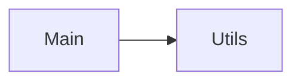

# Project Digest Continued: stoked-ui
Generated on: Mon Apr 14 2025 11:58:22 GMT-0500 (Central Daylight Time)

## Code Visualization


### Architecture and Relationships

These diagrams visualize code relationships at different levels of abstraction.

### File Dependencies

This diagram shows dependencies between individual source files.

#

Below is a visualization of file dependencies in the codebase:

```mermaid
graph LR
  F1_stoked-ui_.gitignore[".gitignore"]
  F2_joy-ui-nextjs-ts_.gitignore[".gitignore"]
  F3_material-ui-cra_.gitignore[".gitignore"]
  F4_examples_.gitignore[".gitignore"]
  F5_material-ui-cra-styled-components_.gitignore[".gitignore"]
  F6_base-ui-vite-tailwind-ts_.gitignore[".gitignore"]
  F7_joy-ui-cra-ts_.gitignore[".gitignore"]
  F8_base-ui-nextjs-tailwind-ts_.gitignore[".gitignore"]
  F9_base-ui-vite-tailwind_.gitignore[".gitignore"]
  F10_joy-ui-vite-ts_.gitignore[".gitignore"]
  F11_material-ui-cra-tailwind-ts_.gitignore[".gitignore"]
  F12_material-ui-cra-styled-components-ts_.gitignore[".gitignore"]
  F13_material-ui-gatsby_.gitignore[".gitignore"]
  F14_material-ui-express-ssr_.gitignore[".gitignore"]
  F15_material-ui-cra-ts_.gitignore[".gitignore"]
  F16_material-ui-nextjs-pages-router_.gitignore[".gitignore"]
  F17_material-ui-nextjs-ts_.gitignore[".gitignore"]
  F18_material-ui-preact_.gitignore[".gitignore"]
  F19_material-ui-nextjs-pages-router-ts_.gitignore[".gitignore"]
  F20_material-ui-nextjs-ts-v4-v5-migration_.gitignore[".gitignore"]
  F21_material-ui-remix-ts_.gitignore[".gitignore"]
  F22_sui-media-selector_.gitignore[".gitignore"]
  F23_material-ui-vite-ts_.gitignore[".gitignore"]
  F24_material-ui-vite_.gitignore[".gitignore"]
  F25_sizeSnapshot_.gitignore[".gitignore"]
  F26_material-ui-nextjs_jsconfig.json["jsconfig.json"]
  F27_docs_package.json["package.json"]
  F28_export_package.json["package.json"]
  F29_benchmark_package.json["package.json"]
  F30_base-ui-cra_package.json["package.json"]
  F31_base-ui-vite-tailwind_package.json["package.json"]
  F32_base-ui-cra-ts_package.json["package.json"]
  F33_base-ui-nextjs-tailwind-ts_package.json["package.json"]
  F34_joy-ui-nextjs-ts_package.json["package.json"]
  F35_base-ui-vite-tailwind-ts_package.json["package.json"]
  F36_joy-ui-vite-ts_package.json["package.json"]
  F37_material-ui-cra_package.json["package.json"]
  F38_joy-ui-cra-ts_package.json["package.json"]
  F39_material-ui-cra-styled-components-ts_package.json["package.json"]
  F40_material-ui-cra-styled-components_package.json["package.json"]
  F41_material-ui-cra-tailwind-ts_package.json["package.json"]
  F42_material-ui-cra-ts_package.json["package.json"]
  F43_material-ui-gatsby_package.json["package.json"]
  F44_material-ui-express-ssr_package.json["package.json"]
  F45_material-ui-nextjs_package.json["package.json"]
  F46_material-ui-nextjs-pages-router_package.json["package.json"]
  F47_material-ui-nextjs-pages-router-ts_package.json["package.json"]
  F48_material-ui-nextjs-ts_package.json["package.json"]
  F49_material-ui-preact_package.json["package.json"]
  F50_material-ui-nextjs-ts-v4-v5-migration_package.json["package.json"]
  F51_material-ui-remix-ts_package.json["package.json"]
  F52_material-ui-vite_package.json["package.json"]
  F53_sui-common_package.json["package.json"]
  F54_material-ui-vite-ts_package.json["package.json"]
  F55_material-ui-via-cdn_package.json["package.json"]
  F56_sui-editor_package.json["package.json"]
  F57_sui-docs_package.json["package.json"]
  F58_stoked-ui_package.json["package.json"]
  F59_sui-file-explorer_package.json["package.json"]
  F60_sui-github_package.json["package.json"]
  F61_sui-media-selector_package.json["package.json"]
  F62_api-docs-builder_package.json["package.json"]
  F63_docs-utils_package.json["package.json"]
  F64_sui-timeline_package.json["package.json"]
  F65_feedback_package.json["package.json"]
  F66_markdown_package.json["package.json"]
  F67_eslint-plugin-stoked-ui_package.json["package.json"]
  F68_proptypes_package.json["package.json"]
  F69_react-docgen-types_package.json["package.json"]
  F70_netlify-plugin-cache-docs_package.json["package.json"]
  F71_rsc-builder_package.json["package.json"]
  F72_sui-envinfo_package.json["package.json"]
  F73_test-utils_package.json["package.json"]
  F74_server_README.md["README.md"]
  F75_base-ui-cra-ts_README.md["README.md"]
  F76_docs_README.md["README.md"]
  F77_base-ui-cra_README.md["README.md"]
  F78_base-ui-nextjs-tailwind-ts_README.md["README.md"]
  F79_browser_README.md["README.md"]
  F80_stoked-ui_README.md["README.md"]
  F81_base-ui-vite-tailwind_README.md["README.md"]
  F82_base-ui-vite-tailwind-ts_README.md["README.md"]
  F83_joy-ui-cra-ts_README.md["README.md"]
  F84_joy-ui-nextjs-ts_README.md["README.md"]
  F85_material-ui-cra_README.md["README.md"]
  F86_joy-ui-vite-ts_README.md["README.md"]
  F87_material-ui-cra-ts_README.md["README.md"]
  F88_material-ui-cra-styled-components-ts_README.md["README.md"]
  F89_material-ui-cra-styled-components_README.md["README.md"]
  F90_material-ui-cra-tailwind-ts_README.md["README.md"]
  F91_material-ui-express-ssr_README.md["README.md"]
  F92_material-ui-gatsby_README.md["README.md"]
  F93_material-ui-nextjs-pages-router_README.md["README.md"]
  F94_material-ui-nextjs_README.md["README.md"]
  F95_material-ui-nextjs-ts_README.md["README.md"]
  F96_material-ui-nextjs-pages-router-ts_README.md["README.md"]
  F97_material-ui-preact_README.md["README.md"]
  F98_material-ui-nextjs-ts-v4-v5-migration_README.md["README.md"]
  F99_material-ui-remix-ts_README.md["README.md"]
  F100_material-ui-via-cdn_README.md["README.md"]
  F101_sui-common_README.md["README.md"]
  F102_sui-docs_README.md["README.md"]
  F103_material-ui-vite-ts_README.md["README.md"]
  F104_sui-file-explorer_README.md["README.md"]
  F105_sui-github_README.md["README.md"]
  F106_sui-timeline_README.md["README.md"]
  F107_sui-media-selector_README.md["README.md"]
  F108_docs-utils_README.md["README.md"]
  F109_material-ui-vite_README.md["README.md"]
  F110_sui-editor_README.md["README.md"]
  F111_eslint-plugin-stoked-ui_README.md["README.md"]
  F112_markdown_README.md["README.md"]
  F113_proptypes_README.md["README.md"]
  F114_feedback_README.md["README.md"]
  F115_sui-envinfo_README.md["README.md"]
  F116_test-utils_README.md["README.md"]
  F117_scripts_README.md["README.md"]
  F118_api_tsconfig.json["tsconfig.json"]
  F119_scripts_tsconfig.json["tsconfig.json"]
  F120_buildApiDocs_tsconfig.json["tsconfig.json"]
  F121_base-ui-nextjs-tailwind-ts_tsconfig.json["tsconfig.json"]
  F122_docs_tsconfig.json["tsconfig.json"]
  F123_base-ui-cra-ts_tsconfig.json["tsconfig.json"]
  F124_base-ui-vite-tailwind-ts_tsconfig.json["tsconfig.json"]
  F125_joy-ui-cra-ts_tsconfig.json["tsconfig.json"]
  F126_joy-ui-nextjs-ts_tsconfig.json["tsconfig.json"]
  F127_joy-ui-vite-ts_tsconfig.json["tsconfig.json"]
  F128_material-ui-cra-styled-components-ts_tsconfig.json["tsconfig.json"]
  F129_material-ui-cra-tailwind-ts_tsconfig.json["tsconfig.json"]
  F130_material-ui-cra-ts_tsconfig.json["tsconfig.json"]
  F131_material-ui-nextjs-ts_tsconfig.json["tsconfig.json"]
  F132_material-ui-nextjs-ts-v4-v5-migration_tsconfig.json["tsconfig.json"]
  F133_material-ui-nextjs-pages-router-ts_tsconfig.json["tsconfig.json"]
  F134_material-ui-vite-ts_tsconfig.json["tsconfig.json"]
  F135_material-ui-remix-ts_tsconfig.json["tsconfig.json"]
  F136_infra_tsconfig.json["tsconfig.json"]
  F137_sui-common_tsconfig.json["tsconfig.json"]
  F138_sui-file-explorer_tsconfig.json["tsconfig.json"]
  F139_sui-docs_tsconfig.json["tsconfig.json"]
  F140_sui-editor_tsconfig.json["tsconfig.json"]
  F141_sui-github_tsconfig.json["tsconfig.json"]
  F142_sui-timeline_tsconfig.json["tsconfig.json"]
  F143_docs-utils_tsconfig.json["tsconfig.json"]
  F144_api-docs-builder_tsconfig.json["tsconfig.json"]
  F145_sui-media-selector_tsconfig.json["tsconfig.json"]
  F146_rsc-builder_tsconfig.json["tsconfig.json"]
  F147_proptypes_tsconfig.json["tsconfig.json"]
  F148_test-utils_tsconfig.json["tsconfig.json"]
  F149_buildApiDocs_tsconfig.json["tsconfig.json"]
  F150_typescript-to-proptypes_tsconfig.json["tsconfig.json"]
  F151_base-ui-vite-tailwind_vite.config.js["vite.config.js"]
  F152_material-ui-vite_vite.config.js["vite.config.js"]
  F153_browser_index.js["index.js"]
  F154_material-ui-express-ssr_webpack.config.js["webpack.config.js"]
  F155_sizeSnapshot_webpack.config.js["webpack.config.js"]
  F156_stoked-ui_tsconfig.json["tsconfig.json"]
  F157_box-baseline_index.js["index.js"]
  F158_box-material-ui_index.js["index.js"]
  F159_box-chakra-ui_index.js["index.js"]
  F160_browser_webpack.config.js["webpack.config.js"]
  F161_box-theme-ui_index.js["index.js"]
  F162_components_index.js["index.js"]
  F163_grid-material-ui_index.js["index.js"]
  F164_make-styles_index.js["index.js"]
  F165_grid-simple_index.js["index.js"]
  F166_grid-system_index.js["index.js"]
  F167_primitives_index.js["index.js"]
  F168_styled-components-box-material-ui-system_index.js["index.js"]
  F169_noop_index.js["index.js"]
  F170_styled-components-box-styled-system_index.js["index.js"]
  F171_styled-emotion_index.js["index.js"]
  F172_styled-material-ui_index.js["index.js"]
  F173_styled-sc_index.js["index.js"]
  F174_table-cell_index.js["index.js"]
  F175_utils_index.js["index.js"]
  F176_docs_index.js["index.js"]
  F177_common_index.js["index.js"]
  F178_consulting_index.js["index.js"]
  F179_docs_index.js["index.js"]
  F180_docs-lib_index.js["index.js"]
  F181_docs_index.js["index.js"]
  F182_experiments_index.js["index.js"]
  F183_editor_index.js["index.js"]
  F184_file-explorer_index.js["index.js"]
  F185_onepirate_index.js["index.js"]
  F186_docs_index.js["index.js"]
  F187_paperbase_index.js["index.js"]
  F188_docs_index.js["index.js"]
  F189_media-selector_index.js["index.js"]
  F190_docs_index.js["index.js"]
  F191_stoked-ui_index.js["index.js"]
  F192_docs_index.js["index.js"]
  F193_src_index.js["index.js"]
  F194_src_index.js["index.js"]
  F195_timeline_index.js["index.js"]
  F196_pages_index.js["index.js"]
  F197_pages_index.js["index.js"]
  F198_CodeCopyButton_index.js["index.js"]
  F199_src_index.js["index.js"]
  F200_src_index.js["index.js"]
  F201_CodeSandbox_index.js["index.js"]
  F202_DemoEditor_index.js["index.js"]
  F203_DemoEditorError_index.js["index.js"]
  F204_HighlightedCode_index.js["index.js"]
  F205_DemoToolbarRoot_index.js["index.js"]
  F206_HighlightedCodeWithTabs_index.js["index.js"]
  F207_DemoSandbox_index.js["index.js"]
  F208_MarkdownElement_index.js["index.js"]
  F209_DemoToolbar_index.js["index.js"]
  F210_Demo_index.js["index.js"]
  F211_ReactRunner_index.js["index.js"]
  F212_RichMarkdownElement_index.js["index.js"]
  F213_StackBlitz_index.js["index.js"]
  F214_SandboxDependencies_index.js["index.js"]
  F215_addHiddenInput_index.js["index.js"]
  F216_NProgressBar_index.js["index.js"]
  F217_SvgIcons_index.js["index.js"]
  F218_getFileExtension_index.js["index.js"]
  F219_getProductInfoFromUrl_index.js["index.js"]
  F220_NProgressBar_index.js["index.js"]
  F221_stylingSolutionMapping_index.js["index.js"]
  F222_feedback_index.js["index.js"]
  F223_svgIcons_index.js["index.js"]
  F224_src_index.js["index.js"]
  F225_markdown_index.js["index.js"]
  F226_sizeSnapshot_index.js["index.js"]
  F227_netlify-plugin-cache-docs_index.js["index.js"]
  F228_useLazyCSS_index.js["index.js"]
  F229_buildApiDocs_index.ts["index.ts"]
  F230_fileExplorerSettings_index.ts["index.ts"]
  F231_Colors_index.ts["index.ts"]
  F232_FetchBackoff_index.ts["index.ts"]
  F233_infra_index.ts["index.ts"]
  F234_Ids_index.ts["index.ts"]
  F235_namedId_index.ts["index.ts"]
  F236_GrokLoader_index.ts["index.ts"]
  F237_useIncId_index.ts["index.ts"]
  F238_LocalDb_index.ts["index.ts"]
  F239_MimeType_index.ts["index.ts"]
  F240_ProviderState_index.ts["index.ts"]
  F241_src_index.ts["index.ts"]
  F242_useResize_index.ts["index.ts"]
  F243_Types_index.ts["index.ts"]
  F244_useResizeWindow_index.ts["index.ts"]
  F245_Branding_index.ts["index.ts"]
  F246_BrandingCssVarsProvider_index.ts["index.ts"]
  F247_DocsProvider_index.ts["index.ts"]
  F248_InfoCard_index.ts["index.ts"]
  F249_I18n_index.ts["index.ts"]
  F250_Link_index.ts["index.ts"]
  F251_NProgressBar_index.ts["index.ts"]
  F252_translations_index.ts["index.ts"]
  F253_SvgIcons_index.ts["index.ts"]
  F254_brandingCssVars_index.ts["index.ts"]
  F255_BrandingCssVarsProvider_index.ts["index.ts"]
  F256_InfoCard_index.ts["index.ts"]
  F257_branding_index.ts["index.ts"]
  F258_i18n_index.ts["index.ts"]
  F259_components_index.ts["index.ts"]
  F260_Link_index.ts["index.ts"]
  F261_src_index.ts["index.ts"]
  F262_translations_index.ts["index.ts"]
  F263_Editor_index.ts["index.ts"]
  F264_Editor_index.ts["index.ts"]
  F265_Controllers_index.ts["index.ts"]
  F266_DetailView_index.ts["index.ts"]
  F267_EditorAction_index.ts["index.ts"]
  F268_EditorControls_index.ts["index.ts"]
  F269_EditorEngine_index.ts["index.ts"]
  F270_EditorFile_index.ts["index.ts"]
  F271_EditorFileTabs_index.ts["index.ts"]
  F272_EditorView_index.ts["index.ts"]
  F273_EditorTrack_index.ts["index.ts"]
  F274_EditorProvider_index.ts["index.ts"]
  F275_db_index.ts["index.ts"]
  F276_src_index.ts["index.ts"]
  F277_hooks_index.ts["index.ts"]
  F278_EditorProvider_index.ts["index.ts"]
  F279_icons_index.ts["index.ts"]
  F280_corePlugins_index.ts["index.ts"]
  F281_useEditorInstanceEvents_index.ts["index.ts"]
  F282_internals_index.ts["index.ts"]
  F283_useEditorKeyboard_index.ts["index.ts"]
  F284_models_index.ts["index.ts"]
  F285_models_index.ts["index.ts"]
  F286_useEditorMetadata_index.ts["index.ts"]
  F287_zero-styled_index.ts["index.ts"]
  F288_themeAugmentation_index.ts["index.ts"]
  F289_useEditor_index.ts["index.ts"]
  F290_FileExplorer_index.ts["index.ts"]
  F291_FileExplorerBasic_index.ts["index.ts"]
  F292_File_index.ts["index.ts"]
  F293_FileElement_index.ts["index.ts"]
  F294_FileDropzone_index.ts["index.ts"]
  F295_FileExplorerTabs_index.ts["index.ts"]
  F296_FileExplorer_index.ts["index.ts"]
  F297_hooks_index.ts["index.ts"]
  F298_src_index.ts["index.ts"]
  F299_icons_index.ts["index.ts"]
  F300_useFileUtils_index.ts["index.ts"]
  F301_FileExplorerProvider_index.ts["index.ts"]
  F302_FileDepthContext_index.ts["index.ts"]
  F303_FileIcon_index.ts["index.ts"]
  F304_corePlugins_index.ts["index.ts"]
  F305_FileProvider_index.ts["index.ts"]
  F306_internals_index.ts["index.ts"]
  F307_models_index.ts["index.ts"]
  F308_useFileExplorerInstanceEvents_index.ts["index.ts"]
  F309_useFileExplorerDnd_index.ts["index.ts"]
  F310_useFileExplorerId_index.ts["index.ts"]
  F311_useFileExplorerExpansion_index.ts["index.ts"]
  F312_useFileExplorerFocus_index.ts["index.ts"]
  F313_useFileExplorerFiles_index.ts["index.ts"]
  F314_useFileExplorerGrid_index.ts["index.ts"]
  F315_useFileExplorerKeyboardNavigation_index.ts["index.ts"]
  F316_useFileExplorer_index.ts["index.ts"]
  F317_zero-styled_index.ts["index.ts"]
  F318_useFileExplorerIcons_index.ts["index.ts"]
  F319_useFileExplorerJSXItems_index.ts["index.ts"]
  F320_useFileExplorerSelection_index.ts["index.ts"]
  F321_src_index.ts["index.ts"]
  F322_Editor_index.ts["index.ts"]
  F323_AppOutputFile_index.ts["index.ts"]
  F324_themeAugmentation_index.ts["index.ts"]
  F325_FileSystemApi_index.ts["index.ts"]
  F326_models_index.ts["index.ts"]
  F327_useFile_index.ts["index.ts"]
  F328_App_index.ts["index.ts"]
  F329_AppFile_index.ts["index.ts"]
  F330_Metadata_index.ts["index.ts"]
  F331_Stage_index.ts["index.ts"]
  F332_MediaFile_index.ts["index.ts"]
  F333_MediaType_index.ts["index.ts"]
  F334_WebFileFactory_index.ts["index.ts"]
  F335_WebFile_index.ts["index.ts"]
  F336_src_index.ts["index.ts"]
  F337_zip_index.ts["index.ts"]
  F338_Controller_index.ts["index.ts"]
  F339_Timeline_index.ts["index.ts"]
  F340_Engine_index.ts["index.ts"]
  F341_Interactable_index.ts["index.ts"]
  F342_TimelineAction_index.ts["index.ts"]
  F343_Timeline_index.ts["index.ts"]
  F344_TimelineControls_index.ts["index.ts"]
  F345_TimelineCursor_index.ts["index.ts"]
  F346_TimelineFile_index.ts["index.ts"]
  F347_TimelinePlayer_index.ts["index.ts"]
  F348_Commands_index.ts["index.ts"]
  F349_TimelineLabels_index.ts["index.ts"]
  F350_TimelineProvider_index.ts["index.ts"]
  F351_TimelineScrollResizer_index.ts["index.ts"]
  F352_TimelineTrackArea_index.ts["index.ts"]
  F353_components_index.ts["index.ts"]
  F354_src_index.ts["index.ts"]
  F355_ToggleButtonGroupEx_index.ts["index.ts"]
  F356_TimelineTrack_index.ts["index.ts"]
  F357_utils_index.ts["index.ts"]
  F358_icons_index.ts["index.ts"]
  F359_themeAugmentation_index.ts["index.ts"]
  F360_TimelineTime_index.ts["index.ts"]
  F361_src_index.ts["index.ts"]
  F362_fileExplorerSettings_index.ts["index.ts"]
  F363_RtlProvider_index.ts["index.ts"]
  F364_src_index.ts["index.ts"]
  F365_src_index.ts["index.ts"]
  F366_buildApiDocs_index.ts["index.ts"]
  F367_api-docs-builder_index.ts["index.ts"]
  F368_material-ui-express-ssr_server.js["server.js"]
  F369_projectSettings_index.ts["index.ts"]
  F370_scenarios_server.js["server.js"]
  F371_pages__app.js["_app.js"]
  F372_pages__app.tsx["_app.tsx"]
  F373_pages__app.tsx["_app.tsx"]
  F374_pages__app.js["_app.js"]
  F375_pages__app.js["_app.js"]
  F376_pages__document.js["_document.js"]
  F377_pages__document.js["_document.js"]
  F378_pages__document.js["_document.js"]
  F379_development__buildManifest.js["_buildManifest.js"]
  F380_pages__document.tsx["_document.tsx"]
  F381_pages__document.tsx["_document.tsx"]
  F382_pages__error.js["_error.js"]
  F383_examples_.eslintrc.js[".eslintrc.js"]
  F384_stoked-ui_.eslintrc.js[".eslintrc.js"]
  F385_routes__index.tsx["_index.tsx"]
  F386_api_.eslintrc.js[".eslintrc.js"]
  F387_infra_.eslintrc.js[".eslintrc.js"]
  F388_development__ssgManifest.js["_ssgManifest.js"]
  F389_sui-common_.eslintrc.js[".eslintrc.js"]
  F390_pages__error.js["_error.js"]
  F391_sui-github_.eslintrc.js[".eslintrc.js"]
  F392_sui-docs_.eslintrc.js[".eslintrc.js"]
  F393_sui-timeline_.eslintrc.js[".eslintrc.js"]
  F394_sui-file-explorer_.eslintrc.js[".eslintrc.js"]
  F395_sui-editor_.eslintrc.js[".eslintrc.js"]
  F396_stoked-ui_.mocharc.js[".mocharc.js"]
  F397_stoked-ui_.stylelintrc.js[".stylelintrc.js"]
  F398_api-docs-builder_.eslintrc.js[".eslintrc.js"]
  F399_vendor-chunks_@mui+material-nextjs@5.16.14_@emotion+cache@11.14.0_@emotion+server@11.11.0_@mui+materi_99296d17ff195d19854402030534774c.js["@mui+material-nextjs@5.16.14_@emotion+cache@11.14.0_@emotion+server@11.11.0_@mui+materi_99296d17ff195d19854402030534774c.js"]
  F400_vendor-chunks_@babel+runtime@7.26.10.js["@babel+runtime@7.26.10.js"]
  F401_mui_2020-q2-update.js["2020-q2-update.js"]
  F402_vendor-chunks_@swc+helpers@0.5.2.js["@swc+helpers@0.5.2.js"]
  F403_mui_2020-introducing-sketch.js["2020-introducing-sketch.js"]
  F404_mui_2020-q1-update.js["2020-q1-update.js"]
  F405_mui_2020.js["2020.js"]
  F406_mui_2020-q3-update.js["2020-q3-update.js"]
  F407_mui_2020-developer-survey-results.js["2020-developer-survey-results.js"]
  F408_mui_2021-developer-survey-results.js["2021-developer-survey-results.js"]
  F409_mui_2019.js["2019.js"]
  F410_mui_2019-developer-survey-results.js["2019-developer-survey-results.js"]
  F411_mui_2021-q1-update.js["2021-q1-update.js"]
  F412_mui_2021-q2-update.js["2021-q2-update.js"]
  F413_mui_2021-q3-update.js["2021-q3-update.js"]
  F414_mui_2021.js["2021.js"]
  F415_mui_2023-chamonix-retreat.js["2023-chamonix-retreat.js"]
  F416_mui_2022-tenerife-retreat.js["2022-tenerife-retreat.js"]
  F417_mui_2023-material-ui-v6-and-beyond.js["2023-material-ui-v6-and-beyond.js"]
  F418_mui_2023-phuket-retreat.js["2023-phuket-retreat.js"]
  F419_mui_2023-mui-values.js["2023-mui-values.js"]
  F420_mui_2023-toolpad-beta-announcement.js["2023-toolpad-beta-announcement.js"]
  F421_pages_404.tsx["404.tsx"]
  F422_pages_about.js["about.js"]
  F423_pages_about.tsx["about.tsx"]
  F424_pages_about.js["about.js"]
  F425_pages_about.tsx["about.tsx"]
  F426_pages_about.tsx["about.tsx"]
  F427_routes_about.tsx["about.tsx"]
  F428_about_AboutEnd.tsx["AboutEnd.tsx"]
  F429_about_AboutHero.tsx["AboutHero.tsx"]
  F430_careers_accessibility-engineer.js["accessibility-engineer.js"]
  F431_docs_accessibility.js["accessibility.js"]
  F432_basics_AdaptingHOC.js["AdaptingHOC.js"]
  F433_components_Ad.js["Ad.js"]
  F434_components_ad.styles.js["ad.styles.js"]
  F435_basics_AdaptingHOC.tsx["AdaptingHOC.tsx"]
  F436_basics_AdaptingHook.js["AdaptingHook.js"]
  F437_basics_AdaptingStyledComponents.js["AdaptingStyledComponents.js"]
  F438_basics_AdaptingHook.tsx["AdaptingHook.tsx"]
  F439_basics_AdaptingStyledComponents.tsx["AdaptingStyledComponents.tsx"]
  F440_components_AdCarbon.js["AdCarbon.js"]
  F441_components_addHiddenInput.ts["addHiddenInput.ts"]
  F442_utils_addHiddenInput.ts["addHiddenInput.ts"]
  F443_components_AdDisplay.js["AdDisplay.js"]
  F444_Timeline_AddTrackButton.tsx["AddTrackButton.tsx"]
  F445_components_AdGuest.js["AdGuest.js"]
  F446_components_AdInHouse.js["AdInHouse.js"]
  F447_components_AdobeXDIcon.js["AdobeXDIcon.js"]
  F448_components_AdManager.js["AdManager.js"]
  F449_mui_aggregation-functions.js["aggregation-functions.js"]
  F450_home_AdvancedShowcase.tsx["AdvancedShowcase.tsx"]
  F451_components_ApiDivider.js["ApiDivider.js"]
  F452_infra_api.ts["api.ts"]
  F453_Controllers_AnimationController.ts["AnimationController.ts"]
  F454_focus_ApiMethodFocusItem.js["ApiMethodFocusItem.js"]
  F455_focus_ApiMethodFocusItem.js["ApiMethodFocusItem.js"]
  F456_focus_ApiMethodFocusItem.tsx["ApiMethodFocusItem.tsx"]
  F457_items_ApiMethodGetItem.tsx["ApiMethodGetItem.tsx"]
  F458_items_ApiMethodGetItemDOMElement.js["ApiMethodGetItemDOMElement.js"]
  F459_items_ApiMethodGetItem.js["ApiMethodGetItem.js"]
  F460_focus_ApiMethodFocusItem.tsx["ApiMethodFocusItem.tsx"]
  F461_items_ApiMethodGetItemDOMElement.tsx["ApiMethodGetItemDOMElement.tsx"]
  F462_items_ApiMethodGetItemDOMElement.js["ApiMethodGetItemDOMElement.js"]
  F463_items_ApiMethodGetItemDOMElement.tsx["ApiMethodGetItemDOMElement.tsx"]
  F464_items_ApiMethodGetItemOrderedChildrenIds.tsx["ApiMethodGetItemOrderedChildrenIds.tsx"]
  F465_items_ApiMethodGetItemOrderedChildrenIds.js["ApiMethodGetItemOrderedChildrenIds.js"]
  F466_items_ApiMethodGetItemTree.tsx["ApiMethodGetItemTree.tsx"]
  F467_items_ApiMethodGetItemTree.js["ApiMethodGetItemTree.js"]
  F468_selection_ApiMethodSelectItem.js["ApiMethodSelectItem.js"]
  F469_selection_ApiMethodSelectItem.js["ApiMethodSelectItem.js"]
  F470_selection_ApiMethodSelectItem.tsx["ApiMethodSelectItem.tsx"]
  F471_selection_ApiMethodSelectItemKeepExistingSelection.js["ApiMethodSelectItemKeepExistingSelection.js"]
  F472_selection_ApiMethodSelectItemKeepExistingSelection.tsx["ApiMethodSelectItemKeepExistingSelection.tsx"]
  F473_selection_ApiMethodSelectItemKeepExistingSelection.tsx["ApiMethodSelectItemKeepExistingSelection.tsx"]
  F474_expansion_ApiMethodSetItemExpansion.js["ApiMethodSetItemExpansion.js"]
  F475_expansion_ApiMethodSetItemExpansion.tsx["ApiMethodSetItemExpansion.tsx"]
  F476_selection_ApiMethodSelectItem.tsx["ApiMethodSelectItem.tsx"]
  F477_expansion_ApiMethodSetItemExpansion.js["ApiMethodSetItemExpansion.js"]
  F478_selection_ApiMethodSelectItemKeepExistingSelection.js["ApiMethodSelectItemKeepExistingSelection.js"]
  F479_components_ApiPage.js["ApiPage.js"]
  F480_expansion_ApiMethodSetItemExpansion.tsx["ApiMethodSetItemExpansion.tsx"]
  F481_src_App.js["App.js"]
  F482_src_App.js["App.js"]
  F483_ApiPage_ApiWarning.tsx["ApiWarning.tsx"]
  F484_material-ui-express-ssr_App.js["App.js"]
  F485_src_App.js["App.js"]
  F486_App_App.ts["App.ts"]
  F487_src_App.js["App.js"]
  F488_src_App.tsx["App.tsx"]
  F489_src_App.jsx["App.jsx"]
  F490_src_App.jsx["App.jsx"]
  F491_src_App.tsx["App.tsx"]
  F492_src_App.tsx["App.tsx"]
  F493_src_App.tsx["App.tsx"]
  F494_src_App.tsx["App.tsx"]
  F495_src_App.tsx["App.tsx"]
  F496_src_App.tsx["App.tsx"]
  F497_src_App.tsx["App.tsx"]
  F498_views_AppAppBar.tsx["AppAppBar.tsx"]
  F499_components_AppBar.js["AppBar.js"]
  F500_views_AppAppBar.js["AppAppBar.js"]
  F501_AppFile_AppFile_20250414110248.ts["AppFile_20250414110248.ts"]
  F502_components_AppBar.tsx["AppBar.tsx"]
  F503_AppFile_AppFile.ts["AppFile.ts"]
  F504_views_AppFooter.tsx["AppFooter.tsx"]
  F505_views_AppForm.js["AppForm.js"]
  F506_AppFile_AppFile_20250323032253.ts["AppFile_20250323032253.ts"]
  F507_components_AppContainer.js["AppContainer.js"]
  F508_views_AppForm.tsx["AppForm.tsx"]
  F509_components_AppFrame.js["AppFrame.js"]
  F510_layouts_AppFooter.tsx["AppFooter.tsx"]
  F511_banner_AppFrameBanner.tsx["AppFrameBanner.tsx"]
  F512_layouts_AppHeader.tsx["AppHeader.tsx"]
  F513_components_AppLayoutDocs.js["AppLayoutDocs.js"]
  F514_banner_AppHeaderBanner.tsx["AppHeaderBanner.tsx"]
  F515_components_AppNavIcons.ts["AppNavIcons.ts"]
  F516_components_AppLayoutDocsFooter.js["AppLayoutDocsFooter.js"]
  F517_components_AppNavDrawer.js["AppNavDrawer.js"]
  F518_AppOutputFile_AppOutputFile.ts["AppOutputFile.ts"]
  F519_components_AppSearch.js["AppSearch.js"]
  F520_components_AppNavDrawerItem.js["AppNavDrawerItem.js"]
  F521_components_AppSettingsDrawer.js["AppSettingsDrawer.js"]
  F522_components_AppTableOfContents.js["AppTableOfContents.js"]
  F523_mui_april-2019-update.js["april-2019-update.js"]
  F524_components_AppTheme.js["AppTheme.js"]
  F525_action_ArrowButton.tsx["ArrowButton.tsx"]
  F526_Controller_AudioController.ts["AudioController.ts"]
  F527_Editor_AudioPlayer.tsx["AudioPlayer.tsx"]
  F528_Controllers_AudioController.ts["AudioController.ts"]
  F529_using_AutoSizer.tsx["AutoSizer.tsx"]
  F530_mui_august-2019-update.js["august-2019-update.js"]
  F531_stoked-ui_babel.config.js["babel.config.js"]
  F532_docs_babel.config.js["babel.config.js"]
  F533_.history_babel.config_20250414114234.js["babel.config_20250414114234.js"]
  F534_components_BackToTop.tsx["BackToTop.tsx"]
  F535_utils_babel-plugin-jsx-preview.js["babel-plugin-jsx-preview.js"]
  F536_components_BaseButtonDemo.tsx["BaseButtonDemo.tsx"]
  F537_pages_base-ui.tsx["base-ui.tsx"]
  F538_components_BaseInputDemo.tsx["BaseInputDemo.tsx"]
  F539_components_BaseMenuDemo.tsx["BaseMenuDemo.tsx"]
  F540_mui_base-ui-2024-plans.js["base-ui-2024-plans.js"]
  F541_components_BaseSliderDemo.tsx["BaseSliderDemo.tsx"]
  F542_components_BaseTabsDemo.tsx["BaseTabsDemo.tsx"]
  F543_productBaseUI_BaseUICustomization.tsx["BaseUICustomization.tsx"]
  F544_productBaseUI_BaseUIComponents.tsx["BaseUIComponents.tsx"]
  F545_components_BaseUIComponents.js["BaseUIComponents.js"]
  F546_productBaseUI_BaseUIEnd.tsx["BaseUIEnd.tsx"]
  F547_productBaseUI_BaseUIHero.tsx["BaseUIHero.tsx"]
  F548_productBaseUI_BaseUITestimonial.tsx["BaseUITestimonial.tsx"]
  F549_productBaseUI_BaseUISummary.tsx["BaseUISummary.tsx"]
  F550_productBaseUI_BaseUIThemesDemo.tsx["BaseUIThemesDemo.tsx"]
  F551_editor_BasicEditor.js["BasicEditor.js"]
  F552_FileExplorer_BasicFileExplorer.tsx["BasicFileExplorer.tsx"]
  F553_Editor_BasicEditor.tsx["BasicEditor.tsx"]
  F554_Editor_BasicEditor.tsx["BasicEditor.tsx"]
  F555_items_BasicSimpleFileExplorer.js["BasicSimpleFileExplorer.js"]
  F556_items_BasicSimpleFileExplorer.tsx["BasicSimpleFileExplorer.tsx"]
  F557_Timeline_BasicTimeline.tsx["BasicTimeline.tsx"]
  F558_mui_benny-joo-joining.js["benny-joo-joining.js"]
  F559_scripts_benchmark.js["benchmark.js"]
  F560_DetailView_BlendModeSelect.tsx["BlendModeSelect.tsx"]
  F561_blog_blog-custom-card.js["blog-custom-card.js"]
  F562_types_blob-fix.d.ts["blob-fix.d.ts"]
  F563_customization_BorderedFileExplorer.js["BorderedFileExplorer.js"]
  F564_components_bootstrap.js["bootstrap.js"]
  F565_pages_blog.tsx["blog.tsx"]
  F566_customization_BorderedFileExplorer.tsx["BorderedFileExplorer.tsx"]
  F567_website_branding-theme-test.tsx["branding-theme-test.tsx"]
  F568_BrandingCssVarsProvider_BrandingCssVarsProvider.tsx["BrandingCssVarsProvider.tsx"]
  F569_BrandingCssVarsProvider_BrandingCssVarsProvider.d.ts["BrandingCssVarsProvider.d.ts"]
  F570_blog_blog.js["blog.js"]
  F571_modules_brandingTheme.ts["brandingTheme.ts"]
  F572_BrandingCssVarsProvider_BrandingCssVarsProvider.tsx["BrandingCssVarsProvider.tsx"]
  F573_branding_BrandingProvider.tsx["BrandingProvider.tsx"]
  F574_branding_brandingTheme.ts["brandingTheme.ts"]
  F575_mui_bringing-consistency-to-material-ui-customization-apis.js["bringing-consistency-to-material-ui-customization-apis.js"]
  F576_mui_build-layouts-faster-with-grid-v2.js["build-layouts-faster-with-grid-v2.js"]
  F577_api_buildApi.ts["buildApi.ts"]
  F578_api-docs-builder_buildApi.ts["buildApi.ts"]
  F579_scripts_build.js["build.js"]
  F580_api-docs-builder_buildApiUtils.ts["buildApiUtils.ts"]
  F581_api_buildGridEventsDocumentation.ts["buildGridEventsDocumentation.ts"]
  F582_scripts_buildColorTypes.js["buildColorTypes.js"]
  F583_api_buildExportsDocumentation.ts["buildExportsDocumentation.ts"]
  F584_api_buildGridSelectorsDocumentation.ts["buildGridSelectorsDocumentation.ts"]
  F585_scripts_buildIcons.js["buildIcons.js"]
  F586_rsc-builder_buildRsc_20250414114841.ts["buildRsc_20250414114841.ts"]
  F587_rsc-builder_buildRsc.ts["buildRsc.ts"]
  F588_scripts_buildServiceWorker.js["buildServiceWorker.js"]
  F589_api_buildInterfacesDocumentation.ts["buildInterfacesDocumentation.ts"]
  F590_components_BundleSizeIcon.js["BundleSizeIcon.js"]
  F591_mui_callback-support-in-style-overrides.js["callback-support-in-style-overrides.js"]
  F592_components_Button.js["Button.js"]
  F593_components_Button.tsx["Button.tsx"]
  F594_pages_careers.tsx["careers.tsx"]
  F595_selection_CheckboxMultiSelection.js["CheckboxMultiSelection.js"]
  F596_using_CellMeasurer.tsx["CellMeasurer.tsx"]
  F597_selection_CheckboxMultiSelection.js["CheckboxMultiSelection.js"]
  F598_selection_CheckboxMultiSelection.tsx["CheckboxMultiSelection.tsx"]
  F599_docs_callouts.js["callouts.js"]
  F600_stack_certificate.ts["certificate.ts"]
  F601_selection_CheckboxMultiSelection.tsx["CheckboxMultiSelection.tsx"]
  F602_selection_CheckboxSelection.js["CheckboxSelection.js"]
  F603_selection_CheckboxSelection.tsx["CheckboxSelection.tsx"]
  F604_selection_CheckboxSelection.js["CheckboxSelection.js"]
  F605_selection_CheckboxSelection.tsx["CheckboxSelection.tsx"]
  F606_list_ClassesList.tsx["ClassesList.tsx"]
  F607_sections_ClassesSection.tsx["ClassesSection.tsx"]
  F608_table_ClassesTable.tsx["ClassesTable.tsx"]
  F609_cleanupTracking_CleanupTracking.ts["CleanupTracking.ts"]
  F610_cleanupTracking_CleanupTracking.ts["CleanupTracking.ts"]
  F611_src_ClientStyleContext.tsx["ClientStyleContext.tsx"]
  F612_material-ui-express-ssr_client.js["client.js"]
  F613_utils_CodeCopy.tsx["CodeCopy.tsx"]
  F614_components_CodeCopyButton.tsx["CodeCopyButton.tsx"]
  F615_components_CodeCopyButton.tsx["CodeCopyButton.tsx"]
  F616_utils_codeStylingSolution.js["codeStylingSolution.js"]
  F617_sandbox_CodeSandbox.ts["CodeSandbox.ts"]
  F618_components_CodeSandbox.tsx["CodeSandbox.tsx"]
  F619_components_CodeCopy.tsx["CodeCopy.tsx"]
  F620_docs_codeblock.js["codeblock.js"]
  F621_utils_codeVariant.js["codeVariant.js"]
  F622_components_codeStylingSolution.tsx["codeStylingSolution.tsx"]
  F623_components_codeVariant.tsx["codeVariant.tsx"]
  F624_data_common-component-api-pages.js["common-component-api-pages.js"]
  F625_Timeline_CollapsedTimeline.tsx["CollapsedTimeline.tsx"]
  F626_Colors_colors.ts["colors.ts"]
  F627_home_CompaniesGrid.tsx["CompaniesGrid.tsx"]
  F628_data_common-component-api-pages.ts["common-component-api-pages.ts"]
  F629_ApiBuilders_ComponentApiBuilder.ts["ComponentApiBuilder.ts"]
  F630_src_ComponentClassDefinition.ts["ComponentClassDefinition.ts"]
  F631_components_ComponentLinkHeader.js["ComponentLinkHeader.js"]
  F632_components_ComponentPageTabs.js["ComponentPageTabs.js"]
  F633_themeAugmentation_components.d.ts["components.d.ts"]
  F634_themeAugmentation_components.d.ts["components.d.ts"]
  F635_base_components-gallery.tsx["components-gallery.tsx"]
  F636_pages_components.tsx["components.tsx"]
  F637_themeAugmentation_components.d.ts["components.d.ts"]
  F638_src_components.tsx["components.tsx"]
  F639_app_components.tsx["components.tsx"]
  F640_components_ComponentsApiContent.js["ComponentsApiContent.js"]
  F641_action_ComponentShowcaseCard.tsx["ComponentShowcaseCard.tsx"]
  F642_docs_config.d.ts["config.d.ts"]
  F643_material-ui-preact_config-overrides.js["config-overrides.js"]
  F644_docs_config.js["config.js"]
  F645_interface_const.ts["const.ts"]
  F646_modules_constants.js["constants.js"]
  F647_components_constants.js["constants.js"]
  F648_File_constants.ts["constants.ts"]
  F649_useFileExplorerDnd_constants.ts["constants.ts"]
  F650_docs_consulting.js["consulting.js"]
  F651_company_contact.js["contact.js"]
  F652_paperbase_Content.tsx["Content.tsx"]
  F653_paperbase_Content.js["Content.js"]
  F654_DetailView_ControlledColor.tsx["ControlledColor.tsx"]
  F655_DetailView_ControlledCheckbox.tsx["ControlledCheckbox.tsx"]
  F656_Editor_ContextMenu.tsx["ContextMenu.tsx"]
  F657_DetailView_ControlledCss.tsx["ControlledCss.tsx"]
  F658_DetailView_ControlledCoordinates.tsx["ControlledCoordinates.tsx"]
  F659_expansion_ControlledExpansion.js["ControlledExpansion.js"]
  F660_expansion_ControlledExpansion.js["ControlledExpansion.js"]
  F661_DetailView_ControlledSelect.tsx["ControlledSelect.tsx"]
  F662_selection_ControlledSelection.js["ControlledSelection.js"]
  F663_selection_ControlledSelection.js["ControlledSelection.js"]
  F664_selection_ControlledSelection.tsx["ControlledSelection.tsx"]
  F665_selection_ControlledSelection.tsx["ControlledSelection.tsx"]
  F666_DetailView_ControlledText.tsx["ControlledText.tsx"]
  F667_expansion_ControlledExpansion.tsx["ControlledExpansion.tsx"]
  F668_expansion_ControlledExpansion.tsx["ControlledExpansion.tsx"]
  F669_DetailView_ControlledVolumeSpan.tsx["ControlledVolumeSpan.tsx"]
  F670_Controller_Controller.ts["Controller.ts"]
  F671_Controller_Controller.types.ts["Controller.types.ts"]
  F672_Controller_ControllerParams.ts["ControllerParams.ts"]
  F673_Controllers_Controllers.ts["Controllers.ts"]
  F674_Controller_Controllers.ts["Controllers.ts"]
  F675_components_Copyright.js["Copyright.js"]
  F676_components_Copyright.js["Copyright.js"]
  F677_src_Copyright.js["Copyright.js"]
  F678_src_Copyright.jsx["Copyright.jsx"]
  F679_src_Copyright.js["Copyright.js"]
  F680_src_Copyright.tsx["Copyright.tsx"]
  F681_src_Copyright.tsx["Copyright.tsx"]
  F682_src_Copyright.tsx["Copyright.tsx"]
  F683_components_Copyright.tsx["Copyright.tsx"]
  F684_scenarios_core.js["core.js"]
  F685_overview_CoreDemo.js["CoreDemo.js"]
  F686_overview_CoreDemo.tsx["CoreDemo.tsx"]
  F687_productCore_CoreHero.tsx["CoreHero.tsx"]
  F688_corePlugins_corePlugins.ts["corePlugins.ts"]
  F689_productCore_CoreProducts.tsx["CoreProducts.tsx"]
  F690_corePlugins_corePlugins.ts["corePlugins.ts"]
  F691_material-ui-cra-styled-components_craco.config.js["craco.config.js"]
  F692_home_CoreShowcase.tsx["CoreShowcase.tsx"]
  F693_scripts_coreTypeScriptProjects.js["coreTypeScriptProjects.js"]
  F694_sizeSnapshot_create.js["create.js"]
  F695_utils_createDescribeableProp.ts["createDescribeableProp.ts"]
  F696_material-ui-cra-styled-components-ts_craco.config.js["craco.config.js"]
  F697_src_createDescribe.ts["createDescribe.ts"]
  F698_src_createDOM.d.ts["createDOM.d.ts"]
  F699_src_createDOM.js["createDOM.js"]
  F700_material-ui-express-ssr_createEmotionCache.js["createEmotionCache.js"]
  F701_src_createEmotionCache.ts["createEmotionCache.ts"]
  F702_examples_createEmotionCache.ts["createEmotionCache.ts"]
  F703_src_createMount.tsx["createMount.tsx"]
  F704_src_createEmotionCache.ts["createEmotionCache.ts"]
  F705_GithubEvents_CreateEvent.tsx["CreateEvent.tsx"]
  F706_sandbox_CreateReactApp.ts["CreateReactApp.ts"]
  F707_src_createType.ts["createType.ts"]
  F708_components_CreateReactApp.ts["CreateReactApp.ts"]
  F709_utils_createTypeScriptProject.ts["createTypeScriptProject.ts"]
  F710_src_createRenderer.tsx["createRenderer.tsx"]
  F711_usage_CssVarsBasic.js["CssVarsBasic.js"]
  F712_usage_CssVarsBasic.tsx["CssVarsBasic.tsx"]
  F713_usage_CssVarsBasic.js["CssVarsBasic.js"]
  F714_src_createTypeScriptProject.ts["createTypeScriptProject.ts"]
  F715_usage_CssVarsBasic.tsx["CssVarsBasic.tsx"]
  F716_scripts_createXTypeScriptProjects.ts["createXTypeScriptProjects.ts"]
  F717_customization_CustomAnimation.js["CustomAnimation.js"]
  F718_docs_custom-components.js["custom-components.js"]
  F719_drag-and-drop_CustomAnimation.js["CustomAnimation.js"]
  F720_dropzone_CustomAnimation.js["CustomAnimation.js"]
  F721_customization_CustomAnimation.js["CustomAnimation.js"]
  F722_customization_CustomAnimation.tsx["CustomAnimation.tsx"]
  F723_dropzone_CustomAnimation.tsx["CustomAnimation.tsx"]
  F724_drag-and-drop_CustomAnimation.tsx["CustomAnimation.tsx"]
  F725_customization_CustomAnimation.tsx["CustomAnimation.tsx"]
  F726_Editor_CustomEditor.tsx["CustomEditor.tsx"]
  F727_Timeline_CustomControlsTimeline.tsx["CustomControlsTimeline.tsx"]
  F728_Editor_CustomEditor.tsx["CustomEditor.tsx"]
  F729_home_CustomerShowcase.tsx["CustomerShowcase.tsx"]
  F730_customization_CustomIcons.js["CustomIcons.js"]
  F731_customization_CustomIcons.tsx["CustomIcons.tsx"]
  F732_customization_CustomIcons.js["CustomIcons.js"]
  F733_customization_CustomIcons.tsx["CustomIcons.tsx"]
  F734_customization_CustomStyling.js["CustomStyling.js"]
  F735_file-explorer-basic_customization.js["customization.js"]
  F736_file-explorer_customization.js["customization.js"]
  F737_customization_CustomStyling.js["CustomStyling.js"]
  F738_drag-and-drop_CustomStyling.js["CustomStyling.js"]
  F739_customization_CustomStyling.tsx["CustomStyling.tsx"]
  F740_dropzone_CustomStyling.js["CustomStyling.js"]
  F741_customization_CustomStyling.tsx["CustomStyling.tsx"]
  F742_drag-and-drop_CustomStyling.tsx["CustomStyling.tsx"]
  F743_dropzone_CustomStyling.tsx["CustomStyling.tsx"]
  F744_mui_danail-hadjiatanasov-joining.js["danail-hadjiatanasov-joining.js"]
  F745_mui_danilo-leal-joining.js["danilo-leal-joining.js"]
  F746_stoked-ui_dangerfile.ts["dangerfile.ts"]
  F747_docs_data-grid-premium.js["data-grid-premium.js"]
  F748_utils_dataGridLayoutConfig.tsx["dataGridLayoutConfig.tsx"]
  F749_fileExplorer_data.tsx["data.tsx"]
  F750_mui_date-pickers-stable-v5.js["date-pickers-stable-v5.js"]
  F751_mui_december-2019-update.js["december-2019-update.js"]
  F752_utils_deal_class_prefix.ts["deal_class_prefix.ts"]
  F753_utils_defaultPropsHandler.ts["defaultPropsHandler.ts"]
  F754_form_defer.js["defer.js"]
  F755_form_defer.tsx["defer.tsx"]
  F756_GithubEvents_DeleteEvent.tsx["DeleteEvent.tsx"]
  F757_components_Demo.tsx["Demo.tsx"]
  F758_components_DemoEditor.tsx["DemoEditor.tsx"]
  F759_components_Demo.js["Demo.js"]
  F760_utils_deal_data.ts["deal_data.ts"]
  F761_components_DemoEditorError.tsx["DemoEditorError.tsx"]
  F762_components_DemoErrorBoundary.js["DemoErrorBoundary.js"]
  F763_docs_demos.js["demos.js"]
  F764_docs_DemoInDocs.js["DemoInDocs.js"]
  F765_components_DemoEditorError.tsx["DemoEditorError.tsx"]
  F766_components_DemoSandbox.js["DemoSandbox.js"]
  F767_components_DemoToolbar.js["DemoToolbar.js"]
  F768_components_DemoEditor.tsx["DemoEditor.tsx"]
  F769_components_DemoSandbox.tsx["DemoSandbox.tsx"]
  F770_components_DemoToolbar.tsx["DemoToolbar.tsx"]
  F771_components_DemoToolbarRoot.ts["DemoToolbarRoot.ts"]
  F772_sandbox_Dependencies.ts["Dependencies.ts"]
  F773_functions_deploy-succeeded.js["deploy-succeeded.js"]
  F774_components_DemoToolbarRoot.tsx["DemoToolbarRoot.tsx"]
  F775_components_Dependencies.ts["Dependencies.ts"]
  F776_DetailView_Description.tsx["Description.tsx"]
  F777_src_describeConformance.tsx["describeConformance.tsx"]
  F778_pages_design-kits.tsx["design-kits.tsx"]
  F779_productDesignKit_DesignKitDemo.tsx["DesignKitDemo.tsx"]
  F780_home_DesignDemo.tsx["DesignDemo.tsx"]
  F781_productDesignKit_DesignKitHero.tsx["DesignKitHero.tsx"]
  F782_productDesignKit_DesignKitFAQ.tsx["DesignKitFAQ.tsx"]
  F783_productDesignKit_DesignKitValues.tsx["DesignKitValues.tsx"]
  F784_home_DesignKits.tsx["DesignKits.tsx"]
  F785_home_DesignSystemComponents.tsx["DesignSystemComponents.tsx"]
  F786_DetailView_DesSelect.tsx["DesSelect.tsx"]
  F787_DetailView_Detail.tsx["Detail.tsx"]
  F788_DetailView_DetailAction.tsx["DetailAction.tsx"]
  F789_DetailView_DetailActions.tsx["DetailActions.tsx"]
  F790_DetailView_Detail.types.ts["Detail.types.ts"]
  F791_DetailView_DetailBreadcrumbs.tsx["DetailBreadcrumbs.tsx"]
  F792_DetailView_DetailTrack.types.tsx["DetailTrack.types.tsx"]
  F793_DetailView_DetailSettings.tsx["DetailSettings.tsx"]
  F794_DetailView_DetailProject.tsx["DetailProject.tsx"]
  F795_DetailView_DetailTrack.tsx["DetailTrack.tsx"]
  F796_DetailView_DetailTracks.tsx["DetailTracks.tsx"]
  F797_DetailView_DetailView.tsx["DetailView.tsx"]
  F798_DetailView_DetailView.types.ts["DetailView.types.ts"]
  F799_DetailView_detailViewClasses.ts["detailViewClasses.ts"]
  F800_DetailView_DetailCombined.tsx["DetailCombined.tsx"]
  F801_home_DiamondSponsors.tsx["DiamondSponsors.tsx"]
  F802_items_DisabledItemsFocusable.js["DisabledItemsFocusable.js"]
  F803_items_DisabledItemsFocusable.js["DisabledItemsFocusable.js"]
  F804_items_DisabledItemsFocusable.tsx["DisabledItemsFocusable.tsx"]
  F805_items_DisabledItemsFocusable.tsx["DisabledItemsFocusable.tsx"]
  F806_items_DisabledJSXItem.js["DisabledJSXItem.js"]
  F807_items_DisabledPropItem.tsx["DisabledPropItem.tsx"]
  F808_items_DisabledJSXItem.tsx["DisabledJSXItem.tsx"]
  F809_items_DisabledPropItem.js["DisabledPropItem.js"]
  F810_components_DiamondSponsors.js["DiamondSponsors.js"]
  F811_selection_DisableSelection.js["DisableSelection.js"]
  F812_selection_DisableSelection.tsx["DisableSelection.tsx"]
  F813_selection_DisableSelection.js["DisableSelection.js"]
  F814_selection_DisableSelection.tsx["DisableSelection.tsx"]
  F815_mui_discord-announcement.js["discord-announcement.js"]
  F816_icons_DiscordIcon.tsx["DiscordIcon.tsx"]
  F817_mui_docs-restructure-2022.js["docs-restructure-2022.js"]
  F818_docs_docs.d.ts["docs.d.ts"]
  F819_rules_disallow-active-element-as-key-event-target.js["disallow-active-element-as-key-event-target.js"]
  F820_rules_docgen-ignore-before-comment.js["docgen-ignore-before-comment.js"]
  F821_scenarios_docs.js["docs.js"]
  F822_types_docs.d.ts["docs.d.ts"]
  F823_DocsProvider_DocsProvider.tsx["DocsProvider.tsx"]
  F824_DocsProvider_DocsProvider.d.ts["DocsProvider.d.ts"]
  F825_lib_domains.ts["domains.ts"]
  F826_DocsProvider_DocsProvider.tsx["DocsProvider.tsx"]
  F827_infra_domains.ts["domains.ts"]
  F828_file-explorer_drag-and-drop.js["drag-and-drop.js"]
  F829_drag-and-drop_DragAndDropExternal.js["DragAndDropExternal.js"]
  F830_dropzone_DragAndDropExternal.js["DragAndDropExternal.js"]
  F831_dropzone_DragAndDropExternal.tsx["DragAndDropExternal.tsx"]
  F832_drag-and-drop_DragAndDropExternal.tsx["DragAndDropExternal.tsx"]
  F833_dropzone_DragAndDropFileTypes.js["DragAndDropFileTypes.js"]
  F834_drag-and-drop_DragAndDropFileTypes.js["DragAndDropFileTypes.js"]
  F835_dropzone_DragAndDropFileTypes.tsx["DragAndDropFileTypes.tsx"]
  F836_drag-and-drop_DragAndDropFileTypes.tsx["DragAndDropFileTypes.tsx"]
  F837_drag-and-drop_DragAndDropInternal.js["DragAndDropInternal.js"]
  F838_dropzone_DragAndDropInternal.js["DragAndDropInternal.js"]
  F839_drag-and-drop_DragAndDropInternal.tsx["DragAndDropInternal.tsx"]
  F840_dropzone_DragAndDropInternal.tsx["DragAndDropInternal.tsx"]
  F841_dropzone_DragAndDropTrash.js["DragAndDropTrash.js"]
  F842_drag-and-drop_DragAndDropTrash.tsx["DragAndDropTrash.tsx"]
  F843_drag-and-drop_DragAndDropTrash.js["DragAndDropTrash.js"]
  F844_dropzone_DragAndDropTrash.tsx["DragAndDropTrash.tsx"]
  F845_file-explorer_dragzone.js["dragzone.js"]
  F846_markdownlint-rule-mui_duplicate-h1.js["duplicate-h1.js"]
  F847_pricing_EarlyBird.tsx["EarlyBird.tsx"]
  F848_data_editor-component-api-pages.js["editor-component-api-pages.js"]
  F849_icons_EdgeSnap.tsx["EdgeSnap.tsx"]
  F850_data_editor-component-api-pages.ts["editor-component-api-pages.ts"]
  F851_Editor_Editor.plugins.ts["Editor.plugins.ts"]
  F852_Editor_Editor.styled.tsx["Editor.styled.tsx"]
  F853_models_editor.ts["editor.ts"]
  F854_Editor_Editor.types.ts["Editor.types.ts"]
  F855_Editor_Editor.tsx["Editor.tsx"]
  F856_EditorAction_EditorAction.ts["EditorAction.ts"]
  F857_Editor_editorClasses.ts["editorClasses.ts"]
  F858_EditorProvider_EditorContext.tsx["EditorContext.tsx"]
  F859_EditorProvider_EditorContext.ts["EditorContext.ts"]
  F860_pwa_EditorComponent.tsx["EditorComponent.tsx"]
  F861_EditorControls_EditorControls.types.ts["EditorControls.types.ts"]
  F862_EditorControls_editorControlsClasses.ts["editorControlsClasses.ts"]
  F863_Controllers_EditorControllerParams.ts["EditorControllerParams.ts"]
  F864_EditorEngine_EditorEngine.types.ts["EditorEngine.types.ts"]
  F865_EditorControls_EditorControls.tsx["EditorControls.tsx"]
  F866_EditorEngine_EditorEngine.ts["EditorEngine.ts"]
  F867_EditorFileTabs_EditorFileTabs.tsx["EditorFileTabs.tsx"]
  F868_EditorFile_EditorFile.example.tsx["EditorFile.example.tsx"]
  F869_showcase_EditorFileTest.tsx["EditorFileTest.tsx"]
  F870_EditorFile_EditorFile.ts["EditorFile.ts"]
  F871_showcase_EditorFileTestHero.tsx["EditorFileTestHero.tsx"]
  F872_showcase_EditorHero.tsx["EditorHero.tsx"]
  F873_EditorProvider_EditorProvider.tsx["EditorProvider.tsx"]
  F874_EditorProvider_EditorProvider.types.ts["EditorProvider.types.ts"]
  F875_home_EditorSandbox.tsx["EditorSandbox.tsx"]
  F876_editor_EditorModes.js["EditorModes.js"]
  F877_EditorScreener_EditorScreener.tsx["EditorScreener.tsx"]
  F878_EditorProvider_EditorProvider.tsx["EditorProvider.tsx"]
  F879_EditorProvider_EditorProvider.types.ts["EditorProvider.types.ts"]
  F880_EditorScreener_EditorScreener.types.ts["EditorScreener.types.ts"]
  F881_home_EditorShowcase.tsx["EditorShowcase.tsx"]
  F882_EditorProvider_EditorState.ts["EditorState.ts"]
  F883_EditorTrack_EditorTrack.ts["EditorTrack.ts"]
  F884_EditorTrack_EditorTrackActions.tsx["EditorTrackActions.tsx"]
  F885_EditorView_EditorView.types.ts["EditorView.types.ts"]
  F886_editor_EditorUsage.js["EditorUsage.js"]
  F887_EditorView_editorViewClasses.ts["editorViewClasses.ts"]
  F888_editor_EditorWithContent.js["EditorWithContent.js"]
  F889_EditorView_EditorViewActions.tsx["EditorViewActions.tsx"]
  F890_EditorView_EditorView.tsx["EditorView.tsx"]
  F891_editor_EditorWithFileView.js["EditorWithFileView.js"]
  F892_Editor_EditorWithContent.tsx["EditorWithContent.tsx"]
  F893_Editor_EditorWithContent.tsx["EditorWithContent.tsx"]
  F894_components_EditPage.js["EditPage.js"]
  F895_editor_EditorWithLabels.js["EditorWithLabels.js"]
  F896_x-grid_EditProgress.tsx["EditProgress.tsx"]
  F897_home_ElementPointer.tsx["ElementPointer.tsx"]
  F898_x-grid_EditStatus.tsx["EditStatus.tsx"]
  F899_footer_EmailSubscribe.tsx["EmailSubscribe.tsx"]
  F900_Engine_emitter.ts["emitter.ts"]
  F901_Engine_Engine.types.ts["Engine.types.ts"]
  F902_Engine_Engine.ts["Engine.ts"]
  F903_sui-envinfo_envinfo.js["envinfo.js"]
  F904_infra_envVars.ts["envVars.ts"]
  F905_ThemeRegistry_EmotionCache.tsx["EmotionCache.tsx"]
  F906_app_entry.client.tsx["entry.client.tsx"]
  F907_app_entry.server.tsx["entry.server.tsx"]
  F908_production-error_ErrorDecoder.js["ErrorDecoder.js"]
  F909_utils_escapeCell.ts["escapeCell.ts"]
  F910_utils_EventManager.ts["EventManager.ts"]
  F911_EditorEngine_events.ts["events.ts"]
  F912_utils_EventManager.ts["EventManager.ts"]
  F913_models_events.ts["events.ts"]
  F914_models_events.ts["events.ts"]
  F915_Engine_events.ts["events.ts"]
  F916_docs_example-projects.js["example-projects.js"]
  F917_Editor_ExampleForm.tsx["ExampleForm.tsx"]
  F918_showcase_ExampleShowcaseFiles.tsx["ExampleShowcaseFiles.tsx"]
  F919_file-explorer_expansion.js["expansion.js"]
  F920_list_ExpandableApiItem.tsx["ExpandableApiItem.tsx"]
  F921_useFileExplorer_extractPluginParamsFromProps.ts["extractPluginParamsFromProps.ts"]
  F922_markdown_extractImports.js["extractImports.js"]
  F923_file-explorer-basic_expansion.js["expansion.js"]
  F924_useEditor_extractPluginParamsFromProps.ts["extractPluginParamsFromProps.ts"]
  F925_utils_extractTemplates.ts["extractTemplates.ts"]
  F926_animation_FadeDelay.tsx["FadeDelay.tsx"]
  F927_docs_faq.js["faq.js"]
  F928_icons_FeatureSnap.tsx["FeatureSnap.tsx"]
  F929_src_featureToggle.js["featureToggle.js"]
  F930_FetchBackoff_FetchBackoff.ts["FetchBackoff.ts"]
  F931_components_FigmaIcon.js["FigmaIcon.js"]
  F932_types_fg-loadcss.d.ts["fg-loadcss.d.ts"]
  F933_api_file-element.js["file-element.js"]
  F934_docs_file-customization.js["file-customization.js"]
  F935_api_file-explorer-basic.js["file-explorer-basic.js"]
  F936_api_file-explorer.js["file-explorer.js"]
  F937_docs_file-with-path.js["file-with-path.js"]
  F938_data_file-explorer-component-api-pages.js["file-explorer-component-api-pages.js"]
  F939_api_file.js["file.js"]
  F940_data_file-explorer-component-api-pages.ts["file-explorer-component-api-pages.ts"]
  F941_MediaFile_File.ts["File.ts"]
  F942_File_File.types.ts["File.types.ts"]
  F943_File_fileClasses.ts["fileClasses.ts"]
  F944_FileDepthContext_FileDepthContext.ts["FileDepthContext.ts"]
  F945_svgIcons_FileDownload.js["FileDownload.js"]
  F946_FileDropzone_FileDropzone.tsx["FileDropzone.tsx"]
  F947_File_File.tsx["File.tsx"]
  F948_FileDropzone_FileDropzone.types.ts["FileDropzone.types.ts"]
  F949_FileDropzone_fileDropzoneClasses.ts["fileDropzoneClasses.ts"]
  F950_FileElement_FileElement.tsx["FileElement.tsx"]
  F951_FileElement_FileElement.types.ts["FileElement.types.ts"]
  F952_FileElement_fileElementClasses.ts["fileElementClasses.ts"]
  F953_FileExplorer_FileExplorer.plugins.ts["FileExplorer.plugins.ts"]
  F954_FileExplorer_FileExplorer.types.ts["FileExplorer.types.ts"]
  F955_FileElement_FileElementContent.tsx["FileElementContent.tsx"]
  F956_utils_fileExplorer.ts["fileExplorer.ts"]
  F957_FileExplorerBasic_FileExplorerBasic.plugins.ts["FileExplorerBasic.plugins.ts"]
  F958_overview_FileExplorerBasic.js["FileExplorerBasic.js"]
  F959_overview_FileExplorerBasic.tsx["FileExplorerBasic.tsx"]
  F960_FileExplorer_FileExplorer.tsx["FileExplorer.tsx"]
  F961_FileExplorerBasic_FileExplorerBasic.types.ts["FileExplorerBasic.types.ts"]
  F962_showcase_FileExplorerCard.tsx["FileExplorerCard.tsx"]
  F963_FileExplorerBasic_FileExplorerBasic.tsx["FileExplorerBasic.tsx"]
  F964_FileExplorerProvider_FileExplorerChildrenItemProvider.tsx["FileExplorerChildrenItemProvider.tsx"]
  F965_FileExplorer_fileExplorerClasses.ts["fileExplorerClasses.ts"]
  F966_FileExplorerBasic_fileExplorerBasicClasses.ts["fileExplorerBasicClasses.ts"]
  F967_FileExplorerProvider_FileExplorerContext.ts["FileExplorerContext.ts"]
  F968_customization_FileExplorerCustomizer.js["FileExplorerCustomizer.js"]
  F969_drag-and-drop_FileExplorerCustomizer.js["FileExplorerCustomizer.js"]
  F970_dropzone_FileExplorerCustomizer.js["FileExplorerCustomizer.js"]
  F971_dropzone_FileExplorerCustomizer.tsx["FileExplorerCustomizer.tsx"]
  F972_customization_FileExplorerCustomizer.tsx["FileExplorerCustomizer.tsx"]
  F973_drag-and-drop_FileExplorerCustomizer.tsx["FileExplorerCustomizer.tsx"]
  F974_showcase_FileExplorerDnd.tsx["FileExplorerDnd.tsx"]
  F975_overview_FileExplorerDynamic.js["FileExplorerDynamic.js"]
  F976_useFileExplorerDnd_FileExplorerDndItemContext.ts["FileExplorerDndItemContext.ts"]
  F977_overview_FileExplorerDynamic.tsx["FileExplorerDynamic.tsx"]
  F978_useFileExplorerDnd_FileExplorerDndAction.ts["FileExplorerDndAction.ts"]
  F979_items_FileExplorerEx.js["FileExplorerEx.js"]
  F980_useFileExplorerDnd_FileExplorerDndContext.ts["FileExplorerDndContext.ts"]
  F981_useFileExplorerGrid_FileExplorerGridColumns.tsx["FileExplorerGridColumns.tsx"]
  F982_items_FileExplorerEx.tsx["FileExplorerEx.tsx"]
  F983_useFileExplorerGrid_FileExplorerGridHeaders.types.ts["FileExplorerGridHeaders.types.ts"]
  F984_FileExplorerProvider_FileExplorerProvider.tsx["FileExplorerProvider.tsx"]
  F985_FileExplorerProvider_FileExplorerProvider.types.ts["FileExplorerProvider.types.ts"]
  F986_useFileExplorerGrid_FileExplorerGridHeaders.tsx["FileExplorerGridHeaders.tsx"]
  F987_FileExplorerTabs_FileExplorerTabs.types.ts["FileExplorerTabs.types.ts"]
  F988_home_FileExplorerShowcase.tsx["FileExplorerShowcase.tsx"]
  F989_showcase_FileExplorerHero.tsx["FileExplorerHero.tsx"]
  F990_FileExplorerTabs_FileExplorerTabs.tsx["FileExplorerTabs.tsx"]
  F991_FileExplorerTabs_fileExplorerTabsClasses.ts["fileExplorerTabsClasses.ts"]
  F992_models_fileExplorerView.ts["fileExplorerView.ts"]
  F993_usage_FileExplorerUsage.js["FileExplorerUsage.js"]
  F994_usage_FileExplorerUsage.tsx["FileExplorerUsage.tsx"]
  F995_useFileExplorerGrid_fileExplorerViewGridHeadersClasses.ts["fileExplorerViewGridHeadersClasses.ts"]
  F996_components_FileExtension.ts["FileExtension.ts"]
  F997_FileIcon_FileIcon.types.ts["FileIcon.types.ts"]
  F998_FileIcon_FileIcon.tsx["FileIcon.tsx"]
  F999_sandbox_FileExtension.ts["FileExtension.ts"]
  F1000_File_FileExtras.tsx["FileExtras.tsx"]
  F1001_FileProvider_FileProvider.tsx["FileProvider.tsx"]
  F1002_FileProvider_FileProvider.types.ts["FileProvider.types.ts"]
  F1003_File_FileIconContainer.tsx["FileIconContainer.tsx"]
  F1004_File_FileLabel.tsx["FileLabel.tsx"]
  F1005_icons_FilesView.d.ts["FilesView.d.ts"]
  F1006_showcase_FileListCard.tsx["FileListCard.tsx"]
  F1007_icons_FilesView.js["FilesView.js"]
  F1008_MediaFile_FileSystem.ts["FileSystem.ts"]
  F1009_FileSystemApi_FileSystemApi.ts["FileSystemApi.ts"]
  F1010_FileExplorer_FileWrapped.tsx["FileWrapped.tsx"]
  F1011_cleanupTracking_FinalizationRegistryBasedCleanupTracking.ts["FinalizationRegistryBasedCleanupTracking.ts"]
  F1012_cleanupTracking_FinalizationRegistryBasedCleanupTracking.ts["FinalizationRegistryBasedCleanupTracking.ts"]
  F1013_utils_findActivePage.ts["findActivePage.ts"]
  F1014_utils_findApiPages.ts["findApiPages.ts"]
  F1015_utils_findComponents.ts["findComponents.ts"]
  F1016_utils_findPagesMarkdown.ts["findPagesMarkdown.ts"]
  F1017_utils_findHooks.ts["findHooks.ts"]
  F1018_utils_findIndexFile.ts["findIndexFile.ts"]
  F1019_src_findOutermostIntrinsic.ts["findOutermostIntrinsic.ts"]
  F1020_src_fireDiscreteEvent.ts["fireDiscreteEvent.ts"]
  F1021_getting-started_FirstComponent.js["FirstComponent.js"]
  F1022_mui_first-look-at-joy.js["first-look-at-joy.js"]
  F1023_customize_FirstComponent.js["FirstComponent.js"]
  F1024_actions_FirstComponent.js["FirstComponent.js"]
  F1025_autoscroll_FirstComponent.js["FirstComponent.js"]
  F1026_getting-started_FirstComponent.js["FirstComponent.js"]
  F1027_events and callbacks_FirstComponent.js["FirstComponent.js"]
  F1028_labels_FirstComponent.js["FirstComponent.js"]
  F1029_grid_FirstComponent.js["FirstComponent.js"]
  F1030_scale_FirstComponent.js["FirstComponent.js"]
  F1031_getting-started_FirstComponent.tsx["FirstComponent.tsx"]
  F1032_actions_FirstComponent.tsx["FirstComponent.tsx"]
  F1033_autoscroll_FirstComponent.tsx["FirstComponent.tsx"]
  F1034_events and callbacks_FirstComponent.tsx["FirstComponent.tsx"]
  F1035_getting-started_FirstComponent.tsx["FirstComponent.tsx"]
  F1036_customize_FirstComponent.tsx["FirstComponent.tsx"]
  F1037_labels_FirstComponent.tsx["FirstComponent.tsx"]
  F1038_grid_FirstComponent.tsx["FirstComponent.tsx"]
  F1039_scale_FirstComponent.tsx["FirstComponent.tsx"]
  F1040_sui-docs_fix-extensions.js["fix-extensions.js"]
  F1041_src_flushMicrotasks.ts["flushMicrotasks.ts"]
  F1042_animation_FlashCode.tsx["FlashCode.tsx"]
  F1043_file-explorer_focus.js["focus.js"]
  F1044_file-explorer-basic_focus.js["focus.js"]
  F1045_showcase_FolderTreeView.tsx["FolderTreeView.tsx"]
  F1046_src_focusVisible.ts["focusVisible.ts"]
  F1047_showcase_FolderTable.tsx["FolderTable.tsx"]
  F1048_GithubEvents_ForkEvent.tsx["ForkEvent.tsx"]
  F1049_scripts_formattedTSDemos.js["formattedTSDemos.js"]
  F1050_form_FormButton.js["FormButton.js"]
  F1051_form_FormButton.tsx["FormButton.tsx"]
  F1052_form_FormFeedback.js["FormFeedback.js"]
  F1053_form_FormFeedback.tsx["FormFeedback.tsx"]
  F1054_action_Frame.tsx["Frame.tsx"]
  F1055_editor_FullscreenEditor.js["FullscreenEditor.js"]
  F1056_utils_generateApiTranslation.ts["generateApiTranslation.ts"]
  F1057_careers_fullstack-engineer.js["fullstack-engineer.js"]
  F1058_utils_generatePropDescription.ts["generatePropDescription.ts"]
  F1059_scripts_generateProptypes.ts["generateProptypes.ts"]
  F1060_utils_generatePropTypeDescription.ts["generatePropTypeDescription.ts"]
  F1061_scripts_generateRSSFeed.ts["generateRSSFeed.ts"]
  F1062_scripts_generateProptypes.ts["generateProptypes.ts"]
  F1063_src_generatePropTypes.ts["generatePropTypes.ts"]
  F1064_scripts_generateTemplateScreenshots.ts["generateTemplateScreenshots.ts"]
  F1065_joy_generateThemeAugmentation.ts["generateThemeAugmentation.ts"]
  F1066_fileExplorerSettings_getComponentInfo.ts["getComponentInfo.ts"]
  F1067_db_get.ts["get.ts"]
  F1068_fileExplorerSettings_getComponentInfo.ts["getComponentInfo.ts"]
  F1069_projectSettings_getComponentInfo.ts["getComponentInfo.ts"]
  F1070_items_GetItemId.js["GetItemId.js"]
  F1071_items_GetItemId.tsx["GetItemId.tsx"]
  F1072_items_GetItemLabel.tsx["GetItemLabel.tsx"]
  F1073_items_GetItemLabel.js["GetItemLabel.js"]
  F1074_joy_getMinimalJoyTemplate.ts["getMinimalJoyTemplate.ts"]
  F1075_utils_getProductInfoFromUrl.ts["getProductInfoFromUrl.ts"]
  F1076_utils_getPropsFromComponentNode.ts["getPropsFromComponentNode.ts"]
  F1077_components_getProductInfoFromUrl.ts["getProductInfoFromUrl.ts"]
  F1078_src_getPropsFromComponentNode.ts["getPropsFromComponentNode.ts"]
  F1079_src_getPropTypesFromFile.ts["getPropTypesFromFile.ts"]
  F1080_home_GetStartedButtons.tsx["GetStartedButtons.tsx"]
  F1081_src_getTypeHash.ts["getTypeHash.ts"]
  F1082_GithubCalendar_GithubCalendar.tsx["GithubCalendar.tsx"]
  F1083_GithubEvents_GithubEvents_20250414112325.tsx["GithubEvents_20250414112325.tsx"]
  F1084_docs_getting-started.js["getting-started.js"]
  F1085_markdownlint-rule-mui_git-diff.js["git-diff.js"]
  F1086_types_github.ts["github.ts"]
  F1087_GithubEvents_GithubEvents_20250414112721.tsx["GithubEvents_20250414112721.tsx"]
  F1088_GithubEvents_GithubEvents_20250414112516.tsx["GithubEvents_20250414112516.tsx"]
  F1089_GithubEvents_GithubEvents.tsx["GithubEvents.tsx"]
  F1090_src_global.d.ts["global.d.ts"]
  F1091_advanced_GlobalCss.js["GlobalCss.js"]
  F1092_customization_GmailFileExplorer.js["GmailFileExplorer.js"]
  F1093_advanced_GlobalCss.tsx["GlobalCss.tsx"]
  F1094_customization_GmailFileExplorer.tsx["GmailFileExplorer.tsx"]
  F1095_home_GoldSponsors.tsx["GoldSponsors.tsx"]
  F1096_typography_GradientText.tsx["GradientText.tsx"]
  F1097_components_GoogleAnalytics.js["GoogleAnalytics.js"]
  F1098_src_global.d.ts["global.d.ts"]
  F1099_icons_GridSnap.tsx["GridSnap.tsx"]
  F1100_using_Grid.tsx["Grid.tsx"]
  F1101_components_Head.tsx["Head.tsx"]
  F1102_GrokLoader_GrokLoader.tsx["GrokLoader.tsx"]
  F1103_paperbase_Header.js["Header.js"]
  F1104_paperbase_Header.tsx["Header.tsx"]
  F1105_docs_headers.js["headers.js"]
  F1106_header_HeaderNavDropdown.tsx["HeaderNavDropdown.tsx"]
  F1107_header_HeaderNavBar.tsx["HeaderNavBar.tsx"]
  F1108_file-explorer_headless.js["headless.js"]
  F1109_customization_HeadlessAPI.js["HeadlessAPI.js"]
  F1110_drag-and-drop_HeadlessAPI.js["HeadlessAPI.js"]
  F1111_dropzone_HeadlessAPI.js["HeadlessAPI.js"]
  F1112_customization_HeadlessAPI.js["HeadlessAPI.js"]
  F1113_customization_HeadlessAPI.tsx["HeadlessAPI.tsx"]
  F1114_drag-and-drop_HeadlessAPI.tsx["HeadlessAPI.tsx"]
  F1115_dropzone_HeadlessAPI.tsx["HeadlessAPI.tsx"]
  F1116_utils_helpers.ts["helpers.ts"]
  F1117_customization_HeadlessAPI.tsx["HeadlessAPI.tsx"]
  F1118_models_helpers.ts["helpers.ts"]
  F1119_models_helpers.ts["helpers.ts"]
  F1120_home_HeroConsulting_20250114205721.tsx["HeroConsulting_20250114205721.tsx"]
  F1121_home_HeroConsulting.tsx["HeroConsulting.tsx"]
  F1122_home_HeroConsulting_20250414111248.tsx["HeroConsulting_20250414111248.tsx"]
  F1123_home_Hero.tsx["Hero.tsx"]
  F1124_models_helpers.ts["helpers.ts"]
  F1125_home_HeroCore.tsx["HeroCore.tsx"]
  F1126_home_HeroEditor.tsx["HeroEditor.tsx"]
  F1127_layouts_HeroContainer.tsx["HeroContainer.tsx"]
  F1128_home_HeroEnd.tsx["HeroEnd.tsx"]
  F1129_home_HeroFileExplorer.tsx["HeroFileExplorer.tsx"]
  F1130_home_HeroMain.tsx["HeroMain.tsx"]
  F1131_home_HeroMediaSelector.tsx["HeroMediaSelector.tsx"]
  F1132_pricing_HeroPricing.tsx["HeroPricing.tsx"]
  F1133_home_HeroStokedUi.tsx["HeroStokedUi.tsx"]
  F1134_home_HeroTimeline.tsx["HeroTimeline.tsx"]
  F1135_productBaseUI_heroVariables.ts["heroVariables.ts"]
  F1136_basics_HigherOrderComponent.tsx["HigherOrderComponent.tsx"]
  F1137_basics_HigherOrderComponent.js["HigherOrderComponent.js"]
  F1138_components_HighlightedCode.js["HighlightedCode.js"]
  F1139_components_HighlightedCodeWithTabs.tsx["HighlightedCodeWithTabs.tsx"]
  F1140_action_Highlighter.tsx["Highlighter.tsx"]
  F1141_components_HighlightedCodeWithTabs.tsx["HighlightedCodeWithTabs.tsx"]
  F1142_components_HighlightedCode.tsx["HighlightedCode.tsx"]
  F1143_basics_Hook.tsx["Hook.tsx"]
  F1144_onepirate_Home.js["Home.js"]
  F1145_basics_Hook.js["Hook.js"]
  F1146_onepirate_Home.tsx["Home.tsx"]
  F1147_ApiBuilders_HookApiBuilder.ts["HookApiBuilder.ts"]
  F1148_components_HooksApiContent.js["HooksApiContent.js"]
  F1149_advanced_HybridGlobalCss.js["HybridGlobalCss.js"]
  F1150_about_HowToSupport.tsx["HowToSupport.tsx"]
  F1151_advanced_HybridGlobalCss.tsx["HybridGlobalCss.tsx"]
  F1152_I18n_i18n.d.ts["i18n.d.ts"]
  F1153_scripts_i18n.ts["i18n.ts"]
  F1154_I18n_i18n.tsx["i18n.tsx"]
  F1155_i18n_i18n.tsx["i18n.tsx"]
  F1156_utils_i18n.js["i18n.js"]
  F1157_expansion_IconExpansionFileExplorer.js["IconExpansionFileExplorer.js"]
  F1158_expansion_IconExpansionFileExplorer.js["IconExpansionFileExplorer.js"]
  F1159_expansion_IconExpansionFileExplorer.tsx["IconExpansionFileExplorer.tsx"]
  F1160_expansion_IconExpansionFileExplorer.tsx["IconExpansionFileExplorer.tsx"]
  F1161_icon_IconImage.tsx["IconImage.tsx"]
  F1162_types_idb.d.ts["idb.d.ts"]
  F1163_src_idb.types.d.ts["idb.types.d.ts"]
  F1164_types_icons.d.ts["icons.d.ts"]
  F1165_icons_icons.tsx["icons.tsx"]
  F1166_Controllers_ImageController.ts["ImageController.ts"]
  F1167_icons_icons.tsx["icons.tsx"]
  F1168_MediaFile_IMediaFile.ts["IMediaFile.ts"]
  F1169_models_IMediaFileEx.ts["IMediaFileEx.ts"]
  F1170_src_index_20250414111935.ts["index_20250414111935.ts"]
  F1171_MimeType_IMimeType.ts["IMimeType.ts"]
  F1172_file-customizaton_IndentationAtItemLevel.js["IndentationAtItemLevel.js"]
  F1173_file-customizaton_IndentationAtItemLevel.tsx["IndentationAtItemLevel.tsx"]
  F1174_CodeSandbox_index.d.ts["index.d.ts"]
  F1175_pages_index.45f68bed2dce96f5.hot-update.js["index.45f68bed2dce96f5.hot-update.js"]
  F1176_CodeCopyButton_index.d.ts["index.d.ts"]
  F1177_Demo_index.d.ts["index.d.ts"]
  F1178_pages_index.6fceafcc44708300.hot-update.js["index.6fceafcc44708300.hot-update.js"]
  F1179_DemoEditor_index.d.ts["index.d.ts"]
  F1180_DemoToolbar_index.d.ts["index.d.ts"]
  F1181_DemoSandbox_index.d.ts["index.d.ts"]
  F1182_DemoToolbarRoot_index.d.ts["index.d.ts"]
  F1183_HighlightedCode_index.d.ts["index.d.ts"]
  F1184_MarkdownElement_index.d.ts["index.d.ts"]
  F1185_HighlightedCodeWithTabs_index.d.ts["index.d.ts"]
  F1186_DemoEditorError_index.d.ts["index.d.ts"]
  F1187_RichMarkdownElement_index.d.ts["index.d.ts"]
  F1188_ReactRunner_index.d.ts["index.d.ts"]
  F1189_SandboxDependencies_index.d.ts["index.d.ts"]
  F1190_Branding_index.d.ts["index.d.ts"]
  F1191_brandingCssVars_index.d.ts["index.d.ts"]
  F1192_SvgIcons_index.d.ts["index.d.ts"]
  F1193_StackBlitz_index.d.ts["index.d.ts"]
  F1194_addHiddenInput_index.d.ts["index.d.ts"]
  F1195_getFileExtension_index.d.ts["index.d.ts"]
  F1196_translations_index.d.ts["index.d.ts"]
  F1197_getProductInfoFromUrl_index.d.ts["index.d.ts"]
  F1198_NProgressBar_index.d.ts["index.d.ts"]
  F1199_stylingSolutionMapping_index.d.ts["index.d.ts"]
  F1200_example_index.tsx["index.tsx"]
  F1201_markdown_index.d.ts["index.d.ts"]
  F1202_react-docgen-types_index.d.ts["index.d.ts"]
  F1203_useLazyCSS_index.d.ts["index.d.ts"]
  F1204_pwa_index.tsx["index.tsx"]
  F1205_example_index.tsx["index.tsx"]
  F1206_src_index.tsx["index.tsx"]
  F1207_src_index.tsx["index.tsx"]
  F1208_pages_index.tsx["index.tsx"]
  F1209_src_index.tsx["index.tsx"]
  F1210_src_index.tsx["index.tsx"]
  F1211_src_index.tsx["index.tsx"]
  F1212_DemoCodeViewer_index.tsx["index.tsx"]
  F1213_pages_index.tsx["index.tsx"]
  F1214_InfoCard_InfoCard.d.ts["InfoCard.d.ts"]
  F1215_DemoToolbarFallback_index.tsx["index.tsx"]
  F1216_action_InfoCard.tsx["InfoCard.tsx"]
  F1217_pages_index.tsx["index.tsx"]
  F1218_DocsProvider_index.tsx["index.tsx"]
  F1219_InfoCard_InfoCard.tsx["InfoCard.tsx"]
  F1220_InfoCard_InfoCard.tsx["InfoCard.tsx"]
  F1221_db_init.ts["init.ts"]
  F1222_src_init.js["init.js"]
  F1223_src_initPlaywrightMatchers.ts["initPlaywrightMatchers.ts"]
  F1224_src_initMatchers.ts["initMatchers.ts"]
  F1225_src_injectPropTypesInFile.ts["injectPropTypesInFile.ts"]
  F1226_docs_installation.js["installation.js"]
  F1227_docs_installation.js["installation.js"]
  F1228_components_InstallationGrid.js["InstallationGrid.js"]
  F1229_Interactable_Interactable.tsx["Interactable.tsx"]
  F1230_types_interactjs-fix.d.ts["interactjs-fix.d.ts"]
  F1231_mui_introducing-base-ui.js["introducing-base-ui.js"]
  F1232_components_InterfaceApiPage.js["InterfaceApiPage.js"]
  F1233_mui_introducing-pigment-css.js["introducing-pigment-css.js"]
  F1234_mui_introducing-the-row-grouping-feature.js["introducing-the-row-grouping-feature.js"]
  F1235_mui_introducing-sync-plugin.js["introducing-sync-plugin.js"]
  F1236_GithubEvents_IssuesEvent.tsx["IssuesEvent.tsx"]
  F1237_GithubEvents_IssueCommentEvent.tsx["IssueCommentEvent.tsx"]
  F1238_action_Item.tsx["Item.tsx"]
  F1239_file-customizaton_ItemChildrenIndentationProp.js["ItemChildrenIndentationProp.js"]
  F1240_file-customizaton_ItemChildrenIndentationProp.tsx["ItemChildrenIndentationProp.tsx"]
  F1241_file-explorer_items.js["items.js"]
  F1242_file-explorer-basic_items.js["items.js"]
  F1243_models_items.ts["items.ts"]
  F1244_svgIcons_JavaScript.js["JavaScript.js"]
  F1245_components_JoyStartingLinksCollection.js["JoyStartingLinksCollection.js"]
  F1246_models_items.ts["items.ts"]
  F1247_components_JoyThemeBuilder.tsx["JoyThemeBuilder.tsx"]
  F1248_components_JoyUsageDemo.tsx["JoyUsageDemo.tsx"]
  F1249_mui_july-2019-update.js["july-2019-update.js"]
  F1250_mui_lab-date-pickers-to-mui-x.js["lab-date-pickers-to-mui-x.js"]
  F1251_mui_lab-tree-view-to-mui-x.js["lab-tree-view-to-mui-x.js"]
  F1252_components_JoyVariablesDemo.tsx["JoyVariablesDemo.tsx"]
  F1253_src_KarmaReporterReactProfiler.js["KarmaReporterReactProfiler.js"]
  F1254_dropzone_LabelSlotProps.js["LabelSlotProps.js"]
  F1255_Timeline_KeyDownControls.tsx["KeyDownControls.tsx"]
  F1256_mui_june-2019-update.js["june-2019-update.js"]
  F1257_drag-and-drop_LabelSlotProps.js["LabelSlotProps.js"]
  F1258_customization_LabelSlotProps.js["LabelSlotProps.js"]
  F1259_customization_LabelSlotProps.js["LabelSlotProps.js"]
  F1260_drag-and-drop_LabelSlotProps.tsx["LabelSlotProps.tsx"]
  F1261_customization_LabelSlotProps.tsx["LabelSlotProps.tsx"]
  F1262_customization_LabelSlotProps.tsx["LabelSlotProps.tsx"]
  F1263_customization_LabelSlots.js["LabelSlots.js"]
  F1264_drag-and-drop_LabelSlots.js["LabelSlots.js"]
  F1265_dropzone_LabelSlotProps.tsx["LabelSlotProps.tsx"]
  F1266_dropzone_LabelSlots.js["LabelSlots.js"]
  F1267_customization_LabelSlots.js["LabelSlots.js"]
  F1268_customization_LabelSlots.tsx["LabelSlots.tsx"]
  F1269_drag-and-drop_LabelSlots.tsx["LabelSlots.tsx"]
  F1270_dropzone_LabelSlots.tsx["LabelSlots.tsx"]
  F1271_app_layout.js["layout.js"]
  F1272_customization_LabelSlots.tsx["LabelSlots.tsx"]
  F1273_app_layout.tsx["layout.tsx"]
  F1274_src_Layout.tsx["Layout.tsx"]
  F1275_versions_LatestVersions.js["LatestVersions.js"]
  F1276_app_layout.tsx["layout.tsx"]
  F1277_pricing_LicensingModelContext.tsx["LicensingModelContext.tsx"]
  F1278_app_layout.tsx["layout.tsx"]
  F1279_pricing_LicensingModelSwitch.tsx["LicensingModelSwitch.tsx"]
  F1280_Link_Link.d.ts["Link.d.ts"]
  F1281_components_Link.js["Link.js"]
  F1282_src_Link.js["Link.js"]
  F1283_components_Link.tsx["Link.tsx"]
  F1284_src_Link.tsx["Link.tsx"]
  F1285_src_Link.tsx["Link.tsx"]
  F1286_Link_Link.tsx["Link.tsx"]
  F1287_Link_Link.tsx["Link.tsx"]
  F1288_using_List.tsx["List.tsx"]
  F1289_virtualized_List.tsx["List.tsx"]
  F1290_joy_literalToObject.ts["literalToObject.ts"]
  F1291_sizeSnapshot_loadComparison.js["loadComparison.js"]
  F1292_base_listbox.tsx["listbox.tsx"]
  F1293_Editor_Loader.tsx["Loader.tsx"]
  F1294_markdown_loader.js["loader.js"]
  F1295_headless_LogExpandedItems.js["LogExpandedItems.js"]
  F1296_headless_LogExpandedItems.tsx["LogExpandedItems.tsx"]
  F1297_utils_loadScript.js["loadScript.js"]
  F1298_LocalDb_LocalDb.ts["LocalDb.ts"]
  F1299_icons_LottieIcon.d.ts["LottieIcon.d.ts"]
  F1300_utils_logger.ts["logger.ts"]
  F1301_icons_LottieIcon.js["LottieIcon.js"]
  F1302_src_main.jsx["main.jsx"]
  F1303_stoked-ui_main.back.tsx["main.back.tsx"]
  F1304_media-selector_main.bac.tsx["main.bac.tsx"]
  F1305_src_main.jsx["main.jsx"]
  F1306_common_main.tsx["main.tsx"]
  F1307_consulting_main.tsx["main.tsx"]
  F1308_editor_main.tsx["main.tsx"]
  F1309_file-explorer_main.tsx["main.tsx"]
  F1310_timeline_main.tsx["main.tsx"]
  F1311_media-selector_main.tsx["main.tsx"]
  F1312_stoked-ui_main.tsx["main.tsx"]
  F1313_src_main.tsx["main.tsx"]
  F1314_src_main.tsx["main.tsx"]
  F1315_src_main.tsx["main.tsx"]
  F1316_utils_mapApiPageTranslations.js["mapApiPageTranslations.js"]
  F1317_mui_march-2019-update.js["march-2019-update.js"]
  F1318_mui_making-customizable-components.js["making-customizable-components.js"]
  F1319_mui_marija-najdova-joining.js["marija-najdova-joining.js"]
  F1320_docs_markdown.js["markdown.js"]
  F1321_components_Markdown.js["Markdown.js"]
  F1322_components_Markdown.tsx["Markdown.tsx"]
  F1323_components_MarkdownDocs.js["MarkdownDocs.js"]
  F1324_components_MarkdownElement.tsx["MarkdownElement.tsx"]
  F1325_components_MarkdownElement.js["MarkdownElement.js"]
  F1326_components_MarkdownLinks.js["MarkdownLinks.js"]
  F1327_components_MarkdownDocsV2.js["MarkdownDocsV2.js"]
  F1328_markdown_MarkdownElement.tsx["MarkdownElement.tsx"]
  F1329_mui_material-ui-is-now-mui.js["material-ui-is-now-mui.js"]
  F1330_mui_material-ui-v1-is-out.js["material-ui-v1-is-out.js"]
  F1331_mui_material-ui-v4-is-out.js["material-ui-v4-is-out.js"]
  F1332_pages_material-ui.tsx["material-ui.tsx"]
  F1333_BrandingCssVarsProvider_MarkdownLinks.js["MarkdownLinks.js"]
  F1334_productMaterial_MaterialComponents.tsx["MaterialComponents.tsx"]
  F1335_MaterialUIComponents_MaterialDataDisplayComponents.js["MaterialDataDisplayComponents.js"]
  F1336_modules_MaterialDesignDemo.tsx["MaterialDesignDemo.tsx"]
  F1337_home_MaterialDesignComponents.tsx["MaterialDesignComponents.tsx"]
  F1338_home_MaterialDesignDemo.tsx["MaterialDesignDemo.tsx"]
  F1339_components_MaterialDesignIcon.js["MaterialDesignIcon.js"]
  F1340_productMaterial_MaterialEnd.tsx["MaterialEnd.tsx"]
  F1341_productMaterial_MaterialDesignKits.tsx["MaterialDesignKits.tsx"]
  F1342_MaterialUIComponents_MaterialFeedbackComponents.js["MaterialFeedbackComponents.js"]
  F1343_components_MaterialFreeTemplatesCollection.js["MaterialFreeTemplatesCollection.js"]
  F1344_MaterialUIComponents_MaterialInputComponents.js["MaterialInputComponents.js"]
  F1345_productMaterial_MaterialHero.tsx["MaterialHero.tsx"]
  F1346_MaterialUIComponents_MaterialLabComponents.js["MaterialLabComponents.js"]
  F1347_MaterialUIComponents_MaterialLayoutComponents.js["MaterialLayoutComponents.js"]
  F1348_MaterialUIComponents_MaterialNavigationComponents.js["MaterialNavigationComponents.js"]
  F1349_MaterialUIComponents_MaterialSurfaceComponents.js["MaterialSurfaceComponents.js"]
  F1350_components_MaterialStartingLinksCollection.js["MaterialStartingLinksCollection.js"]
  F1351_components_MaterialShowcase.js["MaterialShowcase.js"]
  F1352_productMaterial_MaterialStyling.tsx["MaterialStyling.tsx"]
  F1353_home_MaterialShowcase.tsx["MaterialShowcase.tsx"]
  F1354_productMaterial_MaterialTemplates.tsx["MaterialTemplates.tsx"]
  F1355_productMaterial_MaterialTheming.tsx["MaterialTheming.tsx"]
  F1356_components_MaterialUIDesignResources.js["MaterialUIDesignResources.js"]
  F1357_components_MaterialUIExampleCollection.js["MaterialUIExampleCollection.js"]
  F1358_MaterialUIComponents_MaterialUtilComponents.js["MaterialUtilComponents.js"]
  F1359_mui_matheus-wichman-joining.js["matheus-wichman-joining.js"]
  F1360_mui_may-2019-update.js["may-2019-update.js"]
  F1361_data_media-selector-component-api-pages.ts["media-selector-component-api-pages.ts"]
  F1362_base_menu.tsx["menu.tsx"]
  F1363_MediaFile_MediaFile.ts["MediaFile.ts"]
  F1364_data_media-selector-component-api-pages.js["media-selector-component-api-pages.js"]
  F1365_Types_mergeWith.ts["mergeWith.ts"]
  F1366_mui_michal-dudak-joining.js["michal-dudak-joining.js"]
  F1367_MediaFile_MediaFile.types.ts["MediaFile.types.ts"]
  F1368_MediaType_MediaType.ts["MediaType.ts"]
  F1369_server_middleware-build-manifest.js["middleware-build-manifest.js"]
  F1370_server_middleware-react-loadable-manifest.js["middleware-react-loadable-manifest.js"]
  F1371_editor_MinimalEditor.js["MinimalEditor.js"]
  F1372_docs_mock.js["mock.js"]
  F1373_src_mochaHooks.js["mochaHooks.js"]
  F1374_DetailView_Modal.tsx["Modal.tsx"]
  F1375_onepirate_modules.d.ts["modules.d.ts"]
  F1376_MimeType_MimeType.ts["MimeType.ts"]
  F1377_home_mock.js["mock.js"]
  F1378_src_models.ts["models.ts"]
  F1379_mui_mui-core-v5-migration-update.js["mui-core-v5-migration-update.js"]
  F1380_lib_mongodb.ts["mongodb.ts"]
  F1381_action_More.tsx["More.tsx"]
  F1382_mui_mui-core-v5.js["mui-core-v5.js"]
  F1383_mui_mui-next-js-app-router.js["mui-next-js-app-router.js"]
  F1384_mui_mui-product-comparison.js["mui-product-comparison.js"]
  F1385_mui_mui-x-end-v6-features.js["mui-x-end-v6-features.js"]
  F1386_types_mui-styles.d.ts["mui-styles.d.ts"]
  F1387_mui_mui-x-mid-v6-features.js["mui-x-mid-v6-features.js"]
  F1388_mui_mui-x-v5.js["mui-x-v5.js"]
  F1389_mui_mui-x-v6-alpha-zero.js["mui-x-v6-alpha-zero.js"]
  F1390_mui_mui-x-v7-beta.js["mui-x-v7-beta.js"]
  F1391_mui_mui-x-v6.js["mui-x-v6.js"]
  F1392_mui_mui-x-v7.js["mui-x-v7.js"]
  F1393_models_MuiCancellableEvent.ts["MuiCancellableEvent.ts"]
  F1394_models_MuiCancellableEvent.ts["MuiCancellableEvent.ts"]
  F1395_src_MuiPage.ts["MuiPage.ts"]
  F1396_components_MuiProductSelector.tsx["MuiProductSelector.tsx"]
  F1397_selection_MultiSelectFileExplorer.js["MultiSelectFileExplorer.js"]
  F1398_home_MuiStatistics.tsx["MuiStatistics.tsx"]
  F1399_selection_MultiSelectFileExplorer.js["MultiSelectFileExplorer.js"]
  F1400_selection_MultiSelectFileExplorer.tsx["MultiSelectFileExplorer.tsx"]
  F1401_selection_MultiSelectFileExplorer.tsx["MultiSelectFileExplorer.tsx"]
  F1402_Timeline_MultiTrackTimeline.tsx["MultiTrackTimeline.tsx"]
  F1403_docs_namedId.js["namedId.js"]
  F1404_namedId_namedId.tsx["namedId.tsx"]
  F1405_namedId_namedId.js["namedId.js"]
  F1406_paperbase_Navigator.js["Navigator.js"]
  F1407_paperbase_Navigator.tsx["Navigator.tsx"]
  F1408_namedId_namedId.ts["namedId.ts"]
  F1409_basics_NestedStylesHook.js["NestedStylesHook.js"]
  F1410_basics_NestedStylesHook.tsx["NestedStylesHook.tsx"]
  F1411_home_NewsletterToast.tsx["NewsletterToast.tsx"]
  F1412_material-ui-nextjs-pages-router_next.config.js["next.config.js"]
  F1413_server_next-font-manifest.js["next-font-manifest.js"]
  F1414_material-ui-nextjs-pages-router-ts_next.config.js["next.config.js"]
  F1415_material-ui-nextjs-ts_next-env.d.ts["next-env.d.ts"]
  F1416_docs_next-env.d.ts["next-env.d.ts"]
  F1417_material-ui-nextjs-ts-v4-v5-migration_next.config.js["next.config.js"]
  F1418_docs_nextConfigDocsInfra.js["nextConfigDocsInfra.js"]
  F1419_rules_no-empty-box.js["no-empty-box.js"]
  F1420_rules_no-hardcoded-labels.js["no-hardcoded-labels.js"]
  F1421_rules_no-styled-box.js["no-styled-box.js"]
  F1422_showcase_NotificationCard.tsx["NotificationCard.tsx"]
  F1423_components_NotFoundHero.tsx["NotFoundHero.tsx"]
  F1424_mui_november-2019-update.js["november-2019-update.js"]
  F1425_server_notifications_json.js["notifications_json.js"]
  F1426_chunks_notifications_json.js["notifications_json.js"]
  F1427_components_Notifications.js["Notifications.js"]
  F1428_action_NpmCopyButton.tsx["NpmCopyButton.tsx"]
  F1429_NProgressBar_NProgressBar.js["NProgressBar.js"]
  F1430_NProgressBar_NProgressBar.d.ts["NProgressBar.d.ts"]
  F1431_NProgressBar_NProgressBar.d.ts["NProgressBar.d.ts"]
  F1432_NProgressBar_NProgressBar.js["NProgressBar.js"]
  F1433_mui_october-2019-update.js["october-2019-update.js"]
  F1434_docs_og-card.js["og-card.js"]
  F1435_edge-functions_og-image.tsx["og-image.tsx"]
  F1436_home_OriginalShowcase.tsx["OriginalShowcase.tsx"]
  F1437_DetailView_OutlinedStyle.ts["OutlinedStyle.ts"]
  F1438_about_OurValues.tsx["OurValues.tsx"]
  F1439_themeAugmentation_overrides.d.ts["overrides.d.ts"]
  F1440_themeAugmentation_overrides.d.ts["overrides.d.ts"]
  F1441_docs_overview.js["overview.js"]
  F1442_themeAugmentation_overrides.d.ts["overrides.d.ts"]
  F1443_docs_overview.js["overview.js"]
  F1444_docs_overview.js["overview.js"]
  F1445_docs_overview.js["overview.js"]
  F1446_docs_overview.js["overview.js"]
  F1447_docs_overview.js["overview.js"]
  F1448_docs_overview.js["overview.js"]
  F1449_about_page.js["page.js"]
  F1450_app_page.js["page.js"]
  F1451_app_page.tsx["page.tsx"]
  F1452_sign-up_page.tsx["page.tsx"]
  F1453_app_page.tsx["page.tsx"]
  F1454_app_page.tsx["page.tsx"]
  F1455_about_page.tsx["page.tsx"]
  F1456_data_pages_20250414115215.ts["pages_20250414115215.ts"]
  F1457_components_PageContext.tsx["PageContext.tsx"]
  F1458_data_pages_20250414115237.ts["pages_20250414115237.ts"]
  F1459_data_pages_20250414115246.ts["pages_20250414115246.ts"]
  F1460_data_pages_20250414115304.ts["pages_20250414115304.ts"]
  F1461_data_pages_20250414115331.ts["pages_20250414115331.ts"]
  F1462_data_pages_20250414115336.ts["pages_20250414115336.ts"]
  F1463_data_pages_20250414115251.ts["pages_20250414115251.ts"]
  F1464_data_pages_20250414115343.ts["pages_20250414115343.ts"]
  F1465_chunks_pages_common_main_tsx.js["pages_common_main_tsx.js"]
  F1466_webpack_pages_consulting_main_tsx.a880be652de69025.hot-update.js["pages_consulting_main_tsx.a880be652de69025.hot-update.js"]
  F1467_chunks_pages_consulting_main_tsx.js["pages_consulting_main_tsx.js"]
  F1468_chunks_pages_editor_main_tsx.js["pages_editor_main_tsx.js"]
  F1469_chunks_pages_file-explorer_main_tsx.js["pages_file-explorer_main_tsx.js"]
  F1470_docs-lib_pages.ts["pages.ts"]
  F1471_data_pages.ts["pages.ts"]
  F1472_system_pagesApi.js["pagesApi.js"]
  F1473_chunks_pages_stoked-ui_main_tsx.js["pages_stoked-ui_main_tsx.js"]
  F1474_chunks_pages_media-selector_main_tsx.js["pages_media-selector_main_tsx.js"]
  F1475_chunks_pages_timeline_main_tsx.js["pages_timeline_main_tsx.js"]
  F1476_system_pages.ts["pages.ts"]
  F1477_src_pagesApi.js["pagesApi.js"]
  F1478_components_Paper.js["Paper.js"]
  F1479_components_Paper.tsx["Paper.tsx"]
  F1480_paperbase_Paperbase.js["Paperbase.js"]
  F1481_paperbase_Paperbase.tsx["Paperbase.tsx"]
  F1482_selection_ParentChildrenSelectionRelationship.js["ParentChildrenSelectionRelationship.js"]
  F1483_selection_ParentChildrenSelectionRelationship.tsx["ParentChildrenSelectionRelationship.tsx"]
  F1484_utils_parseSlotsAndClasses.ts["parseSlotsAndClasses.ts"]
  F1485_utils_parseTest.ts["parseTest.ts"]
  F1486_scripts_playground.template.tsx["playground.template.tsx"]
  F1487_showcase_PlayerCard.tsx["PlayerCard.tsx"]
  F1488_markdown_parseMarkdown.js["parseMarkdown.js"]
  F1489_models_plugin.ts["plugin.ts"]
  F1490_models_plugin.ts["plugin.ts"]
  F1491_vendor-chunks_plyr-react@5.3.0_plyr@3.7.8_react@18.3.1.js["plyr-react@5.3.0_plyr@3.7.8_react@18.3.1.js"]
  F1492_docs_postcss.config.js["postcss.config.js"]
  F1493_chunks_polyfills.js["polyfills.js"]
  F1494_base-ui-nextjs-tailwind-ts_postcss.config.js["postcss.config.js"]
  F1495_base_popup.tsx["popup.tsx"]
  F1496_src_PopoverMenu.tsx["PopoverMenu.tsx"]
  F1497_models_plugin.types.ts["plugin.types.ts"]
  F1498_base-ui-vite-tailwind_postcss.config.js["postcss.config.js"]
  F1499_base-ui-vite-tailwind-ts_postcss.config.js["postcss.config.js"]
  F1500_mui_premium-plan-release.js["premium-plan-release.js"]
  F1501_material-ui-cra-tailwind-ts_postcss.config.js["postcss.config.js"]
  F1502_markdown_prepareMarkdown.js["prepareMarkdown.js"]
  F1503_pages_pricing.tsx["pricing.tsx"]
  F1504_stoked-ui_prettier.config.js["prettier.config.js"]
  F1505_pricing_PricingFAQ.tsx["PricingFAQ.tsx"]
  F1506_pricing_PricingList.tsx["PricingList.tsx"]
  F1507_pricing_PricingWhatToExpect.tsx["PricingWhatToExpect.tsx"]
  F1508_pricing_PricingTable.tsx["PricingTable.tsx"]
  F1509_markdown_prism.d.ts["prism.d.ts"]
  F1510_markdown_prism.js["prism.js"]
  F1511_onepirate_privacy.js["privacy.js"]
  F1512_onepirate_Privacy.js["Privacy.js"]
  F1513_onepirate_Privacy.tsx["Privacy.tsx"]
  F1514_views_ProductCategories.js["ProductCategories.js"]
  F1515_views_ProductCategories.tsx["ProductCategories.tsx"]
  F1516_views_ProductCTA.js["ProductCTA.js"]
  F1517_views_ProductHero.js["ProductHero.js"]
  F1518_views_ProductCTA.tsx["ProductCTA.tsx"]
  F1519_views_ProductHero.tsx["ProductHero.tsx"]
  F1520_views_ProductHeroLayout.tsx["ProductHeroLayout.tsx"]
  F1521_views_ProductHowItWorks.js["ProductHowItWorks.js"]
  F1522_views_ProductHowItWorks.tsx["ProductHowItWorks.tsx"]
  F1523_views_ProductHeroLayout.js["ProductHeroLayout.js"]
  F1524_views_ProductSmokingHero.js["ProductSmokingHero.js"]
  F1525_pages_production-error.js["production-error.js"]
  F1526_views_ProductSmokingHero.tsx["ProductSmokingHero.tsx"]
  F1527_home_ProductsSwitcher.tsx["ProductsSwitcher.tsx"]
  F1528_src_products.tsx["products.tsx"]
  F1529_home_ProductSuite.tsx["ProductSuite.tsx"]
  F1530_x-grid_ProgressBar.tsx["ProgressBar.tsx"]
  F1531_views_ProductValues.js["ProductValues.js"]
  F1532_api-docs-builder_ProjectSettings.ts["ProjectSettings.ts"]
  F1533_GithubEvents_ProjectsV2Event.tsx["ProjectsV2Event.tsx"]
  F1534_GithubEvents_ProjectsV2ColumnEvent.tsx["ProjectsV2ColumnEvent.tsx"]
  F1535_GithubEvents_ProjectsV2FieldEvent.tsx["ProjectsV2FieldEvent.tsx"]
  F1536_GithubEvents_ProjectsV2ItemEvent.tsx["ProjectsV2ItemEvent.tsx"]
  F1537_list_PropertiesList.tsx["PropertiesList.tsx"]
  F1538_views_ProductValues.tsx["ProductValues.tsx"]
  F1539_themeAugmentation_props.d.ts["props.d.ts"]
  F1540_table_PropertiesTable.tsx["PropertiesTable.tsx"]
  F1541_themeAugmentation_props.d.ts["props.d.ts"]
  F1542_sections_PropertiesSection.js["PropertiesSection.js"]
  F1543_themeAugmentation_props.d.ts["props.d.ts"]
  F1544_useFileExplorerGrid_PropUtils.ts["PropUtils.ts"]
  F1545_src_ProTip.js["ProTip.js"]
  F1546_src_ProTip.js["ProTip.js"]
  F1547_material-ui-express-ssr_ProTip.js["ProTip.js"]
  F1548_components_ProTip.js["ProTip.js"]
  F1549_src_ProTip.tsx["ProTip.tsx"]
  F1550_components_ProTip.js["ProTip.js"]
  F1551_src_ProTip.js["ProTip.js"]
  F1552_src_ProTip.js["ProTip.js"]
  F1553_src_ProTip.tsx["ProTip.tsx"]
  F1554_src_ProTip.jsx["ProTip.jsx"]
  F1555_src_ProTip.tsx["ProTip.tsx"]
  F1556_src_ProTip.tsx["ProTip.tsx"]
  F1557_src_ProTip.tsx["ProTip.tsx"]
  F1558_components_ProTip.tsx["ProTip.tsx"]
  F1559_EditorProvider_ProviderTest.tsx["ProviderTest.tsx"]
  F1560_src_ProTip.tsx["ProTip.tsx"]
  F1561_src_ProTip.tsx["ProTip.tsx"]
  F1562_utils_publishEditorEvent.ts["publishEditorEvent.ts"]
  F1563_ProviderState_ProviderState.ts["ProviderState.ts"]
  F1564_utils_publishFileExplorerEvent.ts["publishFileExplorerEvent.ts"]
  F1565_GithubEvents_PullRequestEvent.tsx["PullRequestEvent.tsx"]
  F1566_GithubEvents_PushEvent.tsx["PushEvent.tsx"]
  F1567_showcase_RandomHome.tsx["RandomHome.tsx"]
  F1568_src_react-app-env.d.ts["react-app-env.d.ts"]
  F1569_src_react-app-env.d.ts["react-app-env.d.ts"]
  F1570_src_react-app-env.d.ts["react-app-env.d.ts"]
  F1571_src_react-app-env.d.ts["react-app-env.d.ts"]
  F1572_src_react-app-env.d.ts["react-app-env.d.ts"]
  F1573_careers_react-community-engineer.js["react-community-engineer.js"]
  F1574_careers_react-engineer-docs-infra.js["react-engineer-docs-infra.js"]
  F1575_careers_react-tech-lead-core.js["react-tech-lead-core.js"]
  F1576_careers_react-engineer-x-charts.js["react-engineer-x-charts.js"]
  F1577_careers_react-engineer-x.js["react-engineer-x.js"]
  F1578_chunks_react-refresh.js["react-refresh.js"]
  F1579_components_ReactRunner.tsx["ReactRunner.tsx"]
  F1580_careers_react-tech-lead-x-grid.js["react-tech-lead-x-grid.js"]
  F1581_showcase_RealEstateCard.tsx["RealEstateCard.tsx"]
  F1582_components_ReactRunner.tsx["ReactRunner.tsx"]
  F1583_home_References.tsx["References.tsx"]
  F1584_stack_redirect.ts["redirect.ts"]
  F1585_mui_remote-award-win-2024.js["remote-award-win-2024.js"]
  F1586_material-ui-remix-ts_remix.config.js["remix.config.js"]
  F1587_Commands_RemoveActionCommand.ts["RemoveActionCommand.ts"]
  F1588_versions_ReleasedVersions.js["ReleasedVersions.js"]
  F1589_scripts_reportBrokenLinks.js["reportBrokenLinks.js"]
  F1590_utils_replaceMarkdownLinks.ts["replaceMarkdownLinks.ts"]
  F1591_Commands_RemoveTrackCommand.ts["RemoveTrackCommand.ts"]
  F1592_utils_replaceUrl.ts["replaceUrl.ts"]
  F1593_src_reportWebVitals.ts["reportWebVitals.ts"]
  F1594_utils_resolveExportSpecifier.ts["resolveExportSpecifier.ts"]
  F1595_form_RFTextField.js["RFTextField.js"]
  F1596_sui-docs_restructure-components.js["restructure-components.js"]
  F1597_sui-docs_restructure.js["restructure.js"]
  F1598_form_RFTextField.tsx["RFTextField.tsx"]
  F1599_docs_roadmap.js["roadmap.js"]
  F1600_components_RichMarkdownElement.tsx["RichMarkdownElement.tsx"]
  F1601_components_RichMarkdownElement.js["RichMarkdownElement.js"]
  F1602_docs_roadmap.js["roadmap.js"]
  F1603_docs_roadmap.js["roadmap.js"]
  F1604_docs_roadmap.js["roadmap.js"]
  F1605_icons_RootSvg.tsx["RootSvg.tsx"]
  F1606_app_root.tsx["root.tsx"]
  F1607_src_route.ts["route.ts"]
  F1608_rules_rules-of-use-theme-variants.js["rules-of-use-theme-variants.js"]
  F1609_Metadata_ScreenshotStore.ts["ScreenshotStore.ts"]
  F1610_Metadata_ScreenshotQueue.ts["ScreenshotQueue.ts"]
  F1611_typography_SectionHeadline.tsx["SectionHeadline.tsx"]
  F1612_layouts_Section.tsx["Section.tsx"]
  F1613_file-explorer_selection.js["selection.js"]
  F1614_file-explorer-basic_selection.js["selection.js"]
  F1615_mui_september-2019-update.js["september-2019-update.js"]
  F1616_ProviderState_Settings.ts["Settings.ts"]
  F1617_src_serviceWorker.js["serviceWorker.js"]
  F1618_src_setup.js["setup.js"]
  F1619_src_setupBabel.js["setupBabel.js"]
  F1620_src_setupKarma.js["setupKarma.js"]
  F1621_src_setupBabelPlaywright.js["setupBabelPlaywright.js"]
  F1622_src_setupJSDOM.js["setupJSDOM.js"]
  F1623_src_setupTests.js["setupTests.js"]
  F1624_src_setupTests.ts["setupTests.ts"]
  F1625_src_setupTests.ts["setupTests.ts"]
  F1626_src_setupTests.js["setupTests.js"]
  F1627_home_ShowcaseContainer.tsx["ShowcaseContainer.tsx"]
  F1628_onepirate_sign-in.js["sign-in.js"]
  F1629_onepirate_sign-up.js["sign-up.js"]
  F1630_onepirate_SignIn.tsx["SignIn.tsx"]
  F1631_onepirate_SignIn.js["SignIn.js"]
  F1632_onepirate_SignUp.js["SignUp.js"]
  F1633_onepirate_SignUp.tsx["SignUp.tsx"]
  F1634_selection_SingleSelectFileExplorer.js["SingleSelectFileExplorer.js"]
  F1635_selection_SingleSelectFileExplorer.tsx["SingleSelectFileExplorer.tsx"]
  F1636_selection_SingleSelectFileExplorer.js["SingleSelectFileExplorer.js"]
  F1637_mui_siriwat-kunaporn-joining.js["siriwat-kunaporn-joining.js"]
  F1638_selection_SingleSelectFileExplorer.tsx["SingleSelectFileExplorer.tsx"]
  F1639_Editor_SizeSlider.tsx["SizeSlider.tsx"]
  F1640_components_SketchIcon.js["SketchIcon.js"]
  F1641_infra_site.ts["site.ts"]
  F1642_components_SkipLink.tsx["SkipLink.tsx"]
  F1643_performance_slider-emotion.js["slider-emotion.js"]
  F1644_performance_slider-jss.js["slider-jss.js"]
  F1645_icons_Slack.tsx["Slack.tsx"]
  F1646_BrandingCssVarsProvider_SkipLink.tsx["SkipLink.tsx"]
  F1647_list_SlotsList.tsx["SlotsList.tsx"]
  F1648_animation_Slide.tsx["Slide.tsx"]
  F1649_sections_SlotsSection.tsx["SlotsSection.tsx"]
  F1650_table_SlotsTable.tsx["SlotsTable.tsx"]
  F1651_api_sms.ts["sms.ts"]
  F1652_components_Snackbar.js["Snackbar.js"]
  F1653_components_Snackbar.tsx["Snackbar.tsx"]
  F1654_TimelineLabels_SnapControls.tsx["SnapControls.tsx"]
  F1655_home_SponsorCard.tsx["SponsorCard.tsx"]
  F1656_joy_sourceJoyTemplates.ts["sourceJoyTemplates.ts"]
  F1657_utils_sortObjects.ts["sortObjects.ts"]
  F1658_lib_sourcing.ts["sourcing.ts"]
  F1659_mui_spotlight-damien-tassone.js["spotlight-damien-tassone.js"]
  F1660_home_Sponsors.tsx["Sponsors.tsx"]
  F1661_chunks_src_components_header_HeaderNavBar_tsx.js["src_components_header_HeaderNavBar_tsx.js"]
  F1662_chunks_src_components_showcase_EditorHero_tsx.js["src_components_showcase_EditorHero_tsx.js"]
  F1663_sandbox_StackBlitz.ts["StackBlitz.ts"]
  F1664_chunks_src_components_header_HeaderNavDropdown_tsx.js["src_components_header_HeaderNavDropdown_tsx.js"]
  F1665_chunks_src_components_showcase_FileExplorerCard_tsx.js["src_components_showcase_FileExplorerCard_tsx.js"]
  F1666_chunks_src_components_showcase_TimelineHero_tsx.js["src_components_showcase_TimelineHero_tsx.js"]
  F1667_components_StackBlitz.tsx["StackBlitz.tsx"]
  F1668_stoked-ui_sst.config.ts["sst.config.ts"]
  F1669_careers_staff-ui-engineer-base-ui.js["staff-ui-engineer-base-ui.js"]
  F1670_Editor_StokedUiEditorApp.ts["StokedUiEditorApp.ts"]
  F1671_home_StartToday.tsx["StartToday.tsx"]
  F1672_x-grid_Status.tsx["Status.tsx"]
  F1673_careers_staff-engineer-pigment-css.js["staff-engineer-pigment-css.js"]
  F1674_DetailView_StokedSelect.tsx["StokedSelect.tsx"]
  F1675_home_StokedConsultingShowcase.tsx["StokedConsultingShowcase.tsx"]
  F1676_MimeType_StokedUiMime.ts["StokedUiMime.ts"]
  F1677_File_StokedUIFile.tsx["StokedUIFile.tsx"]
  F1678_Stage_Stage.ts["Stage.ts"]
  F1679_rules_straight-quotes.js["straight-quotes.js"]
  F1680_Timeline_StokedUiTimelineApp.ts["StokedUiTimelineApp.ts"]
  F1681_markdownlint-rule-mui_straight-quotes.js["straight-quotes.js"]
  F1682_home_StoreTemplatesBanner.tsx["StoreTemplatesBanner.tsx"]
  F1683_basics_StressTest.js["StressTest.js"]
  F1684_advanced_StringTemplates.js["StringTemplates.js"]
  F1685_basics_StyledComponents.js["StyledComponents.js"]
  F1686_basics_StyledComponents.tsx["StyledComponents.tsx"]
  F1687_utils_StyledEngineProvider.js["StyledEngineProvider.js"]
  F1688_basics_StressTest.tsx["StressTest.tsx"]
  F1689_utils_stylingSolutionMapping.js["stylingSolutionMapping.js"]
  F1690_table_StyledTableContainer.tsx["StyledTableContainer.tsx"]
  F1691_src_subdomains.ts["subdomains.ts"]
  F1692_scenarios_styles.js["styles.js"]
  F1693_action_StylingInfo.tsx["StylingInfo.tsx"]
  F1694_pages_subscription.tsx["subscription.tsx"]
  F1695_components_stylingSolutionMapping.ts["stylingSolutionMapping.ts"]
  F1696_api_subscribe.ts["subscribe.ts"]
  F1697_docs_support.js["support.js"]
  F1698_rules_sui-name-matches-component-name.js["sui-name-matches-component-name.js"]
  F1699_docs_support.js["support.js"]
  F1700_icons_SvgHamburgerMenu.tsx["SvgHamburgerMenu.tsx"]
  F1701_icons_SvgMaterialDesign.tsx["SvgMaterialDesign.tsx"]
  F1702_icons_SvgMuiX.tsx["SvgMuiX.tsx"]
  F1703_icons_SvgStackOverflow.tsx["SvgStackOverflow.tsx"]
  F1704_icons_SvgMuiLogotype.tsx["SvgMuiLogotype.tsx"]
  F1705_icons_SvgStorybook.tsx["SvgStorybook.tsx"]
  F1706_icons_SvgMuiLogomark.tsx["SvgMuiLogomark.tsx"]
  F1707_icons_SvgSuiLogomark.tsx["SvgSuiLogomark.tsx"]
  F1708_icons_SvgSuiLogotype.tsx["SvgSuiLogotype.tsx"]
  F1709_icons_SvgSuiX.tsx["SvgSuiX.tsx"]
  F1710_icons_SvgTwinkle.tsx["SvgTwinkle.tsx"]
  F1711_src_sw.js["sw.js"]
  F1712_scenarios_system.js["system.js"]
  F1713_performance_system.js["system.js"]
  F1714_performance_table-emotion.js["table-emotion.js"]
  F1715_productDesignKit_SyncFeatures.tsx["SyncFeatures.tsx"]
  F1716_markdownlint-rule-mui_table-alignment.js["table-alignment.js"]
  F1717_performance_table-component.js["table-component.js"]
  F1718_performance_table-hook.js["table-hook.js"]
  F1719_performance_table-mui.js["table-mui.js"]
  F1720_performance_table-raw.js["table-raw.js"]
  F1721_performance_table-styled-components.js["table-styled-components.js"]
  F1722_banner_TableOfContentsBanner.tsx["TableOfContentsBanner.tsx"]
  F1723_using_Table.tsx["Table.tsx"]
  F1724_docs_tailwind.config.js["tailwind.config.js"]
  F1725_base_tabs.tsx["tabs.tsx"]
  F1726_base-ui-vite-tailwind_tailwind.config.js["tailwind.config.js"]
  F1727_base-ui-nextjs-tailwind-ts_tailwind.config.js["tailwind.config.js"]
  F1728_base-ui-vite-tailwind-ts_tailwind.config.js["tailwind.config.js"]
  F1729_material-ui-cra-tailwind-ts_tailwind.config.js["tailwind.config.js"]
  F1730_showcase_TaskCard.tsx["TaskCard.tsx"]
  F1731_about_TeamStatistics.tsx["TeamStatistics.tsx"]
  F1732_about_Team.tsx["Team.tsx"]
  F1733_careers_technical-recruiter.js["technical-recruiter.js"]
  F1734_productTemplate_TemplateHero.tsx["TemplateHero.tsx"]
  F1735_productTemplate_TemplateDemo.tsx["TemplateDemo.tsx"]
  F1736_onepirate_terms.js["terms.js"]
  F1737_pages_templates.tsx["templates.tsx"]
  F1738_markdownlint-rule-mui_terminal-language.js["terminal-language.js"]
  F1739_onepirate_Terms.js["Terms.js"]
  F1740_onepirate_Terms.tsx["Terms.tsx"]
  F1741_Editor_Test.tsx["Test.tsx"]
  F1742_home_Testimonials.tsx["Testimonials.tsx"]
  F1743_components_TextField.js["TextField.js"]
  F1744_components_TextField.tsx["TextField.tsx"]
  F1745_modules_theme.js["theme.js"]
  F1746_markdown_textToHash.js["textToHash.js"]
  F1747_src_theme.js["theme.js"]
  F1748_material-ui-express-ssr_theme.js["theme.js"]
  F1749_src_theme.js["theme.js"]
  F1750_src_theme.js["theme.js"]
  F1751_src_theme.js["theme.js"]
  F1752_src_theme.js["theme.js"]
  F1753_src_theme.js["theme.js"]
  F1754_src_theme.ts["theme.ts"]
  F1755_modules_theme.ts["theme.ts"]
  F1756_ThemeRegistry_theme.ts["theme.ts"]
  F1757_src_theme.ts["theme.ts"]
  F1758_src_theme.ts["theme.ts"]
  F1759_src_theme.ts["theme.ts"]
  F1760_src_theme.ts["theme.ts"]
  F1761_src_theme.tsx["theme.tsx"]
  F1762_showcase_ThemeAccordion.tsx["ThemeAccordion.tsx"]
  F1763_showcase_ThemeChip.tsx["ThemeChip.tsx"]
  F1764_showcase_ThemeButton.tsx["ThemeButton.tsx"]
  F1765_showcase_ThemeDatePicker.tsx["ThemeDatePicker.tsx"]
  F1766_components_ThemeContext.js["ThemeContext.js"]
  F1767_header_ThemeModeToggle.tsx["ThemeModeToggle.tsx"]
  F1768_components_ThemeContext.tsx["ThemeContext.tsx"]
  F1769_showcase_ThemeSlider.tsx["ThemeSlider.tsx"]
  F1770_showcase_ThemeSwitch.tsx["ThemeSwitch.tsx"]
  F1771_advanced_ThemeNesting.js["ThemeNesting.js"]
  F1772_showcase_ThemeTabs.tsx["ThemeTabs.tsx"]
  F1773_advanced_ThemeNesting.tsx["ThemeNesting.tsx"]
  F1774_showcase_ThemeToggleButton.tsx["ThemeToggleButton.tsx"]
  F1775_components_ThemeViewer.tsx["ThemeViewer.tsx"]
  F1776_showcase_ThemeTimeline.tsx["ThemeTimeline.tsx"]
  F1777_advanced_Theming.js["Theming.js"]
  F1778_ThemeRegistry_ThemeRegistry.tsx["ThemeRegistry.tsx"]
  F1779_advanced_Theming.tsx["Theming.tsx"]
  F1780_data_timeline-component-api-pages.js["timeline-component-api-pages.js"]
  F1781_data_timeline-component-api-pages.ts["timeline-component-api-pages.ts"]
  F1782_src_timeline.types.d.ts["timeline.types.d.ts"]
  F1783_Timeline_Timeline.tsx["Timeline.tsx"]
  F1784_TimelineAction_TimelineAction.types.ts["TimelineAction.types.ts"]
  F1785_TimelineAction_TimelineAction.tsx["TimelineAction.tsx"]
  F1786_api_timeline.js["timeline.js"]
  F1787_Timeline_Timeline.types.ts["Timeline.types.ts"]
  F1788_TimelineAction_timelineActionClasses.ts["timelineActionClasses.ts"]
  F1789_Timeline_timelineClasses.ts["timelineClasses.ts"]
  F1790_Timeline_TimelineControlProps.ts["TimelineControlProps.ts"]
  F1791_Timeline_TimelineControl.types.ts["TimelineControl.types.ts"]
  F1792_TimelineContext_TimelineContext.tsx["TimelineContext.tsx"]
  F1793_TimelineControls_TimelineControls.types.ts["TimelineControls.types.ts"]
  F1794_TimelineControls_timelineControlsClasses.ts["timelineControlsClasses.ts"]
  F1795_TimelineCursor_timelineCursorClasses.ts["timelineCursorClasses.ts"]
  F1796_TimelineCursor_TimelineCursor.types.tsx["TimelineCursor.types.tsx"]
  F1797_TimelineControls_TimelineControls.tsx["TimelineControls.tsx"]
  F1798_TimelineCursor_TimelineCursor.tsx["TimelineCursor.tsx"]
  F1799_editor_TimelineEditorDemo.js["TimelineEditorDemo.js"]
  F1800_TimelineProvider_TimelineDetail.ts["TimelineDetail.ts"]
  F1801_showcase_TimelineEditorDemo.js["TimelineEditorDemo.js"]
  F1802_editor_TimelineEditorDemo.tsx["TimelineEditorDemo.tsx"]
  F1803_showcase_TimelineEditorDemo.tsx["TimelineEditorDemo.tsx"]
  F1804_overview_TimelineEngineDemo.js["TimelineEngineDemo.js"]
  F1805_overview_TimelineEngineDemo.tsx["TimelineEngineDemo.tsx"]
  F1806_TimelineFile_TimelineFile_20250309053424.ts["TimelineFile_20250309053424.ts"]
  F1807_TimelineFile_TimelineFile_20250414110458.ts["TimelineFile_20250414110458.ts"]
  F1808_TimelineFile_TimelineFile.ts["TimelineFile.ts"]
  F1809_showcase_TimelineHero.tsx["TimelineHero.tsx"]
  F1810_TimelineFile_TimelineFile.types.ts["TimelineFile.types.ts"]
  F1811_TimelineLabels_TimelineLabel.tsx["TimelineLabel.tsx"]
  F1812_TimelineLabels_TimelineLabels.tsx["TimelineLabels.tsx"]
  F1813_TimelineLabels_timelineLabelsClasses.ts["timelineLabelsClasses.ts"]
  F1814_TimelineLabels_TimelineLabels.types.ts["TimelineLabels.types.ts"]
  F1815_TimelinePlayer_TimelinePlayer.types.ts["TimelinePlayer.types.ts"]
  F1816_TimelinePlayer_TimelinePlayer.tsx["TimelinePlayer.tsx"]
  F1817_TimelineProvider_TimelineProvider.tsx["TimelineProvider.tsx"]
  F1818_TimelinePlayer_timelinePlayerClasses.ts["timelinePlayerClasses.ts"]
  F1819_TimelineScrollResizer_TimelineScrollResizer.types.ts["TimelineScrollResizer.types.ts"]
  F1820_TimelineProvider_TimelineProviderFunctions.ts["TimelineProviderFunctions.ts"]
  F1821_TimelineProvider_TimelineProvider.types.ts["TimelineProvider.types.ts"]
  F1822_Timeline_TimelineState.ts["TimelineState.ts"]
  F1823_TimelineScrollResizer_TimelineScrollResizer.tsx["TimelineScrollResizer.tsx"]
  F1824_TimelineScrollResizer_timelineScrollResizerClasses.ts["timelineScrollResizerClasses.ts"]
  F1825_home_TimelineShowcase.tsx["TimelineShowcase.tsx"]
  F1826_TimelineTime_TimelineTime.tsx["TimelineTime.tsx"]
  F1827_TimelineTime_TimelineTime.types.ts["TimelineTime.types.ts"]
  F1828_TimelineTime_timelineTimeClasses.ts["timelineTimeClasses.ts"]
  F1829_TimelineLabels_TimelineTrackActions.tsx["TimelineTrackActions.tsx"]
  F1830_TimelineTrackArea_TimelineTrackArea.types.ts["TimelineTrackArea.types.ts"]
  F1831_TimelineTrack_TimelineTrack.tsx["TimelineTrack.tsx"]
  F1832_TimelineTrackArea_TimelineTrackArea.tsx["TimelineTrackArea.tsx"]
  F1833_TimelineTrackArea_timelineTrackAreaClasses.ts["timelineTrackAreaClasses.ts"]
  F1834_TimelineTrackArea_TimelineTrackAreaCollapsed.tsx["TimelineTrackAreaCollapsed.tsx"]
  F1835_TimelineTrackArea_TimelineTrackAreaDragLines.tsx["TimelineTrackAreaDragLines.tsx"]
  F1836_TimelineTrack_timelineTrackClasses.ts["timelineTrackClasses.ts"]
  F1837_TimelineTrack_TimelineTrackDnd.tsx["TimelineTrackDnd.tsx"]
  F1838_TimelineTrack_TimelineTrack.types.ts["TimelineTrack.types.ts"]
  F1839_TimelineTrack_TimelineTrackDnd.types.ts["TimelineTrackDnd.types.ts"]
  F1840_icons_TimelineTrackIcon.tsx["TimelineTrackIcon.tsx"]
  F1841_timeline_TimelineUsage.js["TimelineUsage.js"]
  F1842_icons_TimelineView.js["TimelineView.js"]
  F1843_icons_TimelineView.d.ts["TimelineView.d.ts"]
  F1844_icons_TimelineView.tsx["TimelineView.tsx"]
  F1845_cleanupTracking_TimerBasedCleanupTracking.ts["TimerBasedCleanupTracking.ts"]
  F1846_cleanupTracking_TimerBasedCleanupTracking.ts["TimerBasedCleanupTracking.ts"]
  F1847_ToggleButtonGroupEx_ToggleButtonGroupEx.types.ts["ToggleButtonGroupEx.types.ts"]
  F1848_ToggleButtonGroupEx_ToggleButtonGroupEx.tsx["ToggleButtonGroupEx.tsx"]
  F1849_sections_ToggleDisplayOption.tsx["ToggleDisplayOption.tsx"]
  F1850_components_Toolbar.js["Toolbar.js"]
  F1851_components_Toolbar.tsx["Toolbar.tsx"]
  F1852_mui_toolpad-use-cases.js["toolpad-use-cases.js"]
  F1853_components_TopLayoutCareers.js["TopLayoutCareers.js"]
  F1854_expansion_TrackItemExpansionToggle.js["TrackItemExpansionToggle.js"]
  F1855_expansion_TrackItemExpansionToggle.js["TrackItemExpansionToggle.js"]
  F1856_expansion_TrackItemExpansionToggle.tsx["TrackItemExpansionToggle.tsx"]
  F1857_expansion_TrackItemExpansionToggle.tsx["TrackItemExpansionToggle.tsx"]
  F1858_components_TopLayoutBlog.js["TopLayoutBlog.js"]
  F1859_selection_TrackItemSelectionToggle.js["TrackItemSelectionToggle.js"]
  F1860_selection_TrackItemSelectionToggle.js["TrackItemSelectionToggle.js"]
  F1861_selection_TrackItemSelectionToggle.tsx["TrackItemSelectionToggle.tsx"]
  F1862_selection_TrackItemSelectionToggle.tsx["TrackItemSelectionToggle.tsx"]
  F1863_stoked-ui_tsup.config.ts["tsup.config.ts"]
  F1864_sandbox_types.ts["types.ts"]
  F1865_svgIcons_TypeScript.js["TypeScript.js"]
  F1866_components_Typography.js["Typography.js"]
  F1867_Types_Types.ts["Types.ts"]
  F1868_components_types.ts["types.ts"]
  F1869_components_Typography.tsx["Typography.tsx"]
  F1870_src_until.js["until.js"]
  F1871_scripts_updateIconSynonyms.js["updateIconSynonyms.js"]
  F1872_docs_usage.js["usage.js"]
  F1873_sui-docs_update-imports.js["update-imports.js"]
  F1874_docs_usage.js["usage.js"]
  F1875_base_use-host-element-name.tsx["use-host-element-name.tsx"]
  F1876_utils_useClipboardCopy.ts["useClipboardCopy.ts"]
  F1877_docs_usage.js["usage.js"]
  F1878_TimelineTrack_useAutoScroll.ts["useAutoScroll.ts"]
  F1879_TimelineTrackArea_useDragLine.ts["useDragLine.ts"]
  F1880_useEditor_useEditor.ts["useEditor.ts"]
  F1881_useEditor_useEditor.types.ts["useEditor.types.ts"]
  F1882_hooks_useEditorApiRef.tsx["useEditorApiRef.tsx"]
  F1883_EditorProvider_useEditorContext.ts["useEditorContext.ts"]
  F1884_useEditorInstanceEvents_useEditorInstanceEvents.ts["useEditorInstanceEvents.ts"]
  F1885_useEditorKeyboard_useEditorKeyboard.types.ts["useEditorKeyboard.types.ts"]
  F1886_useEditorInstanceEvents_useEditorInstanceEvents.types.ts["useEditorInstanceEvents.types.ts"]
  F1887_useEditorKeyboard_useEditorKeyboard.ts["useEditorKeyboard.ts"]
  F1888_useEditorMetadata_useEditorMetadata.ts["useEditorMetadata.ts"]
  F1889_useEditorMetadata_useEditorMetadata.types.ts["useEditorMetadata.types.ts"]
  F1890_useEditor_useEditorModels.ts["useEditorModels.ts"]
  F1891_models_UseEditorStatus.ts["UseEditorStatus.ts"]
  F1892_useEditorMetadata_useEditorMetadata.utils.ts["useEditorMetadata.utils.ts"]
  F1893_useFile_useFile.ts["useFile.ts"]
  F1894_FileElement_useFileElementState.ts["useFileElementState.ts"]
  F1895_useFile_useFile.types.ts["useFile.types.ts"]
  F1896_useFileExplorer_useFileExplorer.ts["useFileExplorer.ts"]
  F1897_useFileExplorer_useFileExplorer.types.ts["useFileExplorer.types.ts"]
  F1898_hooks_useFileExplorerApiRef.tsx["useFileExplorerApiRef.tsx"]
  F1899_FileExplorerProvider_useFileExplorerContext.ts["useFileExplorerContext.ts"]
  F1900_useFileExplorerDnd_useFileExplorerDnd.tsx["useFileExplorerDnd.tsx"]
  F1901_useFileExplorerExpansion_useFileExplorerExpansion.ts["useFileExplorerExpansion.ts"]
  F1902_useFileExplorerFiles_useFileExplorerFiles.tsx["useFileExplorerFiles.tsx"]
  F1903_useFileExplorerDnd_useFileExplorerDnd.types.ts["useFileExplorerDnd.types.ts"]
  F1904_useFileExplorerExpansion_useFileExplorerExpansion.types.ts["useFileExplorerExpansion.types.ts"]
  F1905_useFileExplorerFiles_useFileExplorerFiles.types.ts["useFileExplorerFiles.types.ts"]
  F1906_useFileExplorerFiles_useFileExplorerFiles.utils.ts["useFileExplorerFiles.utils.ts"]
  F1907_useFileExplorerFocus_useFileExplorerFocus.ts["useFileExplorerFocus.ts"]
  F1908_useFileExplorerFocus_useFileExplorerFocus.types.ts["useFileExplorerFocus.types.ts"]
  F1909_useFileExplorerGrid_useFileExplorerGrid.types.ts["useFileExplorerGrid.types.ts"]
  F1910_useFileExplorerGrid_useFileExplorerGridColumnHeader.tsx["useFileExplorerGridColumnHeader.tsx"]
  F1911_useFileExplorerGrid_useFileExplorerGrid.tsx["useFileExplorerGrid.tsx"]
  F1912_useFileExplorerGrid_useFileExplorerGridColumnHeader.types.ts["useFileExplorerGridColumnHeader.types.ts"]
  F1913_useFileExplorerGrid_useFileExplorerGridHeaderCell.tsx["useFileExplorerGridHeaderCell.tsx"]
  F1914_useFileExplorerGrid_useFileExplorerGridHeaders.tsx["useFileExplorerGridHeaders.tsx"]
  F1915_useFileExplorerGrid_useFileExplorerGridHeaders.types.ts["useFileExplorerGridHeaders.types.ts"]
  F1916_useFileExplorerIcons_useFileExplorerIcons.ts["useFileExplorerIcons.ts"]
  F1917_useFileExplorerIcons_useFileExplorerIcons.types.ts["useFileExplorerIcons.types.ts"]
  F1918_useFileExplorerId_useFileExplorerId.ts["useFileExplorerId.ts"]
  F1919_useFileExplorerInstanceEvents_useFileExplorerInstanceEvents.ts["useFileExplorerInstanceEvents.ts"]
  F1920_useFileExplorerJSXItems_useFileExplorerJSXItems.tsx["useFileExplorerJSXItems.tsx"]
  F1921_useFileExplorerInstanceEvents_useFileExplorerInstanceEvents.types.ts["useFileExplorerInstanceEvents.types.ts"]
  F1922_useFileExplorerId_useFileExplorerId.types.ts["useFileExplorerId.types.ts"]
  F1923_useFileExplorerJSXItems_useFileExplorerJSXItems.types.ts["useFileExplorerJSXItems.types.ts"]
  F1924_useFileExplorerKeyboardNavigation_useFileExplorerKeyboardNavigation.ts["useFileExplorerKeyboardNavigation.ts"]
  F1925_useFileExplorerSelection_useFileExplorerSelection.ts["useFileExplorerSelection.ts"]
  F1926_useFileExplorer_useFileExplorerModels.ts["useFileExplorerModels.ts"]
  F1927_useFileExplorerKeyboardNavigation_useFileExplorerKeyboardNavigation.types.ts["useFileExplorerKeyboardNavigation.types.ts"]
  F1928_useFileExplorerSelection_useFileExplorerSelection.types.ts["useFileExplorerSelection.types.ts"]
  F1929_models_UseFileStatus.ts["UseFileStatus.ts"]
  F1930_useFileUtils_useFileUtils.tsx["useFileUtils.tsx"]
  F1931_useIncId_useIncId.ts["useIncId.ts"]
  F1932_File_useFileState.ts["useFileState.ts"]
  F1933_hooks_useInstanceEventHandler.ts["useInstanceEventHandler.ts"]
  F1934_utils_useLazyCSS.js["useLazyCSS.js"]
  F1935_hooks_useLazyRef.ts["useLazyRef.ts"]
  F1936_hooks_useOnMount.ts["useOnMount.ts"]
  F1937_components_useLazyCSS.tsx["useLazyCSS.tsx"]
  F1938_useFileExplorerSelection_useFileExplorerSelection.utils.ts["useFileExplorerSelection.utils.ts"]
  F1939_useResize_useResize.tsx["useResize.tsx"]
  F1940_utils_useQueryParameterState.ts["useQueryParameterState.ts"]
  F1941_DetailView_useOptions.tsx["useOptions.tsx"]
  F1942_useResizeWindow_useResizeWindow.tsx["useResizeWindow.tsx"]
  F1943_src_userEvent.ts["userEvent.ts"]
  F1944_advanced_UseTheme.js["UseTheme.js"]
  F1945_home_UserFeedbacks.tsx["UserFeedbacks.tsx"]
  F1946_hooks_useTimeout.ts["useTimeout.ts"]
  F1947_advanced_UseTheme.tsx["UseTheme.tsx"]
  F1948_api_utils.ts["utils.ts"]
  F1949_utils_utils.ts["utils.ts"]
  F1950_src_utils.tsx["utils.tsx"]
  F1951_scripts_utils.ts["utils.ts"]
  F1952_utils_utils.ts["utils.ts"]
  F1953_mui_v6-beta-pickers.js["v6-beta-pickers.js"]
  F1954_home_ValueProposition.tsx["ValueProposition.tsx"]
  F1955_form_validation.js["validation.js"]
  F1956_form_validation.ts["validation.ts"]
  F1957_pages_versions.js["versions.js"]
  F1958_sui-docs_verify-components.js["verify-components.js"]
  F1959_versions_VersionsContext.js["VersionsContext.js"]
  F1960_LocalDb_VideoDb.tsx["VideoDb.tsx"]
  F1961_Controllers_VideoController.ts["VideoController.ts"]
  F1962_showcase_ViewToggleButton.tsx["ViewToggleButton.tsx"]
  F1963_src_vite-env.d.ts["vite-env.d.ts"]
  F1964_docs_vision.js["vision.js"]
  F1965_src_vite-env.d.ts["vite-env.d.ts"]
  F1966_src_vite-env.d.ts["vite-env.d.ts"]
  F1967_base-ui-vite-tailwind-ts_vite.config.ts["vite.config.ts"]
  F1968_joy-ui-vite-ts_vite.config.ts["vite.config.ts"]
  F1969_EditorControls_Volume.tsx["Volume.tsx"]
  F1970_material-ui-vite-ts_vite.config.ts["vite.config.ts"]
  F1971_utils_warning.ts["warning.ts"]
  F1972_WebFile_WebFile.ts["WebFile.ts"]
  F1973_components_W3CIcon.js["W3CIcon.js"]
  F1974_Controllers_WebController.ts["WebController.ts"]
  F1975_WebFile_WebFileFactory.ts["WebFileFactory.ts"]
  F1976_utils_warning.ts["warning.ts"]
  F1977_webpack_webpack.45f68bed2dce96f5.hot-update.js["webpack.45f68bed2dce96f5.hot-update.js"]
  F1978_server_webpack-runtime.js["webpack-runtime.js"]
  F1979_webpack_webpack.a880be652de69025.hot-update.js["webpack.a880be652de69025.hot-update.js"]
  F1980_webpack_webpack.6fceafcc44708300.hot-update.js["webpack.6fceafcc44708300.hot-update.js"]
  F1981_stoked-ui_webpackBaseConfig.js["webpackBaseConfig.js"]
  F1982_.history_webpackBaseConfig_20250414114457.js["webpackBaseConfig_20250414114457.js"]
  F1983_chunks_webpack.js["webpack.js"]
  F1984_modules_withRoot.js["withRoot.js"]
  F1985_advanced_WithTheme.js["WithTheme.js"]
  F1986_using_WindowScroller.tsx["WindowScroller.tsx"]
  F1987_modules_withRoot.tsx["withRoot.tsx"]
  F1988_webpack_webpack.a8e7a437774bd888.hot-update.js["webpack.a8e7a437774bd888.hot-update.js"]
  F1989_advanced_WithTheme.tsx["WithTheme.tsx"]
  F1990_sizeSnapshot_worker.js["worker.js"]
  F1991_zip_Zip.ts["Zip.ts"]
  F1992_Editor_Zoom.tsx["Zoom.tsx"]
  F1993_home_XGridGlobalStyles.tsx["XGridGlobalStyles.tsx"]
  F1994_TimelineTrackArea_ZoomControls.tsx["ZoomControls.tsx"]
  F1995_vendor-chunks_next@13.5.9_@babel+core@7.26.10_babel-plugin-macros@3.1.0_react-dom@18.3.1_react@18.3.1__react@18.3.1.js["next@13.5.9_@babel+core@7.26.10_babel-plugin-macros@3.1.0_react-dom@18.3.1_react@18.3.1__react@18.3.1.js"]
  F1996_pages__app.js["_app.js"]
  F1997_pages_index.js["index.js"]
  F1998_mui_2019.md["2019.md"]
  F1999_mui_2019-developer-survey-results.md["2019-developer-survey-results.md"]
  F2000_mui_2020.md["2020.md"]
  F2001_mui_2020-introducing-sketch.md["2020-introducing-sketch.md"]
  F2002_mui_2020-developer-survey-results.md["2020-developer-survey-results.md"]
  F2003_mui_2020-q2-update.md["2020-q2-update.md"]
  F2004_mui_2020-q3-update.md["2020-q3-update.md"]
  F2005_mui_2020-q1-update.md["2020-q1-update.md"]
  F2006_chunks_main.js["main.js"]
  F2007_mui_2021-q3-update.md["2021-q3-update.md"]
  F2008_mui_2021.md["2021.md"]
  F2009_mui_2021-q1-update.md["2021-q1-update.md"]
  F2010_mui_2021-q2-update.md["2021-q2-update.md"]
  F2011_mui_2022-tenerife-retreat.md["2022-tenerife-retreat.md"]
  F2012_mui_2023-chamonix-retreat.md["2023-chamonix-retreat.md"]
  F2013_mui_2023-mui-values.md["2023-mui-values.md"]
  F2014_mui_2023-material-ui-v6-and-beyond.md["2023-material-ui-v6-and-beyond.md"]
  F2015_mui_2023-phuket-retreat.md["2023-phuket-retreat.md"]
  F2016_mui_2021-developer-survey-results.md["2021-developer-survey-results.md"]
  F2017_mui_2023-toolpad-beta-announcement.md["2023-toolpad-beta-announcement.md"]
  F2018_careers_accessibility-engineer.md["accessibility-engineer.md"]
  F2019_accessibility_accessibility.md["accessibility.md"]
  F2020_mui_aggregation-functions.md["aggregation-functions.md"]
  F2021_advanced_advanced.md["advanced.md"]
  F2022_mui_april-2019-update.md["april-2019-update.md"]
  F2023_mui_base-ui-2024-plans.md["base-ui-2024-plans.md"]
  F2024_basics_basics.md["basics.md"]
  F2025_mui_august-2019-update.md["august-2019-update.md"]
  F2026_api_api.md["api.md"]
  F2027_blog_blog.md["blog.md"]
  F2028_mui_benny-joo-joining.md["benny-joo-joining.md"]
  F2029_mui_build-layouts-faster-with-grid-v2.md["build-layouts-faster-with-grid-v2.md"]
  F2030_mui_bringing-consistency-to-material-ui-customization-apis.md["bringing-consistency-to-material-ui-customization-apis.md"]
  F2031_docs_callouts.md["callouts.md"]
  F2032_mui_callback-support-in-style-overrides.md["callback-support-in-style-overrides.md"]
  F2033_docs-utils_CHANGELOG.md["CHANGELOG.md"]
  F2034_markdown_CHANGELOG.md["CHANGELOG.md"]
  F2035_blog_blog-custom-card.md["blog-custom-card.md"]
  F2036_stoked-ui_CHANGELOG.md["CHANGELOG.md"]
  F2037_proptypes_CHANGELOG.md["CHANGELOG.md"]
  F2038_docs_codeblock.md["codeblock.md"]
  F2039_typescript-to-proptypes_CHANGELOG.old.md["CHANGELOG.old.md"]
  F2040_test-utils_CHANGELOG.md["CHANGELOG.md"]
  F2041_consulting_consulting.md["consulting.md"]
  F2042_contact_contact.md["contact.md"]
  F2043_docs_custom-components.md["custom-components.md"]
  F2044_sui-docs_COMPONENT_RESTRUCTURE.md["COMPONENT_RESTRUCTURE.md"]
  F2045_stoked-ui_CONTRIBUTING.md["CONTRIBUTING.md"]
  F2046_stoked-ui_CHANGELOG.old.md["CHANGELOG.old.md"]
  F2047_mui_danilo-leal-joining.md["danilo-leal-joining.md"]
  F2048_mui_date-pickers-stable-v5.md["date-pickers-stable-v5.md"]
  F2049_customization_customization.md["customization.md"]
  F2050_mui_danail-hadjiatanasov-joining.md["danail-hadjiatanasov-joining.md"]
  F2051_mui_december-2019-update.md["december-2019-update.md"]
  F2052_careers_design-engineer-x-grid.md["design-engineer-x-grid.md"]
  F2053_careers_designer.md["designer.md"]
  F2054_customization_customization.md["customization.md"]
  F2055_docs_demos.md["demos.md"]
  F2056_careers_design-engineer.md["design-engineer.md"]
  F2057_mui_docs-restructure-2022.md["docs-restructure-2022.md"]
  F2058_careers_developer-advocate.md["developer-advocate.md"]
  F2059_mui_discord-announcement.md["discord-announcement.md"]
  F2060_careers_developer-experience-engineer.md["developer-experience-engineer.md"]
  F2061_drag-and-drop_drag-and-drop.md["drag-and-drop.md"]
  F2062_editor_editor_20250414115449.md["editor_20250414115449.md"]
  F2063_editor_editor-api_20250414114729.md["editor-api_20250414114729.md"]
  F2064_dropzone_dropzone.md["dropzone.md"]
  F2065_editor_editor-api_20250414114701.md["editor-api_20250414114701.md"]
  F2066_editor_editor-api_20250414114708.md["editor-api_20250414114708.md"]
  F2067_editor_editor-api.md["editor-api.md"]
  F2068_editor_editor.md["editor.md"]
  F2069_editor_editor.md["editor.md"]
  F2070_careers_engineering-manager.md["engineering-manager.md"]
  F2071_example-projects_example-projects.md["example-projects.md"]
  F2072_Editor_editor.md["editor.md"]
  F2073_Editor_editor.md["editor.md"]
  F2074_faq_faq.md["faq.md"]
  F2075_expansion_expansion.md["expansion.md"]
  F2076_expansion_expansion.md["expansion.md"]
  F2077_media-selector_file-with-path.md["file-with-path.md"]
  F2078_mui_first-look-at-joy.md["first-look-at-joy.md"]
  F2079_FileExplorer_fileexplorer.md["fileexplorer.md"]
  F2080_focus_focus.md["focus.md"]
  F2081_getting-started_getting-started.md["getting-started.md"]
  F2082_file-customizaton_file-customization.md["file-customization.md"]
  F2083_actions_getting-started.md["getting-started.md"]
  F2084_careers_full-stack-engineer.md["full-stack-engineer.md"]
  F2085_focus_focus.md["focus.md"]
  F2086_autoscroll_getting-started.md["getting-started.md"]
  F2087_getting-started_getting-started.md["getting-started.md"]
  F2088_events and callbacks_getting-started.md["getting-started.md"]
  F2089_customize_getting-started.md["getting-started.md"]
  F2090_scale_getting-started.md["getting-started.md"]
  F2091_labels_getting-started.md["getting-started.md"]
  F2092_docs_headers.md["headers.md"]
  F2093_careers_head-of-operations.md["head-of-operations.md"]
  F2094_grid_getting-started.md["getting-started.md"]
  F2095_headless_headless.md["headless.md"]
  F2096_production-error_index.md["index.md"]
  F2097_mui_introducing-base-ui.md["introducing-base-ui.md"]
  F2098_installation_installation.md["installation.md"]
  F2099_mui_introducing-pigment-css.md["introducing-pigment-css.md"]
  F2100_mui_introducing-sync-plugin.md["introducing-sync-plugin.md"]
  F2101_mui_june-2019-update.md["june-2019-update.md"]
  F2102_mui_july-2019-update.md["july-2019-update.md"]
  F2103_items_items.md["items.md"]
  F2104_items_items.md["items.md"]
  F2105_mui_lab-date-pickers-to-mui-x.md["lab-date-pickers-to-mui-x.md"]
  F2106_mui_introducing-the-row-grouping-feature.md["introducing-the-row-grouping-feature.md"]
  F2107_mui_lab-tree-view-to-mui-x.md["lab-tree-view-to-mui-x.md"]
  F2108_mui_march-2019-update.md["march-2019-update.md"]
  F2109_mui_marija-najdova-joining.md["marija-najdova-joining.md"]
  F2110_mui_making-customizable-components.md["making-customizable-components.md"]
  F2111_mui_material-ui-is-now-mui.md["material-ui-is-now-mui.md"]
  F2112_docs_markdown.md["markdown.md"]
  F2113_mui_material-ui-v1-is-out.md["material-ui-v1-is-out.md"]
  F2114_mui_matheus-wichman-joining.md["matheus-wichman-joining.md"]
  F2115_mui_material-ui-v4-is-out.md["material-ui-v4-is-out.md"]
  F2116_mui_may-2019-update.md["may-2019-update.md"]
  F2117_mui_michal-dudak-joining.md["michal-dudak-joining.md"]
  F2118_mui_mui-product-comparison.md["mui-product-comparison.md"]
  F2119_mui_mui-core-v5-migration-update.md["mui-core-v5-migration-update.md"]
  F2120_mui_mui-x-end-v6-features.md["mui-x-end-v6-features.md"]
  F2121_mui_mui-x-mid-v6-features.md["mui-x-mid-v6-features.md"]
  F2122_mui_mui-x-v5.md["mui-x-v5.md"]
  F2123_mui_mui-next-js-app-router.md["mui-next-js-app-router.md"]
  F2124_mui_mui-x-v6-alpha-zero.md["mui-x-v6-alpha-zero.md"]
  F2125_mui_mui-core-v5.md["mui-core-v5.md"]
  F2126_namedId_namedId.md["namedId.md"]
  F2127_mui_november-2019-update.md["november-2019-update.md"]
  F2128_mui_october-2019-update.md["october-2019-update.md"]
  F2129_mui_mui-x-v7-beta.md["mui-x-v7-beta.md"]
  F2130_mui_mui-x-v7.md["mui-x-v7.md"]
  F2131_docs_og-card.md["og-card.md"]
  F2132_mui_mui-x-v6.md["mui-x-v6.md"]
  F2133_common_overview.md["overview.md"]
  F2134_overview_overview.md["overview.md"]
  F2135_overview_overview.md["overview.md"]
  F2136_media-selector_overview.md["overview.md"]
  F2137_overview_overview.md["overview.md"]
  F2138_overview_overview.md["overview.md"]
  F2139_careers_people-operation-manager.md["people-operation-manager.md"]
  F2140_overview_overview.md["overview.md"]
  F2141_careers_product-engineer.md["product-engineer.md"]
  F2142_views_privacy.md["privacy.md"]
  F2143_mui_premium-plan-release.md["premium-plan-release.md"]
  F2144_careers_product-manager.md["product-manager.md"]
  F2145_showcase_overview.md["overview.md"]
  F2146_careers_react-engineer-core.md["react-engineer-core.md"]
  F2147_careers_react-engineer-x.md["react-engineer-x.md"]
  F2148_careers_product-marketing-manager.md["product-marketing-manager.md"]
  F2149_careers_react-engineer-docs-infra.md["react-engineer-docs-infra.md"]
  F2150_careers_react-engineer-x-charts.md["react-engineer-x-charts.md"]
  F2151_careers_react-engineer-x-grid.md["react-engineer-x-grid.md"]
  F2152_careers_react-tech-lead-core.md["react-tech-lead-core.md"]
  F2153_careers_react-tech-lead-x-grid.md["react-tech-lead-x-grid.md"]
  F2154_careers_react-community-engineer.md["react-community-engineer.md"]
  F2155_sui-github_README_20250414111700.md["README_20250414111700.md"]
  F2156_sui-github_README_20250414111957.md["README_20250414111957.md"]
  F2157_sui-github_README_20250414111950.md["README_20250414111950.md"]
  F2158_sui-github_README_20250414112013.md["README_20250414112013.md"]
  F2159_sui-github_README_20250414112107.md["README_20250414112107.md"]
  F2160_sui-github_README_20250414112104.md["README_20250414112104.md"]
  F2161_sui-github_README_20250414112045.md["README_20250414112045.md"]
  F2162_mui_remote-award-win-2024.md["remote-award-win-2024.md"]
  F2163_sui-github_README_20250414112021.md["README_20250414112021.md"]
  F2164_sui-github_README_20250414112039.md["README_20250414112039.md"]
  F2165_roadmap_roadmap.md["roadmap.md"]
  F2166_roadmap_roadmap.md["roadmap.md"]
  F2167_roadmap_roadmap.md["roadmap.md"]
  F2168_roadmap_roadmap.md["roadmap.md"]
  F2169_stoked-ui_SECURITY.md["SECURITY.md"]
  F2170_careers_ROLE_TEMPLATE.md["ROLE_TEMPLATE.md"]
  F2171_careers_senior-designer.md["senior-designer.md"]
  F2172_selection_selection.md["selection.md"]
  F2173_selection_selection.md["selection.md"]
  F2174_careers_staff-engineer-pigment-css.md["staff-engineer-pigment-css.md"]
  F2175_mui_september-2019-update.md["september-2019-update.md"]
  F2176_mui_siriwat-kunaporn-joining.md["siriwat-kunaporn-joining.md"]
  F2177_mui_spotlight-damien-tassone.md["spotlight-damien-tassone.md"]
  F2178_careers_support-agent.md["support-agent.md"]
  F2179_careers_staff-ui-engineer-base-ui.md["staff-ui-engineer-base-ui.md"]
  F2180_support_support.md["support.md"]
  F2181_careers_technical-product-manager.md["technical-product-manager.md"]
  F2182_careers_technical-recruiter.md["technical-recruiter.md"]
  F2183_timeline_timeline.md["timeline.md"]
  F2184_mui_toolpad-use-cases.md["toolpad-use-cases.md"]
  F2185_views_terms.md["terms.md"]
  F2186_typescript_typescript.md["typescript.md"]
  F2187_stoked-ui_TYPESCRIPT_CONVENTION.md["TYPESCRIPT_CONVENTION.md"]
  F2188_usage_usage.md["usage.md"]
  F2189_usage_usage.md["usage.md"]
  F2190_Timeline_timeline.md["timeline.md"]
  F2191_versions_versions.md["versions.md"]
  F2192_vision_vision.md["vision.md"]
  F2193_usage_usage.md["usage.md"]
  F2194_mui_v6-beta-pickers.md["v6-beta-pickers.md"]
  F2195_vendor-chunks_@mui+material@5.15.21_@emotion+react@11.14.0_@types+react@18.3.19_react@18.3.1__@emotio_fb33178ffb7fdf834b830f6fa707ee05.js["@mui+material@5.15.21_@emotion+react@11.14.0_@types+react@18.3.19_react@18.3.1__@emotio_fb33178ffb7fdf834b830f6fa707ee05.js"]
  F2196_pages_consulting.js["consulting.js"]
  F2197_public__headers["_headers"]
  F2198_public__redirects["_redirects"]
  F2199_stoked-ui_.git-blame-ignore-revs[".git-blame-ignore-revs"]
  F2200_stoked-ui_.eslintignore[".eslintignore"]
  F2201_sui-media-selector_.eslintrc.cjs[".eslintrc.cjs"]
  F2202_stoked-ui_.gitattributes[".gitattributes"]
  F2203_public_.nojekyll[".nojekyll"]
  F2204_sui-docs_.npmignore[".npmignore"]
  F2205_stoked-ui_.markdownlint-cli2.cjs[".markdownlint-cli2.cjs"]
  F2206_proptypes_.npmignore[".npmignore"]
  F2207_docs-utils_.npmignore[".npmignore"]
  F2208_stoked-ui_.nvmrc[".nvmrc"]
  F2209_material-ui-remix-ts_.stackblitzrc[".stackblitzrc"]
  F2210_stoked-ui_.tidelift.yml[".tidelift.yml"]
  F2211_webpack_45f68bed2dce96f5.webpack.hot-update.json["45f68bed2dce96f5.webpack.hot-update.json"]
  F2212_webpack_6fceafcc44708300.webpack.hot-update.json["6fceafcc44708300.webpack.hot-update.json"]
  F2213_webpack_633457081244afec._.hot-update.json["633457081244afec._.hot-update.json"]
  F2214_webpack_a880be652de69025.webpack.hot-update.json["a880be652de69025.webpack.hot-update.json"]
  F2215_policies_access-dynamodb.json["access-dynamodb.json"]
  F2216_webpack_a8e7a437774bd888.webpack.hot-update.json["a8e7a437774bd888.webpack.hot-update.json"]
  F2217_accordion-actions_accordion-actions.json["accordion-actions.json"]
  F2218_accordion-group_accordion-group.json["accordion-group.json"]
  F2219_accordion-details_accordion-details.json["accordion-details.json"]
  F2220_accordion-details_accordion-details.json["accordion-details.json"]
  F2221_accordion-summary_accordion-summary.json["accordion-summary.json"]
  F2222_accordion_accordion.json["accordion.json"]
  F2223_accordion-summary_accordion-summary.json["accordion-summary.json"]
  F2224_accordion_accordion.json["accordion.json"]
  F2225_alert-title_alert-title.json["alert-title.json"]
  F2226_alert_alert.json["alert.json"]
  F2227_alert_alert.json["alert.json"]
  F2228_app-bar_app-bar.json["app-bar.json"]
  F2229_aspect-ratio_aspect-ratio.json["aspect-ratio.json"]
  F2230_autocomplete-listbox_autocomplete-listbox.json["autocomplete-listbox.json"]
  F2231_autocomplete-option_autocomplete-option.json["autocomplete-option.json"]
  F2232_avatar-group_avatar-group.json["avatar-group.json"]
  F2233_avatar-group_avatar-group.json["avatar-group.json"]
  F2234_avatar_avatar.json["avatar.json"]
  F2235_avatar_avatar.json["avatar.json"]
  F2236_autocomplete_autocomplete.json["autocomplete.json"]
  F2237_autocomplete_autocomplete.json["autocomplete.json"]
  F2238_backdrop_backdrop.json["backdrop.json"]
  F2239_badge_badge.json["badge.json"]
  F2240_badge_badge.json["badge.json"]
  F2241_badge_badge.json["badge.json"]
  F2242_components-gallery_base-theme.css["base-theme.css"]
  F2243_bottom-navigation_bottom-navigation.json["bottom-navigation.json"]
  F2244_bottom-navigation-action_bottom-navigation-action.json["bottom-navigation-action.json"]
  F2245_box_box.json["box.json"]
  F2246_box_box.json["box.json"]
  F2247_breadcrumbs_breadcrumbs.json["breadcrumbs.json"]
  F2248_breadcrumbs_breadcrumbs.json["breadcrumbs.json"]
  F2249_scripts_build.mjs["build.mjs"]
  F2250_export_build-manifest.json["build-manifest.json"]
  F2251_scripts_buildSite.sh["buildSite.sh"]
  F2252_scripts_buildTypes.mjs["buildTypes.mjs"]
  F2253_button-base_button-base.json["button-base.json"]
  F2254_button-group_button-group.json["button-group.json"]
  F2255_button-group_button-group.json["button-group.json"]
  F2256_button_button.json["button.json"]
  F2257_button_button.json["button.json"]
  F2258_button_button.json["button.json"]
  F2259_card-actions_card-actions.json["card-actions.json"]
  F2260_card-action-area_card-action-area.json["card-action-area.json"]
  F2261_card-actions_card-actions.json["card-actions.json"]
  F2262_card-header_card-header.json["card-header.json"]
  F2263_card-content_card-content.json["card-content.json"]
  F2264_card-cover_card-cover.json["card-cover.json"]
  F2265_card-content_card-content.json["card-content.json"]
  F2266_card-media_card-media.json["card-media.json"]
  F2267_card-overflow_card-overflow.json["card-overflow.json"]
  F2268_card_card.json["card.json"]
  F2269_card_card.json["card.json"]
  F2270_checkbox_checkbox.json["checkbox.json"]
  F2271_checkbox_checkbox.json["checkbox.json"]
  F2272_chip-delete_chip-delete.json["chip-delete.json"]
  F2273_chip_chip.json["chip.json"]
  F2274_.codesandbox_ci.json["ci.json"]
  F2275_chip_chip.json["chip.json"]
  F2276_.codesandbox_ci_20250414114807.json["ci_20250414114807.json"]
  F2277_.codesandbox_ci_20250414114507.json["ci_20250414114507.json"]
  F2278_circular-progress_circular-progress.json["circular-progress.json"]
  F2279_circular-progress_circular-progress.json["circular-progress.json"]
  F2280_stoked-ui_codecov.yml["codecov.yml"]
  F2281_feedback_claudia.json["claudia.json"]
  F2282_click-away-listener_click-away-listener.json["click-away-listener.json"]
  F2283_collapse_collapse.json["collapse.json"]
  F2284_.circleci_config.yml["config.yml"]
  F2285_container_container.json["container.json"]
  F2286_scripts_copyFiles.mjs["copyFiles.mjs"]
  F2287_sui-docs_copyTranslations.sh["copyTranslations.sh"]
  F2288_scripts_copyFilesUtils.mjs["copyFilesUtils.mjs"]
  F2289_MUI_CorrectRerenceCased.yml["CorrectRerenceCased.yml"]
  F2290_MUI_CorrectReferenceAllCases.yml["CorrectReferenceAllCases.yml"]
  F2291_stoked-ui_crowdin.yml["crowdin.yml"]
  F2292_css-baseline_css-baseline.json["css-baseline.json"]
  F2293_css-baseline_css-baseline.json["css-baseline.json"]
  F2294_css-animation_css-animation.json["css-animation.json"]
  F2295_css-transition_css-transition.json["css-transition.json"]
  F2296_docs_data-grid-premium-translation.json["data-grid-premium-translation.json"]
  F2297_docs_data-grid-premium.json["data-grid-premium.json"]
  F2298_dialog-actions_dialog-actions.json["dialog-actions.json"]
  F2299_dialog-content_dialog-content.json["dialog-content.json"]
  F2300_dialog-content-text_dialog-content-text.json["dialog-content-text.json"]
  F2301_dialog-actions_dialog-actions.json["dialog-actions.json"]
  F2302_dialog-content_dialog-content.json["dialog-content.json"]
  F2303_dialog_dialog.json["dialog.json"]
  F2304_dialog-title_dialog-title.json["dialog-title.json"]
  F2305_dialog-title_dialog-title.json["dialog-title.json"]
  F2306_divider_divider.json["divider.json"]
  F2307_divider_divider.json["divider.json"]
  F2308_dropdown_dropdown.json["dropdown.json"]
  F2309_.run_editor _ docs.run.xml["editor _ docs.run.xml"]
  F2310_drawer_drawer.json["drawer.json"]
  F2311_drawer_drawer.json["drawer.json"]
  F2312_static_error-codes.json["error-codes.json"]
  F2313_feedback_example.json["example.json"]
  F2314_fab_fab.json["fab.json"]
  F2315_fade_fade.json["fade.json"]
  F2316_functions_feedback-management.mts["feedback-management.mts"]
  F2317_api_file-element.json["file-element.json"]
  F2318_file-element_file-element.json["file-element.json"]
  F2319_file-explorer-basic_file-explorer-basic.json["file-explorer-basic.json"]
  F2320_api_file-explorer.json["file-explorer.json"]
  F2321_scripts_file-explorer.exports.json["file-explorer.exports.json"]
  F2322_file-explorer_file-explorer.json["file-explorer.json"]
  F2323_file_file.json["file.json"]
  F2324_api_file-explorer-basic.json["file-explorer-basic.json"]
  F2325_api_file.json["file.json"]
  F2326_filled-input_filled-input.json["filled-input.json"]
  F2327_utils_find.mjs["find.mjs"]
  F2328_focus-trap_focus-trap.json["focus-trap.json"]
  F2329_form-control_form-control.json["form-control.json"]
  F2330_form-control_form-control.json["form-control.json"]
  F2331_form-control-label_form-control-label.json["form-control-label.json"]
  F2332_form-helper-text_form-helper-text.json["form-helper-text.json"]
  F2333_form-label_form-label.json["form-label.json"]
  F2334_form-group_form-group.json["form-group.json"]
  F2335_form-helper-text_form-helper-text.json["form-helper-text.json"]
  F2336_form-control_form-control.json["form-control.json"]
  F2337_form-label_form-label.json["form-label.json"]
  F2338_stoked-ui_generate-docs.sh["generate-docs.sh"]
  F2339_scripts_generateCodeowners.mjs["generateCodeowners.mjs"]
  F2340_global-styles_global-styles.json["global-styles.json"]
  F2341_pages_global.css["global.css"]
  F2342_MUI_GoogleLatin.yml["GoogleLatin.yml"]
  F2343_app_globals.css["globals.css"]
  F2344_sui-editor_gradient.html["gradient.html"]
  F2345_grid_grid.json["grid.json"]
  F2346_grid_grid.json["grid.json"]
  F2347_grow_grow.json["grow.json"]
  F2348_hidden_hidden.json["hidden.json"]
  F2349_icon_icon.json["icon.json"]
  F2350_icon-button_icon-button.json["icon-button.json"]
  F2351_icon-button_icon-button.json["icon-button.json"]
  F2352_image-list-item-bar_image-list-item-bar.json["image-list-item-bar.json"]
  F2353_image-list_image-list.json["image-list.json"]
  F2354_image-list-item_image-list-item.json["image-list-item.json"]
  F2355_src_index.css["index.css"]
  F2356_src_index.css["index.css"]
  F2357_public_index.html["index.html"]
  F2358_src_index.css["index.css"]
  F2359_base-ui-vite-tailwind_index.html["index.html"]
  F2360_base-ui-vite-tailwind-ts_index.html["index.html"]
  F2361_public_index.html["index.html"]
  F2362_browser_index.html["index.html"]
  F2363_src_index.css["index.css"]
  F2364_public_index.html["index.html"]
  F2365_joy-ui-vite-ts_index.html["index.html"]
  F2366_public_index.html["index.html"]
  F2367_public_index.html["index.html"]
  F2368_public_index.html["index.html"]
  F2369_public_index.html["index.html"]
  F2370_material-ui-via-cdn_index.html["index.html"]
  F2371_public_index.html["index.html"]
  F2372_material-ui-vite_index.html["index.html"]
  F2373_public_index.html["index.html"]
  F2374_material-ui-vite-ts_index.html["index.html"]
  F2375_input-adornment_input-adornment.json["input-adornment.json"]
  F2376_input-label_input-label.json["input-label.json"]
  F2377_input_input.json["input.json"]
  F2378_input-base_input-base.json["input-base.json"]
  F2379_input_input.json["input.json"]
  F2380_input_input.json["input.json"]
  F2381_scripts_jsonlint.mjs["jsonlint.mjs"]
  F2382_stoked-ui_lerna.json["lerna.json"]
  F2383_stoked-ui_LICENSE["LICENSE"]
  F2384_sui-common_LICENSE["LICENSE"]
  F2385_sui-file-explorer_LICENSE["LICENSE"]
  F2386_sui-timeline_LICENSE["LICENSE"]
  F2387_sui-editor_LICENSE["LICENSE"]
  F2388_sui-github_LICENSE["LICENSE"]
  F2389_linear-progress_linear-progress.json["linear-progress.json"]
  F2390_linear-progress_linear-progress.json["linear-progress.json"]
  F2391_link_link.json["link.json"]
  F2392_list-item-avatar_list-item-avatar.json["list-item-avatar.json"]
  F2393_link_link.json["link.json"]
  F2394_list-divider_list-divider.json["list-divider.json"]
  F2395_list-item-button_list-item-button.json["list-item-button.json"]
  F2396_list-item-button_list-item-button.json["list-item-button.json"]
  F2397_list-item-content_list-item-content.json["list-item-content.json"]
  F2398_list-item-decorator_list-item-decorator.json["list-item-decorator.json"]
  F2399_list-item-icon_list-item-icon.json["list-item-icon.json"]
  F2400_list-item-secondary-action_list-item-secondary-action.json["list-item-secondary-action.json"]
  F2401_list-item-text_list-item-text.json["list-item-text.json"]
  F2402_list-item_list-item.json["list-item.json"]
  F2403_list-item_list-item.json["list-item.json"]
  F2404_list-subheader_list-subheader.json["list-subheader.json"]
  F2405_list-subheader_list-subheader.json["list-subheader.json"]
  F2406_list_list.json["list.json"]
  F2407_list_list.json["list.json"]
  F2408_loading-button_loading-button.json["loading-button.json"]
  F2409_chrome-app_manifest.editor.pwa.example.json["manifest.editor.pwa.example.json"]
  F2410_web-app_manifest.editor.pwa.example.json["manifest.editor.pwa.example.json"]
  F2411_web-app_manifest.editor.pwa.json["manifest.editor.pwa.json"]
  F2412_chrome-app_manifest.editor.pwa.json["manifest.editor.pwa.json"]
  F2413_chrome-app_manifest.json["manifest.json"]
  F2414_web-app_manifest.json["manifest.json"]
  F2415_public_manifest.json["manifest.json"]
  F2416_public_manifest.json["manifest.json"]
  F2417_public_manifest.json["manifest.json"]
  F2418_public_manifest.json["manifest.json"]
  F2419_public_manifest.json["manifest.json"]
  F2420_public_manifest.json["manifest.json"]
  F2421_netlify-plugin-cache-docs_manifest.yml["manifest.yml"]
  F2422_public_manifest.json["manifest.json"]
  F2423_masonry_masonry.json["masonry.json"]
  F2424_scripts_material-design-icons.mjs["material-design-icons.mjs"]
  F2425_menu-button_menu-button.json["menu-button.json"]
  F2426_scripts_media-selector.exports.json["media-selector.exports.json"]
  F2427_menu-item_menu-item.json["menu-item.json"]
  F2428_menu-button_menu-button.json["menu-button.json"]
  F2429_menu-item_menu-item.json["menu-item.json"]
  F2430_menu-list_menu-list.json["menu-list.json"]
  F2431_menu_menu.json["menu.json"]
  F2432_menu_menu.json["menu.json"]
  F2433_menu-item_menu-item.json["menu-item.json"]
  F2434_menu-list_menu-list.json["menu-list.json"]
  F2435_menu_menu.json["menu.json"]
  F2436_server_middleware-manifest.json["middleware-manifest.json"]
  F2437_modal-close_modal-close.json["modal-close.json"]
  F2438_modal-overflow_modal-overflow.json["modal-overflow.json"]
  F2439_mobile-stepper_mobile-stepper.json["mobile-stepper.json"]
  F2440_modal-dialog_modal-dialog.json["modal-dialog.json"]
  F2441_modal_modal.json["modal.json"]
  F2442_modal_modal.json["modal.json"]
  F2443_modal_modal.json["modal.json"]
  F2444_MUI_MuiBrandName.yml["MuiBrandName.yml"]
  F2445_native-select_native-select.json["native-select.json"]
  F2446_stoked-ui_netlify.toml["netlify.toml"]
  F2447_docs_next.config_20250414114533.mjs["next.config_20250414114533.mjs"]
  F2448_server_next-font-manifest.json["next-font-manifest.json"]
  F2449_docs_next.config_20250414114536.mjs["next.config_20250414114536.mjs"]
  F2450_docs_next.config_20250414114546.mjs["next.config_20250414114546.mjs"]
  F2451_material-ui-nextjs_next.config.mjs["next.config.mjs"]
  F2452_docs_next.config.mjs["next.config.mjs"]
  F2453_base-ui-nextjs-tailwind-ts_next.config.mjs["next.config.mjs"]
  F2454_joy-ui-nextjs-ts_next.config.mjs["next.config.mjs"]
  F2455_material-ui-nextjs-ts_next.config.mjs["next.config.mjs"]
  F2456_no-ssr_no-ssr.json["no-ssr.json"]
  F2457_MUI_NoCompanyName.yml["NoCompanyName.yml"]
  F2458_MUI_NoBritish.yml["NoBritish.yml"]
  F2459_scripts_npm-local-add-user.sh["npm-local-add-user.sh"]
  F2460_docs_notifications.json["notifications.json"]
  F2461_stoked-ui_nx.json["nx.json"]
  F2462_number-input_number-input.json["number-input.json"]
  F2463_option-group_option-group.json["option-group.json"]
  F2464_option_option.json["option.json"]
  F2465_option_option.json["option.json"]
  F2466_outlined-input_outlined-input.json["outlined-input.json"]
  F2467_sui-github_package_20250414111700.json["package_20250414111700.json"]
  F2468_sui-common_package_20250414113932.json["package_20250414113932.json"]
  F2469_sui-github_package_20250414112120.json["package_20250414112120.json"]
  F2470_sui-github_package_20250414112134.json["package_20250414112134.json"]
  F2471_sui-github_package_20250414114017.json["package_20250414114017.json"]
  F2472_sui-common_package_20250414113954.json["package_20250414113954.json"]
  F2473_sui-github_package_20250414114029.json["package_20250414114029.json"]
  F2474_sui-github_package_20250414114052.json["package_20250414114052.json"]
  F2475_sui-github_package_20250414114110.json["package_20250414114110.json"]
  F2476_sui-github_package_20250414114122.json["package_20250414114122.json"]
  F2477_sui-github_package_20250414114154.json["package_20250414114154.json"]
  F2478_sui-github_package_20250414114149.json["package_20250414114149.json"]
  F2479_scripts_packages.mjs["packages.mjs"]
  F2480_docs_package_20250414115131.json["package_20250414115131.json"]
  F2481_server_pages-manifest.json["pages-manifest.json"]
  F2482_pagination-item_pagination-item.json["pagination-item.json"]
  F2483_pagination_pagination.json["pagination.json"]
  F2484_paper_paper.json["paper.json"]
  F2485_scripts_pigment-license.mjs["pigment-license.mjs"]
  F2486_scripts_pigmentcss-render-mui-demos.mjs["pigmentcss-render-mui-demos.mjs"]
  F2487_popper_popper.json["popper.json"]
  F2488_popup_popup.json["popup.json"]
  F2489_popover_popover.json["popover.json"]
  F2490_popper_popper.json["popper.json"]
  F2491_stoked-ui_pnpm-workspace.yaml["pnpm-workspace.yaml"]
  F2492_portal_portal.json["portal.json"]
  F2493_styles_prism-okaidia.css["prism-okaidia.css"]
  F2494_.run_proptypes.run.xml["proptypes.run.xml"]
  F2495_scripts_pushArgos.mjs["pushArgos.mjs"]
  F2496_scripts_pushSite.sh["pushSite.sh"]
  F2497_radio-group_radio-group.json["radio-group.json"]
  F2498_radio_radio.json["radio.json"]
  F2499_radio_radio.json["radio.json"]
  F2500_radio-group_radio-group.json["radio-group.json"]
  F2501_rating_rating.json["rating.json"]
  F2502_export_react-loadable-manifest.json["react-loadable-manifest.json"]
  F2503_scripts_releaseTag.mjs["releaseTag.mjs"]
  F2504_scripts_releaseChangelog.mjs["releaseChangelog.mjs"]
  F2505_stoked-ui_renovate.json["renovate.json"]
  F2506_sui-docs_restructure-all.sh["restructure-all.sh"]
  F2507_scoped-css-baseline_scoped-css-baseline.json["scoped-css-baseline.json"]
  F2508_scoped-css-baseline_scoped-css-baseline.json["scoped-css-baseline.json"]
  F2509_sui-docs_scripts-package.json["scripts-package.json"]
  F2510_select_select.json["select.json"]
  F2511_select_select.json["select.json"]
  F2512_sheet_sheet.json["sheet.json"]
  F2513_select_select.json["select.json"]
  F2514_public_sitemap.xml["sitemap.xml"]
  F2515_skeleton_skeleton.json["skeleton.json"]
  F2516_skeleton_skeleton.json["skeleton.json"]
  F2517_slide_slide.json["slide.json"]
  F2518_slider_slider.json["slider.json"]
  F2519_slider_slider.json["slider.json"]
  F2520_slider_slider.json["slider.json"]
  F2521_snackbar-content_snackbar-content.json["snackbar-content.json"]
  F2522_snackbar_snackbar.json["snackbar.json"]
  F2523_snackbar_snackbar.json["snackbar.json"]
  F2524_snackbar_snackbar.json["snackbar.json"]
  F2525_speed-dial-action_speed-dial-action.json["speed-dial-action.json"]
  F2526_speed-dial-icon_speed-dial-icon.json["speed-dial-icon.json"]
  F2527_stack_stack.json["stack.json"]
  F2528_speed-dial_speed-dial.json["speed-dial.json"]
  F2529_stack_stack.json["stack.json"]
  F2530_step-button_step-button.json["step-button.json"]
  F2531_step-content_step-content.json["step-content.json"]
  F2532_step-button_step-button.json["step-button.json"]
  F2533_step-icon_step-icon.json["step-icon.json"]
  F2534_step-connector_step-connector.json["step-connector.json"]
  F2535_step-indicator_step-indicator.json["step-indicator.json"]
  F2536_step-label_step-label.json["step-label.json"]
  F2537_step_step.json["step.json"]
  F2538_step_step.json["step.json"]
  F2539_stepper_stepper.json["stepper.json"]
  F2540_stepper_stepper.json["stepper.json"]
  F2541_src_styles.css["styles.css"]
  F2542_svg-icon_svg-icon.json["svg-icon.json"]
  F2543_svg-icon_svg-icon.json["svg-icon.json"]
  F2544_swipeable-drawer_swipeable-drawer.json["swipeable-drawer.json"]
  F2545_switch_switch.json["switch.json"]
  F2546_switch_switch.json["switch.json"]
  F2547_switch_switch.json["switch.json"]
  F2548_tab-context_tab-context.json["tab-context.json"]
  F2549_tab-list_tab-list.json["tab-list.json"]
  F2550_tab-panel_tab-panel.json["tab-panel.json"]
  F2551_tab-list_tab-list.json["tab-list.json"]
  F2552_tab-scroll-button_tab-scroll-button.json["tab-scroll-button.json"]
  F2553_tab_tab.json["tab.json"]
  F2554_tab-panel_tab-panel.json["tab-panel.json"]
  F2555_tab-panel_tab-panel.json["tab-panel.json"]
  F2556_table-body_table-body.json["table-body.json"]
  F2557_table-cell_table-cell.json["table-cell.json"]
  F2558_tab_tab.json["tab.json"]
  F2559_tab_tab.json["tab.json"]
  F2560_table-container_table-container.json["table-container.json"]
  F2561_table-footer_table-footer.json["table-footer.json"]
  F2562_table-head_table-head.json["table-head.json"]
  F2563_table-pagination_table-pagination.json["table-pagination.json"]
  F2564_table-row_table-row.json["table-row.json"]
  F2565_table_table.json["table.json"]
  F2566_table-sort-label_table-sort-label.json["table-sort-label.json"]
  F2567_table-pagination_table-pagination.json["table-pagination.json"]
  F2568_table_table.json["table.json"]
  F2569_tabs_tabs.json["tabs.json"]
  F2570_tabs-list_tabs-list.json["tabs-list.json"]
  F2571_tabs_tabs.json["tabs.json"]
  F2572_tabs_tabs.json["tabs.json"]
  F2573_about_teamMembers.json["teamMembers.json"]
  F2574_scripts_test.mjs["test.mjs"]
  F2575_scripts_testBuiltTypes.mjs["testBuiltTypes.mjs"]
  F2576_textarea-autosize_textarea-autosize.json["textarea-autosize.json"]
  F2577_textarea_textarea.json["textarea.json"]
  F2578_text-field_text-field.json["text-field.json"]
  F2579_timeline-connector_timeline-connector.json["timeline-connector.json"]
  F2580_timeline-content_timeline-content.json["timeline-content.json"]
  F2581_timeline-item_timeline-item.json["timeline-item.json"]
  F2582_timeline-dot_timeline-dot.json["timeline-dot.json"]
  F2583_timeline-opposite-content_timeline-opposite-content.json["timeline-opposite-content.json"]
  F2584_timeline-separator_timeline-separator.json["timeline-separator.json"]
  F2585_scripts_timeline.exports.json["timeline.exports.json"]
  F2586_timeline_timeline.json["timeline.json"]
  F2587_timeline_timeline.json["timeline.json"]
  F2588_api_timeline.json["timeline.json"]
  F2589_toggle-button-group_toggle-button-group.json["toggle-button-group.json"]
  F2590_toggle-button_toggle-button.json["toggle-button.json"]
  F2591_toggle-button-group_toggle-button-group.json["toggle-button-group.json"]
  F2592_toolbar_toolbar.json["toolbar.json"]
  F2593_tooltip_tooltip.json["tooltip.json"]
  F2594_tooltip_tooltip.json["tooltip.json"]
  F2595_translations_translations.json["translations.json"]
  F2596_translations_translations.json["translations.json"]
  F2597_.history_tsconfig_20250414114257.json["tsconfig_20250414114257.json"]
  F2598_sui-docs_tsconfig.build.json["tsconfig.build.json"]
  F2599_proptypes_tsconfig.base.json["tsconfig.base.json"]
  F2600_sui-editor_tsconfig.build.json["tsconfig.build.json"]
  F2601_sui-common_tsconfig.build.json["tsconfig.build.json"]
  F2602_sui-file-explorer_tsconfig.build.json["tsconfig.build.json"]
  F2603_sui-github_tsconfig.build.json["tsconfig.build.json"]
  F2604_sui-media-selector_tsconfig.build.json["tsconfig.build.json"]
  F2605_test-utils_tsconfig.build.json["tsconfig.build.json"]
  F2606_base-ui-vite-tailwind-ts_tsconfig.node.json["tsconfig.node.json"]
  F2607_sui-timeline_tsconfig.build.json["tsconfig.build.json"]
  F2608_docs-utils_tsconfig.build.json["tsconfig.build.json"]
  F2609_material-ui-vite-ts_tsconfig.node.json["tsconfig.node.json"]
  F2610_material-ui-cra-styled-components-ts_tsconfig.paths.json["tsconfig.paths.json"]
  F2611_joy-ui-vite-ts_tsconfig.node.json["tsconfig.node.json"]
  F2612_proptypes_tsconfig.typecheck.json["tsconfig.typecheck.json"]
  F2613_.history_tsconfig.x_20250414114317.json["tsconfig.x_20250414114317.json"]
  F2614_stoked-ui_tsconfig.x.json["tsconfig.x.json"]
  F2615_typography_typography.json["typography.json"]
  F2616_typography_typography.json["typography.json"]
  F2617_.history_update-mui-v5_20250414114444.sh["update-mui-v5_20250414114444.sh"]
  F2618_use-badge_use-badge.json["use-badge.json"]
  F2619_stoked-ui_update-mui-v5.sh["update-mui-v5.sh"]
  F2620_.history_update-mui-v5_20250414114355.sh["update-mui-v5_20250414114355.sh"]
  F2621_use-dropdown_use-dropdown.json["use-dropdown.json"]
  F2622_use-button_use-button.json["use-button.json"]
  F2623_use-autocomplete_use-autocomplete.json["use-autocomplete.json"]
  F2624_use-form-control-context_use-form-control-context.json["use-form-control-context.json"]
  F2625_use-input_use-input.json["use-input.json"]
  F2626_use-menu-button_use-menu-button.json["use-menu-button.json"]
  F2627_use-menu-item-context-stabilizer_use-menu-item-context-stabilizer.json["use-menu-item-context-stabilizer.json"]
  F2628_use-menu_use-menu.json["use-menu.json"]
  F2629_use-menu-item_use-menu-item.json["use-menu-item.json"]
  F2630_use-number-input_use-number-input.json["use-number-input.json"]
  F2631_use-modal_use-modal.json["use-modal.json"]
  F2632_use-option_use-option.json["use-option.json"]
  F2633_use-option-context-stabilizer_use-option-context-stabilizer.json["use-option-context-stabilizer.json"]
  F2634_use-select_use-select.json["use-select.json"]
  F2635_use-slider_use-slider.json["use-slider.json"]
  F2636_use-snackbar_use-snackbar.json["use-snackbar.json"]
  F2637_use-tab_use-tab.json["use-tab.json"]
  F2638_use-switch_use-switch.json["use-switch.json"]
  F2639_use-tabs_use-tabs.json["use-tabs.json"]
  F2640_use-transition-trigger_use-transition-trigger.json["use-transition-trigger.json"]
  F2641_use-tabs-list_use-tabs-list.json["use-tabs-list.json"]
  F2642_use-transition-state-manager_use-transition-state-manager.json["use-transition-state-manager.json"]
  F2643_use-tab-panel_use-tab-panel.json["use-tab-panel.json"]
  F2644_scripts_useReactVersion.mjs["useReactVersion.mjs"]
  F2645_scripts_utils.mjs["utils.mjs"]
  F2646_scripts_validateTypescriptDeclarations.mts["validateTypescriptDeclarations.mts"]
  F2647_stoked-ui_vercel.json["vercel.json"]
  F2648_scripts_video-editor.exports.json["video-editor.exports.json"]
  F2649_zoom_zoom.json["zoom.json"]
  F2650_export_trace["trace"]
  F151_base-ui-vite-tailwind_vite.config.js --> F6_base-ui-vite-tailwind-ts_.gitignore
  F152_material-ui-vite_vite.config.js --> F6_base-ui-vite-tailwind-ts_.gitignore
  F153_browser_index.js --> F18_material-ui-preact_.gitignore
  F154_material-ui-express-ssr_webpack.config.js --> F937_docs_file-with-path.js
  F155_sizeSnapshot_webpack.config.js --> F154_material-ui-express-ssr_webpack.config.js
  F155_sizeSnapshot_webpack.config.js --> F937_docs_file-with-path.js
  F157_box-baseline_index.js --> F18_material-ui-preact_.gitignore
  F158_box-material-ui_index.js --> F18_material-ui-preact_.gitignore
  F159_box-chakra-ui_index.js --> F18_material-ui-preact_.gitignore
  F160_browser_webpack.config.js --> F937_docs_file-with-path.js
  F161_box-theme-ui_index.js --> F18_material-ui-preact_.gitignore
  F161_box-theme-ui_index.js --> F161_box-theme-ui_index.js
  F162_components_index.js --> F18_material-ui-preact_.gitignore
  F163_grid-material-ui_index.js --> F18_material-ui-preact_.gitignore
  F164_make-styles_index.js --> F18_material-ui-preact_.gitignore
  F165_grid-simple_index.js --> F18_material-ui-preact_.gitignore
  F166_grid-system_index.js --> F18_material-ui-preact_.gitignore
  F167_primitives_index.js --> F18_material-ui-preact_.gitignore
  F168_styled-components-box-material-ui-system_index.js --> F18_material-ui-preact_.gitignore
  F170_styled-components-box-styled-system_index.js --> F18_material-ui-preact_.gitignore
  F170_styled-components-box-styled-system_index.js --> F170_styled-components-box-styled-system_index.js
  F171_styled-emotion_index.js --> F18_material-ui-preact_.gitignore
  F172_styled-material-ui_index.js --> F18_material-ui-preact_.gitignore
  F173_styled-sc_index.js --> F18_material-ui-preact_.gitignore
  F174_table-cell_index.js --> F18_material-ui-preact_.gitignore
  F176_docs_index.js --> F18_material-ui-preact_.gitignore
  F177_common_index.js --> F18_material-ui-preact_.gitignore
  F177_common_index.js --> F176_docs_index.js
  F178_consulting_index.js --> F18_material-ui-preact_.gitignore
  F178_consulting_index.js --> F176_docs_index.js
  F179_docs_index.js --> F18_material-ui-preact_.gitignore
  F180_docs-lib_index.js --> F18_material-ui-preact_.gitignore
  F181_docs_index.js --> F18_material-ui-preact_.gitignore
  F182_experiments_index.js --> F18_material-ui-preact_.gitignore
  F182_experiments_index.js --> F1096_typography_GradientText.tsx
  F183_editor_index.js --> F18_material-ui-preact_.gitignore
  F183_editor_index.js --> F176_docs_index.js
  F184_file-explorer_index.js --> F18_material-ui-preact_.gitignore
  F184_file-explorer_index.js --> F176_docs_index.js
  F185_onepirate_index.js --> F18_material-ui-preact_.gitignore
  F185_onepirate_index.js --> F524_components_AppTheme.js
  F185_onepirate_index.js --> F1144_onepirate_Home.js
  F186_docs_index.js --> F18_material-ui-preact_.gitignore
  F187_paperbase_index.js --> F18_material-ui-preact_.gitignore
  F187_paperbase_index.js --> F524_components_AppTheme.js
  F187_paperbase_index.js --> F1480_paperbase_Paperbase.js
  F188_docs_index.js --> F18_material-ui-preact_.gitignore
  F189_media-selector_index.js --> F18_material-ui-preact_.gitignore
  F189_media-selector_index.js --> F176_docs_index.js
  F190_docs_index.js --> F18_material-ui-preact_.gitignore
  F191_stoked-ui_index.js --> F18_material-ui-preact_.gitignore
  F191_stoked-ui_index.js --> F176_docs_index.js
  F192_docs_index.js --> F18_material-ui-preact_.gitignore
  F193_src_index.js --> F18_material-ui-preact_.gitignore
  F194_src_index.js --> F18_material-ui-preact_.gitignore
  F195_timeline_index.js --> F18_material-ui-preact_.gitignore
  F195_timeline_index.js --> F176_docs_index.js
  F196_pages_index.js --> F18_material-ui-preact_.gitignore
  F197_pages_index.js --> F18_material-ui-preact_.gitignore
  F199_src_index.js --> F18_material-ui-preact_.gitignore
  F200_src_index.js --> F18_material-ui-preact_.gitignore
  F227_netlify-plugin-cache-docs_index.js --> F937_docs_file-with-path.js
  F230_fileExplorerSettings_index.ts --> F937_docs_file-with-path.js
  F230_fileExplorerSettings_index.ts --> F1395_src_MuiPage.ts
  F361_src_index.ts --> F18_material-ui-preact_.gitignore
  F362_fileExplorerSettings_index.ts --> F937_docs_file-with-path.js
  F362_fileExplorerSettings_index.ts --> F1395_src_MuiPage.ts
  F364_src_index.ts --> F157_box-baseline_index.js
  F368_material-ui-express-ssr_server.js --> F14_material-ui-express-ssr_.gitignore
  F368_material-ui-express-ssr_server.js --> F18_material-ui-preact_.gitignore
  F369_projectSettings_index.ts --> F937_docs_file-with-path.js
  F369_projectSettings_index.ts --> F1395_src_MuiPage.ts
  F370_scenarios_server.js --> F14_material-ui-express-ssr_.gitignore
  F370_scenarios_server.js --> F18_material-ui-preact_.gitignore
  F370_scenarios_server.js --> F1644_performance_slider-jss.js
  F371_pages__app.js --> F18_material-ui-preact_.gitignore
  F372_pages__app.tsx --> F18_material-ui-preact_.gitignore
  F373_pages__app.tsx --> F18_material-ui-preact_.gitignore
  F374_pages__app.js --> F18_material-ui-preact_.gitignore
  F374_pages__app.js --> F59_sui-file-explorer_package.json
  F374_pages__app.js --> F1457_components_PageContext.tsx
  F374_pages__app.js --> F613_utils_CodeCopy.tsx
  F374_pages__app.js --> F1766_components_ThemeContext.js
  F374_pages__app.js --> F621_utils_codeVariant.js
  F374_pages__app.js --> F616_utils_codeStylingSolution.js
  F374_pages__app.js --> F1687_utils_StyledEngineProvider.js
  F374_pages__app.js --> F701_src_createEmotionCache.ts
  F374_pages__app.js --> F1013_utils_findActivePage.ts
  F374_pages__app.js --> F1116_utils_helpers.ts
  F374_pages__app.js --> F1075_utils_getProductInfoFromUrl.ts
  F374_pages__app.js --> F564_components_bootstrap.js
  F375_pages__app.js --> F18_material-ui-preact_.gitignore
  F375_pages__app.js --> F1995_vendor-chunks_next@13.5.9_@babel+core@7.26.10_babel-plugin-macros@3.1.0_react-dom@18.3.1_react@18.3.1__react@18.3.1.js
  F375_pages__app.js --> F5_material-ui-cra-styled-components_.gitignore
  F376_pages__document.js --> F18_material-ui-preact_.gitignore
  F377_pages__document.js --> F18_material-ui-preact_.gitignore
  F377_pages__document.js --> F1995_vendor-chunks_next@13.5.9_@babel+core@7.26.10_babel-plugin-macros@3.1.0_react-dom@18.3.1_react@18.3.1__react@18.3.1.js
  F377_pages__document.js --> F5_material-ui-cra-styled-components_.gitignore
  F377_pages__document.js --> F937_docs_file-with-path.js
  F378_pages__document.js --> F18_material-ui-preact_.gitignore
  F378_pages__document.js --> F5_material-ui-cra-styled-components_.gitignore
  F378_pages__document.js --> F1116_utils_helpers.ts
  F378_pages__document.js --> F701_src_createEmotionCache.ts
  F378_pages__document.js --> F1492_docs_postcss.config.js
  F380_pages__document.tsx --> F18_material-ui-preact_.gitignore
  F381_pages__document.tsx --> F18_material-ui-preact_.gitignore
  F381_pages__document.tsx --> F1492_docs_postcss.config.js
  F384_stoked-ui_.eslintrc.js --> F18_material-ui-preact_.gitignore
  F384_stoked-ui_.eslintrc.js --> F1995_vendor-chunks_next@13.5.9_@babel+core@7.26.10_babel-plugin-macros@3.1.0_react-dom@18.3.1_react@18.3.1__react@18.3.1.js
  F384_stoked-ui_.eslintrc.js --> F937_docs_file-with-path.js
  F385_routes__index.tsx --> F18_material-ui-preact_.gitignore
  F390_pages__error.js --> F18_material-ui-preact_.gitignore
  F390_pages__error.js --> F1995_vendor-chunks_next@13.5.9_@babel+core@7.26.10_babel-plugin-macros@3.1.0_react-dom@18.3.1_react@18.3.1__react@18.3.1.js
  F390_pages__error.js --> F5_material-ui-cra-styled-components_.gitignore
  F390_pages__error.js --> F937_docs_file-with-path.js
  F401_mui_2020-q2-update.js --> F18_material-ui-preact_.gitignore
  F401_mui_2020-q2-update.js --> F1858_components_TopLayoutBlog.js
  F403_mui_2020-introducing-sketch.js --> F18_material-ui-preact_.gitignore
  F403_mui_2020-introducing-sketch.js --> F1858_components_TopLayoutBlog.js
  F404_mui_2020-q1-update.js --> F18_material-ui-preact_.gitignore
  F404_mui_2020-q1-update.js --> F1858_components_TopLayoutBlog.js
  F405_mui_2020.js --> F18_material-ui-preact_.gitignore
  F405_mui_2020.js --> F1858_components_TopLayoutBlog.js
  F406_mui_2020-q3-update.js --> F18_material-ui-preact_.gitignore
  F406_mui_2020-q3-update.js --> F1858_components_TopLayoutBlog.js
  F407_mui_2020-developer-survey-results.js --> F18_material-ui-preact_.gitignore
  F407_mui_2020-developer-survey-results.js --> F1858_components_TopLayoutBlog.js
  F408_mui_2021-developer-survey-results.js --> F18_material-ui-preact_.gitignore
  F408_mui_2021-developer-survey-results.js --> F1858_components_TopLayoutBlog.js
  F409_mui_2019.js --> F18_material-ui-preact_.gitignore
  F409_mui_2019.js --> F1858_components_TopLayoutBlog.js
  F410_mui_2019-developer-survey-results.js --> F18_material-ui-preact_.gitignore
  F410_mui_2019-developer-survey-results.js --> F1858_components_TopLayoutBlog.js
  F411_mui_2021-q1-update.js --> F18_material-ui-preact_.gitignore
  F411_mui_2021-q1-update.js --> F1858_components_TopLayoutBlog.js
  F412_mui_2021-q2-update.js --> F18_material-ui-preact_.gitignore
  F412_mui_2021-q2-update.js --> F1858_components_TopLayoutBlog.js
  F413_mui_2021-q3-update.js --> F18_material-ui-preact_.gitignore
  F413_mui_2021-q3-update.js --> F1858_components_TopLayoutBlog.js
  F414_mui_2021.js --> F18_material-ui-preact_.gitignore
  F414_mui_2021.js --> F1858_components_TopLayoutBlog.js
  F415_mui_2023-chamonix-retreat.js --> F18_material-ui-preact_.gitignore
  F415_mui_2023-chamonix-retreat.js --> F1858_components_TopLayoutBlog.js
  F416_mui_2022-tenerife-retreat.js --> F18_material-ui-preact_.gitignore
  F416_mui_2022-tenerife-retreat.js --> F1858_components_TopLayoutBlog.js
  F417_mui_2023-material-ui-v6-and-beyond.js --> F18_material-ui-preact_.gitignore
  F417_mui_2023-material-ui-v6-and-beyond.js --> F1858_components_TopLayoutBlog.js
  F418_mui_2023-phuket-retreat.js --> F18_material-ui-preact_.gitignore
  F418_mui_2023-phuket-retreat.js --> F1858_components_TopLayoutBlog.js
  F419_mui_2023-mui-values.js --> F18_material-ui-preact_.gitignore
  F419_mui_2023-mui-values.js --> F1858_components_TopLayoutBlog.js
  F420_mui_2023-toolpad-beta-announcement.js --> F18_material-ui-preact_.gitignore
  F420_mui_2023-toolpad-beta-announcement.js --> F1858_components_TopLayoutBlog.js
  F421_pages_404.tsx --> F18_material-ui-preact_.gitignore
  F421_pages_404.tsx --> F1101_components_Head.tsx
  F421_pages_404.tsx --> F512_layouts_AppHeader.tsx
  F421_pages_404.tsx --> F510_layouts_AppFooter.tsx
  F421_pages_404.tsx --> F514_banner_AppHeaderBanner.tsx
  F421_pages_404.tsx --> F1423_components_NotFoundHero.tsx
  F422_pages_about.js --> F18_material-ui-preact_.gitignore
  F423_pages_about.tsx --> F18_material-ui-preact_.gitignore
  F423_pages_about.tsx --> F512_layouts_AppHeader.tsx
  F423_pages_about.tsx --> F510_layouts_AppFooter.tsx
  F423_pages_about.tsx --> F429_about_AboutHero.tsx
  F423_pages_about.tsx --> F1438_about_OurValues.tsx
  F423_pages_about.tsx --> F1731_about_TeamStatistics.tsx
  F423_pages_about.tsx --> F1101_components_Head.tsx
  F423_pages_about.tsx --> F514_banner_AppHeaderBanner.tsx
  F424_pages_about.js --> F18_material-ui-preact_.gitignore
  F425_pages_about.tsx --> F18_material-ui-preact_.gitignore
  F426_pages_about.tsx --> F18_material-ui-preact_.gitignore
  F427_routes_about.tsx --> F18_material-ui-preact_.gitignore
  F428_about_AboutEnd.tsx --> F18_material-ui-preact_.gitignore
  F428_about_AboutEnd.tsx --> F1096_typography_GradientText.tsx
  F428_about_AboutEnd.tsx --> F1607_src_route.ts
  F428_about_AboutEnd.tsx --> F1612_layouts_Section.tsx
  F428_about_AboutEnd.tsx --> F1611_typography_SectionHeadline.tsx
  F429_about_AboutHero.tsx --> F18_material-ui-preact_.gitignore
  F429_about_AboutHero.tsx --> F1612_layouts_Section.tsx
  F429_about_AboutHero.tsx --> F1096_typography_GradientText.tsx
  F429_about_AboutHero.tsx --> F1731_about_TeamStatistics.tsx
  F429_about_AboutHero.tsx --> F1611_typography_SectionHeadline.tsx
  F430_careers_accessibility-engineer.js --> F18_material-ui-preact_.gitignore
  F430_careers_accessibility-engineer.js --> F1853_components_TopLayoutCareers.js
  F431_docs_accessibility.js --> F18_material-ui-preact_.gitignore
  F432_basics_AdaptingHOC.js --> F18_material-ui-preact_.gitignore
  F433_components_Ad.js --> F18_material-ui-preact_.gitignore
  F433_components_Ad.js --> F440_components_AdCarbon.js
  F433_components_Ad.js --> F446_components_AdInHouse.js
  F433_components_Ad.js --> F646_modules_constants.js
  F433_components_Ad.js --> F448_components_AdManager.js
  F434_components_ad.styles.js --> F448_components_AdManager.js
  F435_basics_AdaptingHOC.tsx --> F18_material-ui-preact_.gitignore
  F436_basics_AdaptingHook.js --> F18_material-ui-preact_.gitignore
  F437_basics_AdaptingStyledComponents.js --> F18_material-ui-preact_.gitignore
  F438_basics_AdaptingHook.tsx --> F18_material-ui-preact_.gitignore
  F439_basics_AdaptingStyledComponents.tsx --> F18_material-ui-preact_.gitignore
  F440_components_AdCarbon.js --> F18_material-ui-preact_.gitignore
  F440_components_AdCarbon.js --> F1297_utils_loadScript.js
  F440_components_AdCarbon.js --> F443_components_AdDisplay.js
  F440_components_AdCarbon.js --> F434_components_ad.styles.js
  F443_components_AdDisplay.js --> F18_material-ui-preact_.gitignore
  F443_components_AdDisplay.js --> F448_components_AdManager.js
  F443_components_AdDisplay.js --> F646_modules_constants.js
  F443_components_AdDisplay.js --> F434_components_ad.styles.js
  F444_Timeline_AddTrackButton.tsx --> F18_material-ui-preact_.gitignore
  F445_components_AdGuest.js --> F18_material-ui-preact_.gitignore
  F445_components_AdGuest.js --> F448_components_AdManager.js
  F446_components_AdInHouse.js --> F18_material-ui-preact_.gitignore
  F446_components_AdInHouse.js --> F443_components_AdDisplay.js
  F447_components_AdobeXDIcon.js --> F18_material-ui-preact_.gitignore
  F448_components_AdManager.js --> F18_material-ui-preact_.gitignore
  F449_mui_aggregation-functions.js --> F18_material-ui-preact_.gitignore
  F449_mui_aggregation-functions.js --> F1858_components_TopLayoutBlog.js
  F450_home_AdvancedShowcase.tsx --> F18_material-ui-preact_.gitignore
  F450_home_AdvancedShowcase.tsx --> F1627_home_ShowcaseContainer.tsx
  F450_home_AdvancedShowcase.tsx --> F1138_components_HighlightedCode.js
  F450_home_AdvancedShowcase.tsx --> F1328_markdown_MarkdownElement.tsx
  F450_home_AdvancedShowcase.tsx --> F1993_home_XGridGlobalStyles.tsx
  F450_home_AdvancedShowcase.tsx --> F1530_x-grid_ProgressBar.tsx
  F450_home_AdvancedShowcase.tsx --> F896_x-grid_EditProgress.tsx
  F450_home_AdvancedShowcase.tsx --> F1672_x-grid_Status.tsx
  F450_home_AdvancedShowcase.tsx --> F898_x-grid_EditStatus.tsx
  F451_components_ApiDivider.js --> F18_material-ui-preact_.gitignore
  F452_infra_api.ts --> F827_infra_domains.ts
  F454_focus_ApiMethodFocusItem.js --> F18_material-ui-preact_.gitignore
  F454_focus_ApiMethodFocusItem.js --> F749_fileExplorer_data.tsx
  F455_focus_ApiMethodFocusItem.js --> F18_material-ui-preact_.gitignore
  F456_focus_ApiMethodFocusItem.tsx --> F18_material-ui-preact_.gitignore
  F456_focus_ApiMethodFocusItem.tsx --> F749_fileExplorer_data.tsx
  F457_items_ApiMethodGetItem.tsx --> F18_material-ui-preact_.gitignore
  F458_items_ApiMethodGetItemDOMElement.js --> F18_material-ui-preact_.gitignore
  F458_items_ApiMethodGetItemDOMElement.js --> F749_fileExplorer_data.tsx
  F459_items_ApiMethodGetItem.js --> F18_material-ui-preact_.gitignore
  F460_focus_ApiMethodFocusItem.tsx --> F18_material-ui-preact_.gitignore
  F461_items_ApiMethodGetItemDOMElement.tsx --> F18_material-ui-preact_.gitignore
  F461_items_ApiMethodGetItemDOMElement.tsx --> F749_fileExplorer_data.tsx
  F462_items_ApiMethodGetItemDOMElement.js --> F18_material-ui-preact_.gitignore
  F463_items_ApiMethodGetItemDOMElement.tsx --> F18_material-ui-preact_.gitignore
  F464_items_ApiMethodGetItemOrderedChildrenIds.tsx --> F18_material-ui-preact_.gitignore
  F465_items_ApiMethodGetItemOrderedChildrenIds.js --> F18_material-ui-preact_.gitignore
  F466_items_ApiMethodGetItemTree.tsx --> F18_material-ui-preact_.gitignore
  F467_items_ApiMethodGetItemTree.js --> F18_material-ui-preact_.gitignore
  F468_selection_ApiMethodSelectItem.js --> F18_material-ui-preact_.gitignore
  F469_selection_ApiMethodSelectItem.js --> F18_material-ui-preact_.gitignore
  F469_selection_ApiMethodSelectItem.js --> F749_fileExplorer_data.tsx
  F470_selection_ApiMethodSelectItem.tsx --> F18_material-ui-preact_.gitignore
  F470_selection_ApiMethodSelectItem.tsx --> F749_fileExplorer_data.tsx
  F471_selection_ApiMethodSelectItemKeepExistingSelection.js --> F18_material-ui-preact_.gitignore
  F472_selection_ApiMethodSelectItemKeepExistingSelection.tsx --> F18_material-ui-preact_.gitignore
  F473_selection_ApiMethodSelectItemKeepExistingSelection.tsx --> F18_material-ui-preact_.gitignore
  F473_selection_ApiMethodSelectItemKeepExistingSelection.tsx --> F749_fileExplorer_data.tsx
  F474_expansion_ApiMethodSetItemExpansion.js --> F18_material-ui-preact_.gitignore
  F474_expansion_ApiMethodSetItemExpansion.js --> F749_fileExplorer_data.tsx
  F475_expansion_ApiMethodSetItemExpansion.tsx --> F18_material-ui-preact_.gitignore
  F475_expansion_ApiMethodSetItemExpansion.tsx --> F749_fileExplorer_data.tsx
  F476_selection_ApiMethodSelectItem.tsx --> F18_material-ui-preact_.gitignore
  F477_expansion_ApiMethodSetItemExpansion.js --> F18_material-ui-preact_.gitignore
  F478_selection_ApiMethodSelectItemKeepExistingSelection.js --> F18_material-ui-preact_.gitignore
  F478_selection_ApiMethodSelectItemKeepExistingSelection.js --> F749_fileExplorer_data.tsx
  F479_components_ApiPage.js --> F18_material-ui-preact_.gitignore
  F479_components_ApiPage.js --> F445_components_AdGuest.js
  F479_components_ApiPage.js --> F1138_components_HighlightedCode.js
  F479_components_ApiPage.js --> F1325_components_MarkdownElement.js
  F479_components_ApiPage.js --> F513_components_AppLayoutDocs.js
  F479_components_ApiPage.js --> F433_components_Ad.js
  F479_components_ApiPage.js --> F1649_sections_SlotsSection.tsx
  F479_components_ApiPage.js --> F1849_sections_ToggleDisplayOption.tsx
  F480_expansion_ApiMethodSetItemExpansion.tsx --> F18_material-ui-preact_.gitignore
  F481_src_App.js --> F18_material-ui-preact_.gitignore
  F482_src_App.js --> F18_material-ui-preact_.gitignore
  F483_ApiPage_ApiWarning.tsx --> F18_material-ui-preact_.gitignore
  F484_material-ui-express-ssr_App.js --> F18_material-ui-preact_.gitignore
  F485_src_App.js --> F18_material-ui-preact_.gitignore
  F487_src_App.js --> F18_material-ui-preact_.gitignore
  F488_src_App.tsx --> F18_material-ui-preact_.gitignore
  F489_src_App.jsx --> F18_material-ui-preact_.gitignore
  F490_src_App.jsx --> F18_material-ui-preact_.gitignore
  F491_src_App.tsx --> F18_material-ui-preact_.gitignore
  F492_src_App.tsx --> F18_material-ui-preact_.gitignore
  F493_src_App.tsx --> F18_material-ui-preact_.gitignore
  F494_src_App.tsx --> F18_material-ui-preact_.gitignore
  F495_src_App.tsx --> F18_material-ui-preact_.gitignore
  F496_src_App.tsx --> F18_material-ui-preact_.gitignore
  F497_src_App.tsx --> F18_material-ui-preact_.gitignore
  F498_views_AppAppBar.tsx --> F18_material-ui-preact_.gitignore
  F499_components_AppBar.js --> F18_material-ui-preact_.gitignore
  F500_views_AppAppBar.js --> F18_material-ui-preact_.gitignore
  F501_AppFile_AppFile_20250414110248.ts --> F937_docs_file-with-path.js
  F502_components_AppBar.tsx --> F18_material-ui-preact_.gitignore
  F503_AppFile_AppFile.ts --> F937_docs_file-with-path.js
  F504_views_AppFooter.tsx --> F18_material-ui-preact_.gitignore
  F505_views_AppForm.js --> F18_material-ui-preact_.gitignore
  F506_AppFile_AppFile_20250323032253.ts --> F937_docs_file-with-path.js
  F507_components_AppContainer.js --> F18_material-ui-preact_.gitignore
  F508_views_AppForm.tsx --> F18_material-ui-preact_.gitignore
  F509_components_AppFrame.js --> F18_material-ui-preact_.gitignore
  F509_components_AppFrame.js --> F1700_icons_SvgHamburgerMenu.tsx
  F509_components_AppFrame.js --> F517_components_AppNavDrawer.js
  F509_components_AppFrame.js --> F521_components_AppSettingsDrawer.js
  F509_components_AppFrame.js --> F1427_components_Notifications.js
  F509_components_AppFrame.js --> F1326_components_MarkdownLinks.js
  F509_components_AppFrame.js --> F1457_components_PageContext.tsx
  F509_components_AppFrame.js --> F1707_icons_SvgSuiLogomark.tsx
  F509_components_AppFrame.js --> F511_banner_AppFrameBanner.tsx
  F509_components_AppFrame.js --> F519_components_AppSearch.js
  F510_layouts_AppFooter.tsx --> F18_material-ui-preact_.gitignore
  F510_layouts_AppFooter.tsx --> F1708_icons_SvgSuiLogotype.tsx
  F510_layouts_AppFooter.tsx --> F899_footer_EmailSubscribe.tsx
  F510_layouts_AppFooter.tsx --> F1607_src_route.ts
  F510_layouts_AppFooter.tsx --> F816_icons_DiscordIcon.tsx
  F510_layouts_AppFooter.tsx --> F1703_icons_SvgStackOverflow.tsx
  F511_banner_AppFrameBanner.tsx --> F18_material-ui-preact_.gitignore
  F511_banner_AppFrameBanner.tsx --> F929_src_featureToggle.js
  F511_banner_AppFrameBanner.tsx --> F1457_components_PageContext.tsx
  F511_banner_AppFrameBanner.tsx --> F519_components_AppSearch.js
  F512_layouts_AppHeader.tsx --> F18_material-ui-preact_.gitignore
  F512_layouts_AppHeader.tsx --> F1767_header_ThemeModeToggle.tsx
  F512_layouts_AppHeader.tsx --> F509_components_AppFrame.js
  F512_layouts_AppHeader.tsx --> F1107_header_HeaderNavBar.tsx
  F512_layouts_AppHeader.tsx --> F1106_header_HeaderNavDropdown.tsx
  F513_components_AppLayoutDocs.js --> F18_material-ui-preact_.gitignore
  F513_components_AppLayoutDocs.js --> F1116_utils_helpers.ts
  F513_components_AppLayoutDocs.js --> F1101_components_Head.tsx
  F513_components_AppLayoutDocs.js --> F509_components_AppFrame.js
  F513_components_AppLayoutDocs.js --> F507_components_AppContainer.js
  F513_components_AppLayoutDocs.js --> F522_components_AppTableOfContents.js
  F513_components_AppLayoutDocs.js --> F448_components_AdManager.js
  F513_components_AppLayoutDocs.js --> F516_components_AppLayoutDocsFooter.js
  F513_components_AppLayoutDocs.js --> F534_components_BackToTop.tsx
  F514_banner_AppHeaderBanner.tsx --> F18_material-ui-preact_.gitignore
  F514_banner_AppHeaderBanner.tsx --> F1607_src_route.ts
  F514_banner_AppHeaderBanner.tsx --> F929_src_featureToggle.js
  F516_components_AppLayoutDocsFooter.js --> F18_material-ui-preact_.gitignore
  F516_components_AppLayoutDocsFooter.js --> F816_icons_DiscordIcon.tsx
  F516_components_AppLayoutDocsFooter.js --> F1645_icons_Slack.tsx
  F516_components_AppLayoutDocsFooter.js --> F1457_components_PageContext.tsx
  F516_components_AppLayoutDocsFooter.js --> F894_components_EditPage.js
  F516_components_AppLayoutDocsFooter.js --> F1708_icons_SvgSuiLogotype.tsx
  F516_components_AppLayoutDocsFooter.js --> F1116_utils_helpers.ts
  F516_components_AppLayoutDocsFooter.js --> F498_views_AppAppBar.tsx
  F517_components_AppNavDrawer.js --> F18_material-ui-preact_.gitignore
  F517_components_AppNavDrawer.js --> F1707_icons_SvgSuiLogomark.tsx
  F517_components_AppNavDrawer.js --> F520_components_AppNavDrawerItem.js
  F517_components_AppNavDrawer.js --> F1116_utils_helpers.ts
  F517_components_AppNavDrawer.js --> F1457_components_PageContext.tsx
  F517_components_AppNavDrawer.js --> F1396_components_MuiProductSelector.tsx
  F517_components_AppNavDrawer.js --> F498_views_AppAppBar.tsx
  F519_components_AppSearch.js --> F18_material-ui-preact_.gitignore
  F519_components_AppSearch.js --> F1995_vendor-chunks_next@13.5.9_@babel+core@7.26.10_babel-plugin-macros@3.1.0_react-dom@18.3.1_react@18.3.1__react@18.3.1.js
  F519_components_AppSearch.js --> F1116_utils_helpers.ts
  F519_components_AppSearch.js --> F642_docs_config.d.ts
  F519_components_AppSearch.js --> F1934_utils_useLazyCSS.js
  F519_components_AppSearch.js --> F1457_components_PageContext.tsx
  F520_components_AppNavDrawerItem.js --> F18_material-ui-preact_.gitignore
  F521_components_AppSettingsDrawer.js --> F18_material-ui-preact_.gitignore
  F521_components_AppSettingsDrawer.js --> F1766_components_ThemeContext.js
  F522_components_AppTableOfContents.js --> F18_material-ui-preact_.gitignore
  F522_components_AppTableOfContents.js --> F1722_banner_TableOfContentsBanner.tsx
  F522_components_AppTableOfContents.js --> F929_src_featureToggle.js
  F522_components_AppTableOfContents.js --> F810_components_DiamondSponsors.js
  F523_mui_april-2019-update.js --> F18_material-ui-preact_.gitignore
  F523_mui_april-2019-update.js --> F1858_components_TopLayoutBlog.js
  F524_components_AppTheme.js --> F18_material-ui-preact_.gitignore
  F524_components_AppTheme.js --> F1101_components_Head.tsx
  F525_action_ArrowButton.tsx --> F18_material-ui-preact_.gitignore
  F527_Editor_AudioPlayer.tsx --> F18_material-ui-preact_.gitignore
  F527_Editor_AudioPlayer.tsx --> F1491_vendor-chunks_plyr-react@5.3.0_plyr@3.7.8_react@18.3.1.js
  F529_using_AutoSizer.tsx --> F18_material-ui-preact_.gitignore
  F530_mui_august-2019-update.js --> F18_material-ui-preact_.gitignore
  F530_mui_august-2019-update.js --> F1858_components_TopLayoutBlog.js
  F532_docs_babel.config.js --> F937_docs_file-with-path.js
  F534_components_BackToTop.tsx --> F18_material-ui-preact_.gitignore
  F536_components_BaseButtonDemo.tsx --> F18_material-ui-preact_.gitignore
  F537_pages_base-ui.tsx --> F18_material-ui-preact_.gitignore
  F537_pages_base-ui.tsx --> F1101_components_Head.tsx
  F537_pages_base-ui.tsx --> F512_layouts_AppHeader.tsx
  F537_pages_base-ui.tsx --> F510_layouts_AppFooter.tsx
  F537_pages_base-ui.tsx --> F514_banner_AppHeaderBanner.tsx
  F537_pages_base-ui.tsx --> F547_productBaseUI_BaseUIHero.tsx
  F537_pages_base-ui.tsx --> F549_productBaseUI_BaseUISummary.tsx
  F537_pages_base-ui.tsx --> F544_productBaseUI_BaseUIComponents.tsx
  F537_pages_base-ui.tsx --> F543_productBaseUI_BaseUICustomization.tsx
  F537_pages_base-ui.tsx --> F546_productBaseUI_BaseUIEnd.tsx
  F537_pages_base-ui.tsx --> F548_productBaseUI_BaseUITestimonial.tsx
  F538_components_BaseInputDemo.tsx --> F18_material-ui-preact_.gitignore
  F539_components_BaseMenuDemo.tsx --> F18_material-ui-preact_.gitignore
  F540_mui_base-ui-2024-plans.js --> F18_material-ui-preact_.gitignore
  F540_mui_base-ui-2024-plans.js --> F1858_components_TopLayoutBlog.js
  F541_components_BaseSliderDemo.tsx --> F18_material-ui-preact_.gitignore
  F542_components_BaseTabsDemo.tsx --> F18_material-ui-preact_.gitignore
  F543_productBaseUI_BaseUICustomization.tsx --> F18_material-ui-preact_.gitignore
  F543_productBaseUI_BaseUICustomization.tsx --> F1710_icons_SvgTwinkle.tsx
  F543_productBaseUI_BaseUICustomization.tsx --> F1612_layouts_Section.tsx
  F543_productBaseUI_BaseUICustomization.tsx --> F1140_action_Highlighter.tsx
  F543_productBaseUI_BaseUICustomization.tsx --> F1238_action_Item.tsx
  F543_productBaseUI_BaseUICustomization.tsx --> F1096_typography_GradientText.tsx
  F543_productBaseUI_BaseUICustomization.tsx --> F1611_typography_SectionHeadline.tsx
  F543_productBaseUI_BaseUICustomization.tsx --> F1042_animation_FlashCode.tsx
  F543_productBaseUI_BaseUICustomization.tsx --> F1054_action_Frame.tsx
  F543_productBaseUI_BaseUICustomization.tsx --> F1138_components_HighlightedCode.js
  F543_productBaseUI_BaseUICustomization.tsx --> F1328_markdown_MarkdownElement.tsx
  F544_productBaseUI_BaseUIComponents.tsx --> F18_material-ui-preact_.gitignore
  F544_productBaseUI_BaseUIComponents.tsx --> F1096_typography_GradientText.tsx
  F544_productBaseUI_BaseUIComponents.tsx --> F1238_action_Item.tsx
  F544_productBaseUI_BaseUIComponents.tsx --> F1140_action_Highlighter.tsx
  F544_productBaseUI_BaseUIComponents.tsx --> F1612_layouts_Section.tsx
  F544_productBaseUI_BaseUIComponents.tsx --> F1611_typography_SectionHeadline.tsx
  F544_productBaseUI_BaseUIComponents.tsx --> F1381_action_More.tsx
  F544_productBaseUI_BaseUIComponents.tsx --> F1054_action_Frame.tsx
  F544_productBaseUI_BaseUIComponents.tsx --> F1607_src_route.ts
  F544_productBaseUI_BaseUIComponents.tsx --> F1138_components_HighlightedCode.js
  F544_productBaseUI_BaseUIComponents.tsx --> F1328_markdown_MarkdownElement.tsx
  F545_components_BaseUIComponents.js --> F18_material-ui-preact_.gitignore
  F546_productBaseUI_BaseUIEnd.tsx --> F18_material-ui-preact_.gitignore
  F546_productBaseUI_BaseUIEnd.tsx --> F1080_home_GetStartedButtons.tsx
  F546_productBaseUI_BaseUIEnd.tsx --> F1612_layouts_Section.tsx
  F546_productBaseUI_BaseUIEnd.tsx --> F1611_typography_SectionHeadline.tsx
  F546_productBaseUI_BaseUIEnd.tsx --> F1096_typography_GradientText.tsx
  F546_productBaseUI_BaseUIEnd.tsx --> F1607_src_route.ts
  F547_productBaseUI_BaseUIHero.tsx --> F18_material-ui-preact_.gitignore
  F547_productBaseUI_BaseUIHero.tsx --> F1127_layouts_HeroContainer.tsx
  F547_productBaseUI_BaseUIHero.tsx --> F1161_icon_IconImage.tsx
  F547_productBaseUI_BaseUIHero.tsx --> F1096_typography_GradientText.tsx
  F547_productBaseUI_BaseUIHero.tsx --> F1607_src_route.ts
  F547_productBaseUI_BaseUIHero.tsx --> F1080_home_GetStartedButtons.tsx
  F548_productBaseUI_BaseUITestimonial.tsx --> F18_material-ui-preact_.gitignore
  F548_productBaseUI_BaseUITestimonial.tsx --> F1612_layouts_Section.tsx
  F549_productBaseUI_BaseUISummary.tsx --> F18_material-ui-preact_.gitignore
  F549_productBaseUI_BaseUISummary.tsx --> F1612_layouts_Section.tsx
  F549_productBaseUI_BaseUISummary.tsx --> F1611_typography_SectionHeadline.tsx
  F549_productBaseUI_BaseUISummary.tsx --> F1096_typography_GradientText.tsx
  F550_productBaseUI_BaseUIThemesDemo.tsx --> F18_material-ui-preact_.gitignore
  F550_productBaseUI_BaseUIThemesDemo.tsx --> F1607_src_route.ts
  F550_productBaseUI_BaseUIThemesDemo.tsx --> F1135_productBaseUI_heroVariables.ts
  F551_editor_BasicEditor.js --> F18_material-ui-preact_.gitignore
  F552_FileExplorer_BasicFileExplorer.tsx --> F18_material-ui-preact_.gitignore
  F553_Editor_BasicEditor.tsx --> F18_material-ui-preact_.gitignore
  F554_Editor_BasicEditor.tsx --> F18_material-ui-preact_.gitignore
  F555_items_BasicSimpleFileExplorer.js --> F18_material-ui-preact_.gitignore
  F556_items_BasicSimpleFileExplorer.tsx --> F18_material-ui-preact_.gitignore
  F557_Timeline_BasicTimeline.tsx --> F18_material-ui-preact_.gitignore
  F558_mui_benny-joo-joining.js --> F18_material-ui-preact_.gitignore
  F558_mui_benny-joo-joining.js --> F1858_components_TopLayoutBlog.js
  F559_scripts_benchmark.js --> F937_docs_file-with-path.js
  F560_DetailView_BlendModeSelect.tsx --> F18_material-ui-preact_.gitignore
  F561_blog_blog-custom-card.js --> F18_material-ui-preact_.gitignore
  F561_blog_blog-custom-card.js --> F1858_components_TopLayoutBlog.js
  F563_customization_BorderedFileExplorer.js --> F18_material-ui-preact_.gitignore
  F565_pages_blog.tsx --> F18_material-ui-preact_.gitignore
  F565_pages_blog.tsx --> F2_joy-ui-nextjs-ts_.gitignore
  F565_pages_blog.tsx --> F1645_icons_Slack.tsx
  F565_pages_blog.tsx --> F816_icons_DiscordIcon.tsx
  F565_pages_blog.tsx --> F1101_components_Head.tsx
  F565_pages_blog.tsx --> F512_layouts_AppHeader.tsx
  F565_pages_blog.tsx --> F510_layouts_AppFooter.tsx
  F565_pages_blog.tsx --> F1096_typography_GradientText.tsx
  F565_pages_blog.tsx --> F1858_components_TopLayoutBlog.js
  F565_pages_blog.tsx --> F1128_home_HeroEnd.tsx
  F565_pages_blog.tsx --> F1061_scripts_generateRSSFeed.ts
  F565_pages_blog.tsx --> F1612_layouts_Section.tsx
  F565_pages_blog.tsx --> F1611_typography_SectionHeadline.tsx
  F565_pages_blog.tsx --> F1658_lib_sourcing.ts
  F566_customization_BorderedFileExplorer.tsx --> F18_material-ui-preact_.gitignore
  F567_website_branding-theme-test.tsx --> F18_material-ui-preact_.gitignore
  F567_website_branding-theme-test.tsx --> F1101_components_Head.tsx
  F567_website_branding-theme-test.tsx --> F512_layouts_AppHeader.tsx
  F567_website_branding-theme-test.tsx --> F1612_layouts_Section.tsx
  F567_website_branding-theme-test.tsx --> F510_layouts_AppFooter.tsx
  F568_BrandingCssVarsProvider_BrandingCssVarsProvider.tsx --> F18_material-ui-preact_.gitignore
  F569_BrandingCssVarsProvider_BrandingCssVarsProvider.d.ts --> F18_material-ui-preact_.gitignore
  F570_blog_blog.js --> F18_material-ui-preact_.gitignore
  F570_blog_blog.js --> F1858_components_TopLayoutBlog.js
  F572_BrandingCssVarsProvider_BrandingCssVarsProvider.tsx --> F18_material-ui-preact_.gitignore
  F573_branding_BrandingProvider.tsx --> F18_material-ui-preact_.gitignore
  F575_mui_bringing-consistency-to-material-ui-customization-apis.js --> F18_material-ui-preact_.gitignore
  F575_mui_bringing-consistency-to-material-ui-customization-apis.js --> F1858_components_TopLayoutBlog.js
  F576_mui_build-layouts-faster-with-grid-v2.js --> F18_material-ui-preact_.gitignore
  F576_mui_build-layouts-faster-with-grid-v2.js --> F1858_components_TopLayoutBlog.js
  F577_api_buildApi.ts --> F937_docs_file-with-path.js
  F577_api_buildApi.ts --> F1504_stoked-ui_prettier.config.js
  F578_api-docs-builder_buildApi.ts --> F937_docs_file-with-path.js
  F579_scripts_build.js --> F937_docs_file-with-path.js
  F579_scripts_build.js --> F63_docs-utils_package.json
  F580_api-docs-builder_buildApiUtils.ts --> F937_docs_file-with-path.js
  F580_api-docs-builder_buildApiUtils.ts --> F150_typescript-to-proptypes_tsconfig.json
  F580_api-docs-builder_buildApiUtils.ts --> F1504_stoked-ui_prettier.config.js
  F581_api_buildGridEventsDocumentation.ts --> F150_typescript-to-proptypes_tsconfig.json
  F581_api_buildGridEventsDocumentation.ts --> F937_docs_file-with-path.js
  F582_scripts_buildColorTypes.js --> F937_docs_file-with-path.js
  F583_api_buildExportsDocumentation.ts --> F937_docs_file-with-path.js
  F583_api_buildExportsDocumentation.ts --> F150_typescript-to-proptypes_tsconfig.json
  F584_api_buildGridSelectorsDocumentation.ts --> F937_docs_file-with-path.js
  F584_api_buildGridSelectorsDocumentation.ts --> F150_typescript-to-proptypes_tsconfig.json
  F585_scripts_buildIcons.js --> F937_docs_file-with-path.js
  F585_scripts_buildIcons.js --> F288_themeAugmentation_index.ts
  F586_rsc-builder_buildRsc_20250414114841.ts --> F937_docs_file-with-path.js
  F587_rsc-builder_buildRsc.ts --> F937_docs_file-with-path.js
  F588_scripts_buildServiceWorker.js --> F937_docs_file-with-path.js
  F589_api_buildInterfacesDocumentation.ts --> F150_typescript-to-proptypes_tsconfig.json
  F589_api_buildInterfacesDocumentation.ts --> F157_box-baseline_index.js
  F589_api_buildInterfacesDocumentation.ts --> F937_docs_file-with-path.js
  F589_api_buildInterfacesDocumentation.ts --> F18_material-ui-preact_.gitignore
  F589_api_buildInterfacesDocumentation.ts --> F1232_components_InterfaceApiPage.js
  F589_api_buildInterfacesDocumentation.ts --> F748_utils_dataGridLayoutConfig.tsx
  F589_api_buildInterfacesDocumentation.ts --> F1316_utils_mapApiPageTranslations.js
  F590_components_BundleSizeIcon.js --> F18_material-ui-preact_.gitignore
  F591_mui_callback-support-in-style-overrides.js --> F18_material-ui-preact_.gitignore
  F591_mui_callback-support-in-style-overrides.js --> F1858_components_TopLayoutBlog.js
  F592_components_Button.js --> F18_material-ui-preact_.gitignore
  F593_components_Button.tsx --> F18_material-ui-preact_.gitignore
  F594_pages_careers.tsx --> F18_material-ui-preact_.gitignore
  F594_pages_careers.tsx --> F1438_about_OurValues.tsx
  F594_pages_careers.tsx --> F512_layouts_AppHeader.tsx
  F594_pages_careers.tsx --> F510_layouts_AppFooter.tsx
  F594_pages_careers.tsx --> F1096_typography_GradientText.tsx
  F594_pages_careers.tsx --> F1161_icon_IconImage.tsx
  F594_pages_careers.tsx --> F1612_layouts_Section.tsx
  F594_pages_careers.tsx --> F1611_typography_SectionHeadline.tsx
  F594_pages_careers.tsx --> F1101_components_Head.tsx
  F594_pages_careers.tsx --> F1607_src_route.ts
  F594_pages_careers.tsx --> F514_banner_AppHeaderBanner.tsx
  F595_selection_CheckboxMultiSelection.js --> F18_material-ui-preact_.gitignore
  F595_selection_CheckboxMultiSelection.js --> F749_fileExplorer_data.tsx
  F596_using_CellMeasurer.tsx --> F18_material-ui-preact_.gitignore
  F597_selection_CheckboxMultiSelection.js --> F18_material-ui-preact_.gitignore
  F598_selection_CheckboxMultiSelection.tsx --> F18_material-ui-preact_.gitignore
  F598_selection_CheckboxMultiSelection.tsx --> F749_fileExplorer_data.tsx
  F599_docs_callouts.js --> F18_material-ui-preact_.gitignore
  F599_docs_callouts.js --> F1323_components_MarkdownDocs.js
  F601_selection_CheckboxMultiSelection.tsx --> F18_material-ui-preact_.gitignore
  F602_selection_CheckboxSelection.js --> F18_material-ui-preact_.gitignore
  F603_selection_CheckboxSelection.tsx --> F18_material-ui-preact_.gitignore
  F603_selection_CheckboxSelection.tsx --> F749_fileExplorer_data.tsx
  F604_selection_CheckboxSelection.js --> F18_material-ui-preact_.gitignore
  F604_selection_CheckboxSelection.js --> F749_fileExplorer_data.tsx
  F605_selection_CheckboxSelection.tsx --> F18_material-ui-preact_.gitignore
  F606_list_ClassesList.tsx --> F18_material-ui-preact_.gitignore
  F606_list_ClassesList.tsx --> F483_ApiPage_ApiWarning.tsx
  F607_sections_ClassesSection.tsx --> F18_material-ui-preact_.gitignore
  F607_sections_ClassesSection.tsx --> F606_list_ClassesList.tsx
  F607_sections_ClassesSection.tsx --> F608_table_ClassesTable.tsx
  F608_table_ClassesTable.tsx --> F18_material-ui-preact_.gitignore
  F608_table_ClassesTable.tsx --> F606_list_ClassesList.tsx
  F608_table_ClassesTable.tsx --> F1690_table_StyledTableContainer.tsx
  F608_table_ClassesTable.tsx --> F483_ApiPage_ApiWarning.tsx
  F611_src_ClientStyleContext.tsx --> F18_material-ui-preact_.gitignore
  F612_material-ui-express-ssr_client.js --> F18_material-ui-preact_.gitignore
  F612_material-ui-express-ssr_client.js --> F1995_vendor-chunks_next@13.5.9_@babel+core@7.26.10_babel-plugin-macros@3.1.0_react-dom@18.3.1_react@18.3.1__react@18.3.1.js
  F613_utils_CodeCopy.tsx --> F18_material-ui-preact_.gitignore
  F614_components_CodeCopyButton.tsx --> F18_material-ui-preact_.gitignore
  F614_components_CodeCopyButton.tsx --> F1876_utils_useClipboardCopy.ts
  F615_components_CodeCopyButton.tsx --> F18_material-ui-preact_.gitignore
  F616_utils_codeStylingSolution.js --> F18_material-ui-preact_.gitignore
  F616_utils_codeStylingSolution.js --> F1116_utils_helpers.ts
  F616_utils_codeStylingSolution.js --> F646_modules_constants.js
  F617_sandbox_CodeSandbox.ts --> F442_utils_addHiddenInput.ts
  F617_sandbox_CodeSandbox.ts --> F772_sandbox_Dependencies.ts
  F617_sandbox_CodeSandbox.ts --> F706_sandbox_CreateReactApp.ts
  F617_sandbox_CodeSandbox.ts --> F999_sandbox_FileExtension.ts
  F617_sandbox_CodeSandbox.ts --> F1864_sandbox_types.ts
  F617_sandbox_CodeSandbox.ts --> F18_material-ui-preact_.gitignore
  F618_components_CodeSandbox.tsx --> F18_material-ui-preact_.gitignore
  F619_components_CodeCopy.tsx --> F18_material-ui-preact_.gitignore
  F620_docs_codeblock.js --> F18_material-ui-preact_.gitignore
  F620_docs_codeblock.js --> F1323_components_MarkdownDocs.js
  F621_utils_codeVariant.js --> F18_material-ui-preact_.gitignore
  F621_utils_codeVariant.js --> F1116_utils_helpers.ts
  F621_utils_codeVariant.js --> F646_modules_constants.js
  F622_components_codeStylingSolution.tsx --> F18_material-ui-preact_.gitignore
  F623_components_codeVariant.tsx --> F18_material-ui-preact_.gitignore
  F625_Timeline_CollapsedTimeline.tsx --> F18_material-ui-preact_.gitignore
  F627_home_CompaniesGrid.tsx --> F18_material-ui-preact_.gitignore
  F627_home_CompaniesGrid.tsx --> F1161_icon_IconImage.tsx
  F629_ApiBuilders_ComponentApiBuilder.ts --> F937_docs_file-with-path.js
  F629_ApiBuilders_ComponentApiBuilder.ts --> F69_react-docgen-types_package.json
  F629_ApiBuilders_ComponentApiBuilder.ts --> F18_material-ui-preact_.gitignore
  F629_ApiBuilders_ComponentApiBuilder.ts --> F479_components_ApiPage.js
  F629_ApiBuilders_ComponentApiBuilder.ts --> F1316_utils_mapApiPageTranslations.js
  F631_components_ComponentLinkHeader.js --> F18_material-ui-preact_.gitignore
  F631_components_ComponentLinkHeader.js --> F1640_components_SketchIcon.js
  F631_components_ComponentLinkHeader.js --> F931_components_FigmaIcon.js
  F631_components_ComponentLinkHeader.js --> F447_components_AdobeXDIcon.js
  F631_components_ComponentLinkHeader.js --> F590_components_BundleSizeIcon.js
  F631_components_ComponentLinkHeader.js --> F1973_components_W3CIcon.js
  F631_components_ComponentLinkHeader.js --> F1339_components_MaterialDesignIcon.js
  F632_components_ComponentPageTabs.js --> F18_material-ui-preact_.gitignore
  F632_components_ComponentPageTabs.js --> F1156_utils_i18n.js
  F635_base_components-gallery.tsx --> F18_material-ui-preact_.gitignore
  F636_pages_components.tsx --> F18_material-ui-preact_.gitignore
  F636_pages_components.tsx --> F1101_components_Head.tsx
  F636_pages_components.tsx --> F512_layouts_AppHeader.tsx
  F636_pages_components.tsx --> F510_layouts_AppFooter.tsx
  F636_pages_components.tsx --> F1612_layouts_Section.tsx
  F636_pages_components.tsx --> F1116_utils_helpers.ts
  F636_pages_components.tsx --> F1395_src_MuiPage.ts
  F638_src_components.tsx --> F18_material-ui-preact_.gitignore
  F639_app_components.tsx --> F18_material-ui-preact_.gitignore
  F640_components_ComponentsApiContent.js --> F18_material-ui-preact_.gitignore
  F640_components_ComponentsApiContent.js --> F1138_components_HighlightedCode.js
  F640_components_ComponentsApiContent.js --> F1325_components_MarkdownElement.js
  F640_components_ComponentsApiContent.js --> F1542_sections_PropertiesSection.js
  F640_components_ComponentsApiContent.js --> F607_sections_ClassesSection.tsx
  F640_components_ComponentsApiContent.js --> F1649_sections_SlotsSection.tsx
  F640_components_ComponentsApiContent.js --> F1849_sections_ToggleDisplayOption.tsx
  F641_action_ComponentShowcaseCard.tsx --> F18_material-ui-preact_.gitignore
  F650_docs_consulting.js --> F18_material-ui-preact_.gitignore
  F651_company_contact.js --> F18_material-ui-preact_.gitignore
  F651_company_contact.js --> F1853_components_TopLayoutCareers.js
  F652_paperbase_Content.tsx --> F18_material-ui-preact_.gitignore
  F653_paperbase_Content.js --> F18_material-ui-preact_.gitignore
  F654_DetailView_ControlledColor.tsx --> F18_material-ui-preact_.gitignore
  F655_DetailView_ControlledCheckbox.tsx --> F18_material-ui-preact_.gitignore
  F656_Editor_ContextMenu.tsx --> F18_material-ui-preact_.gitignore
  F658_DetailView_ControlledCoordinates.tsx --> F18_material-ui-preact_.gitignore
  F659_expansion_ControlledExpansion.js --> F18_material-ui-preact_.gitignore
  F659_expansion_ControlledExpansion.js --> F749_fileExplorer_data.tsx
  F660_expansion_ControlledExpansion.js --> F18_material-ui-preact_.gitignore
  F661_DetailView_ControlledSelect.tsx --> F18_material-ui-preact_.gitignore
  F662_selection_ControlledSelection.js --> F18_material-ui-preact_.gitignore
  F662_selection_ControlledSelection.js --> F749_fileExplorer_data.tsx
  F663_selection_ControlledSelection.js --> F18_material-ui-preact_.gitignore
  F664_selection_ControlledSelection.tsx --> F18_material-ui-preact_.gitignore
  F664_selection_ControlledSelection.tsx --> F749_fileExplorer_data.tsx
  F665_selection_ControlledSelection.tsx --> F18_material-ui-preact_.gitignore
  F666_DetailView_ControlledText.tsx --> F18_material-ui-preact_.gitignore
  F667_expansion_ControlledExpansion.tsx --> F18_material-ui-preact_.gitignore
  F667_expansion_ControlledExpansion.tsx --> F749_fileExplorer_data.tsx
  F668_expansion_ControlledExpansion.tsx --> F18_material-ui-preact_.gitignore
  F669_DetailView_ControlledVolumeSpan.tsx --> F18_material-ui-preact_.gitignore
  F675_components_Copyright.js --> F18_material-ui-preact_.gitignore
  F676_components_Copyright.js --> F18_material-ui-preact_.gitignore
  F677_src_Copyright.js --> F18_material-ui-preact_.gitignore
  F678_src_Copyright.jsx --> F18_material-ui-preact_.gitignore
  F679_src_Copyright.js --> F18_material-ui-preact_.gitignore
  F680_src_Copyright.tsx --> F18_material-ui-preact_.gitignore
  F681_src_Copyright.tsx --> F18_material-ui-preact_.gitignore
  F682_src_Copyright.tsx --> F18_material-ui-preact_.gitignore
  F683_components_Copyright.tsx --> F18_material-ui-preact_.gitignore
  F684_scenarios_core.js --> F29_benchmark_package.json
  F684_scenarios_core.js --> F18_material-ui-preact_.gitignore
  F685_overview_CoreDemo.js --> F18_material-ui-preact_.gitignore
  F686_overview_CoreDemo.tsx --> F18_material-ui-preact_.gitignore
  F687_productCore_CoreHero.tsx --> F18_material-ui-preact_.gitignore
  F687_productCore_CoreHero.tsx --> F1612_layouts_Section.tsx
  F687_productCore_CoreHero.tsx --> F1611_typography_SectionHeadline.tsx
  F687_productCore_CoreHero.tsx --> F1096_typography_GradientText.tsx
  F687_productCore_CoreHero.tsx --> F1161_icon_IconImage.tsx
  F689_productCore_CoreProducts.tsx --> F18_material-ui-preact_.gitignore
  F689_productCore_CoreProducts.tsx --> F1612_layouts_Section.tsx
  F692_home_CoreShowcase.tsx --> F18_material-ui-preact_.gitignore
  F692_home_CoreShowcase.tsx --> F1138_components_HighlightedCode.js
  F692_home_CoreShowcase.tsx --> F1328_markdown_MarkdownElement.tsx
  F692_home_CoreShowcase.tsx --> F1338_home_MaterialDesignDemo.tsx
  F692_home_CoreShowcase.tsx --> F1627_home_ShowcaseContainer.tsx
  F692_home_CoreShowcase.tsx --> F897_home_ElementPointer.tsx
  F692_home_CoreShowcase.tsx --> F1693_action_StylingInfo.tsx
  F692_home_CoreShowcase.tsx --> F1042_animation_FlashCode.tsx
  F693_scripts_coreTypeScriptProjects.js --> F937_docs_file-with-path.js
  F694_sizeSnapshot_create.js --> F937_docs_file-with-path.js
  F694_sizeSnapshot_create.js --> F157_box-baseline_index.js
  F695_utils_createDescribeableProp.ts --> F69_react-docgen-types_package.json
  F703_src_createMount.tsx --> F18_material-ui-preact_.gitignore
  F703_src_createMount.tsx --> F1995_vendor-chunks_next@13.5.9_@babel+core@7.26.10_babel-plugin-macros@3.1.0_react-dom@18.3.1_react@18.3.1__react@18.3.1.js
  F703_src_createMount.tsx --> F396_stoked-ui_.mocharc.js
  F705_GithubEvents_CreateEvent.tsx --> F18_material-ui-preact_.gitignore
  F706_sandbox_CreateReactApp.ts --> F1864_sandbox_types.ts
  F706_sandbox_CreateReactApp.ts --> F18_material-ui-preact_.gitignore
  F707_src_createType.ts --> F150_typescript-to-proptypes_tsconfig.json
  F708_components_CreateReactApp.ts --> F18_material-ui-preact_.gitignore
  F709_utils_createTypeScriptProject.ts --> F937_docs_file-with-path.js
  F709_utils_createTypeScriptProject.ts --> F150_typescript-to-proptypes_tsconfig.json
  F710_src_createRenderer.tsx --> F18_material-ui-preact_.gitignore
  F710_src_createRenderer.tsx --> F396_stoked-ui_.mocharc.js
  F711_usage_CssVarsBasic.js --> F18_material-ui-preact_.gitignore
  F712_usage_CssVarsBasic.tsx --> F18_material-ui-preact_.gitignore
  F713_usage_CssVarsBasic.js --> F18_material-ui-preact_.gitignore
  F714_src_createTypeScriptProject.ts --> F937_docs_file-with-path.js
  F714_src_createTypeScriptProject.ts --> F150_typescript-to-proptypes_tsconfig.json
  F715_usage_CssVarsBasic.tsx --> F18_material-ui-preact_.gitignore
  F716_scripts_createXTypeScriptProjects.ts --> F937_docs_file-with-path.js
  F717_customization_CustomAnimation.js --> F18_material-ui-preact_.gitignore
  F717_customization_CustomAnimation.js --> F749_fileExplorer_data.tsx
  F718_docs_custom-components.js --> F18_material-ui-preact_.gitignore
  F718_docs_custom-components.js --> F1323_components_MarkdownDocs.js
  F719_drag-and-drop_CustomAnimation.js --> F18_material-ui-preact_.gitignore
  F719_drag-and-drop_CustomAnimation.js --> F749_fileExplorer_data.tsx
  F720_dropzone_CustomAnimation.js --> F18_material-ui-preact_.gitignore
  F720_dropzone_CustomAnimation.js --> F749_fileExplorer_data.tsx
  F721_customization_CustomAnimation.js --> F18_material-ui-preact_.gitignore
  F722_customization_CustomAnimation.tsx --> F18_material-ui-preact_.gitignore
  F722_customization_CustomAnimation.tsx --> F749_fileExplorer_data.tsx
  F723_dropzone_CustomAnimation.tsx --> F18_material-ui-preact_.gitignore
  F723_dropzone_CustomAnimation.tsx --> F749_fileExplorer_data.tsx
  F724_drag-and-drop_CustomAnimation.tsx --> F18_material-ui-preact_.gitignore
  F724_drag-and-drop_CustomAnimation.tsx --> F749_fileExplorer_data.tsx
  F725_customization_CustomAnimation.tsx --> F18_material-ui-preact_.gitignore
  F726_Editor_CustomEditor.tsx --> F18_material-ui-preact_.gitignore
  F727_Timeline_CustomControlsTimeline.tsx --> F18_material-ui-preact_.gitignore
  F728_Editor_CustomEditor.tsx --> F18_material-ui-preact_.gitignore
  F729_home_CustomerShowcase.tsx --> F18_material-ui-preact_.gitignore
  F729_home_CustomerShowcase.tsx --> F1648_animation_Slide.tsx
  F729_home_CustomerShowcase.tsx --> F926_animation_FadeDelay.tsx
  F730_customization_CustomIcons.js --> F18_material-ui-preact_.gitignore
  F730_customization_CustomIcons.js --> F749_fileExplorer_data.tsx
  F731_customization_CustomIcons.tsx --> F18_material-ui-preact_.gitignore
  F731_customization_CustomIcons.tsx --> F749_fileExplorer_data.tsx
  F732_customization_CustomIcons.js --> F18_material-ui-preact_.gitignore
  F733_customization_CustomIcons.tsx --> F18_material-ui-preact_.gitignore
  F734_customization_CustomStyling.js --> F18_material-ui-preact_.gitignore
  F734_customization_CustomStyling.js --> F749_fileExplorer_data.tsx
  F735_file-explorer-basic_customization.js --> F18_material-ui-preact_.gitignore
  F736_file-explorer_customization.js --> F18_material-ui-preact_.gitignore
  F737_customization_CustomStyling.js --> F18_material-ui-preact_.gitignore
  F738_drag-and-drop_CustomStyling.js --> F18_material-ui-preact_.gitignore
  F738_drag-and-drop_CustomStyling.js --> F749_fileExplorer_data.tsx
  F739_customization_CustomStyling.tsx --> F18_material-ui-preact_.gitignore
  F739_customization_CustomStyling.tsx --> F749_fileExplorer_data.tsx
  F740_dropzone_CustomStyling.js --> F18_material-ui-preact_.gitignore
  F740_dropzone_CustomStyling.js --> F749_fileExplorer_data.tsx
  F741_customization_CustomStyling.tsx --> F18_material-ui-preact_.gitignore
  F742_drag-and-drop_CustomStyling.tsx --> F18_material-ui-preact_.gitignore
  F742_drag-and-drop_CustomStyling.tsx --> F749_fileExplorer_data.tsx
  F743_dropzone_CustomStyling.tsx --> F18_material-ui-preact_.gitignore
  F743_dropzone_CustomStyling.tsx --> F749_fileExplorer_data.tsx
  F744_mui_danail-hadjiatanasov-joining.js --> F18_material-ui-preact_.gitignore
  F744_mui_danail-hadjiatanasov-joining.js --> F1858_components_TopLayoutBlog.js
  F745_mui_danilo-leal-joining.js --> F18_material-ui-preact_.gitignore
  F745_mui_danilo-leal-joining.js --> F1858_components_TopLayoutBlog.js
  F746_stoked-ui_dangerfile.ts --> F746_stoked-ui_dangerfile.ts
  F747_docs_data-grid-premium.js --> F18_material-ui-preact_.gitignore
  F747_docs_data-grid-premium.js --> F479_components_ApiPage.js
  F750_mui_date-pickers-stable-v5.js --> F18_material-ui-preact_.gitignore
  F750_mui_date-pickers-stable-v5.js --> F1858_components_TopLayoutBlog.js
  F751_mui_december-2019-update.js --> F18_material-ui-preact_.gitignore
  F751_mui_december-2019-update.js --> F1858_components_TopLayoutBlog.js
  F753_utils_defaultPropsHandler.ts --> F69_react-docgen-types_package.json
  F754_form_defer.js --> F18_material-ui-preact_.gitignore
  F755_form_defer.tsx --> F18_material-ui-preact_.gitignore
  F756_GithubEvents_DeleteEvent.tsx --> F18_material-ui-preact_.gitignore
  F757_components_Demo.tsx --> F18_material-ui-preact_.gitignore
  F758_components_DemoEditor.tsx --> F18_material-ui-preact_.gitignore
  F758_components_DemoEditor.tsx --> F1325_components_MarkdownElement.js
  F758_components_DemoEditor.tsx --> F614_components_CodeCopyButton.tsx
  F758_components_DemoEditor.tsx --> F613_utils_CodeCopy.tsx
  F759_components_Demo.js --> F18_material-ui-preact_.gitignore
  F759_components_Demo.js --> F1138_components_HighlightedCode.js
  F759_components_Demo.js --> F766_components_DemoSandbox.js
  F759_components_Demo.js --> F1579_components_ReactRunner.tsx
  F759_components_Demo.js --> F758_components_DemoEditor.tsx
  F759_components_Demo.js --> F761_components_DemoEditorError.tsx
  F759_components_Demo.js --> F440_components_AdCarbon.js
  F759_components_Demo.js --> F1116_utils_helpers.ts
  F759_components_Demo.js --> F621_utils_codeVariant.js
  F759_components_Demo.js --> F616_utils_codeStylingSolution.js
  F759_components_Demo.js --> F646_modules_constants.js
  F759_components_Demo.js --> F1689_utils_stylingSolutionMapping.js
  F759_components_Demo.js --> F771_components_DemoToolbarRoot.ts
  F761_components_DemoEditorError.tsx --> F18_material-ui-preact_.gitignore
  F762_components_DemoErrorBoundary.js --> F18_material-ui-preact_.gitignore
  F763_docs_demos.js --> F18_material-ui-preact_.gitignore
  F763_docs_demos.js --> F1323_components_MarkdownDocs.js
  F764_docs_DemoInDocs.js --> F18_material-ui-preact_.gitignore
  F765_components_DemoEditorError.tsx --> F18_material-ui-preact_.gitignore
  F766_components_DemoSandbox.js --> F18_material-ui-preact_.gitignore
  F766_components_DemoSandbox.js --> F1995_vendor-chunks_next@13.5.9_@babel+core@7.26.10_babel-plugin-macros@3.1.0_react-dom@18.3.1_react@18.3.1__react@18.3.1.js
  F766_components_DemoSandbox.js --> F1644_performance_slider-jss.js
  F766_components_DemoSandbox.js --> F5_material-ui-cra-styled-components_.gitignore
  F766_components_DemoSandbox.js --> F1766_components_ThemeContext.js
  F767_components_DemoToolbar.js --> F18_material-ui-preact_.gitignore
  F767_components_DemoToolbar.js --> F646_modules_constants.js
  F767_components_DemoToolbar.js --> F621_utils_codeVariant.js
  F767_components_DemoToolbar.js --> F616_utils_codeStylingSolution.js
  F767_components_DemoToolbar.js --> F1689_utils_stylingSolutionMapping.js
  F768_components_DemoEditor.tsx --> F18_material-ui-preact_.gitignore
  F769_components_DemoSandbox.tsx --> F18_material-ui-preact_.gitignore
  F769_components_DemoSandbox.tsx --> F1995_vendor-chunks_next@13.5.9_@babel+core@7.26.10_babel-plugin-macros@3.1.0_react-dom@18.3.1_react@18.3.1__react@18.3.1.js
  F769_components_DemoSandbox.tsx --> F1644_performance_slider-jss.js
  F769_components_DemoSandbox.tsx --> F5_material-ui-cra-styled-components_.gitignore
  F770_components_DemoToolbar.tsx --> F18_material-ui-preact_.gitignore
  F772_sandbox_Dependencies.ts --> F646_modules_constants.js
  F772_sandbox_Dependencies.ts --> F1075_utils_getProductInfoFromUrl.ts
  F774_components_DemoToolbarRoot.tsx --> F18_material-ui-preact_.gitignore
  F776_DetailView_Description.tsx --> F18_material-ui-preact_.gitignore
  F777_src_describeConformance.tsx --> F18_material-ui-preact_.gitignore
  F778_pages_design-kits.tsx --> F18_material-ui-preact_.gitignore
  F778_pages_design-kits.tsx --> F1101_components_Head.tsx
  F778_pages_design-kits.tsx --> F512_layouts_AppHeader.tsx
  F778_pages_design-kits.tsx --> F510_layouts_AppFooter.tsx
  F778_pages_design-kits.tsx --> F781_productDesignKit_DesignKitHero.tsx
  F778_pages_design-kits.tsx --> F783_productDesignKit_DesignKitValues.tsx
  F778_pages_design-kits.tsx --> F779_productDesignKit_DesignKitDemo.tsx
  F778_pages_design-kits.tsx --> F782_productDesignKit_DesignKitFAQ.tsx
  F778_pages_design-kits.tsx --> F1715_productDesignKit_SyncFeatures.tsx
  F778_pages_design-kits.tsx --> F1340_productMaterial_MaterialEnd.tsx
  F778_pages_design-kits.tsx --> F1583_home_References.tsx
  F778_pages_design-kits.tsx --> F514_banner_AppHeaderBanner.tsx
  F779_productDesignKit_DesignKitDemo.tsx --> F18_material-ui-preact_.gitignore
  F779_productDesignKit_DesignKitDemo.tsx --> F1612_layouts_Section.tsx
  F779_productDesignKit_DesignKitDemo.tsx --> F1611_typography_SectionHeadline.tsx
  F779_productDesignKit_DesignKitDemo.tsx --> F1096_typography_GradientText.tsx
  F779_productDesignKit_DesignKitDemo.tsx --> F1238_action_Item.tsx
  F779_productDesignKit_DesignKitDemo.tsx --> F1140_action_Highlighter.tsx
  F779_productDesignKit_DesignKitDemo.tsx --> F1381_action_More.tsx
  F779_productDesignKit_DesignKitDemo.tsx --> F1054_action_Frame.tsx
  F780_home_DesignDemo.tsx --> F18_material-ui-preact_.gitignore
  F780_home_DesignDemo.tsx --> F897_home_ElementPointer.tsx
  F781_productDesignKit_DesignKitHero.tsx --> F18_material-ui-preact_.gitignore
  F781_productDesignKit_DesignKitHero.tsx --> F1096_typography_GradientText.tsx
  F781_productDesignKit_DesignKitHero.tsx --> F1127_layouts_HeroContainer.tsx
  F781_productDesignKit_DesignKitHero.tsx --> F1161_icon_IconImage.tsx
  F781_productDesignKit_DesignKitHero.tsx --> F1080_home_GetStartedButtons.tsx
  F782_productDesignKit_DesignKitFAQ.tsx --> F18_material-ui-preact_.gitignore
  F782_productDesignKit_DesignKitFAQ.tsx --> F1612_layouts_Section.tsx
  F783_productDesignKit_DesignKitValues.tsx --> F18_material-ui-preact_.gitignore
  F783_productDesignKit_DesignKitValues.tsx --> F1096_typography_GradientText.tsx
  F783_productDesignKit_DesignKitValues.tsx --> F1612_layouts_Section.tsx
  F783_productDesignKit_DesignKitValues.tsx --> F1611_typography_SectionHeadline.tsx
  F784_home_DesignKits.tsx --> F18_material-ui-preact_.gitignore
  F784_home_DesignKits.tsx --> F1648_animation_Slide.tsx
  F784_home_DesignKits.tsx --> F926_animation_FadeDelay.tsx
  F785_home_DesignSystemComponents.tsx --> F18_material-ui-preact_.gitignore
  F785_home_DesignSystemComponents.tsx --> F1612_layouts_Section.tsx
  F785_home_DesignSystemComponents.tsx --> F1096_typography_GradientText.tsx
  F785_home_DesignSystemComponents.tsx --> F1611_typography_SectionHeadline.tsx
  F786_DetailView_DesSelect.tsx --> F18_material-ui-preact_.gitignore
  F787_DetailView_Detail.tsx --> F18_material-ui-preact_.gitignore
  F788_DetailView_DetailAction.tsx --> F18_material-ui-preact_.gitignore
  F789_DetailView_DetailActions.tsx --> F18_material-ui-preact_.gitignore
  F791_DetailView_DetailBreadcrumbs.tsx --> F18_material-ui-preact_.gitignore
  F793_DetailView_DetailSettings.tsx --> F18_material-ui-preact_.gitignore
  F794_DetailView_DetailProject.tsx --> F18_material-ui-preact_.gitignore
  F795_DetailView_DetailTrack.tsx --> F18_material-ui-preact_.gitignore
  F796_DetailView_DetailTracks.tsx --> F18_material-ui-preact_.gitignore
  F797_DetailView_DetailView.tsx --> F18_material-ui-preact_.gitignore
  F798_DetailView_DetailView.types.ts --> F18_material-ui-preact_.gitignore
  F800_DetailView_DetailCombined.tsx --> F18_material-ui-preact_.gitignore
  F801_home_DiamondSponsors.tsx --> F18_material-ui-preact_.gitignore
  F801_home_DiamondSponsors.tsx --> F1655_home_SponsorCard.tsx
  F802_items_DisabledItemsFocusable.js --> F18_material-ui-preact_.gitignore
  F803_items_DisabledItemsFocusable.js --> F18_material-ui-preact_.gitignore
  F804_items_DisabledItemsFocusable.tsx --> F18_material-ui-preact_.gitignore
  F805_items_DisabledItemsFocusable.tsx --> F18_material-ui-preact_.gitignore
  F806_items_DisabledJSXItem.js --> F18_material-ui-preact_.gitignore
  F807_items_DisabledPropItem.tsx --> F18_material-ui-preact_.gitignore
  F808_items_DisabledJSXItem.tsx --> F18_material-ui-preact_.gitignore
  F809_items_DisabledPropItem.js --> F18_material-ui-preact_.gitignore
  F810_components_DiamondSponsors.js --> F18_material-ui-preact_.gitignore
  F810_components_DiamondSponsors.js --> F1156_utils_i18n.js
  F811_selection_DisableSelection.js --> F18_material-ui-preact_.gitignore
  F812_selection_DisableSelection.tsx --> F18_material-ui-preact_.gitignore
  F813_selection_DisableSelection.js --> F18_material-ui-preact_.gitignore
  F813_selection_DisableSelection.js --> F749_fileExplorer_data.tsx
  F814_selection_DisableSelection.tsx --> F18_material-ui-preact_.gitignore
  F814_selection_DisableSelection.tsx --> F749_fileExplorer_data.tsx
  F815_mui_discord-announcement.js --> F18_material-ui-preact_.gitignore
  F815_mui_discord-announcement.js --> F1858_components_TopLayoutBlog.js
  F816_icons_DiscordIcon.tsx --> F18_material-ui-preact_.gitignore
  F817_mui_docs-restructure-2022.js --> F18_material-ui-preact_.gitignore
  F817_mui_docs-restructure-2022.js --> F1858_components_TopLayoutBlog.js
  F818_docs_docs.d.ts --> F1380_lib_mongodb.ts
  F819_rules_disallow-active-element-as-key-event-target.js --> F67_eslint-plugin-stoked-ui_package.json
  F821_scenarios_docs.js --> F937_docs_file-with-path.js
  F821_scenarios_docs.js --> F29_benchmark_package.json
  F821_scenarios_docs.js --> F18_material-ui-preact_.gitignore
  F821_scenarios_docs.js --> F1325_components_MarkdownElement.js
  F822_types_docs.d.ts --> F18_material-ui-preact_.gitignore
  F823_DocsProvider_DocsProvider.tsx --> F18_material-ui-preact_.gitignore
  F824_DocsProvider_DocsProvider.d.ts --> F18_material-ui-preact_.gitignore
  F825_lib_domains.ts --> F1668_stoked-ui_sst.config.ts
  F826_DocsProvider_DocsProvider.tsx --> F18_material-ui-preact_.gitignore
  F828_file-explorer_drag-and-drop.js --> F18_material-ui-preact_.gitignore
  F828_file-explorer_drag-and-drop.js --> F1323_components_MarkdownDocs.js
  F829_drag-and-drop_DragAndDropExternal.js --> F18_material-ui-preact_.gitignore
  F829_drag-and-drop_DragAndDropExternal.js --> F749_fileExplorer_data.tsx
  F830_dropzone_DragAndDropExternal.js --> F18_material-ui-preact_.gitignore
  F830_dropzone_DragAndDropExternal.js --> F749_fileExplorer_data.tsx
  F831_dropzone_DragAndDropExternal.tsx --> F18_material-ui-preact_.gitignore
  F831_dropzone_DragAndDropExternal.tsx --> F749_fileExplorer_data.tsx
  F832_drag-and-drop_DragAndDropExternal.tsx --> F18_material-ui-preact_.gitignore
  F832_drag-and-drop_DragAndDropExternal.tsx --> F749_fileExplorer_data.tsx
  F833_dropzone_DragAndDropFileTypes.js --> F18_material-ui-preact_.gitignore
  F833_dropzone_DragAndDropFileTypes.js --> F749_fileExplorer_data.tsx
  F834_drag-and-drop_DragAndDropFileTypes.js --> F18_material-ui-preact_.gitignore
  F834_drag-and-drop_DragAndDropFileTypes.js --> F749_fileExplorer_data.tsx
  F835_dropzone_DragAndDropFileTypes.tsx --> F18_material-ui-preact_.gitignore
  F835_dropzone_DragAndDropFileTypes.tsx --> F749_fileExplorer_data.tsx
  F836_drag-and-drop_DragAndDropFileTypes.tsx --> F18_material-ui-preact_.gitignore
  F836_drag-and-drop_DragAndDropFileTypes.tsx --> F749_fileExplorer_data.tsx
  F837_drag-and-drop_DragAndDropInternal.js --> F18_material-ui-preact_.gitignore
  F837_drag-and-drop_DragAndDropInternal.js --> F749_fileExplorer_data.tsx
  F838_dropzone_DragAndDropInternal.js --> F18_material-ui-preact_.gitignore
  F838_dropzone_DragAndDropInternal.js --> F749_fileExplorer_data.tsx
  F839_drag-and-drop_DragAndDropInternal.tsx --> F18_material-ui-preact_.gitignore
  F839_drag-and-drop_DragAndDropInternal.tsx --> F749_fileExplorer_data.tsx
  F840_dropzone_DragAndDropInternal.tsx --> F18_material-ui-preact_.gitignore
  F840_dropzone_DragAndDropInternal.tsx --> F749_fileExplorer_data.tsx
  F841_dropzone_DragAndDropTrash.js --> F18_material-ui-preact_.gitignore
  F841_dropzone_DragAndDropTrash.js --> F749_fileExplorer_data.tsx
  F842_drag-and-drop_DragAndDropTrash.tsx --> F18_material-ui-preact_.gitignore
  F842_drag-and-drop_DragAndDropTrash.tsx --> F749_fileExplorer_data.tsx
  F843_drag-and-drop_DragAndDropTrash.js --> F18_material-ui-preact_.gitignore
  F843_drag-and-drop_DragAndDropTrash.js --> F749_fileExplorer_data.tsx
  F844_dropzone_DragAndDropTrash.tsx --> F18_material-ui-preact_.gitignore
  F844_dropzone_DragAndDropTrash.tsx --> F749_fileExplorer_data.tsx
  F845_file-explorer_dragzone.js --> F18_material-ui-preact_.gitignore
  F845_file-explorer_dragzone.js --> F1323_components_MarkdownDocs.js
  F847_pricing_EarlyBird.tsx --> F18_material-ui-preact_.gitignore
  F849_icons_EdgeSnap.tsx --> F18_material-ui-preact_.gitignore
  F850_data_editor-component-api-pages.ts --> F1395_src_MuiPage.ts
  F852_Editor_Editor.styled.tsx --> F18_material-ui-preact_.gitignore
  F852_Editor_Editor.styled.tsx --> F1491_vendor-chunks_plyr-react@5.3.0_plyr@3.7.8_react@18.3.1.js
  F854_Editor_Editor.types.ts --> F18_material-ui-preact_.gitignore
  F855_Editor_Editor.tsx --> F18_material-ui-preact_.gitignore
  F856_EditorAction_EditorAction.ts --> F18_material-ui-preact_.gitignore
  F858_EditorProvider_EditorContext.tsx --> F18_material-ui-preact_.gitignore
  F859_EditorProvider_EditorContext.ts --> F18_material-ui-preact_.gitignore
  F860_pwa_EditorComponent.tsx --> F18_material-ui-preact_.gitignore
  F861_EditorControls_EditorControls.types.ts --> F18_material-ui-preact_.gitignore
  F865_EditorControls_EditorControls.tsx --> F18_material-ui-preact_.gitignore
  F867_EditorFileTabs_EditorFileTabs.tsx --> F18_material-ui-preact_.gitignore
  F870_EditorFile_EditorFile.ts --> F18_material-ui-preact_.gitignore
  F871_showcase_EditorFileTestHero.tsx --> F18_material-ui-preact_.gitignore
  F871_showcase_EditorFileTestHero.tsx --> F1491_vendor-chunks_plyr-react@5.3.0_plyr@3.7.8_react@18.3.1.js
  F872_showcase_EditorHero.tsx --> F18_material-ui-preact_.gitignore
  F873_EditorProvider_EditorProvider.tsx --> F18_material-ui-preact_.gitignore
  F874_EditorProvider_EditorProvider.types.ts --> F18_material-ui-preact_.gitignore
  F875_home_EditorSandbox.tsx --> F18_material-ui-preact_.gitignore
  F876_editor_EditorModes.js --> F18_material-ui-preact_.gitignore
  F877_EditorScreener_EditorScreener.tsx --> F18_material-ui-preact_.gitignore
  F878_EditorProvider_EditorProvider.tsx --> F18_material-ui-preact_.gitignore
  F879_EditorProvider_EditorProvider.types.ts --> F18_material-ui-preact_.gitignore
  F880_EditorScreener_EditorScreener.types.ts --> F18_material-ui-preact_.gitignore
  F881_home_EditorShowcase.tsx --> F18_material-ui-preact_.gitignore
  F881_home_EditorShowcase.tsx --> F1627_home_ShowcaseContainer.tsx
  F881_home_EditorShowcase.tsx --> F1138_components_HighlightedCode.js
  F881_home_EditorShowcase.tsx --> F1328_markdown_MarkdownElement.tsx
  F884_EditorTrack_EditorTrackActions.tsx --> F18_material-ui-preact_.gitignore
  F885_EditorView_EditorView.types.ts --> F18_material-ui-preact_.gitignore
  F886_editor_EditorUsage.js --> F18_material-ui-preact_.gitignore
  F888_editor_EditorWithContent.js --> F18_material-ui-preact_.gitignore
  F889_EditorView_EditorViewActions.tsx --> F18_material-ui-preact_.gitignore
  F890_EditorView_EditorView.tsx --> F18_material-ui-preact_.gitignore
  F891_editor_EditorWithFileView.js --> F18_material-ui-preact_.gitignore
  F892_Editor_EditorWithContent.tsx --> F18_material-ui-preact_.gitignore
  F893_Editor_EditorWithContent.tsx --> F18_material-ui-preact_.gitignore
  F894_components_EditPage.js --> F18_material-ui-preact_.gitignore
  F895_editor_EditorWithLabels.js --> F18_material-ui-preact_.gitignore
  F896_x-grid_EditProgress.tsx --> F18_material-ui-preact_.gitignore
  F897_home_ElementPointer.tsx --> F18_material-ui-preact_.gitignore
  F898_x-grid_EditStatus.tsx --> F18_material-ui-preact_.gitignore
  F899_footer_EmailSubscribe.tsx --> F18_material-ui-preact_.gitignore
  F903_sui-envinfo_envinfo.js --> F72_sui-envinfo_package.json
  F905_ThemeRegistry_EmotionCache.tsx --> F18_material-ui-preact_.gitignore
  F906_app_entry.client.tsx --> F18_material-ui-preact_.gitignore
  F907_app_entry.server.tsx --> F18_material-ui-preact_.gitignore
  F908_production-error_ErrorDecoder.js --> F18_material-ui-preact_.gitignore
  F908_production-error_ErrorDecoder.js --> F1325_components_MarkdownElement.js
  F913_models_events.ts --> F18_material-ui-preact_.gitignore
  F914_models_events.ts --> F18_material-ui-preact_.gitignore
  F916_docs_example-projects.js --> F18_material-ui-preact_.gitignore
  F917_Editor_ExampleForm.tsx --> F18_material-ui-preact_.gitignore
  F919_file-explorer_expansion.js --> F18_material-ui-preact_.gitignore
  F920_list_ExpandableApiItem.tsx --> F18_material-ui-preact_.gitignore
  F923_file-explorer-basic_expansion.js --> F18_material-ui-preact_.gitignore
  F924_useEditor_extractPluginParamsFromProps.ts --> F18_material-ui-preact_.gitignore
  F926_animation_FadeDelay.tsx --> F18_material-ui-preact_.gitignore
  F927_docs_faq.js --> F18_material-ui-preact_.gitignore
  F928_icons_FeatureSnap.tsx --> F18_material-ui-preact_.gitignore
  F931_components_FigmaIcon.js --> F18_material-ui-preact_.gitignore
  F933_api_file-element.js --> F18_material-ui-preact_.gitignore
  F933_api_file-element.js --> F479_components_ApiPage.js
  F933_api_file-element.js --> F1316_utils_mapApiPageTranslations.js
  F934_docs_file-customization.js --> F18_material-ui-preact_.gitignore
  F935_api_file-explorer-basic.js --> F18_material-ui-preact_.gitignore
  F935_api_file-explorer-basic.js --> F479_components_ApiPage.js
  F935_api_file-explorer-basic.js --> F1316_utils_mapApiPageTranslations.js
  F936_api_file-explorer.js --> F18_material-ui-preact_.gitignore
  F936_api_file-explorer.js --> F479_components_ApiPage.js
  F936_api_file-explorer.js --> F1316_utils_mapApiPageTranslations.js
  F937_docs_file-with-path.js --> F18_material-ui-preact_.gitignore
  F939_api_file.js --> F18_material-ui-preact_.gitignore
  F939_api_file.js --> F479_components_ApiPage.js
  F939_api_file.js --> F1316_utils_mapApiPageTranslations.js
  F940_data_file-explorer-component-api-pages.ts --> F1395_src_MuiPage.ts
  F942_File_File.types.ts --> F18_material-ui-preact_.gitignore
  F944_FileDepthContext_FileDepthContext.ts --> F18_material-ui-preact_.gitignore
  F945_svgIcons_FileDownload.js --> F18_material-ui-preact_.gitignore
  F946_FileDropzone_FileDropzone.tsx --> F18_material-ui-preact_.gitignore
  F947_File_File.tsx --> F18_material-ui-preact_.gitignore
  F947_File_File.tsx --> F1995_vendor-chunks_next@13.5.9_@babel+core@7.26.10_babel-plugin-macros@3.1.0_react-dom@18.3.1_react@18.3.1__react@18.3.1.js
  F948_FileDropzone_FileDropzone.types.ts --> F18_material-ui-preact_.gitignore
  F950_FileElement_FileElement.tsx --> F18_material-ui-preact_.gitignore
  F951_FileElement_FileElement.types.ts --> F18_material-ui-preact_.gitignore
  F954_FileExplorer_FileExplorer.types.ts --> F18_material-ui-preact_.gitignore
  F955_FileElement_FileElementContent.tsx --> F18_material-ui-preact_.gitignore
  F958_overview_FileExplorerBasic.js --> F18_material-ui-preact_.gitignore
  F959_overview_FileExplorerBasic.tsx --> F18_material-ui-preact_.gitignore
  F960_FileExplorer_FileExplorer.tsx --> F18_material-ui-preact_.gitignore
  F961_FileExplorerBasic_FileExplorerBasic.types.ts --> F18_material-ui-preact_.gitignore
  F962_showcase_FileExplorerCard.tsx --> F18_material-ui-preact_.gitignore
  F963_FileExplorerBasic_FileExplorerBasic.tsx --> F18_material-ui-preact_.gitignore
  F964_FileExplorerProvider_FileExplorerChildrenItemProvider.tsx --> F18_material-ui-preact_.gitignore
  F967_FileExplorerProvider_FileExplorerContext.ts --> F18_material-ui-preact_.gitignore
  F968_customization_FileExplorerCustomizer.js --> F18_material-ui-preact_.gitignore
  F968_customization_FileExplorerCustomizer.js --> F749_fileExplorer_data.tsx
  F969_drag-and-drop_FileExplorerCustomizer.js --> F18_material-ui-preact_.gitignore
  F969_drag-and-drop_FileExplorerCustomizer.js --> F749_fileExplorer_data.tsx
  F970_dropzone_FileExplorerCustomizer.js --> F18_material-ui-preact_.gitignore
  F970_dropzone_FileExplorerCustomizer.js --> F749_fileExplorer_data.tsx
  F971_dropzone_FileExplorerCustomizer.tsx --> F18_material-ui-preact_.gitignore
  F971_dropzone_FileExplorerCustomizer.tsx --> F749_fileExplorer_data.tsx
  F972_customization_FileExplorerCustomizer.tsx --> F18_material-ui-preact_.gitignore
  F972_customization_FileExplorerCustomizer.tsx --> F749_fileExplorer_data.tsx
  F973_drag-and-drop_FileExplorerCustomizer.tsx --> F18_material-ui-preact_.gitignore
  F973_drag-and-drop_FileExplorerCustomizer.tsx --> F749_fileExplorer_data.tsx
  F974_showcase_FileExplorerDnd.tsx --> F18_material-ui-preact_.gitignore
  F975_overview_FileExplorerDynamic.js --> F18_material-ui-preact_.gitignore
  F975_overview_FileExplorerDynamic.js --> F749_fileExplorer_data.tsx
  F976_useFileExplorerDnd_FileExplorerDndItemContext.ts --> F18_material-ui-preact_.gitignore
  F977_overview_FileExplorerDynamic.tsx --> F18_material-ui-preact_.gitignore
  F977_overview_FileExplorerDynamic.tsx --> F749_fileExplorer_data.tsx
  F979_items_FileExplorerEx.js --> F18_material-ui-preact_.gitignore
  F980_useFileExplorerDnd_FileExplorerDndContext.ts --> F18_material-ui-preact_.gitignore
  F981_useFileExplorerGrid_FileExplorerGridColumns.tsx --> F18_material-ui-preact_.gitignore
  F982_items_FileExplorerEx.tsx --> F18_material-ui-preact_.gitignore
  F983_useFileExplorerGrid_FileExplorerGridHeaders.types.ts --> F18_material-ui-preact_.gitignore
  F984_FileExplorerProvider_FileExplorerProvider.tsx --> F18_material-ui-preact_.gitignore
  F985_FileExplorerProvider_FileExplorerProvider.types.ts --> F18_material-ui-preact_.gitignore
  F986_useFileExplorerGrid_FileExplorerGridHeaders.tsx --> F18_material-ui-preact_.gitignore
  F987_FileExplorerTabs_FileExplorerTabs.types.ts --> F18_material-ui-preact_.gitignore
  F988_home_FileExplorerShowcase.tsx --> F18_material-ui-preact_.gitignore
  F988_home_FileExplorerShowcase.tsx --> F1627_home_ShowcaseContainer.tsx
  F988_home_FileExplorerShowcase.tsx --> F1138_components_HighlightedCode.js
  F988_home_FileExplorerShowcase.tsx --> F1328_markdown_MarkdownElement.tsx
  F989_showcase_FileExplorerHero.tsx --> F18_material-ui-preact_.gitignore
  F990_FileExplorerTabs_FileExplorerTabs.tsx --> F18_material-ui-preact_.gitignore
  F993_usage_FileExplorerUsage.js --> F18_material-ui-preact_.gitignore
  F994_usage_FileExplorerUsage.tsx --> F18_material-ui-preact_.gitignore
  F997_FileIcon_FileIcon.types.ts --> F18_material-ui-preact_.gitignore
  F998_FileIcon_FileIcon.tsx --> F18_material-ui-preact_.gitignore
  F1000_File_FileExtras.tsx --> F18_material-ui-preact_.gitignore
  F1002_FileProvider_FileProvider.types.ts --> F18_material-ui-preact_.gitignore
  F1004_File_FileLabel.tsx --> F18_material-ui-preact_.gitignore
  F1006_showcase_FileListCard.tsx --> F18_material-ui-preact_.gitignore
  F1010_FileExplorer_FileWrapped.tsx --> F18_material-ui-preact_.gitignore
  F1013_utils_findActivePage.ts --> F1395_src_MuiPage.ts
  F1014_utils_findApiPages.ts --> F937_docs_file-with-path.js
  F1015_utils_findComponents.ts --> F937_docs_file-with-path.js
  F1016_utils_findPagesMarkdown.ts --> F937_docs_file-with-path.js
  F1017_utils_findHooks.ts --> F937_docs_file-with-path.js
  F1018_utils_findIndexFile.ts --> F937_docs_file-with-path.js
  F1020_src_fireDiscreteEvent.ts --> F18_material-ui-preact_.gitignore
  F1021_getting-started_FirstComponent.js --> F18_material-ui-preact_.gitignore
  F1022_mui_first-look-at-joy.js --> F18_material-ui-preact_.gitignore
  F1022_mui_first-look-at-joy.js --> F1858_components_TopLayoutBlog.js
  F1023_customize_FirstComponent.js --> F18_material-ui-preact_.gitignore
  F1024_actions_FirstComponent.js --> F18_material-ui-preact_.gitignore
  F1025_autoscroll_FirstComponent.js --> F18_material-ui-preact_.gitignore
  F1026_getting-started_FirstComponent.js --> F18_material-ui-preact_.gitignore
  F1027_events and callbacks_FirstComponent.js --> F18_material-ui-preact_.gitignore
  F1028_labels_FirstComponent.js --> F18_material-ui-preact_.gitignore
  F1029_grid_FirstComponent.js --> F18_material-ui-preact_.gitignore
  F1030_scale_FirstComponent.js --> F18_material-ui-preact_.gitignore
  F1031_getting-started_FirstComponent.tsx --> F18_material-ui-preact_.gitignore
  F1032_actions_FirstComponent.tsx --> F18_material-ui-preact_.gitignore
  F1033_autoscroll_FirstComponent.tsx --> F18_material-ui-preact_.gitignore
  F1034_events and callbacks_FirstComponent.tsx --> F18_material-ui-preact_.gitignore
  F1035_getting-started_FirstComponent.tsx --> F18_material-ui-preact_.gitignore
  F1036_customize_FirstComponent.tsx --> F18_material-ui-preact_.gitignore
  F1037_labels_FirstComponent.tsx --> F18_material-ui-preact_.gitignore
  F1038_grid_FirstComponent.tsx --> F18_material-ui-preact_.gitignore
  F1039_scale_FirstComponent.tsx --> F18_material-ui-preact_.gitignore
  F1040_sui-docs_fix-extensions.js --> F937_docs_file-with-path.js
  F1043_file-explorer_focus.js --> F18_material-ui-preact_.gitignore
  F1044_file-explorer-basic_focus.js --> F18_material-ui-preact_.gitignore
  F1045_showcase_FolderTreeView.tsx --> F18_material-ui-preact_.gitignore
  F1047_showcase_FolderTable.tsx --> F18_material-ui-preact_.gitignore
  F1048_GithubEvents_ForkEvent.tsx --> F18_material-ui-preact_.gitignore
  F1049_scripts_formattedTSDemos.js --> F937_docs_file-with-path.js
  F1049_scripts_formattedTSDemos.js --> F1504_stoked-ui_prettier.config.js
  F1050_form_FormButton.js --> F18_material-ui-preact_.gitignore
  F1051_form_FormButton.tsx --> F18_material-ui-preact_.gitignore
  F1052_form_FormFeedback.js --> F18_material-ui-preact_.gitignore
  F1053_form_FormFeedback.tsx --> F18_material-ui-preact_.gitignore
  F1054_action_Frame.tsx --> F18_material-ui-preact_.gitignore
  F1055_editor_FullscreenEditor.js --> F18_material-ui-preact_.gitignore
  F1056_utils_generateApiTranslation.ts --> F937_docs_file-with-path.js
  F1057_careers_fullstack-engineer.js --> F18_material-ui-preact_.gitignore
  F1057_careers_fullstack-engineer.js --> F1853_components_TopLayoutCareers.js
  F1058_utils_generatePropDescription.ts --> F69_react-docgen-types_package.json
  F1059_scripts_generateProptypes.ts --> F937_docs_file-with-path.js
  F1059_scripts_generateProptypes.ts --> F1504_stoked-ui_prettier.config.js
  F1060_utils_generatePropTypeDescription.ts --> F69_react-docgen-types_package.json
  F1061_scripts_generateRSSFeed.ts --> F65_feedback_package.json
  F1061_scripts_generateRSSFeed.ts --> F1658_lib_sourcing.ts
  F1061_scripts_generateRSSFeed.ts --> F1607_src_route.ts
  F1062_scripts_generateProptypes.ts --> F937_docs_file-with-path.js
  F1062_scripts_generateProptypes.ts --> F1504_stoked-ui_prettier.config.js
  F1062_scripts_generateProptypes.ts --> F150_typescript-to-proptypes_tsconfig.json
  F1064_scripts_generateTemplateScreenshots.ts --> F937_docs_file-with-path.js
  F1066_fileExplorerSettings_getComponentInfo.ts --> F937_docs_file-with-path.js
  F1068_fileExplorerSettings_getComponentInfo.ts --> F937_docs_file-with-path.js
  F1069_projectSettings_getComponentInfo.ts --> F937_docs_file-with-path.js
  F1070_items_GetItemId.js --> F18_material-ui-preact_.gitignore
  F1071_items_GetItemId.tsx --> F18_material-ui-preact_.gitignore
  F1072_items_GetItemLabel.tsx --> F18_material-ui-preact_.gitignore
  F1073_items_GetItemLabel.js --> F18_material-ui-preact_.gitignore
  F1074_joy_getMinimalJoyTemplate.ts --> F18_material-ui-preact_.gitignore
  F1075_utils_getProductInfoFromUrl.ts --> F1116_utils_helpers.ts
  F1076_utils_getPropsFromComponentNode.ts --> F150_typescript-to-proptypes_tsconfig.json
  F1078_src_getPropsFromComponentNode.ts --> F150_typescript-to-proptypes_tsconfig.json
  F1079_src_getPropTypesFromFile.ts --> F150_typescript-to-proptypes_tsconfig.json
  F1080_home_GetStartedButtons.tsx --> F18_material-ui-preact_.gitignore
  F1080_home_GetStartedButtons.tsx --> F1428_action_NpmCopyButton.tsx
  F1082_GithubCalendar_GithubCalendar.tsx --> F18_material-ui-preact_.gitignore
  F1083_GithubEvents_GithubEvents_20250414112325.tsx --> F18_material-ui-preact_.gitignore
  F1084_docs_getting-started.js --> F18_material-ui-preact_.gitignore
  F1087_GithubEvents_GithubEvents_20250414112721.tsx --> F18_material-ui-preact_.gitignore
  F1088_GithubEvents_GithubEvents_20250414112516.tsx --> F18_material-ui-preact_.gitignore
  F1089_GithubEvents_GithubEvents.tsx --> F18_material-ui-preact_.gitignore
  F1091_advanced_GlobalCss.js --> F18_material-ui-preact_.gitignore
  F1092_customization_GmailFileExplorer.js --> F18_material-ui-preact_.gitignore
  F1092_customization_GmailFileExplorer.js --> F305_FileProvider_index.ts
  F1092_customization_GmailFileExplorer.js --> F303_FileIcon_index.ts
  F1093_advanced_GlobalCss.tsx --> F18_material-ui-preact_.gitignore
  F1094_customization_GmailFileExplorer.tsx --> F18_material-ui-preact_.gitignore
  F1094_customization_GmailFileExplorer.tsx --> F305_FileProvider_index.ts
  F1094_customization_GmailFileExplorer.tsx --> F303_FileIcon_index.ts
  F1095_home_GoldSponsors.tsx --> F18_material-ui-preact_.gitignore
  F1095_home_GoldSponsors.tsx --> F1655_home_SponsorCard.tsx
  F1095_home_GoldSponsors.tsx --> F1607_src_route.ts
  F1097_components_GoogleAnalytics.js --> F18_material-ui-preact_.gitignore
  F1097_components_GoogleAnalytics.js --> F621_utils_codeVariant.js
  F1097_components_GoogleAnalytics.js --> F616_utils_codeStylingSolution.js
  F1097_components_GoogleAnalytics.js --> F1116_utils_helpers.ts
  F1099_icons_GridSnap.tsx --> F18_material-ui-preact_.gitignore
  F1100_using_Grid.tsx --> F18_material-ui-preact_.gitignore
  F1101_components_Head.tsx --> F18_material-ui-preact_.gitignore
  F1101_components_Head.tsx --> F642_docs_config.d.ts
  F1101_components_Head.tsx --> F1116_utils_helpers.ts
  F1102_GrokLoader_GrokLoader.tsx --> F18_material-ui-preact_.gitignore
  F1103_paperbase_Header.js --> F18_material-ui-preact_.gitignore
  F1104_paperbase_Header.tsx --> F18_material-ui-preact_.gitignore
  F1105_docs_headers.js --> F18_material-ui-preact_.gitignore
  F1105_docs_headers.js --> F1323_components_MarkdownDocs.js
  F1106_header_HeaderNavDropdown.tsx --> F18_material-ui-preact_.gitignore
  F1106_header_HeaderNavDropdown.tsx --> F1700_icons_SvgHamburgerMenu.tsx
  F1106_header_HeaderNavDropdown.tsx --> F1607_src_route.ts
  F1107_header_HeaderNavBar.tsx --> F18_material-ui-preact_.gitignore
  F1107_header_HeaderNavBar.tsx --> F1607_src_route.ts
  F1107_header_HeaderNavBar.tsx --> F1528_src_products.tsx
  F1108_file-explorer_headless.js --> F18_material-ui-preact_.gitignore
  F1109_customization_HeadlessAPI.js --> F18_material-ui-preact_.gitignore
  F1110_drag-and-drop_HeadlessAPI.js --> F18_material-ui-preact_.gitignore
  F1110_drag-and-drop_HeadlessAPI.js --> F303_FileIcon_index.ts
  F1110_drag-and-drop_HeadlessAPI.js --> F305_FileProvider_index.ts
  F1111_dropzone_HeadlessAPI.js --> F18_material-ui-preact_.gitignore
  F1111_dropzone_HeadlessAPI.js --> F303_FileIcon_index.ts
  F1111_dropzone_HeadlessAPI.js --> F305_FileProvider_index.ts
  F1112_customization_HeadlessAPI.js --> F18_material-ui-preact_.gitignore
  F1112_customization_HeadlessAPI.js --> F303_FileIcon_index.ts
  F1112_customization_HeadlessAPI.js --> F305_FileProvider_index.ts
  F1113_customization_HeadlessAPI.tsx --> F18_material-ui-preact_.gitignore
  F1114_drag-and-drop_HeadlessAPI.tsx --> F18_material-ui-preact_.gitignore
  F1114_drag-and-drop_HeadlessAPI.tsx --> F303_FileIcon_index.ts
  F1114_drag-and-drop_HeadlessAPI.tsx --> F305_FileProvider_index.ts
  F1115_dropzone_HeadlessAPI.tsx --> F18_material-ui-preact_.gitignore
  F1115_dropzone_HeadlessAPI.tsx --> F303_FileIcon_index.ts
  F1115_dropzone_HeadlessAPI.tsx --> F305_FileProvider_index.ts
  F1116_utils_helpers.ts --> F642_docs_config.d.ts
  F1117_customization_HeadlessAPI.tsx --> F18_material-ui-preact_.gitignore
  F1117_customization_HeadlessAPI.tsx --> F303_FileIcon_index.ts
  F1117_customization_HeadlessAPI.tsx --> F305_FileProvider_index.ts
  F1120_home_HeroConsulting_20250114205721.tsx --> F18_material-ui-preact_.gitignore
  F1120_home_HeroConsulting_20250114205721.tsx --> F1096_typography_GradientText.tsx
  F1120_home_HeroConsulting_20250114205721.tsx --> F1080_home_GetStartedButtons.tsx
  F1120_home_HeroConsulting_20250114205721.tsx --> F1127_layouts_HeroContainer.tsx
  F1121_home_HeroConsulting.tsx --> F18_material-ui-preact_.gitignore
  F1121_home_HeroConsulting.tsx --> F1096_typography_GradientText.tsx
  F1121_home_HeroConsulting.tsx --> F1080_home_GetStartedButtons.tsx
  F1121_home_HeroConsulting.tsx --> F1127_layouts_HeroContainer.tsx
  F1122_home_HeroConsulting_20250414111248.tsx --> F18_material-ui-preact_.gitignore
  F1122_home_HeroConsulting_20250414111248.tsx --> F1096_typography_GradientText.tsx
  F1122_home_HeroConsulting_20250414111248.tsx --> F1080_home_GetStartedButtons.tsx
  F1122_home_HeroConsulting_20250414111248.tsx --> F1127_layouts_HeroContainer.tsx
  F1123_home_Hero.tsx --> F18_material-ui-preact_.gitignore
  F1123_home_Hero.tsx --> F1096_typography_GradientText.tsx
  F1123_home_Hero.tsx --> F1080_home_GetStartedButtons.tsx
  F1123_home_Hero.tsx --> F1127_layouts_HeroContainer.tsx
  F1125_home_HeroCore.tsx --> F18_material-ui-preact_.gitignore
  F1125_home_HeroCore.tsx --> F1096_typography_GradientText.tsx
  F1125_home_HeroCore.tsx --> F1080_home_GetStartedButtons.tsx
  F1125_home_HeroCore.tsx --> F1127_layouts_HeroContainer.tsx
  F1126_home_HeroEditor.tsx --> F18_material-ui-preact_.gitignore
  F1126_home_HeroEditor.tsx --> F1080_home_GetStartedButtons.tsx
  F1126_home_HeroEditor.tsx --> F1127_layouts_HeroContainer.tsx
  F1127_layouts_HeroContainer.tsx --> F18_material-ui-preact_.gitignore
  F1128_home_HeroEnd.tsx --> F18_material-ui-preact_.gitignore
  F1128_home_HeroEnd.tsx --> F1612_layouts_Section.tsx
  F1129_home_HeroFileExplorer.tsx --> F18_material-ui-preact_.gitignore
  F1129_home_HeroFileExplorer.tsx --> F1096_typography_GradientText.tsx
  F1129_home_HeroFileExplorer.tsx --> F1080_home_GetStartedButtons.tsx
  F1129_home_HeroFileExplorer.tsx --> F1127_layouts_HeroContainer.tsx
  F1130_home_HeroMain.tsx --> F18_material-ui-preact_.gitignore
  F1130_home_HeroMain.tsx --> F1096_typography_GradientText.tsx
  F1130_home_HeroMain.tsx --> F1080_home_GetStartedButtons.tsx
  F1130_home_HeroMain.tsx --> F1127_layouts_HeroContainer.tsx
  F1131_home_HeroMediaSelector.tsx --> F18_material-ui-preact_.gitignore
  F1131_home_HeroMediaSelector.tsx --> F1096_typography_GradientText.tsx
  F1131_home_HeroMediaSelector.tsx --> F1080_home_GetStartedButtons.tsx
  F1131_home_HeroMediaSelector.tsx --> F1127_layouts_HeroContainer.tsx
  F1132_pricing_HeroPricing.tsx --> F18_material-ui-preact_.gitignore
  F1132_pricing_HeroPricing.tsx --> F1612_layouts_Section.tsx
  F1132_pricing_HeroPricing.tsx --> F1611_typography_SectionHeadline.tsx
  F1132_pricing_HeroPricing.tsx --> F1096_typography_GradientText.tsx
  F1133_home_HeroStokedUi.tsx --> F18_material-ui-preact_.gitignore
  F1133_home_HeroStokedUi.tsx --> F1096_typography_GradientText.tsx
  F1133_home_HeroStokedUi.tsx --> F1080_home_GetStartedButtons.tsx
  F1133_home_HeroStokedUi.tsx --> F1127_layouts_HeroContainer.tsx
  F1134_home_HeroTimeline.tsx --> F18_material-ui-preact_.gitignore
  F1134_home_HeroTimeline.tsx --> F1080_home_GetStartedButtons.tsx
  F1134_home_HeroTimeline.tsx --> F1127_layouts_HeroContainer.tsx
  F1136_basics_HigherOrderComponent.tsx --> F18_material-ui-preact_.gitignore
  F1137_basics_HigherOrderComponent.js --> F18_material-ui-preact_.gitignore
  F1138_components_HighlightedCode.js --> F18_material-ui-preact_.gitignore
  F1138_components_HighlightedCode.js --> F1325_components_MarkdownElement.js
  F1138_components_HighlightedCode.js --> F614_components_CodeCopyButton.tsx
  F1138_components_HighlightedCode.js --> F613_utils_CodeCopy.tsx
  F1139_components_HighlightedCodeWithTabs.tsx --> F18_material-ui-preact_.gitignore
  F1140_action_Highlighter.tsx --> F18_material-ui-preact_.gitignore
  F1141_components_HighlightedCodeWithTabs.tsx --> F18_material-ui-preact_.gitignore
  F1142_components_HighlightedCode.tsx --> F18_material-ui-preact_.gitignore
  F1143_basics_Hook.tsx --> F18_material-ui-preact_.gitignore
  F1144_onepirate_Home.js --> F18_material-ui-preact_.gitignore
  F1145_basics_Hook.js --> F18_material-ui-preact_.gitignore
  F1146_onepirate_Home.tsx --> F18_material-ui-preact_.gitignore
  F1147_ApiBuilders_HookApiBuilder.ts --> F937_docs_file-with-path.js
  F1147_ApiBuilders_HookApiBuilder.ts --> F150_typescript-to-proptypes_tsconfig.json
  F1147_ApiBuilders_HookApiBuilder.ts --> F69_react-docgen-types_package.json
  F1148_components_HooksApiContent.js --> F18_material-ui-preact_.gitignore
  F1148_components_HooksApiContent.js --> F1542_sections_PropertiesSection.js
  F1148_components_HooksApiContent.js --> F1138_components_HighlightedCode.js
  F1148_components_HooksApiContent.js --> F1325_components_MarkdownElement.js
  F1148_components_HooksApiContent.js --> F1849_sections_ToggleDisplayOption.tsx
  F1149_advanced_HybridGlobalCss.js --> F18_material-ui-preact_.gitignore
  F1150_about_HowToSupport.tsx --> F18_material-ui-preact_.gitignore
  F1150_about_HowToSupport.tsx --> F1096_typography_GradientText.tsx
  F1150_about_HowToSupport.tsx --> F1612_layouts_Section.tsx
  F1150_about_HowToSupport.tsx --> F1611_typography_SectionHeadline.tsx
  F1151_advanced_HybridGlobalCss.tsx --> F18_material-ui-preact_.gitignore
  F1152_I18n_i18n.d.ts --> F18_material-ui-preact_.gitignore
  F1153_scripts_i18n.ts --> F937_docs_file-with-path.js
  F1153_scripts_i18n.ts --> F1116_utils_helpers.ts
  F1153_scripts_i18n.ts --> F1456_data_pages_20250414115215.ts
  F1153_scripts_i18n.ts --> F1395_src_MuiPage.ts
  F1154_I18n_i18n.tsx --> F18_material-ui-preact_.gitignore
  F1155_i18n_i18n.tsx --> F18_material-ui-preact_.gitignore
  F1157_expansion_IconExpansionFileExplorer.js --> F18_material-ui-preact_.gitignore
  F1157_expansion_IconExpansionFileExplorer.js --> F749_fileExplorer_data.tsx
  F1158_expansion_IconExpansionFileExplorer.js --> F18_material-ui-preact_.gitignore
  F1159_expansion_IconExpansionFileExplorer.tsx --> F18_material-ui-preact_.gitignore
  F1159_expansion_IconExpansionFileExplorer.tsx --> F749_fileExplorer_data.tsx
  F1160_expansion_IconExpansionFileExplorer.tsx --> F18_material-ui-preact_.gitignore
  F1161_icon_IconImage.tsx --> F18_material-ui-preact_.gitignore
  F1165_icons_icons.tsx --> F18_material-ui-preact_.gitignore
  F1167_icons_icons.tsx --> F18_material-ui-preact_.gitignore
  F1172_file-customizaton_IndentationAtItemLevel.js --> F18_material-ui-preact_.gitignore
  F1172_file-customizaton_IndentationAtItemLevel.js --> F749_fileExplorer_data.tsx
  F1173_file-customizaton_IndentationAtItemLevel.tsx --> F18_material-ui-preact_.gitignore
  F1173_file-customizaton_IndentationAtItemLevel.tsx --> F749_fileExplorer_data.tsx
  F1176_CodeCopyButton_index.d.ts --> F18_material-ui-preact_.gitignore
  F1177_Demo_index.d.ts --> F18_material-ui-preact_.gitignore
  F1179_DemoEditor_index.d.ts --> F18_material-ui-preact_.gitignore
  F1180_DemoToolbar_index.d.ts --> F18_material-ui-preact_.gitignore
  F1181_DemoSandbox_index.d.ts --> F18_material-ui-preact_.gitignore
  F1182_DemoToolbarRoot_index.d.ts --> F18_material-ui-preact_.gitignore
  F1183_HighlightedCode_index.d.ts --> F18_material-ui-preact_.gitignore
  F1184_MarkdownElement_index.d.ts --> F18_material-ui-preact_.gitignore
  F1185_HighlightedCodeWithTabs_index.d.ts --> F18_material-ui-preact_.gitignore
  F1186_DemoEditorError_index.d.ts --> F18_material-ui-preact_.gitignore
  F1187_RichMarkdownElement_index.d.ts --> F18_material-ui-preact_.gitignore
  F1188_ReactRunner_index.d.ts --> F18_material-ui-preact_.gitignore
  F1190_Branding_index.d.ts --> F18_material-ui-preact_.gitignore
  F1191_brandingCssVars_index.d.ts --> F18_material-ui-preact_.gitignore
  F1192_SvgIcons_index.d.ts --> F18_material-ui-preact_.gitignore
  F1196_translations_index.d.ts --> F18_material-ui-preact_.gitignore
  F1200_example_index.tsx --> F18_material-ui-preact_.gitignore
  F1200_example_index.tsx --> F1101_components_Head.tsx
  F1204_pwa_index.tsx --> F18_material-ui-preact_.gitignore
  F1205_example_index.tsx --> F18_material-ui-preact_.gitignore
  F1206_src_index.tsx --> F18_material-ui-preact_.gitignore
  F1207_src_index.tsx --> F18_material-ui-preact_.gitignore
  F1208_pages_index.tsx --> F18_material-ui-preact_.gitignore
  F1208_pages_index.tsx --> F1528_src_products.tsx
  F1209_src_index.tsx --> F18_material-ui-preact_.gitignore
  F1210_src_index.tsx --> F18_material-ui-preact_.gitignore
  F1211_src_index.tsx --> F18_material-ui-preact_.gitignore
  F1212_DemoCodeViewer_index.tsx --> F18_material-ui-preact_.gitignore
  F1213_pages_index.tsx --> F18_material-ui-preact_.gitignore
  F1214_InfoCard_InfoCard.d.ts --> F18_material-ui-preact_.gitignore
  F1215_DemoToolbarFallback_index.tsx --> F18_material-ui-preact_.gitignore
  F1217_pages_index.tsx --> F18_material-ui-preact_.gitignore
  F1219_InfoCard_InfoCard.tsx --> F18_material-ui-preact_.gitignore
  F1220_InfoCard_InfoCard.tsx --> F18_material-ui-preact_.gitignore
  F1226_docs_installation.js --> F18_material-ui-preact_.gitignore
  F1227_docs_installation.js --> F18_material-ui-preact_.gitignore
  F1228_components_InstallationGrid.js --> F18_material-ui-preact_.gitignore
  F1229_Interactable_Interactable.tsx --> F18_material-ui-preact_.gitignore
  F1229_Interactable_Interactable.tsx --> F1230_types_interactjs-fix.d.ts
  F1231_mui_introducing-base-ui.js --> F18_material-ui-preact_.gitignore
  F1231_mui_introducing-base-ui.js --> F1858_components_TopLayoutBlog.js
  F1232_components_InterfaceApiPage.js --> F18_material-ui-preact_.gitignore
  F1232_components_InterfaceApiPage.js --> F1138_components_HighlightedCode.js
  F1232_components_InterfaceApiPage.js --> F1325_components_MarkdownElement.js
  F1232_components_InterfaceApiPage.js --> F513_components_AppLayoutDocs.js
  F1232_components_InterfaceApiPage.js --> F1542_sections_PropertiesSection.js
  F1232_components_InterfaceApiPage.js --> F1849_sections_ToggleDisplayOption.tsx
  F1233_mui_introducing-pigment-css.js --> F18_material-ui-preact_.gitignore
  F1233_mui_introducing-pigment-css.js --> F1858_components_TopLayoutBlog.js
  F1234_mui_introducing-the-row-grouping-feature.js --> F18_material-ui-preact_.gitignore
  F1234_mui_introducing-the-row-grouping-feature.js --> F1858_components_TopLayoutBlog.js
  F1235_mui_introducing-sync-plugin.js --> F18_material-ui-preact_.gitignore
  F1235_mui_introducing-sync-plugin.js --> F1858_components_TopLayoutBlog.js
  F1236_GithubEvents_IssuesEvent.tsx --> F18_material-ui-preact_.gitignore
  F1237_GithubEvents_IssueCommentEvent.tsx --> F18_material-ui-preact_.gitignore
  F1238_action_Item.tsx --> F18_material-ui-preact_.gitignore
  F1239_file-customizaton_ItemChildrenIndentationProp.js --> F18_material-ui-preact_.gitignore
  F1239_file-customizaton_ItemChildrenIndentationProp.js --> F749_fileExplorer_data.tsx
  F1240_file-customizaton_ItemChildrenIndentationProp.tsx --> F18_material-ui-preact_.gitignore
  F1240_file-customizaton_ItemChildrenIndentationProp.tsx --> F749_fileExplorer_data.tsx
  F1241_file-explorer_items.js --> F18_material-ui-preact_.gitignore
  F1242_file-explorer-basic_items.js --> F18_material-ui-preact_.gitignore
  F1244_svgIcons_JavaScript.js --> F18_material-ui-preact_.gitignore
  F1245_components_JoyStartingLinksCollection.js --> F18_material-ui-preact_.gitignore
  F1247_components_JoyThemeBuilder.tsx --> F18_material-ui-preact_.gitignore
  F1247_components_JoyThemeBuilder.tsx --> F1138_components_HighlightedCode.js
  F1247_components_JoyThemeBuilder.tsx --> F617_sandbox_CodeSandbox.ts
  F1247_components_JoyThemeBuilder.tsx --> F1656_joy_sourceJoyTemplates.ts
  F1247_components_JoyThemeBuilder.tsx --> F925_utils_extractTemplates.ts
  F1247_components_JoyThemeBuilder.tsx --> F1065_joy_generateThemeAugmentation.ts
  F1247_components_JoyThemeBuilder.tsx --> F1290_joy_literalToObject.ts
  F1247_components_JoyThemeBuilder.tsx --> F1074_joy_getMinimalJoyTemplate.ts
  F1248_components_JoyUsageDemo.tsx --> F18_material-ui-preact_.gitignore
  F1248_components_JoyUsageDemo.tsx --> F1138_components_HighlightedCode.js
  F1249_mui_july-2019-update.js --> F18_material-ui-preact_.gitignore
  F1249_mui_july-2019-update.js --> F1858_components_TopLayoutBlog.js
  F1250_mui_lab-date-pickers-to-mui-x.js --> F18_material-ui-preact_.gitignore
  F1250_mui_lab-date-pickers-to-mui-x.js --> F1858_components_TopLayoutBlog.js
  F1251_mui_lab-tree-view-to-mui-x.js --> F18_material-ui-preact_.gitignore
  F1251_mui_lab-tree-view-to-mui-x.js --> F1858_components_TopLayoutBlog.js
  F1252_components_JoyVariablesDemo.tsx --> F18_material-ui-preact_.gitignore
  F1252_components_JoyVariablesDemo.tsx --> F1138_components_HighlightedCode.js
  F1253_src_KarmaReporterReactProfiler.js --> F937_docs_file-with-path.js
  F1254_dropzone_LabelSlotProps.js --> F18_material-ui-preact_.gitignore
  F1254_dropzone_LabelSlotProps.js --> F749_fileExplorer_data.tsx
  F1255_Timeline_KeyDownControls.tsx --> F18_material-ui-preact_.gitignore
  F1256_mui_june-2019-update.js --> F18_material-ui-preact_.gitignore
  F1256_mui_june-2019-update.js --> F1858_components_TopLayoutBlog.js
  F1257_drag-and-drop_LabelSlotProps.js --> F18_material-ui-preact_.gitignore
  F1257_drag-and-drop_LabelSlotProps.js --> F749_fileExplorer_data.tsx
  F1258_customization_LabelSlotProps.js --> F18_material-ui-preact_.gitignore
  F1258_customization_LabelSlotProps.js --> F749_fileExplorer_data.tsx
  F1259_customization_LabelSlotProps.js --> F18_material-ui-preact_.gitignore
  F1260_drag-and-drop_LabelSlotProps.tsx --> F18_material-ui-preact_.gitignore
  F1260_drag-and-drop_LabelSlotProps.tsx --> F749_fileExplorer_data.tsx
  F1261_customization_LabelSlotProps.tsx --> F18_material-ui-preact_.gitignore
  F1261_customization_LabelSlotProps.tsx --> F749_fileExplorer_data.tsx
  F1262_customization_LabelSlotProps.tsx --> F18_material-ui-preact_.gitignore
  F1263_customization_LabelSlots.js --> F18_material-ui-preact_.gitignore
  F1263_customization_LabelSlots.js --> F749_fileExplorer_data.tsx
  F1264_drag-and-drop_LabelSlots.js --> F18_material-ui-preact_.gitignore
  F1264_drag-and-drop_LabelSlots.js --> F749_fileExplorer_data.tsx
  F1265_dropzone_LabelSlotProps.tsx --> F18_material-ui-preact_.gitignore
  F1265_dropzone_LabelSlotProps.tsx --> F749_fileExplorer_data.tsx
  F1266_dropzone_LabelSlots.js --> F18_material-ui-preact_.gitignore
  F1266_dropzone_LabelSlots.js --> F749_fileExplorer_data.tsx
  F1267_customization_LabelSlots.js --> F18_material-ui-preact_.gitignore
  F1268_customization_LabelSlots.tsx --> F18_material-ui-preact_.gitignore
  F1268_customization_LabelSlots.tsx --> F749_fileExplorer_data.tsx
  F1269_drag-and-drop_LabelSlots.tsx --> F18_material-ui-preact_.gitignore
  F1269_drag-and-drop_LabelSlots.tsx --> F749_fileExplorer_data.tsx
  F1270_dropzone_LabelSlots.tsx --> F18_material-ui-preact_.gitignore
  F1270_dropzone_LabelSlots.tsx --> F749_fileExplorer_data.tsx
  F1271_app_layout.js --> F18_material-ui-preact_.gitignore
  F1272_customization_LabelSlots.tsx --> F18_material-ui-preact_.gitignore
  F1273_app_layout.tsx --> F18_material-ui-preact_.gitignore
  F1274_src_Layout.tsx --> F18_material-ui-preact_.gitignore
  F1275_versions_LatestVersions.js --> F18_material-ui-preact_.gitignore
  F1276_app_layout.tsx --> F18_material-ui-preact_.gitignore
  F1277_pricing_LicensingModelContext.tsx --> F18_material-ui-preact_.gitignore
  F1278_app_layout.tsx --> F18_material-ui-preact_.gitignore
  F1279_pricing_LicensingModelSwitch.tsx --> F18_material-ui-preact_.gitignore
  F1279_pricing_LicensingModelSwitch.tsx --> F1277_pricing_LicensingModelContext.tsx
  F1280_Link_Link.d.ts --> F18_material-ui-preact_.gitignore
  F1281_components_Link.js --> F18_material-ui-preact_.gitignore
  F1281_components_Link.js --> F13_material-ui-gatsby_.gitignore
  F1282_src_Link.js --> F18_material-ui-preact_.gitignore
  F1284_src_Link.tsx --> F18_material-ui-preact_.gitignore
  F1285_src_Link.tsx --> F18_material-ui-preact_.gitignore
  F1286_Link_Link.tsx --> F18_material-ui-preact_.gitignore
  F1287_Link_Link.tsx --> F18_material-ui-preact_.gitignore
  F1288_using_List.tsx --> F18_material-ui-preact_.gitignore
  F1289_virtualized_List.tsx --> F18_material-ui-preact_.gitignore
  F1291_sizeSnapshot_loadComparison.js --> F937_docs_file-with-path.js
  F1292_base_listbox.tsx --> F18_material-ui-preact_.gitignore
  F1293_Editor_Loader.tsx --> F18_material-ui-preact_.gitignore
  F1294_markdown_loader.js --> F154_material-ui-express-ssr_webpack.config.js
  F1294_markdown_loader.js --> F937_docs_file-with-path.js
  F1295_headless_LogExpandedItems.js --> F18_material-ui-preact_.gitignore
  F1295_headless_LogExpandedItems.js --> F749_fileExplorer_data.tsx
  F1296_headless_LogExpandedItems.tsx --> F18_material-ui-preact_.gitignore
  F1296_headless_LogExpandedItems.tsx --> F749_fileExplorer_data.tsx
  F1302_src_main.jsx --> F18_material-ui-preact_.gitignore
  F1303_stoked-ui_main.back.tsx --> F18_material-ui-preact_.gitignore
  F1304_media-selector_main.bac.tsx --> F18_material-ui-preact_.gitignore
  F1305_src_main.jsx --> F18_material-ui-preact_.gitignore
  F1306_common_main.tsx --> F18_material-ui-preact_.gitignore
  F1307_consulting_main.tsx --> F18_material-ui-preact_.gitignore
  F1308_editor_main.tsx --> F18_material-ui-preact_.gitignore
  F1309_file-explorer_main.tsx --> F18_material-ui-preact_.gitignore
  F1310_timeline_main.tsx --> F18_material-ui-preact_.gitignore
  F1311_media-selector_main.tsx --> F18_material-ui-preact_.gitignore
  F1312_stoked-ui_main.tsx --> F18_material-ui-preact_.gitignore
  F1313_src_main.tsx --> F18_material-ui-preact_.gitignore
  F1314_src_main.tsx --> F18_material-ui-preact_.gitignore
  F1315_src_main.tsx --> F18_material-ui-preact_.gitignore
  F1317_mui_march-2019-update.js --> F18_material-ui-preact_.gitignore
  F1317_mui_march-2019-update.js --> F1858_components_TopLayoutBlog.js
  F1318_mui_making-customizable-components.js --> F18_material-ui-preact_.gitignore
  F1318_mui_making-customizable-components.js --> F1858_components_TopLayoutBlog.js
  F1319_mui_marija-najdova-joining.js --> F18_material-ui-preact_.gitignore
  F1319_mui_marija-najdova-joining.js --> F1858_components_TopLayoutBlog.js
  F1320_docs_markdown.js --> F18_material-ui-preact_.gitignore
  F1320_docs_markdown.js --> F1323_components_MarkdownDocs.js
  F1321_components_Markdown.js --> F18_material-ui-preact_.gitignore
  F1322_components_Markdown.tsx --> F18_material-ui-preact_.gitignore
  F1323_components_MarkdownDocs.js --> F18_material-ui-preact_.gitignore
  F1323_components_MarkdownDocs.js --> F1601_components_RichMarkdownElement.js
  F1323_components_MarkdownDocs.js --> F1116_utils_helpers.ts
  F1323_components_MarkdownDocs.js --> F513_components_AppLayoutDocs.js
  F1323_components_MarkdownDocs.js --> F433_components_Ad.js
  F1323_components_MarkdownDocs.js --> F445_components_AdGuest.js
  F1324_components_MarkdownElement.tsx --> F18_material-ui-preact_.gitignore
  F1325_components_MarkdownElement.js --> F18_material-ui-preact_.gitignore
  F1326_components_MarkdownLinks.js --> F18_material-ui-preact_.gitignore
  F1326_components_MarkdownLinks.js --> F1116_utils_helpers.ts
  F1327_components_MarkdownDocsV2.js --> F18_material-ui-preact_.gitignore
  F1327_components_MarkdownDocsV2.js --> F640_components_ComponentsApiContent.js
  F1327_components_MarkdownDocsV2.js --> F1148_components_HooksApiContent.js
  F1327_components_MarkdownDocsV2.js --> F479_components_ApiPage.js
  F1327_components_MarkdownDocsV2.js --> F1601_components_RichMarkdownElement.js
  F1327_components_MarkdownDocsV2.js --> F1116_utils_helpers.ts
  F1327_components_MarkdownDocsV2.js --> F513_components_AppLayoutDocs.js
  F1327_components_MarkdownDocsV2.js --> F433_components_Ad.js
  F1327_components_MarkdownDocsV2.js --> F509_components_AppFrame.js
  F1327_components_MarkdownDocsV2.js --> F632_components_ComponentPageTabs.js
  F1327_components_MarkdownDocsV2.js --> F445_components_AdGuest.js
  F1327_components_MarkdownDocsV2.js --> F1542_sections_PropertiesSection.js
  F1327_components_MarkdownDocsV2.js --> F607_sections_ClassesSection.tsx
  F1328_markdown_MarkdownElement.tsx --> F18_material-ui-preact_.gitignore
  F1329_mui_material-ui-is-now-mui.js --> F18_material-ui-preact_.gitignore
  F1329_mui_material-ui-is-now-mui.js --> F1858_components_TopLayoutBlog.js
  F1330_mui_material-ui-v1-is-out.js --> F18_material-ui-preact_.gitignore
  F1330_mui_material-ui-v1-is-out.js --> F1858_components_TopLayoutBlog.js
  F1331_mui_material-ui-v4-is-out.js --> F18_material-ui-preact_.gitignore
  F1331_mui_material-ui-v4-is-out.js --> F1858_components_TopLayoutBlog.js
  F1332_pages_material-ui.tsx --> F18_material-ui-preact_.gitignore
  F1332_pages_material-ui.tsx --> F1101_components_Head.tsx
  F1332_pages_material-ui.tsx --> F512_layouts_AppHeader.tsx
  F1332_pages_material-ui.tsx --> F1345_productMaterial_MaterialHero.tsx
  F1332_pages_material-ui.tsx --> F1334_productMaterial_MaterialComponents.tsx
  F1332_pages_material-ui.tsx --> F1355_productMaterial_MaterialTheming.tsx
  F1332_pages_material-ui.tsx --> F1352_productMaterial_MaterialStyling.tsx
  F1332_pages_material-ui.tsx --> F1354_productMaterial_MaterialTemplates.tsx
  F1332_pages_material-ui.tsx --> F1341_productMaterial_MaterialDesignKits.tsx
  F1332_pages_material-ui.tsx --> F1340_productMaterial_MaterialEnd.tsx
  F1332_pages_material-ui.tsx --> F1583_home_References.tsx
  F1332_pages_material-ui.tsx --> F510_layouts_AppFooter.tsx
  F1332_pages_material-ui.tsx --> F514_banner_AppHeaderBanner.tsx
  F1333_BrandingCssVarsProvider_MarkdownLinks.js --> F18_material-ui-preact_.gitignore
  F1334_productMaterial_MaterialComponents.tsx --> F18_material-ui-preact_.gitignore
  F1334_productMaterial_MaterialComponents.tsx --> F1612_layouts_Section.tsx
  F1334_productMaterial_MaterialComponents.tsx --> F1611_typography_SectionHeadline.tsx
  F1334_productMaterial_MaterialComponents.tsx --> F1096_typography_GradientText.tsx
  F1334_productMaterial_MaterialComponents.tsx --> F1238_action_Item.tsx
  F1334_productMaterial_MaterialComponents.tsx --> F1140_action_Highlighter.tsx
  F1334_productMaterial_MaterialComponents.tsx --> F1381_action_More.tsx
  F1334_productMaterial_MaterialComponents.tsx --> F1054_action_Frame.tsx
  F1334_productMaterial_MaterialComponents.tsx --> F1337_home_MaterialDesignComponents.tsx
  F1334_productMaterial_MaterialComponents.tsx --> F1138_components_HighlightedCode.js
  F1334_productMaterial_MaterialComponents.tsx --> F1328_markdown_MarkdownElement.tsx
  F1334_productMaterial_MaterialComponents.tsx --> F1693_action_StylingInfo.tsx
  F1334_productMaterial_MaterialComponents.tsx --> F1607_src_route.ts
  F1335_MaterialUIComponents_MaterialDataDisplayComponents.js --> F18_material-ui-preact_.gitignore
  F1335_MaterialUIComponents_MaterialDataDisplayComponents.js --> F641_action_ComponentShowcaseCard.tsx
  F1336_modules_MaterialDesignDemo.tsx --> F18_material-ui-preact_.gitignore
  F1336_modules_MaterialDesignDemo.tsx --> F897_home_ElementPointer.tsx
  F1337_home_MaterialDesignComponents.tsx --> F18_material-ui-preact_.gitignore
  F1337_home_MaterialDesignComponents.tsx --> F1607_src_route.ts
  F1338_home_MaterialDesignDemo.tsx --> F18_material-ui-preact_.gitignore
  F1338_home_MaterialDesignDemo.tsx --> F897_home_ElementPointer.tsx
  F1339_components_MaterialDesignIcon.js --> F18_material-ui-preact_.gitignore
  F1340_productMaterial_MaterialEnd.tsx --> F18_material-ui-preact_.gitignore
  F1340_productMaterial_MaterialEnd.tsx --> F1080_home_GetStartedButtons.tsx
  F1340_productMaterial_MaterialEnd.tsx --> F1612_layouts_Section.tsx
  F1340_productMaterial_MaterialEnd.tsx --> F1611_typography_SectionHeadline.tsx
  F1340_productMaterial_MaterialEnd.tsx --> F1096_typography_GradientText.tsx
  F1340_productMaterial_MaterialEnd.tsx --> F1607_src_route.ts
  F1341_productMaterial_MaterialDesignKits.tsx --> F18_material-ui-preact_.gitignore
  F1341_productMaterial_MaterialDesignKits.tsx --> F1612_layouts_Section.tsx
  F1341_productMaterial_MaterialDesignKits.tsx --> F1611_typography_SectionHeadline.tsx
  F1341_productMaterial_MaterialDesignKits.tsx --> F1096_typography_GradientText.tsx
  F1341_productMaterial_MaterialDesignKits.tsx --> F1238_action_Item.tsx
  F1341_productMaterial_MaterialDesignKits.tsx --> F1140_action_Highlighter.tsx
  F1341_productMaterial_MaterialDesignKits.tsx --> F1054_action_Frame.tsx
  F1342_MaterialUIComponents_MaterialFeedbackComponents.js --> F18_material-ui-preact_.gitignore
  F1342_MaterialUIComponents_MaterialFeedbackComponents.js --> F641_action_ComponentShowcaseCard.tsx
  F1343_components_MaterialFreeTemplatesCollection.js --> F18_material-ui-preact_.gitignore
  F1344_MaterialUIComponents_MaterialInputComponents.js --> F18_material-ui-preact_.gitignore
  F1344_MaterialUIComponents_MaterialInputComponents.js --> F641_action_ComponentShowcaseCard.tsx
  F1345_productMaterial_MaterialHero.tsx --> F18_material-ui-preact_.gitignore
  F1345_productMaterial_MaterialHero.tsx --> F1161_icon_IconImage.tsx
  F1345_productMaterial_MaterialHero.tsx --> F1127_layouts_HeroContainer.tsx
  F1345_productMaterial_MaterialHero.tsx --> F1080_home_GetStartedButtons.tsx
  F1345_productMaterial_MaterialHero.tsx --> F1096_typography_GradientText.tsx
  F1345_productMaterial_MaterialHero.tsx --> F1607_src_route.ts
  F1346_MaterialUIComponents_MaterialLabComponents.js --> F18_material-ui-preact_.gitignore
  F1346_MaterialUIComponents_MaterialLabComponents.js --> F641_action_ComponentShowcaseCard.tsx
  F1347_MaterialUIComponents_MaterialLayoutComponents.js --> F18_material-ui-preact_.gitignore
  F1347_MaterialUIComponents_MaterialLayoutComponents.js --> F641_action_ComponentShowcaseCard.tsx
  F1348_MaterialUIComponents_MaterialNavigationComponents.js --> F18_material-ui-preact_.gitignore
  F1348_MaterialUIComponents_MaterialNavigationComponents.js --> F641_action_ComponentShowcaseCard.tsx
  F1349_MaterialUIComponents_MaterialSurfaceComponents.js --> F18_material-ui-preact_.gitignore
  F1349_MaterialUIComponents_MaterialSurfaceComponents.js --> F641_action_ComponentShowcaseCard.tsx
  F1350_components_MaterialStartingLinksCollection.js --> F18_material-ui-preact_.gitignore
  F1351_components_MaterialShowcase.js --> F18_material-ui-preact_.gitignore
  F1352_productMaterial_MaterialStyling.tsx --> F18_material-ui-preact_.gitignore
  F1352_productMaterial_MaterialStyling.tsx --> F1612_layouts_Section.tsx
  F1352_productMaterial_MaterialStyling.tsx --> F1611_typography_SectionHeadline.tsx
  F1352_productMaterial_MaterialStyling.tsx --> F1096_typography_GradientText.tsx
  F1352_productMaterial_MaterialStyling.tsx --> F1238_action_Item.tsx
  F1352_productMaterial_MaterialStyling.tsx --> F1140_action_Highlighter.tsx
  F1352_productMaterial_MaterialStyling.tsx --> F1054_action_Frame.tsx
  F1352_productMaterial_MaterialStyling.tsx --> F1581_showcase_RealEstateCard.tsx
  F1352_productMaterial_MaterialStyling.tsx --> F1138_components_HighlightedCode.js
  F1352_productMaterial_MaterialStyling.tsx --> F1328_markdown_MarkdownElement.tsx
  F1352_productMaterial_MaterialStyling.tsx --> F1042_animation_FlashCode.tsx
  F1353_home_MaterialShowcase.tsx --> F18_material-ui-preact_.gitignore
  F1353_home_MaterialShowcase.tsx --> F1138_components_HighlightedCode.js
  F1353_home_MaterialShowcase.tsx --> F1328_markdown_MarkdownElement.tsx
  F1353_home_MaterialShowcase.tsx --> F1338_home_MaterialDesignDemo.tsx
  F1353_home_MaterialShowcase.tsx --> F1627_home_ShowcaseContainer.tsx
  F1353_home_MaterialShowcase.tsx --> F897_home_ElementPointer.tsx
  F1353_home_MaterialShowcase.tsx --> F1693_action_StylingInfo.tsx
  F1353_home_MaterialShowcase.tsx --> F1042_animation_FlashCode.tsx
  F1354_productMaterial_MaterialTemplates.tsx --> F18_material-ui-preact_.gitignore
  F1354_productMaterial_MaterialTemplates.tsx --> F1612_layouts_Section.tsx
  F1354_productMaterial_MaterialTemplates.tsx --> F1611_typography_SectionHeadline.tsx
  F1354_productMaterial_MaterialTemplates.tsx --> F1096_typography_GradientText.tsx
  F1354_productMaterial_MaterialTemplates.tsx --> F1238_action_Item.tsx
  F1354_productMaterial_MaterialTemplates.tsx --> F1140_action_Highlighter.tsx
  F1354_productMaterial_MaterialTemplates.tsx --> F1054_action_Frame.tsx
  F1354_productMaterial_MaterialTemplates.tsx --> F1381_action_More.tsx
  F1355_productMaterial_MaterialTheming.tsx --> F18_material-ui-preact_.gitignore
  F1355_productMaterial_MaterialTheming.tsx --> F1612_layouts_Section.tsx
  F1355_productMaterial_MaterialTheming.tsx --> F1611_typography_SectionHeadline.tsx
  F1355_productMaterial_MaterialTheming.tsx --> F1096_typography_GradientText.tsx
  F1355_productMaterial_MaterialTheming.tsx --> F1238_action_Item.tsx
  F1355_productMaterial_MaterialTheming.tsx --> F1140_action_Highlighter.tsx
  F1355_productMaterial_MaterialTheming.tsx --> F1701_icons_SvgMaterialDesign.tsx
  F1355_productMaterial_MaterialTheming.tsx --> F1054_action_Frame.tsx
  F1355_productMaterial_MaterialTheming.tsx --> F1487_showcase_PlayerCard.tsx
  F1355_productMaterial_MaterialTheming.tsx --> F1138_components_HighlightedCode.js
  F1355_productMaterial_MaterialTheming.tsx --> F1328_markdown_MarkdownElement.tsx
  F1356_components_MaterialUIDesignResources.js --> F18_material-ui-preact_.gitignore
  F1357_components_MaterialUIExampleCollection.js --> F18_material-ui-preact_.gitignore
  F1358_MaterialUIComponents_MaterialUtilComponents.js --> F18_material-ui-preact_.gitignore
  F1359_mui_matheus-wichman-joining.js --> F18_material-ui-preact_.gitignore
  F1359_mui_matheus-wichman-joining.js --> F1858_components_TopLayoutBlog.js
  F1360_mui_may-2019-update.js --> F18_material-ui-preact_.gitignore
  F1360_mui_may-2019-update.js --> F1858_components_TopLayoutBlog.js
  F1362_base_menu.tsx --> F18_material-ui-preact_.gitignore
  F1366_mui_michal-dudak-joining.js --> F18_material-ui-preact_.gitignore
  F1366_mui_michal-dudak-joining.js --> F1858_components_TopLayoutBlog.js
  F1367_MediaFile_MediaFile.types.ts --> F18_material-ui-preact_.gitignore
  F1371_editor_MinimalEditor.js --> F18_material-ui-preact_.gitignore
  F1373_src_mochaHooks.js --> F396_stoked-ui_.mocharc.js
  F1374_DetailView_Modal.tsx --> F18_material-ui-preact_.gitignore
  F1378_src_models.ts --> F150_typescript-to-proptypes_tsconfig.json
  F1379_mui_mui-core-v5-migration-update.js --> F18_material-ui-preact_.gitignore
  F1379_mui_mui-core-v5-migration-update.js --> F1858_components_TopLayoutBlog.js
  F1380_lib_mongodb.ts --> F1380_lib_mongodb.ts
  F1380_lib_mongodb.ts --> F1668_stoked-ui_sst.config.ts
  F1381_action_More.tsx --> F18_material-ui-preact_.gitignore
  F1382_mui_mui-core-v5.js --> F18_material-ui-preact_.gitignore
  F1382_mui_mui-core-v5.js --> F1858_components_TopLayoutBlog.js
  F1383_mui_mui-next-js-app-router.js --> F18_material-ui-preact_.gitignore
  F1383_mui_mui-next-js-app-router.js --> F1858_components_TopLayoutBlog.js
  F1384_mui_mui-product-comparison.js --> F18_material-ui-preact_.gitignore
  F1384_mui_mui-product-comparison.js --> F1858_components_TopLayoutBlog.js
  F1385_mui_mui-x-end-v6-features.js --> F18_material-ui-preact_.gitignore
  F1385_mui_mui-x-end-v6-features.js --> F1858_components_TopLayoutBlog.js
  F1387_mui_mui-x-mid-v6-features.js --> F18_material-ui-preact_.gitignore
  F1387_mui_mui-x-mid-v6-features.js --> F1858_components_TopLayoutBlog.js
  F1388_mui_mui-x-v5.js --> F18_material-ui-preact_.gitignore
  F1388_mui_mui-x-v5.js --> F1858_components_TopLayoutBlog.js
  F1389_mui_mui-x-v6-alpha-zero.js --> F18_material-ui-preact_.gitignore
  F1389_mui_mui-x-v6-alpha-zero.js --> F1858_components_TopLayoutBlog.js
  F1390_mui_mui-x-v7-beta.js --> F18_material-ui-preact_.gitignore
  F1390_mui_mui-x-v7-beta.js --> F1858_components_TopLayoutBlog.js
  F1391_mui_mui-x-v6.js --> F18_material-ui-preact_.gitignore
  F1391_mui_mui-x-v6.js --> F1858_components_TopLayoutBlog.js
  F1392_mui_mui-x-v7.js --> F18_material-ui-preact_.gitignore
  F1392_mui_mui-x-v7.js --> F1858_components_TopLayoutBlog.js
  F1395_src_MuiPage.ts --> F18_material-ui-preact_.gitignore
  F1396_components_MuiProductSelector.tsx --> F18_material-ui-preact_.gitignore
  F1396_components_MuiProductSelector.tsx --> F1161_icon_IconImage.tsx
  F1396_components_MuiProductSelector.tsx --> F1607_src_route.ts
  F1396_components_MuiProductSelector.tsx --> F1457_components_PageContext.tsx
  F1396_components_MuiProductSelector.tsx --> F1528_src_products.tsx
  F1397_selection_MultiSelectFileExplorer.js --> F18_material-ui-preact_.gitignore
  F1397_selection_MultiSelectFileExplorer.js --> F749_fileExplorer_data.tsx
  F1398_home_MuiStatistics.tsx --> F18_material-ui-preact_.gitignore
  F1399_selection_MultiSelectFileExplorer.js --> F18_material-ui-preact_.gitignore
  F1400_selection_MultiSelectFileExplorer.tsx --> F18_material-ui-preact_.gitignore
  F1400_selection_MultiSelectFileExplorer.tsx --> F749_fileExplorer_data.tsx
  F1401_selection_MultiSelectFileExplorer.tsx --> F18_material-ui-preact_.gitignore
  F1402_Timeline_MultiTrackTimeline.tsx --> F18_material-ui-preact_.gitignore
  F1403_docs_namedId.js --> F18_material-ui-preact_.gitignore
  F1404_namedId_namedId.tsx --> F18_material-ui-preact_.gitignore
  F1405_namedId_namedId.js --> F18_material-ui-preact_.gitignore
  F1406_paperbase_Navigator.js --> F18_material-ui-preact_.gitignore
  F1407_paperbase_Navigator.tsx --> F18_material-ui-preact_.gitignore
  F1409_basics_NestedStylesHook.js --> F18_material-ui-preact_.gitignore
  F1410_basics_NestedStylesHook.tsx --> F18_material-ui-preact_.gitignore
  F1411_home_NewsletterToast.tsx --> F18_material-ui-preact_.gitignore
  F1414_material-ui-nextjs-pages-router-ts_next.config.js --> F2_joy-ui-nextjs-ts_.gitignore
  F1417_material-ui-nextjs-ts-v4-v5-migration_next.config.js --> F2_joy-ui-nextjs-ts_.gitignore
  F1418_docs_nextConfigDocsInfra.js --> F2_joy-ui-nextjs-ts_.gitignore
  F1419_rules_no-empty-box.js --> F67_eslint-plugin-stoked-ui_package.json
  F1421_rules_no-styled-box.js --> F67_eslint-plugin-stoked-ui_package.json
  F1422_showcase_NotificationCard.tsx --> F18_material-ui-preact_.gitignore
  F1423_components_NotFoundHero.tsx --> F18_material-ui-preact_.gitignore
  F1423_components_NotFoundHero.tsx --> F1612_layouts_Section.tsx
  F1423_components_NotFoundHero.tsx --> F1611_typography_SectionHeadline.tsx
  F1424_mui_november-2019-update.js --> F18_material-ui-preact_.gitignore
  F1424_mui_november-2019-update.js --> F1858_components_TopLayoutBlog.js
  F1427_components_Notifications.js --> F18_material-ui-preact_.gitignore
  F1427_components_Notifications.js --> F1116_utils_helpers.ts
  F1428_action_NpmCopyButton.tsx --> F18_material-ui-preact_.gitignore
  F1429_NProgressBar_NProgressBar.js --> F18_material-ui-preact_.gitignore
  F1430_NProgressBar_NProgressBar.d.ts --> F18_material-ui-preact_.gitignore
  F1431_NProgressBar_NProgressBar.d.ts --> F18_material-ui-preact_.gitignore
  F1432_NProgressBar_NProgressBar.js --> F18_material-ui-preact_.gitignore
  F1433_mui_october-2019-update.js --> F18_material-ui-preact_.gitignore
  F1433_mui_october-2019-update.js --> F1858_components_TopLayoutBlog.js
  F1434_docs_og-card.js --> F18_material-ui-preact_.gitignore
  F1434_docs_og-card.js --> F1323_components_MarkdownDocs.js
  F1436_home_OriginalShowcase.tsx --> F18_material-ui-preact_.gitignore
  F1436_home_OriginalShowcase.tsx --> F1138_components_HighlightedCode.js
  F1436_home_OriginalShowcase.tsx --> F1328_markdown_MarkdownElement.tsx
  F1436_home_OriginalShowcase.tsx --> F1338_home_MaterialDesignDemo.tsx
  F1436_home_OriginalShowcase.tsx --> F1627_home_ShowcaseContainer.tsx
  F1436_home_OriginalShowcase.tsx --> F897_home_ElementPointer.tsx
  F1436_home_OriginalShowcase.tsx --> F1693_action_StylingInfo.tsx
  F1436_home_OriginalShowcase.tsx --> F1042_animation_FlashCode.tsx
  F1438_about_OurValues.tsx --> F18_material-ui-preact_.gitignore
  F1438_about_OurValues.tsx --> F1096_typography_GradientText.tsx
  F1438_about_OurValues.tsx --> F1607_src_route.ts
  F1438_about_OurValues.tsx --> F1612_layouts_Section.tsx
  F1438_about_OurValues.tsx --> F1611_typography_SectionHeadline.tsx
  F1441_docs_overview.js --> F18_material-ui-preact_.gitignore
  F1443_docs_overview.js --> F18_material-ui-preact_.gitignore
  F1443_docs_overview.js --> F1323_components_MarkdownDocs.js
  F1444_docs_overview.js --> F18_material-ui-preact_.gitignore
  F1444_docs_overview.js --> F1323_components_MarkdownDocs.js
  F1445_docs_overview.js --> F18_material-ui-preact_.gitignore
  F1445_docs_overview.js --> F1323_components_MarkdownDocs.js
  F1446_docs_overview.js --> F18_material-ui-preact_.gitignore
  F1446_docs_overview.js --> F1323_components_MarkdownDocs.js
  F1447_docs_overview.js --> F18_material-ui-preact_.gitignore
  F1448_docs_overview.js --> F18_material-ui-preact_.gitignore
  F1448_docs_overview.js --> F1323_components_MarkdownDocs.js
  F1449_about_page.js --> F18_material-ui-preact_.gitignore
  F1450_app_page.js --> F18_material-ui-preact_.gitignore
  F1451_app_page.tsx --> F18_material-ui-preact_.gitignore
  F1452_sign-up_page.tsx --> F18_material-ui-preact_.gitignore
  F1453_app_page.tsx --> F18_material-ui-preact_.gitignore
  F1454_app_page.tsx --> F18_material-ui-preact_.gitignore
  F1455_about_page.tsx --> F18_material-ui-preact_.gitignore
  F1457_components_PageContext.tsx --> F18_material-ui-preact_.gitignore
  F1457_components_PageContext.tsx --> F1395_src_MuiPage.ts
  F1457_components_PageContext.tsx --> F1075_utils_getProductInfoFromUrl.ts
  F1470_docs-lib_pages.ts --> F1395_src_MuiPage.ts
  F1470_docs-lib_pages.ts --> F515_components_AppNavIcons.ts
  F1476_system_pages.ts --> F1395_src_MuiPage.ts
  F1476_system_pages.ts --> F1472_system_pagesApi.js
  F1478_components_Paper.js --> F18_material-ui-preact_.gitignore
  F1479_components_Paper.tsx --> F18_material-ui-preact_.gitignore
  F1480_paperbase_Paperbase.js --> F18_material-ui-preact_.gitignore
  F1481_paperbase_Paperbase.tsx --> F18_material-ui-preact_.gitignore
  F1482_selection_ParentChildrenSelectionRelationship.js --> F18_material-ui-preact_.gitignore
  F1482_selection_ParentChildrenSelectionRelationship.js --> F749_fileExplorer_data.tsx
  F1483_selection_ParentChildrenSelectionRelationship.tsx --> F18_material-ui-preact_.gitignore
  F1483_selection_ParentChildrenSelectionRelationship.tsx --> F749_fileExplorer_data.tsx
  F1484_utils_parseSlotsAndClasses.ts --> F150_typescript-to-proptypes_tsconfig.json
  F1485_utils_parseTest.ts --> F937_docs_file-with-path.js
  F1486_scripts_playground.template.tsx --> F18_material-ui-preact_.gitignore
  F1487_showcase_PlayerCard.tsx --> F18_material-ui-preact_.gitignore
  F1489_models_plugin.ts --> F18_material-ui-preact_.gitignore
  F1490_models_plugin.ts --> F18_material-ui-preact_.gitignore
  F1495_base_popup.tsx --> F18_material-ui-preact_.gitignore
  F1496_src_PopoverMenu.tsx --> F18_material-ui-preact_.gitignore
  F1497_models_plugin.types.ts --> F18_material-ui-preact_.gitignore
  F1500_mui_premium-plan-release.js --> F18_material-ui-preact_.gitignore
  F1500_mui_premium-plan-release.js --> F1858_components_TopLayoutBlog.js
  F1502_markdown_prepareMarkdown.js --> F937_docs_file-with-path.js
  F1503_pages_pricing.tsx --> F18_material-ui-preact_.gitignore
  F1503_pages_pricing.tsx --> F1101_components_Head.tsx
  F1503_pages_pricing.tsx --> F512_layouts_AppHeader.tsx
  F1503_pages_pricing.tsx --> F1132_pricing_HeroPricing.tsx
  F1503_pages_pricing.tsx --> F1508_pricing_PricingTable.tsx
  F1503_pages_pricing.tsx --> F1506_pricing_PricingList.tsx
  F1503_pages_pricing.tsx --> F1742_home_Testimonials.tsx
  F1503_pages_pricing.tsx --> F1507_pricing_PricingWhatToExpect.tsx
  F1503_pages_pricing.tsx --> F1505_pricing_PricingFAQ.tsx
  F1503_pages_pricing.tsx --> F1128_home_HeroEnd.tsx
  F1503_pages_pricing.tsx --> F510_layouts_AppFooter.tsx
  F1503_pages_pricing.tsx --> F514_banner_AppHeaderBanner.tsx
  F1503_pages_pricing.tsx --> F1277_pricing_LicensingModelContext.tsx
  F1505_pricing_PricingFAQ.tsx --> F18_material-ui-preact_.gitignore
  F1505_pricing_PricingFAQ.tsx --> F1612_layouts_Section.tsx
  F1506_pricing_PricingList.tsx --> F18_material-ui-preact_.gitignore
  F1506_pricing_PricingList.tsx --> F1508_pricing_PricingTable.tsx
  F1506_pricing_PricingList.tsx --> F1277_pricing_LicensingModelContext.tsx
  F1507_pricing_PricingWhatToExpect.tsx --> F18_material-ui-preact_.gitignore
  F1507_pricing_PricingWhatToExpect.tsx --> F1612_layouts_Section.tsx
  F1507_pricing_PricingWhatToExpect.tsx --> F1096_typography_GradientText.tsx
  F1507_pricing_PricingWhatToExpect.tsx --> F1611_typography_SectionHeadline.tsx
  F1508_pricing_PricingTable.tsx --> F18_material-ui-preact_.gitignore
  F1508_pricing_PricingTable.tsx --> F1161_icon_IconImage.tsx
  F1508_pricing_PricingTable.tsx --> F1279_pricing_LicensingModelSwitch.tsx
  F1508_pricing_PricingTable.tsx --> F1277_pricing_LicensingModelContext.tsx
  F1511_onepirate_privacy.js --> F18_material-ui-preact_.gitignore
  F1511_onepirate_privacy.js --> F524_components_AppTheme.js
  F1511_onepirate_privacy.js --> F1512_onepirate_Privacy.js
  F1512_onepirate_Privacy.js --> F18_material-ui-preact_.gitignore
  F1513_onepirate_Privacy.tsx --> F18_material-ui-preact_.gitignore
  F1514_views_ProductCategories.js --> F18_material-ui-preact_.gitignore
  F1515_views_ProductCategories.tsx --> F18_material-ui-preact_.gitignore
  F1516_views_ProductCTA.js --> F18_material-ui-preact_.gitignore
  F1517_views_ProductHero.js --> F18_material-ui-preact_.gitignore
  F1518_views_ProductCTA.tsx --> F18_material-ui-preact_.gitignore
  F1519_views_ProductHero.tsx --> F18_material-ui-preact_.gitignore
  F1520_views_ProductHeroLayout.tsx --> F18_material-ui-preact_.gitignore
  F1521_views_ProductHowItWorks.js --> F18_material-ui-preact_.gitignore
  F1522_views_ProductHowItWorks.tsx --> F18_material-ui-preact_.gitignore
  F1523_views_ProductHeroLayout.js --> F18_material-ui-preact_.gitignore
  F1524_views_ProductSmokingHero.js --> F18_material-ui-preact_.gitignore
  F1525_pages_production-error.js --> F18_material-ui-preact_.gitignore
  F1525_pages_production-error.js --> F1323_components_MarkdownDocs.js
  F1526_views_ProductSmokingHero.tsx --> F18_material-ui-preact_.gitignore
  F1527_home_ProductsSwitcher.tsx --> F18_material-ui-preact_.gitignore
  F1528_src_products.tsx --> F18_material-ui-preact_.gitignore
  F1530_x-grid_ProgressBar.tsx --> F18_material-ui-preact_.gitignore
  F1531_views_ProductValues.js --> F18_material-ui-preact_.gitignore
  F1533_GithubEvents_ProjectsV2Event.tsx --> F18_material-ui-preact_.gitignore
  F1534_GithubEvents_ProjectsV2ColumnEvent.tsx --> F18_material-ui-preact_.gitignore
  F1535_GithubEvents_ProjectsV2FieldEvent.tsx --> F18_material-ui-preact_.gitignore
  F1536_GithubEvents_ProjectsV2ItemEvent.tsx --> F18_material-ui-preact_.gitignore
  F1537_list_PropertiesList.tsx --> F18_material-ui-preact_.gitignore
  F1537_list_PropertiesList.tsx --> F483_ApiPage_ApiWarning.tsx
  F1538_views_ProductValues.tsx --> F18_material-ui-preact_.gitignore
  F1540_table_PropertiesTable.tsx --> F18_material-ui-preact_.gitignore
  F1540_table_PropertiesTable.tsx --> F1537_list_PropertiesList.tsx
  F1540_table_PropertiesTable.tsx --> F1690_table_StyledTableContainer.tsx
  F1540_table_PropertiesTable.tsx --> F483_ApiPage_ApiWarning.tsx
  F1542_sections_PropertiesSection.js --> F18_material-ui-preact_.gitignore
  F1542_sections_PropertiesSection.js --> F1537_list_PropertiesList.tsx
  F1542_sections_PropertiesSection.js --> F1540_table_PropertiesTable.tsx
  F1545_src_ProTip.js --> F18_material-ui-preact_.gitignore
  F1546_src_ProTip.js --> F18_material-ui-preact_.gitignore
  F1547_material-ui-express-ssr_ProTip.js --> F18_material-ui-preact_.gitignore
  F1548_components_ProTip.js --> F18_material-ui-preact_.gitignore
  F1549_src_ProTip.tsx --> F18_material-ui-preact_.gitignore
  F1550_components_ProTip.js --> F18_material-ui-preact_.gitignore
  F1551_src_ProTip.js --> F18_material-ui-preact_.gitignore
  F1552_src_ProTip.js --> F18_material-ui-preact_.gitignore
  F1553_src_ProTip.tsx --> F18_material-ui-preact_.gitignore
  F1554_src_ProTip.jsx --> F18_material-ui-preact_.gitignore
  F1555_src_ProTip.tsx --> F18_material-ui-preact_.gitignore
  F1556_src_ProTip.tsx --> F18_material-ui-preact_.gitignore
  F1557_src_ProTip.tsx --> F18_material-ui-preact_.gitignore
  F1558_components_ProTip.tsx --> F18_material-ui-preact_.gitignore
  F1560_src_ProTip.tsx --> F18_material-ui-preact_.gitignore
  F1561_src_ProTip.tsx --> F18_material-ui-preact_.gitignore
  F1565_GithubEvents_PullRequestEvent.tsx --> F18_material-ui-preact_.gitignore
  F1566_GithubEvents_PushEvent.tsx --> F18_material-ui-preact_.gitignore
  F1573_careers_react-community-engineer.js --> F18_material-ui-preact_.gitignore
  F1573_careers_react-community-engineer.js --> F1853_components_TopLayoutCareers.js
  F1574_careers_react-engineer-docs-infra.js --> F18_material-ui-preact_.gitignore
  F1574_careers_react-engineer-docs-infra.js --> F1853_components_TopLayoutCareers.js
  F1575_careers_react-tech-lead-core.js --> F18_material-ui-preact_.gitignore
  F1575_careers_react-tech-lead-core.js --> F1853_components_TopLayoutCareers.js
  F1576_careers_react-engineer-x-charts.js --> F18_material-ui-preact_.gitignore
  F1576_careers_react-engineer-x-charts.js --> F1853_components_TopLayoutCareers.js
  F1577_careers_react-engineer-x.js --> F18_material-ui-preact_.gitignore
  F1577_careers_react-engineer-x.js --> F1853_components_TopLayoutCareers.js
  F1579_components_ReactRunner.tsx --> F18_material-ui-preact_.gitignore
  F1580_careers_react-tech-lead-x-grid.js --> F18_material-ui-preact_.gitignore
  F1580_careers_react-tech-lead-x-grid.js --> F1853_components_TopLayoutCareers.js
  F1581_showcase_RealEstateCard.tsx --> F18_material-ui-preact_.gitignore
  F1582_components_ReactRunner.tsx --> F18_material-ui-preact_.gitignore
  F1583_home_References.tsx --> F18_material-ui-preact_.gitignore
  F1583_home_References.tsx --> F1612_layouts_Section.tsx
  F1585_mui_remote-award-win-2024.js --> F18_material-ui-preact_.gitignore
  F1585_mui_remote-award-win-2024.js --> F1858_components_TopLayoutBlog.js
  F1588_versions_ReleasedVersions.js --> F18_material-ui-preact_.gitignore
  F1588_versions_ReleasedVersions.js --> F1959_versions_VersionsContext.js
  F1589_scripts_reportBrokenLinks.js --> F937_docs_file-with-path.js
  F1594_utils_resolveExportSpecifier.ts --> F150_typescript-to-proptypes_tsconfig.json
  F1595_form_RFTextField.js --> F18_material-ui-preact_.gitignore
  F1596_sui-docs_restructure-components.js --> F937_docs_file-with-path.js
  F1596_sui-docs_restructure-components.js --> F18_material-ui-preact_.gitignore
  F1597_sui-docs_restructure.js --> F937_docs_file-with-path.js
  F1597_sui-docs_restructure.js --> F18_material-ui-preact_.gitignore
  F1598_form_RFTextField.tsx --> F18_material-ui-preact_.gitignore
  F1599_docs_roadmap.js --> F18_material-ui-preact_.gitignore
  F1600_components_RichMarkdownElement.tsx --> F18_material-ui-preact_.gitignore
  F1601_components_RichMarkdownElement.js --> F18_material-ui-preact_.gitignore
  F1601_components_RichMarkdownElement.js --> F1325_components_MarkdownElement.js
  F1601_components_RichMarkdownElement.js --> F1139_components_HighlightedCodeWithTabs.tsx
  F1601_components_RichMarkdownElement.js --> F758_components_DemoEditor.tsx
  F1602_docs_roadmap.js --> F18_material-ui-preact_.gitignore
  F1603_docs_roadmap.js --> F18_material-ui-preact_.gitignore
  F1604_docs_roadmap.js --> F18_material-ui-preact_.gitignore
  F1606_app_root.tsx --> F18_material-ui-preact_.gitignore
  F1611_typography_SectionHeadline.tsx --> F18_material-ui-preact_.gitignore
  F1612_layouts_Section.tsx --> F18_material-ui-preact_.gitignore
  F1613_file-explorer_selection.js --> F18_material-ui-preact_.gitignore
  F1614_file-explorer-basic_selection.js --> F18_material-ui-preact_.gitignore
  F1615_mui_september-2019-update.js --> F18_material-ui-preact_.gitignore
  F1615_mui_september-2019-update.js --> F1858_components_TopLayoutBlog.js
  F1622_src_setupJSDOM.js --> F396_stoked-ui_.mocharc.js
  F1627_home_ShowcaseContainer.tsx --> F18_material-ui-preact_.gitignore
  F1627_home_ShowcaseContainer.tsx --> F1054_action_Frame.tsx
  F1628_onepirate_sign-in.js --> F18_material-ui-preact_.gitignore
  F1628_onepirate_sign-in.js --> F524_components_AppTheme.js
  F1628_onepirate_sign-in.js --> F1630_onepirate_SignIn.tsx
  F1629_onepirate_sign-up.js --> F18_material-ui-preact_.gitignore
  F1629_onepirate_sign-up.js --> F524_components_AppTheme.js
  F1629_onepirate_sign-up.js --> F1632_onepirate_SignUp.js
  F1630_onepirate_SignIn.tsx --> F18_material-ui-preact_.gitignore
  F1631_onepirate_SignIn.js --> F18_material-ui-preact_.gitignore
  F1632_onepirate_SignUp.js --> F18_material-ui-preact_.gitignore
  F1633_onepirate_SignUp.tsx --> F18_material-ui-preact_.gitignore
  F1634_selection_SingleSelectFileExplorer.js --> F18_material-ui-preact_.gitignore
  F1634_selection_SingleSelectFileExplorer.js --> F749_fileExplorer_data.tsx
  F1635_selection_SingleSelectFileExplorer.tsx --> F18_material-ui-preact_.gitignore
  F1635_selection_SingleSelectFileExplorer.tsx --> F749_fileExplorer_data.tsx
  F1636_selection_SingleSelectFileExplorer.js --> F18_material-ui-preact_.gitignore
  F1637_mui_siriwat-kunaporn-joining.js --> F18_material-ui-preact_.gitignore
  F1637_mui_siriwat-kunaporn-joining.js --> F1858_components_TopLayoutBlog.js
  F1638_selection_SingleSelectFileExplorer.tsx --> F18_material-ui-preact_.gitignore
  F1639_Editor_SizeSlider.tsx --> F18_material-ui-preact_.gitignore
  F1640_components_SketchIcon.js --> F18_material-ui-preact_.gitignore
  F1641_infra_site.ts --> F827_infra_domains.ts
  F1642_components_SkipLink.tsx --> F18_material-ui-preact_.gitignore
  F1643_performance_slider-emotion.js --> F18_material-ui-preact_.gitignore
  F1644_performance_slider-jss.js --> F18_material-ui-preact_.gitignore
  F1645_icons_Slack.tsx --> F18_material-ui-preact_.gitignore
  F1646_BrandingCssVarsProvider_SkipLink.tsx --> F18_material-ui-preact_.gitignore
  F1647_list_SlotsList.tsx --> F18_material-ui-preact_.gitignore
  F1648_animation_Slide.tsx --> F18_material-ui-preact_.gitignore
  F1649_sections_SlotsSection.tsx --> F18_material-ui-preact_.gitignore
  F1649_sections_SlotsSection.tsx --> F1647_list_SlotsList.tsx
  F1649_sections_SlotsSection.tsx --> F1650_table_SlotsTable.tsx
  F1650_table_SlotsTable.tsx --> F18_material-ui-preact_.gitignore
  F1650_table_SlotsTable.tsx --> F1647_list_SlotsList.tsx
  F1650_table_SlotsTable.tsx --> F1690_table_StyledTableContainer.tsx
  F1652_components_Snackbar.js --> F18_material-ui-preact_.gitignore
  F1653_components_Snackbar.tsx --> F18_material-ui-preact_.gitignore
  F1654_TimelineLabels_SnapControls.tsx --> F18_material-ui-preact_.gitignore
  F1655_home_SponsorCard.tsx --> F18_material-ui-preact_.gitignore
  F1658_lib_sourcing.ts --> F937_docs_file-with-path.js
  F1659_mui_spotlight-damien-tassone.js --> F18_material-ui-preact_.gitignore
  F1659_mui_spotlight-damien-tassone.js --> F1858_components_TopLayoutBlog.js
  F1660_home_Sponsors.tsx --> F18_material-ui-preact_.gitignore
  F1660_home_Sponsors.tsx --> F1612_layouts_Section.tsx
  F1660_home_Sponsors.tsx --> F801_home_DiamondSponsors.tsx
  F1660_home_Sponsors.tsx --> F1095_home_GoldSponsors.tsx
  F1660_home_Sponsors.tsx --> F1611_typography_SectionHeadline.tsx
  F1660_home_Sponsors.tsx --> F1096_typography_GradientText.tsx
  F1663_sandbox_StackBlitz.ts --> F442_utils_addHiddenInput.ts
  F1663_sandbox_StackBlitz.ts --> F646_modules_constants.js
  F1663_sandbox_StackBlitz.ts --> F772_sandbox_Dependencies.ts
  F1663_sandbox_StackBlitz.ts --> F706_sandbox_CreateReactApp.ts
  F1663_sandbox_StackBlitz.ts --> F999_sandbox_FileExtension.ts
  F1663_sandbox_StackBlitz.ts --> F1864_sandbox_types.ts
  F1669_careers_staff-ui-engineer-base-ui.js --> F18_material-ui-preact_.gitignore
  F1669_careers_staff-ui-engineer-base-ui.js --> F1853_components_TopLayoutCareers.js
  F1671_home_StartToday.tsx --> F18_material-ui-preact_.gitignore
  F1671_home_StartToday.tsx --> F1096_typography_GradientText.tsx
  F1671_home_StartToday.tsx --> F1080_home_GetStartedButtons.tsx
  F1671_home_StartToday.tsx --> F1611_typography_SectionHeadline.tsx
  F1672_x-grid_Status.tsx --> F18_material-ui-preact_.gitignore
  F1673_careers_staff-engineer-pigment-css.js --> F18_material-ui-preact_.gitignore
  F1673_careers_staff-engineer-pigment-css.js --> F1853_components_TopLayoutCareers.js
  F1674_DetailView_StokedSelect.tsx --> F18_material-ui-preact_.gitignore
  F1675_home_StokedConsultingShowcase.tsx --> F18_material-ui-preact_.gitignore
  F1675_home_StokedConsultingShowcase.tsx --> F1648_animation_Slide.tsx
  F1675_home_StokedConsultingShowcase.tsx --> F926_animation_FadeDelay.tsx
  F1677_File_StokedUIFile.tsx --> F18_material-ui-preact_.gitignore
  F1679_rules_straight-quotes.js --> F67_eslint-plugin-stoked-ui_package.json
  F1682_home_StoreTemplatesBanner.tsx --> F18_material-ui-preact_.gitignore
  F1682_home_StoreTemplatesBanner.tsx --> F1648_animation_Slide.tsx
  F1682_home_StoreTemplatesBanner.tsx --> F926_animation_FadeDelay.tsx
  F1683_basics_StressTest.js --> F18_material-ui-preact_.gitignore
  F1684_advanced_StringTemplates.js --> F18_material-ui-preact_.gitignore
  F1684_advanced_StringTemplates.js --> F1644_performance_slider-jss.js
  F1685_basics_StyledComponents.js --> F18_material-ui-preact_.gitignore
  F1686_basics_StyledComponents.tsx --> F18_material-ui-preact_.gitignore
  F1687_utils_StyledEngineProvider.js --> F18_material-ui-preact_.gitignore
  F1687_utils_StyledEngineProvider.js --> F5_material-ui-cra-styled-components_.gitignore
  F1688_basics_StressTest.tsx --> F18_material-ui-preact_.gitignore
  F1689_utils_stylingSolutionMapping.js --> F646_modules_constants.js
  F1692_scenarios_styles.js --> F29_benchmark_package.json
  F1692_scenarios_styles.js --> F18_material-ui-preact_.gitignore
  F1692_scenarios_styles.js --> F5_material-ui-cra-styled-components_.gitignore
  F1692_scenarios_styles.js --> F1644_performance_slider-jss.js
  F1693_action_StylingInfo.tsx --> F18_material-ui-preact_.gitignore
  F1693_action_StylingInfo.tsx --> F1607_src_route.ts
  F1694_pages_subscription.tsx --> F18_material-ui-preact_.gitignore
  F1694_pages_subscription.tsx --> F1101_components_Head.tsx
  F1696_api_subscribe.ts --> F1668_stoked-ui_sst.config.ts
  F1697_docs_support.js --> F18_material-ui-preact_.gitignore
  F1698_rules_sui-name-matches-component-name.js --> F67_eslint-plugin-stoked-ui_package.json
  F1699_docs_support.js --> F18_material-ui-preact_.gitignore
  F1700_icons_SvgHamburgerMenu.tsx --> F18_material-ui-preact_.gitignore
  F1700_icons_SvgHamburgerMenu.tsx --> F1605_icons_RootSvg.tsx
  F1701_icons_SvgMaterialDesign.tsx --> F18_material-ui-preact_.gitignore
  F1701_icons_SvgMaterialDesign.tsx --> F1605_icons_RootSvg.tsx
  F1702_icons_SvgMuiX.tsx --> F18_material-ui-preact_.gitignore
  F1702_icons_SvgMuiX.tsx --> F1605_icons_RootSvg.tsx
  F1703_icons_SvgStackOverflow.tsx --> F18_material-ui-preact_.gitignore
  F1704_icons_SvgMuiLogotype.tsx --> F18_material-ui-preact_.gitignore
  F1704_icons_SvgMuiLogotype.tsx --> F1605_icons_RootSvg.tsx
  F1705_icons_SvgStorybook.tsx --> F18_material-ui-preact_.gitignore
  F1705_icons_SvgStorybook.tsx --> F1605_icons_RootSvg.tsx
  F1706_icons_SvgMuiLogomark.tsx --> F18_material-ui-preact_.gitignore
  F1706_icons_SvgMuiLogomark.tsx --> F1605_icons_RootSvg.tsx
  F1707_icons_SvgSuiLogomark.tsx --> F18_material-ui-preact_.gitignore
  F1707_icons_SvgSuiLogomark.tsx --> F1605_icons_RootSvg.tsx
  F1708_icons_SvgSuiLogotype.tsx --> F18_material-ui-preact_.gitignore
  F1708_icons_SvgSuiLogotype.tsx --> F1605_icons_RootSvg.tsx
  F1709_icons_SvgSuiX.tsx --> F18_material-ui-preact_.gitignore
  F1709_icons_SvgSuiX.tsx --> F1605_icons_RootSvg.tsx
  F1710_icons_SvgTwinkle.tsx --> F18_material-ui-preact_.gitignore
  F1710_icons_SvgTwinkle.tsx --> F1605_icons_RootSvg.tsx
  F1712_scenarios_system.js --> F29_benchmark_package.json
  F1713_performance_system.js --> F18_material-ui-preact_.gitignore
  F1714_performance_table-emotion.js --> F18_material-ui-preact_.gitignore
  F1715_productDesignKit_SyncFeatures.tsx --> F18_material-ui-preact_.gitignore
  F1715_productDesignKit_SyncFeatures.tsx --> F1705_icons_SvgStorybook.tsx
  F1715_productDesignKit_SyncFeatures.tsx --> F1612_layouts_Section.tsx
  F1715_productDesignKit_SyncFeatures.tsx --> F1611_typography_SectionHeadline.tsx
  F1715_productDesignKit_SyncFeatures.tsx --> F1096_typography_GradientText.tsx
  F1715_productDesignKit_SyncFeatures.tsx --> F1238_action_Item.tsx
  F1715_productDesignKit_SyncFeatures.tsx --> F1140_action_Highlighter.tsx
  F1715_productDesignKit_SyncFeatures.tsx --> F1054_action_Frame.tsx
  F1717_performance_table-component.js --> F18_material-ui-preact_.gitignore
  F1718_performance_table-hook.js --> F18_material-ui-preact_.gitignore
  F1719_performance_table-mui.js --> F18_material-ui-preact_.gitignore
  F1720_performance_table-raw.js --> F18_material-ui-preact_.gitignore
  F1721_performance_table-styled-components.js --> F18_material-ui-preact_.gitignore
  F1721_performance_table-styled-components.js --> F5_material-ui-cra-styled-components_.gitignore
  F1722_banner_TableOfContentsBanner.tsx --> F18_material-ui-preact_.gitignore
  F1722_banner_TableOfContentsBanner.tsx --> F929_src_featureToggle.js
  F1723_using_Table.tsx --> F18_material-ui-preact_.gitignore
  F1725_base_tabs.tsx --> F18_material-ui-preact_.gitignore
  F1730_showcase_TaskCard.tsx --> F18_material-ui-preact_.gitignore
  F1731_about_TeamStatistics.tsx --> F18_material-ui-preact_.gitignore
  F1732_about_Team.tsx --> F18_material-ui-preact_.gitignore
  F1732_about_Team.tsx --> F1607_src_route.ts
  F1732_about_Team.tsx --> F1612_layouts_Section.tsx
  F1732_about_Team.tsx --> F1611_typography_SectionHeadline.tsx
  F1732_about_Team.tsx --> F1096_typography_GradientText.tsx
  F1732_about_Team.tsx --> F2573_about_teamMembers.json
  F1733_careers_technical-recruiter.js --> F18_material-ui-preact_.gitignore
  F1733_careers_technical-recruiter.js --> F1853_components_TopLayoutCareers.js
  F1734_productTemplate_TemplateHero.tsx --> F18_material-ui-preact_.gitignore
  F1734_productTemplate_TemplateHero.tsx --> F1096_typography_GradientText.tsx
  F1734_productTemplate_TemplateHero.tsx --> F1127_layouts_HeroContainer.tsx
  F1734_productTemplate_TemplateHero.tsx --> F1161_icon_IconImage.tsx
  F1735_productTemplate_TemplateDemo.tsx --> F18_material-ui-preact_.gitignore
  F1735_productTemplate_TemplateDemo.tsx --> F1612_layouts_Section.tsx
  F1735_productTemplate_TemplateDemo.tsx --> F1611_typography_SectionHeadline.tsx
  F1735_productTemplate_TemplateDemo.tsx --> F1096_typography_GradientText.tsx
  F1735_productTemplate_TemplateDemo.tsx --> F1238_action_Item.tsx
  F1735_productTemplate_TemplateDemo.tsx --> F1140_action_Highlighter.tsx
  F1735_productTemplate_TemplateDemo.tsx --> F1054_action_Frame.tsx
  F1735_productTemplate_TemplateDemo.tsx --> F1381_action_More.tsx
  F1735_productTemplate_TemplateDemo.tsx --> F1354_productMaterial_MaterialTemplates.tsx
  F1736_onepirate_terms.js --> F18_material-ui-preact_.gitignore
  F1736_onepirate_terms.js --> F524_components_AppTheme.js
  F1736_onepirate_terms.js --> F1739_onepirate_Terms.js
  F1737_pages_templates.tsx --> F18_material-ui-preact_.gitignore
  F1737_pages_templates.tsx --> F1101_components_Head.tsx
  F1737_pages_templates.tsx --> F512_layouts_AppHeader.tsx
  F1737_pages_templates.tsx --> F510_layouts_AppFooter.tsx
  F1737_pages_templates.tsx --> F1734_productTemplate_TemplateHero.tsx
  F1737_pages_templates.tsx --> F1954_home_ValueProposition.tsx
  F1737_pages_templates.tsx --> F1735_productTemplate_TemplateDemo.tsx
  F1737_pages_templates.tsx --> F1742_home_Testimonials.tsx
  F1737_pages_templates.tsx --> F1128_home_HeroEnd.tsx
  F1737_pages_templates.tsx --> F1583_home_References.tsx
  F1737_pages_templates.tsx --> F514_banner_AppHeaderBanner.tsx
  F1739_onepirate_Terms.js --> F18_material-ui-preact_.gitignore
  F1740_onepirate_Terms.tsx --> F18_material-ui-preact_.gitignore
  F1741_Editor_Test.tsx --> F18_material-ui-preact_.gitignore
  F1742_home_Testimonials.tsx --> F18_material-ui-preact_.gitignore
  F1742_home_Testimonials.tsx --> F1612_layouts_Section.tsx
  F1742_home_Testimonials.tsx --> F1611_typography_SectionHeadline.tsx
  F1742_home_Testimonials.tsx --> F1096_typography_GradientText.tsx
  F1743_components_TextField.js --> F18_material-ui-preact_.gitignore
  F1744_components_TextField.tsx --> F18_material-ui-preact_.gitignore
  F1762_showcase_ThemeAccordion.tsx --> F18_material-ui-preact_.gitignore
  F1763_showcase_ThemeChip.tsx --> F18_material-ui-preact_.gitignore
  F1764_showcase_ThemeButton.tsx --> F18_material-ui-preact_.gitignore
  F1765_showcase_ThemeDatePicker.tsx --> F18_material-ui-preact_.gitignore
  F1766_components_ThemeContext.js --> F18_material-ui-preact_.gitignore
  F1766_components_ThemeContext.js --> F1116_utils_helpers.ts
  F1766_components_ThemeContext.js --> F1934_utils_useLazyCSS.js
  F1767_header_ThemeModeToggle.tsx --> F18_material-ui-preact_.gitignore
  F1767_header_ThemeModeToggle.tsx --> F1766_components_ThemeContext.js
  F1768_components_ThemeContext.tsx --> F18_material-ui-preact_.gitignore
  F1769_showcase_ThemeSlider.tsx --> F18_material-ui-preact_.gitignore
  F1770_showcase_ThemeSwitch.tsx --> F18_material-ui-preact_.gitignore
  F1771_advanced_ThemeNesting.js --> F18_material-ui-preact_.gitignore
  F1772_showcase_ThemeTabs.tsx --> F18_material-ui-preact_.gitignore
  F1773_advanced_ThemeNesting.tsx --> F18_material-ui-preact_.gitignore
  F1774_showcase_ThemeToggleButton.tsx --> F18_material-ui-preact_.gitignore
  F1775_components_ThemeViewer.tsx --> F18_material-ui-preact_.gitignore
  F1776_showcase_ThemeTimeline.tsx --> F18_material-ui-preact_.gitignore
  F1777_advanced_Theming.js --> F18_material-ui-preact_.gitignore
  F1778_ThemeRegistry_ThemeRegistry.tsx --> F18_material-ui-preact_.gitignore
  F1779_advanced_Theming.tsx --> F18_material-ui-preact_.gitignore
  F1781_data_timeline-component-api-pages.ts --> F1395_src_MuiPage.ts
  F1783_Timeline_Timeline.tsx --> F18_material-ui-preact_.gitignore
  F1784_TimelineAction_TimelineAction.types.ts --> F18_material-ui-preact_.gitignore
  F1785_TimelineAction_TimelineAction.tsx --> F18_material-ui-preact_.gitignore
  F1786_api_timeline.js --> F18_material-ui-preact_.gitignore
  F1786_api_timeline.js --> F479_components_ApiPage.js
  F1786_api_timeline.js --> F1316_utils_mapApiPageTranslations.js
  F1787_Timeline_Timeline.types.ts --> F18_material-ui-preact_.gitignore
  F1790_Timeline_TimelineControlProps.ts --> F18_material-ui-preact_.gitignore
  F1791_Timeline_TimelineControl.types.ts --> F18_material-ui-preact_.gitignore
  F1792_TimelineContext_TimelineContext.tsx --> F18_material-ui-preact_.gitignore
  F1793_TimelineControls_TimelineControls.types.ts --> F18_material-ui-preact_.gitignore
  F1796_TimelineCursor_TimelineCursor.types.tsx --> F18_material-ui-preact_.gitignore
  F1797_TimelineControls_TimelineControls.tsx --> F18_material-ui-preact_.gitignore
  F1797_TimelineControls_TimelineControls.tsx --> F1_stoked-ui_.gitignore
  F1798_TimelineCursor_TimelineCursor.tsx --> F18_material-ui-preact_.gitignore
  F1799_editor_TimelineEditorDemo.js --> F18_material-ui-preact_.gitignore
  F1801_showcase_TimelineEditorDemo.js --> F18_material-ui-preact_.gitignore
  F1801_showcase_TimelineEditorDemo.js --> F255_BrandingCssVarsProvider_index.ts
  F1802_editor_TimelineEditorDemo.tsx --> F18_material-ui-preact_.gitignore
  F1803_showcase_TimelineEditorDemo.tsx --> F18_material-ui-preact_.gitignore
  F1804_overview_TimelineEngineDemo.js --> F18_material-ui-preact_.gitignore
  F1805_overview_TimelineEngineDemo.tsx --> F18_material-ui-preact_.gitignore
  F1809_showcase_TimelineHero.tsx --> F18_material-ui-preact_.gitignore
  F1811_TimelineLabels_TimelineLabel.tsx --> F18_material-ui-preact_.gitignore
  F1812_TimelineLabels_TimelineLabels.tsx --> F18_material-ui-preact_.gitignore
  F1814_TimelineLabels_TimelineLabels.types.ts --> F18_material-ui-preact_.gitignore
  F1815_TimelinePlayer_TimelinePlayer.types.ts --> F18_material-ui-preact_.gitignore
  F1816_TimelinePlayer_TimelinePlayer.tsx --> F18_material-ui-preact_.gitignore
  F1817_TimelineProvider_TimelineProvider.tsx --> F18_material-ui-preact_.gitignore
  F1819_TimelineScrollResizer_TimelineScrollResizer.types.ts --> F18_material-ui-preact_.gitignore
  F1820_TimelineProvider_TimelineProviderFunctions.ts --> F18_material-ui-preact_.gitignore
  F1821_TimelineProvider_TimelineProvider.types.ts --> F18_material-ui-preact_.gitignore
  F1823_TimelineScrollResizer_TimelineScrollResizer.tsx --> F18_material-ui-preact_.gitignore
  F1825_home_TimelineShowcase.tsx --> F18_material-ui-preact_.gitignore
  F1825_home_TimelineShowcase.tsx --> F1627_home_ShowcaseContainer.tsx
  F1825_home_TimelineShowcase.tsx --> F1138_components_HighlightedCode.js
  F1825_home_TimelineShowcase.tsx --> F1328_markdown_MarkdownElement.tsx
  F1826_TimelineTime_TimelineTime.tsx --> F18_material-ui-preact_.gitignore
  F1827_TimelineTime_TimelineTime.types.ts --> F18_material-ui-preact_.gitignore
  F1829_TimelineLabels_TimelineTrackActions.tsx --> F18_material-ui-preact_.gitignore
  F1830_TimelineTrackArea_TimelineTrackArea.types.ts --> F18_material-ui-preact_.gitignore
  F1831_TimelineTrack_TimelineTrack.tsx --> F18_material-ui-preact_.gitignore
  F1832_TimelineTrackArea_TimelineTrackArea.tsx --> F18_material-ui-preact_.gitignore
  F1834_TimelineTrackArea_TimelineTrackAreaCollapsed.tsx --> F18_material-ui-preact_.gitignore
  F1835_TimelineTrackArea_TimelineTrackAreaDragLines.tsx --> F18_material-ui-preact_.gitignore
  F1837_TimelineTrack_TimelineTrackDnd.tsx --> F18_material-ui-preact_.gitignore
  F1838_TimelineTrack_TimelineTrack.types.ts --> F18_material-ui-preact_.gitignore
  F1840_icons_TimelineTrackIcon.tsx --> F18_material-ui-preact_.gitignore
  F1841_timeline_TimelineUsage.js --> F18_material-ui-preact_.gitignore
  F1844_icons_TimelineView.tsx --> F18_material-ui-preact_.gitignore
  F1847_ToggleButtonGroupEx_ToggleButtonGroupEx.types.ts --> F18_material-ui-preact_.gitignore
  F1848_ToggleButtonGroupEx_ToggleButtonGroupEx.tsx --> F18_material-ui-preact_.gitignore
  F1849_sections_ToggleDisplayOption.tsx --> F18_material-ui-preact_.gitignore
  F1852_mui_toolpad-use-cases.js --> F18_material-ui-preact_.gitignore
  F1852_mui_toolpad-use-cases.js --> F1858_components_TopLayoutBlog.js
  F1853_components_TopLayoutCareers.js --> F18_material-ui-preact_.gitignore
  F1853_components_TopLayoutCareers.js --> F1101_components_Head.tsx
  F1853_components_TopLayoutCareers.js --> F507_components_AppContainer.js
  F1853_components_TopLayoutCareers.js --> F510_layouts_AppFooter.tsx
  F1853_components_TopLayoutCareers.js --> F512_layouts_AppHeader.tsx
  F1853_components_TopLayoutCareers.js --> F1325_components_MarkdownElement.js
  F1854_expansion_TrackItemExpansionToggle.js --> F18_material-ui-preact_.gitignore
  F1854_expansion_TrackItemExpansionToggle.js --> F749_fileExplorer_data.tsx
  F1855_expansion_TrackItemExpansionToggle.js --> F18_material-ui-preact_.gitignore
  F1856_expansion_TrackItemExpansionToggle.tsx --> F18_material-ui-preact_.gitignore
  F1856_expansion_TrackItemExpansionToggle.tsx --> F749_fileExplorer_data.tsx
  F1857_expansion_TrackItemExpansionToggle.tsx --> F18_material-ui-preact_.gitignore
  F1858_components_TopLayoutBlog.js --> F18_material-ui-preact_.gitignore
  F1858_components_TopLayoutBlog.js --> F1101_components_Head.tsx
  F1858_components_TopLayoutBlog.js --> F512_layouts_AppHeader.tsx
  F1858_components_TopLayoutBlog.js --> F507_components_AppContainer.js
  F1858_components_TopLayoutBlog.js --> F510_layouts_AppFooter.tsx
  F1858_components_TopLayoutBlog.js --> F1128_home_HeroEnd.tsx
  F1858_components_TopLayoutBlog.js --> F1325_components_MarkdownElement.js
  F1858_components_TopLayoutBlog.js --> F1601_components_RichMarkdownElement.js
  F1858_components_TopLayoutBlog.js --> F1116_utils_helpers.ts
  F1858_components_TopLayoutBlog.js --> F1607_src_route.ts
  F1859_selection_TrackItemSelectionToggle.js --> F18_material-ui-preact_.gitignore
  F1859_selection_TrackItemSelectionToggle.js --> F749_fileExplorer_data.tsx
  F1860_selection_TrackItemSelectionToggle.js --> F18_material-ui-preact_.gitignore
  F1861_selection_TrackItemSelectionToggle.tsx --> F18_material-ui-preact_.gitignore
  F1861_selection_TrackItemSelectionToggle.tsx --> F749_fileExplorer_data.tsx
  F1862_selection_TrackItemSelectionToggle.tsx --> F18_material-ui-preact_.gitignore
  F1863_stoked-ui_tsup.config.ts --> F1863_stoked-ui_tsup.config.ts
  F1864_sandbox_types.ts --> F1075_utils_getProductInfoFromUrl.ts
  F1865_svgIcons_TypeScript.js --> F18_material-ui-preact_.gitignore
  F1866_components_Typography.js --> F18_material-ui-preact_.gitignore
  F1868_components_types.ts --> F18_material-ui-preact_.gitignore
  F1869_components_Typography.tsx --> F18_material-ui-preact_.gitignore
  F1871_scripts_updateIconSynonyms.js --> F937_docs_file-with-path.js
  F1871_scripts_updateIconSynonyms.js --> F2424_scripts_material-design-icons.mjs
  F1872_docs_usage.js --> F18_material-ui-preact_.gitignore
  F1873_sui-docs_update-imports.js --> F937_docs_file-with-path.js
  F1874_docs_usage.js --> F18_material-ui-preact_.gitignore
  F1875_base_use-host-element-name.tsx --> F18_material-ui-preact_.gitignore
  F1876_utils_useClipboardCopy.ts --> F18_material-ui-preact_.gitignore
  F1877_docs_usage.js --> F18_material-ui-preact_.gitignore
  F1878_TimelineTrack_useAutoScroll.ts --> F18_material-ui-preact_.gitignore
  F1879_TimelineTrackArea_useDragLine.ts --> F18_material-ui-preact_.gitignore
  F1880_useEditor_useEditor.ts --> F18_material-ui-preact_.gitignore
  F1881_useEditor_useEditor.types.ts --> F18_material-ui-preact_.gitignore
  F1882_hooks_useEditorApiRef.tsx --> F18_material-ui-preact_.gitignore
  F1883_EditorProvider_useEditorContext.ts --> F18_material-ui-preact_.gitignore
  F1884_useEditorInstanceEvents_useEditorInstanceEvents.ts --> F18_material-ui-preact_.gitignore
  F1887_useEditorKeyboard_useEditorKeyboard.ts --> F18_material-ui-preact_.gitignore
  F1890_useEditor_useEditorModels.ts --> F18_material-ui-preact_.gitignore
  F1893_useFile_useFile.ts --> F18_material-ui-preact_.gitignore
  F1894_FileElement_useFileElementState.ts --> F18_material-ui-preact_.gitignore
  F1895_useFile_useFile.types.ts --> F18_material-ui-preact_.gitignore
  F1896_useFileExplorer_useFileExplorer.ts --> F18_material-ui-preact_.gitignore
  F1897_useFileExplorer_useFileExplorer.types.ts --> F18_material-ui-preact_.gitignore
  F1898_hooks_useFileExplorerApiRef.tsx --> F18_material-ui-preact_.gitignore
  F1899_FileExplorerProvider_useFileExplorerContext.ts --> F18_material-ui-preact_.gitignore
  F1900_useFileExplorerDnd_useFileExplorerDnd.tsx --> F18_material-ui-preact_.gitignore
  F1901_useFileExplorerExpansion_useFileExplorerExpansion.ts --> F18_material-ui-preact_.gitignore
  F1902_useFileExplorerFiles_useFileExplorerFiles.tsx --> F18_material-ui-preact_.gitignore
  F1904_useFileExplorerExpansion_useFileExplorerExpansion.types.ts --> F18_material-ui-preact_.gitignore
  F1905_useFileExplorerFiles_useFileExplorerFiles.types.ts --> F18_material-ui-preact_.gitignore
  F1907_useFileExplorerFocus_useFileExplorerFocus.ts --> F18_material-ui-preact_.gitignore
  F1908_useFileExplorerFocus_useFileExplorerFocus.types.ts --> F18_material-ui-preact_.gitignore
  F1909_useFileExplorerGrid_useFileExplorerGrid.types.ts --> F18_material-ui-preact_.gitignore
  F1910_useFileExplorerGrid_useFileExplorerGridColumnHeader.tsx --> F18_material-ui-preact_.gitignore
  F1911_useFileExplorerGrid_useFileExplorerGrid.tsx --> F18_material-ui-preact_.gitignore
  F1912_useFileExplorerGrid_useFileExplorerGridColumnHeader.types.ts --> F18_material-ui-preact_.gitignore
  F1913_useFileExplorerGrid_useFileExplorerGridHeaderCell.tsx --> F18_material-ui-preact_.gitignore
  F1914_useFileExplorerGrid_useFileExplorerGridHeaders.tsx --> F18_material-ui-preact_.gitignore
  F1915_useFileExplorerGrid_useFileExplorerGridHeaders.types.ts --> F18_material-ui-preact_.gitignore
  F1917_useFileExplorerIcons_useFileExplorerIcons.types.ts --> F18_material-ui-preact_.gitignore
  F1918_useFileExplorerId_useFileExplorerId.ts --> F18_material-ui-preact_.gitignore
  F1919_useFileExplorerInstanceEvents_useFileExplorerInstanceEvents.ts --> F18_material-ui-preact_.gitignore
  F1920_useFileExplorerJSXItems_useFileExplorerJSXItems.tsx --> F18_material-ui-preact_.gitignore
  F1924_useFileExplorerKeyboardNavigation_useFileExplorerKeyboardNavigation.ts --> F18_material-ui-preact_.gitignore
  F1925_useFileExplorerSelection_useFileExplorerSelection.ts --> F18_material-ui-preact_.gitignore
  F1926_useFileExplorer_useFileExplorerModels.ts --> F18_material-ui-preact_.gitignore
  F1927_useFileExplorerKeyboardNavigation_useFileExplorerKeyboardNavigation.types.ts --> F18_material-ui-preact_.gitignore
  F1928_useFileExplorerSelection_useFileExplorerSelection.types.ts --> F18_material-ui-preact_.gitignore
  F1930_useFileUtils_useFileUtils.tsx --> F18_material-ui-preact_.gitignore
  F1931_useIncId_useIncId.ts --> F18_material-ui-preact_.gitignore
  F1932_File_useFileState.ts --> F18_material-ui-preact_.gitignore
  F1933_hooks_useInstanceEventHandler.ts --> F18_material-ui-preact_.gitignore
  F1934_utils_useLazyCSS.js --> F18_material-ui-preact_.gitignore
  F1937_components_useLazyCSS.tsx --> F18_material-ui-preact_.gitignore
  F1937_components_useLazyCSS.tsx --> F932_types_fg-loadcss.d.ts
  F1939_useResize_useResize.tsx --> F18_material-ui-preact_.gitignore
  F1940_utils_useQueryParameterState.ts --> F18_material-ui-preact_.gitignore
  F1942_useResizeWindow_useResizeWindow.tsx --> F18_material-ui-preact_.gitignore
  F1943_src_userEvent.ts --> F18_material-ui-preact_.gitignore
  F1944_advanced_UseTheme.js --> F18_material-ui-preact_.gitignore
  F1945_home_UserFeedbacks.tsx --> F18_material-ui-preact_.gitignore
  F1945_home_UserFeedbacks.tsx --> F1398_home_MuiStatistics.tsx
  F1947_advanced_UseTheme.tsx --> F18_material-ui-preact_.gitignore
  F1948_api_utils.ts --> F1504_stoked-ui_prettier.config.js
  F1948_api_utils.ts --> F150_typescript-to-proptypes_tsconfig.json
  F1950_src_utils.tsx --> F18_material-ui-preact_.gitignore
  F1951_scripts_utils.ts --> F937_docs_file-with-path.js
  F1953_mui_v6-beta-pickers.js --> F18_material-ui-preact_.gitignore
  F1953_mui_v6-beta-pickers.js --> F1858_components_TopLayoutBlog.js
  F1954_home_ValueProposition.tsx --> F18_material-ui-preact_.gitignore
  F1954_home_ValueProposition.tsx --> F1096_typography_GradientText.tsx
  F1954_home_ValueProposition.tsx --> F1612_layouts_Section.tsx
  F1954_home_ValueProposition.tsx --> F1611_typography_SectionHeadline.tsx
  F1957_pages_versions.js --> F18_material-ui-preact_.gitignore
  F1957_pages_versions.js --> F1323_components_MarkdownDocs.js
  F1957_pages_versions.js --> F1959_versions_VersionsContext.js
  F1958_sui-docs_verify-components.js --> F937_docs_file-with-path.js
  F1959_versions_VersionsContext.js --> F18_material-ui-preact_.gitignore
  F1960_LocalDb_VideoDb.tsx --> F18_material-ui-preact_.gitignore
  F1962_showcase_ViewToggleButton.tsx --> F18_material-ui-preact_.gitignore
  F1964_docs_vision.js --> F18_material-ui-preact_.gitignore
  F1964_docs_vision.js --> F1323_components_MarkdownDocs.js
  F1967_base-ui-vite-tailwind-ts_vite.config.ts --> F6_base-ui-vite-tailwind-ts_.gitignore
  F1968_joy-ui-vite-ts_vite.config.ts --> F6_base-ui-vite-tailwind-ts_.gitignore
  F1969_EditorControls_Volume.tsx --> F18_material-ui-preact_.gitignore
  F1970_material-ui-vite-ts_vite.config.ts --> F6_base-ui-vite-tailwind-ts_.gitignore
  F1973_components_W3CIcon.js --> F18_material-ui-preact_.gitignore
  F1981_stoked-ui_webpackBaseConfig.js --> F937_docs_file-with-path.js
  F1982_.history_webpackBaseConfig_20250414114457.js --> F937_docs_file-with-path.js
  F1984_modules_withRoot.js --> F18_material-ui-preact_.gitignore
  F1985_advanced_WithTheme.js --> F18_material-ui-preact_.gitignore
  F1986_using_WindowScroller.tsx --> F18_material-ui-preact_.gitignore
  F1987_modules_withRoot.tsx --> F18_material-ui-preact_.gitignore
  F1989_advanced_WithTheme.tsx --> F18_material-ui-preact_.gitignore
  F1990_sizeSnapshot_worker.js --> F63_docs-utils_package.json
  F1990_sizeSnapshot_worker.js --> F154_material-ui-express-ssr_webpack.config.js
  F1992_Editor_Zoom.tsx --> F18_material-ui-preact_.gitignore
  F1993_home_XGridGlobalStyles.tsx --> F18_material-ui-preact_.gitignore
  F1994_TimelineTrackArea_ZoomControls.tsx --> F18_material-ui-preact_.gitignore
  F1997_pages_index.js --> F18_material-ui-preact_.gitignore
  F1997_pages_index.js --> F498_views_AppAppBar.tsx
  F1997_pages_index.js --> F932_types_fg-loadcss.d.ts
  F1997_pages_index.js --> F1230_types_interactjs-fix.d.ts
  F1997_pages_index.js --> F1644_performance_slider-jss.js
  F1997_pages_index.js --> F1995_vendor-chunks_next@13.5.9_@babel+core@7.26.10_babel-plugin-macros@3.1.0_react-dom@18.3.1_react@18.3.1__react@18.3.1.js
  F1997_pages_index.js --> F5_material-ui-cra-styled-components_.gitignore
  F1997_pages_index.js --> F937_docs_file-with-path.js
  F2196_pages_consulting.js --> F18_material-ui-preact_.gitignore
  F2196_pages_consulting.js --> F498_views_AppAppBar.tsx
  F2196_pages_consulting.js --> F932_types_fg-loadcss.d.ts
  F2196_pages_consulting.js --> F1230_types_interactjs-fix.d.ts
  F2196_pages_consulting.js --> F1644_performance_slider-jss.js
  F2196_pages_consulting.js --> F1995_vendor-chunks_next@13.5.9_@babel+core@7.26.10_babel-plugin-macros@3.1.0_react-dom@18.3.1_react@18.3.1__react@18.3.1.js
  F2196_pages_consulting.js --> F5_material-ui-cra-styled-components_.gitignore
  F2196_pages_consulting.js --> F937_docs_file-with-path.js
  F2249_scripts_build.mjs --> F937_docs_file-with-path.js
  F2249_scripts_build.mjs --> F63_docs-utils_package.json
  F2252_scripts_buildTypes.mjs --> F937_docs_file-with-path.js
  F2286_scripts_copyFiles.mjs --> F937_docs_file-with-path.js
  F2288_scripts_copyFilesUtils.mjs --> F937_docs_file-with-path.js
  F2327_utils_find.mjs --> F937_docs_file-with-path.js
  F2339_scripts_generateCodeowners.mjs --> F937_docs_file-with-path.js
  F2359_base-ui-vite-tailwind_index.html --> F1302_src_main.jsx
  F2360_base-ui-vite-tailwind-ts_index.html --> F1313_src_main.tsx
  F2365_joy-ui-vite-ts_index.html --> F1313_src_main.tsx
  F2372_material-ui-vite_index.html --> F1302_src_main.jsx
  F2374_material-ui-vite-ts_index.html --> F1313_src_main.tsx
  F2381_scripts_jsonlint.mjs --> F937_docs_file-with-path.js
  F2447_docs_next.config_20250414114533.mjs --> F937_docs_file-with-path.js
  F2447_docs_next.config_20250414114533.mjs --> F433_components_Ad.js
  F2449_docs_next.config_20250414114536.mjs --> F937_docs_file-with-path.js
  F2449_docs_next.config_20250414114536.mjs --> F433_components_Ad.js
  F2450_docs_next.config_20250414114546.mjs --> F937_docs_file-with-path.js
  F2450_docs_next.config_20250414114546.mjs --> F433_components_Ad.js
  F2451_material-ui-nextjs_next.config.mjs --> F2_joy-ui-nextjs-ts_.gitignore
  F2452_docs_next.config.mjs --> F937_docs_file-with-path.js
  F2452_docs_next.config.mjs --> F433_components_Ad.js
  F2453_base-ui-nextjs-tailwind-ts_next.config.mjs --> F2_joy-ui-nextjs-ts_.gitignore
  F2454_joy-ui-nextjs-ts_next.config.mjs --> F2_joy-ui-nextjs-ts_.gitignore
  F2455_material-ui-nextjs-ts_next.config.mjs --> F2_joy-ui-nextjs-ts_.gitignore
  F2486_scripts_pigmentcss-render-mui-demos.mjs --> F937_docs_file-with-path.js
  F2486_scripts_pigmentcss-render-mui-demos.mjs --> F1504_stoked-ui_prettier.config.js
  F2486_scripts_pigmentcss-render-mui-demos.mjs --> F18_material-ui-preact_.gitignore
  F2503_scripts_releaseTag.mjs --> F937_docs_file-with-path.js
  F2503_scripts_releaseTag.mjs --> F63_docs-utils_package.json
  F2504_scripts_releaseChangelog.mjs --> F63_docs-utils_package.json
  F2575_scripts_testBuiltTypes.mjs --> F937_docs_file-with-path.js
  F2644_scripts_useReactVersion.mjs --> F157_box-baseline_index.js
  F2644_scripts_useReactVersion.mjs --> F937_docs_file-with-path.js
  F2644_scripts_useReactVersion.mjs --> F63_docs-utils_package.json
  F2645_scripts_utils.mjs --> F937_docs_file-with-path.js
```

### Class Relationships

This diagram shows inheritance and associations between classes.




<!-- TEST VISUALIZATION MARKER -->


